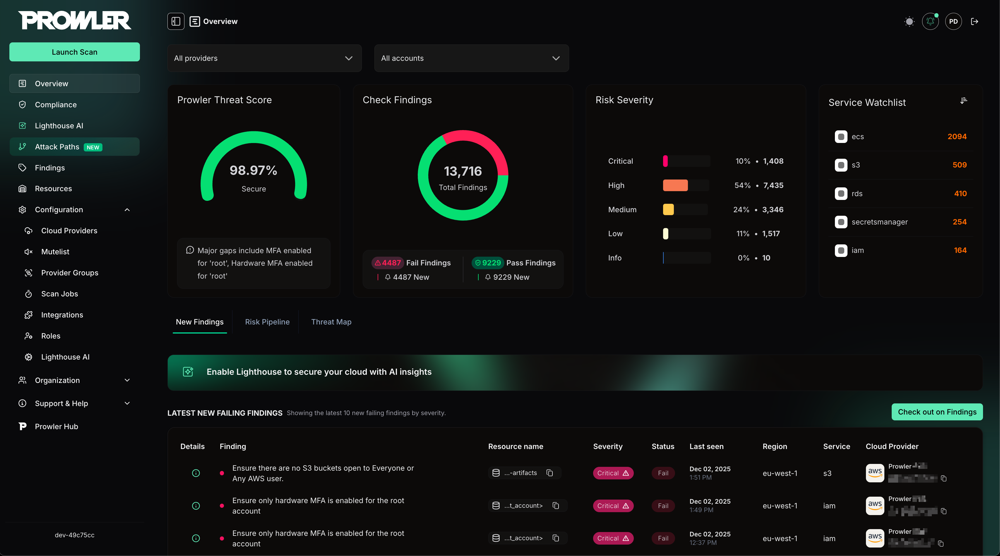
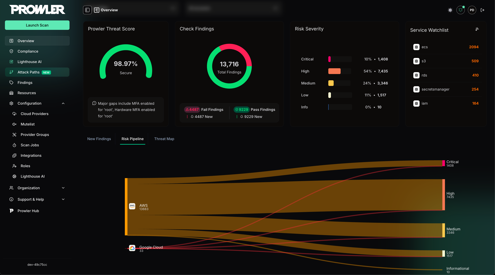
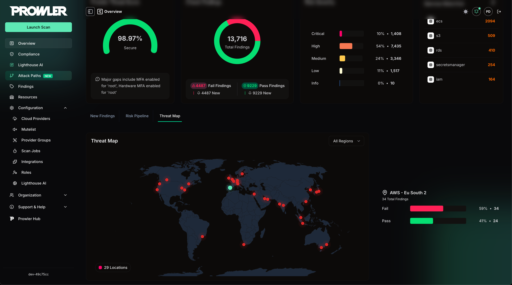
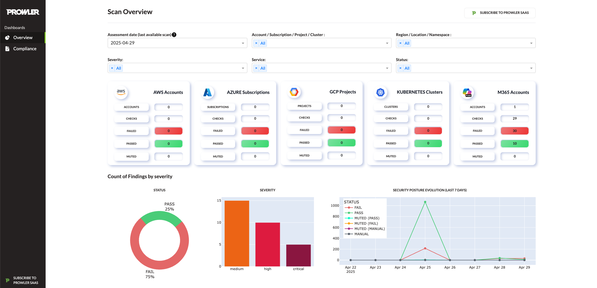

<p align="center">
  
  
</p>
<p align="center">
  <b><i>Prowler</b> is the Open Cloud Security platform trusted by thousands to automate security and compliance in any cloud environment. With hundreds of ready-to-use checks and compliance frameworks, Prowler delivers real-time, customizable monitoring and seamless integrations, making cloud security simple, scalable, and cost-effective for organizations of any size.
</p>
<p align="center">
<b>Secure ANY cloud at AI Speed at <a href="https://prowler.com">prowler.com</i></b>
</p>

<p align="center">
<a href="https://goto.prowler.com/slack"></a>
  <br>
  <a href="https://goto.prowler.com/slack">Join our Prowler community!</a>
</p>
<hr>
<p align="center">
  <a href="https://goto.prowler.com/slack"></a>
  <a href="https://pypi.org/project/prowler/"></a>
  <a href="https://pypi.python.org/pypi/prowler/"></a>
  <a href="https://pypistats.org/packages/prowler"></a>
  <a href="https://hub.docker.com/r/toniblyx/prowler"></a>
  <a href="https://gallery.ecr.aws/prowler-cloud/prowler"></a>
  <a href="https://codecov.io/gh/prowler-cloud/prowler"></a>
  <a href="https://insights.linuxfoundation.org/project/prowler-cloud-prowler"></a>
</p>
<p align="center">
    <a href="https://github.com/prowler-cloud/prowler/releases"></a>
  <a href="https://github.com/prowler-cloud/prowler/releases"></a>
  <a href="https://github.com/prowler-cloud/prowler"></a>
  <a href="https://github.com/prowler-cloud/prowler/issues"></a>
  <a href="https://github.com/prowler-cloud/prowler"></a>
  <a href="https://twitter.com/ToniBlyx"></a>
  <a href="https://twitter.com/prowlercloud"></a>
</p>
<hr>
<p align="center">
  
</p>

# Description

**Prowler** is the world’s most widely used _open-source cloud security platform_ that automates security and compliance across **any cloud environment**. With hundreds of ready-to-use security checks, remediation guidance, and compliance frameworks, Prowler is built to _“Secure ANY cloud at AI Speed”_. Prowler delivers **AI-driven**, **customizable**, and **easy-to-use** assessments, dashboards, reports, and integrations, making cloud security **simple**, **scalable**, and **cost-effective** for organizations of any size.

Prowler includes hundreds of built-in controls to ensure compliance with standards and frameworks, including:

- **Prowler ThreatScore:** Weighted risk prioritization scoring that helps you focus on the most critical security findings first
- **Industry Standards:** CIS, NIST 800, NIST CSF, CISA, and MITRE ATT&CK
- **Regulatory Compliance and Governance:** RBI, FedRAMP, PCI-DSS, and NIS2
- **Frameworks for Sensitive Data and Privacy:** GDPR, HIPAA, and FFIEC
- **Frameworks for Organizational Governance and Quality Control:** SOC2, GXP, and ISO 27001
- **Cloud-Specific Frameworks:** AWS Foundational Technical Review (FTR), AWS Well-Architected Framework, and BSI C5
- **National Security Standards:** ENS (Spanish National Security Scheme) and KISA ISMS-P (Korean)
- **Custom Security Frameworks:** Tailored to your needs

## Prowler App / Prowler Cloud

Prowler App / [Prowler Cloud](https://cloud.prowler.com/) is a web-based application that simplifies running Prowler across your cloud provider accounts. It provides a user-friendly interface to visualize the results and streamline your security assessments.






>For more details, refer to the [Prowler App Documentation](https://docs.prowler.com/projects/prowler-open-source/en/latest/#prowler-app-installation)

## Prowler CLI

```console
prowler <provider>
```


## Prowler Dashboard

```console
prowler dashboard
```


# Prowler at a Glance
> [!Tip]
> For the most accurate and up-to-date information about checks, services, frameworks, and categories, visit [**Prowler Hub**](https://hub.prowler.com).


| Provider | Checks | Services | [Compliance Frameworks](https://docs.prowler.com/projects/prowler-open-source/en/latest/tutorials/compliance/) | [Categories](https://docs.prowler.com/projects/prowler-open-source/en/latest/tutorials/misc/#categories) | Support | Interface |
|---|---|---|---|---|---|---|
| AWS | 584 | 85 | 40 | 17 | Official | UI, API, CLI |
| GCP | 89 | 17 | 14 | 5 | Official | UI, API, CLI |
| Azure | 169 | 22 | 15 | 8 | Official | UI, API, CLI |
| Kubernetes | 84 | 7 | 6 | 9 | Official | UI, API, CLI |
| GitHub | 20 | 2 | 1 | 2 | Official | UI, API, CLI |
| M365 | 70 | 7 | 3 | 2 | Official | UI, API, CLI |
| OCI | 52 | 15 | 1 | 12 | Official | UI, API, CLI |
| Alibaba Cloud | 63 | 10 | 1 | 9 | Official | CLI |
| IaC | [See `trivy` docs.](https://trivy.dev/latest/docs/coverage/iac/) | N/A | N/A | N/A | Official | UI, API, CLI |
| MongoDB Atlas | 10 | 4 | 0 | 3 | Official | UI, API, CLI |
| LLM | [See `promptfoo` docs.](https://www.promptfoo.dev/docs/red-team/plugins/) | N/A | N/A | N/A | Official | CLI |
| NHN | 6 | 2 | 1 | 0 | Unofficial | CLI |

> [!Note]
> The numbers in the table are updated periodically.


> [!Note]
> Use the following commands to list Prowler's available checks, services, compliance frameworks, and categories:
> - `prowler <provider> --list-checks`
> - `prowler <provider> --list-services`
> - `prowler <provider> --list-compliance`
> - `prowler <provider> --list-categories`

# 💻 Installation

## Prowler App

Prowler App offers flexible installation methods tailored to various environments:

> For detailed instructions on using Prowler App, refer to the [Prowler App Usage Guide](https://docs.prowler.com/projects/prowler-open-source/en/latest/tutorials/prowler-app/).

### Docker Compose

**Requirements**

* `Docker Compose` installed: https://docs.docker.com/compose/install/.

**Commands**

``` console
curl -LO https://raw.githubusercontent.com/prowler-cloud/prowler/refs/heads/master/docker-compose.yml
curl -LO https://raw.githubusercontent.com/prowler-cloud/prowler/refs/heads/master/.env
docker compose up -d
```

> Containers are built for `linux/amd64`.

### Configuring Your Workstation for Prowler App

If your workstation's architecture is incompatible, you can resolve this by:

- **Setting the environment variable**: `DOCKER_DEFAULT_PLATFORM=linux/amd64`
- **Using the following flag in your Docker command**: `--platform linux/amd64`

> Once configured, access the Prowler App at http://localhost:3000. Sign up using your email and password to get started.

### Common Issues with Docker Pull Installation

> [!Note]
  If you want to use AWS role assumption (e.g., with the "Connect assuming IAM Role" option), you may need to mount your local `.aws` directory into the container as a volume (e.g., `- "${HOME}/.aws:/home/prowler/.aws:ro"`). There are several ways to configure credentials for Docker containers. See the [Troubleshooting](./docs/troubleshooting.mdx) section for more details and examples.

You can find more information in the [Troubleshooting](./docs/troubleshooting.mdx) section.


### From GitHub

**Requirements**

* `git` installed.
* `poetry` v2 installed: [poetry installation](https://python-poetry.org/docs/#installation).
* `pnpm` installed: [pnpm installation](https://pnpm.io/installation).
* `Docker Compose` installed: https://docs.docker.com/compose/install/.

**Commands to run the API**

``` console
git clone https://github.com/prowler-cloud/prowler
cd prowler/api
poetry install
eval $(poetry env activate)
set -a
source .env
docker compose up postgres valkey -d
cd src/backend
python manage.py migrate --database admin
gunicorn -c config/guniconf.py config.wsgi:application
```
> [!IMPORTANT]
> As of Poetry v2.0.0, the `poetry shell` command has been deprecated. Use `poetry env activate` instead for environment activation.
>
> If your Poetry version is below v2.0.0, continue using `poetry shell` to activate your environment.
> For further guidance, refer to the Poetry Environment Activation Guide https://python-poetry.org/docs/managing-environments/#activating-the-environment.

> After completing the setup, access the API documentation at http://localhost:8080/api/v1/docs.

**Commands to run the API Worker**

``` console
git clone https://github.com/prowler-cloud/prowler
cd prowler/api
poetry install
eval $(poetry env activate)
set -a
source .env
cd src/backend
python -m celery -A config.celery worker -l info -E
```

**Commands to run the API Scheduler**

``` console
git clone https://github.com/prowler-cloud/prowler
cd prowler/api
poetry install
eval $(poetry env activate)
set -a
source .env
cd src/backend
python -m celery -A config.celery beat -l info --scheduler django_celery_beat.schedulers:DatabaseScheduler
```

**Commands to run the UI**

``` console
git clone https://github.com/prowler-cloud/prowler
cd prowler/ui
pnpm install
pnpm run build
pnpm start
```

> Once configured, access the Prowler App at http://localhost:3000. Sign up using your email and password to get started.

## Prowler CLI
### Pip package
Prowler CLI is available as a project in [PyPI](https://pypi.org/project/prowler-cloud/). Consequently, it can be installed using pip with Python >3.9.1, <3.13:

```console
pip install prowler
prowler -v
```
>For further guidance, refer to [https://docs.prowler.com](https://docs.prowler.com/projects/prowler-open-source/en/latest/#prowler-cli-installation)

### Containers

**Available Versions of Prowler CLI**

The following versions of Prowler CLI are available, depending on your requirements:

- `latest`: Synchronizes with the `master` branch. Note that this version is not stable.
- `v4-latest`: Synchronizes with the `v4` branch. Note that this version is not stable.
- `v3-latest`: Synchronizes with the `v3` branch. Note that this version is not stable.
- `<x.y.z>` (release): Stable releases corresponding to specific versions. You can find the complete list of releases [here](https://github.com/prowler-cloud/prowler/releases).
- `stable`: Always points to the latest release.
- `v4-stable`: Always points to the latest release for v4.
- `v3-stable`: Always points to the latest release for v3.

The container images are available here:
- Prowler CLI:
    - [DockerHub](https://hub.docker.com/r/prowlercloud/prowler/tags)
    - [AWS Public ECR](https://gallery.ecr.aws/prowler-cloud/prowler)
- Prowler App:
    - [DockerHub - Prowler UI](https://hub.docker.com/r/prowlercloud/prowler-ui/tags)
    - [DockerHub - Prowler API](https://hub.docker.com/r/prowlercloud/prowler-api/tags)

### From GitHub

Python >3.9.1, <3.13 is required with pip and Poetry:

``` console
git clone https://github.com/prowler-cloud/prowler
cd prowler
eval $(poetry env activate)
poetry install
python prowler-cli.py -v
```
> [!IMPORTANT]
> To clone Prowler on Windows, configure Git to support long file paths by running the following command: `git config core.longpaths true`.

> [!IMPORTANT]
> As of Poetry v2.0.0, the `poetry shell` command has been deprecated. Use `poetry env activate` instead for environment activation.
>
> If your Poetry version is below v2.0.0, continue using `poetry shell` to activate your environment.
> For further guidance, refer to the Poetry Environment Activation Guide https://python-poetry.org/docs/managing-environments/#activating-the-environment.

# ✏️ High level architecture

## Prowler App
**Prowler App** is composed of four key components:

- **Prowler UI**: A web-based interface, built with Next.js, providing a user-friendly experience for executing Prowler scans and visualizing results.
- **Prowler API**: A backend service, developed with Django REST Framework, responsible for running Prowler scans and storing the generated results.
- **Prowler SDK**: A Python SDK designed to extend the functionality of the Prowler CLI for advanced capabilities.
- **Prowler MCP Server**: A Model Context Protocol server that provides AI tools for Lighthouse, the AI-powered security assistant. This is a critical dependency for Lighthouse functionality.


## Prowler CLI

**Running Prowler**

Prowler can be executed across various environments, offering flexibility to meet your needs. It can be run from:

- Your own workstation

- A Kubernetes Job

- Google Compute Engine

- Azure Virtual Machines (VMs)

- Amazon EC2 instances

- AWS Fargate or other container platforms

- CloudShell

And many more environments.


# 📖 Documentation

For installation instructions, usage details, tutorials, and the Developer Guide, visit https://docs.prowler.com/

# 📃 License

Prowler is licensed under the Apache License 2.0.

A copy of the License is available at <http://www.apache.org/licenses/LICENSE-2.0>
