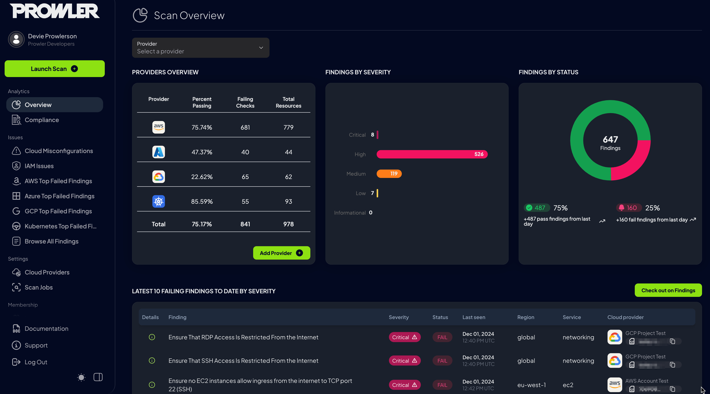
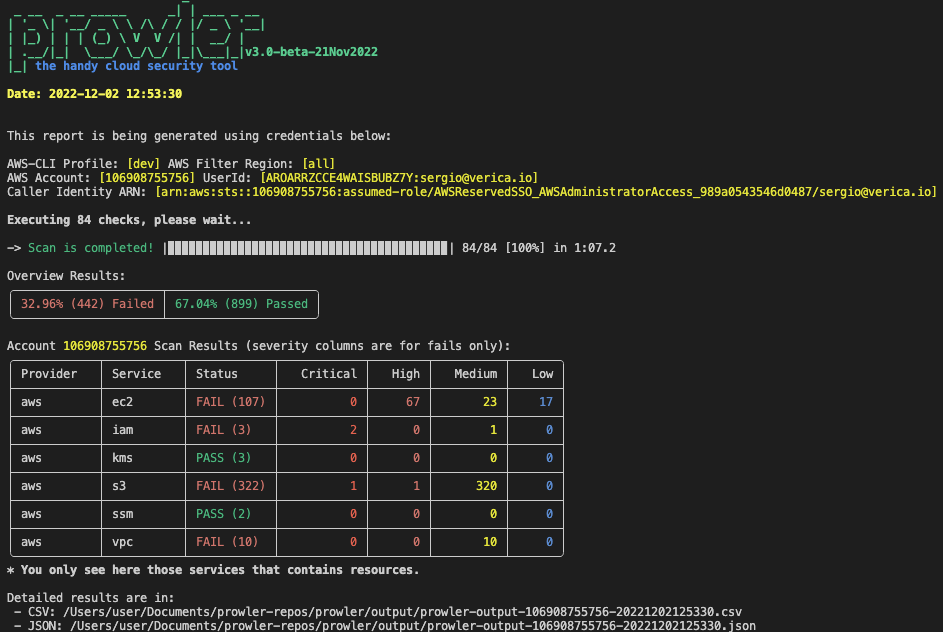
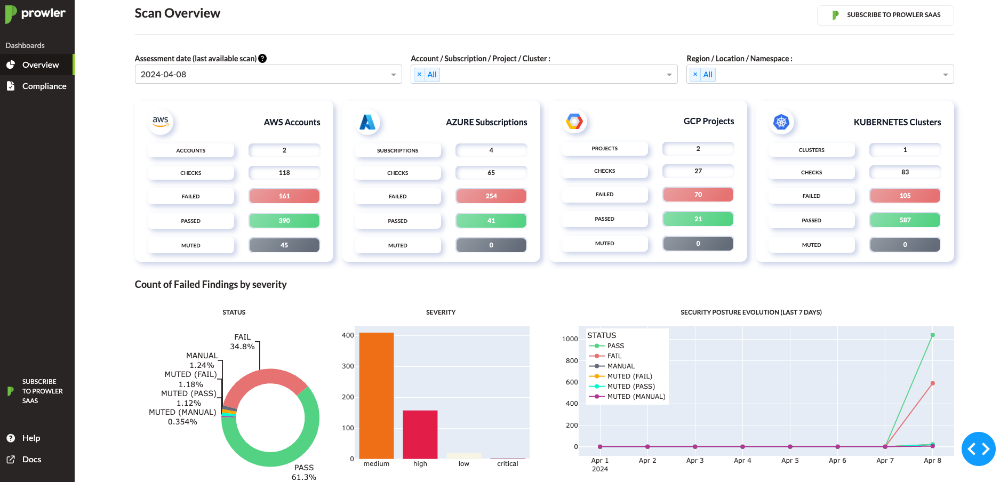
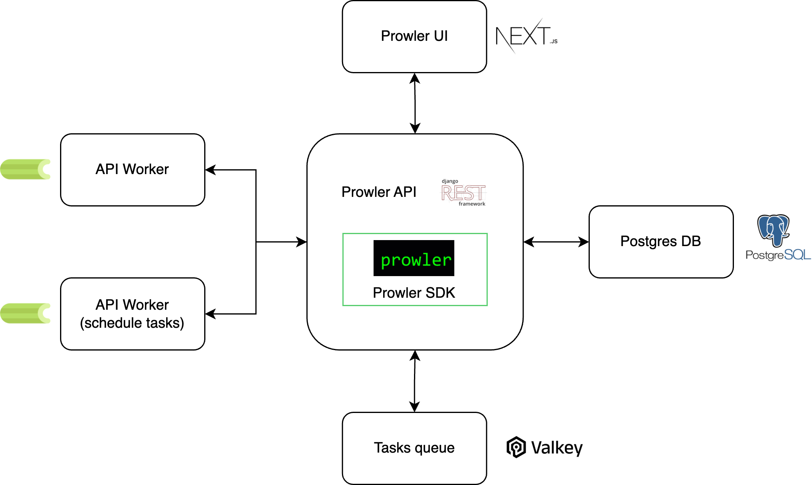
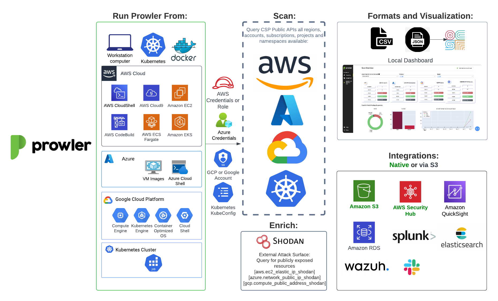

<p align="center">
  
  
</p>
<p align="center">
  <b><i>Prowler SaaS </b> and <b>Prowler Open Source</b> are as dynamic and adaptable as the environment they’re meant to protect. Trusted by the leaders in security.
</p>
<p align="center">
<b>Learn more at <a href="https://prowler.com">prowler.com</i></b>
</p>

<p align="center">
<a href="https://goto.prowler.com/slack"></a>
  <br>
  <a href="https://goto.prowler.com/slack">Join our Prowler community!</a>
</p>
<hr>
<p align="center">
  <a href="https://goto.prowler.com/slack"></a>
  <a href="https://pypi.org/project/prowler/"></a>
  <a href="https://pypi.python.org/pypi/prowler/"></a>
  <a href="https://pypistats.org/packages/prowler"></a>
  <a href="https://hub.docker.com/r/toniblyx/prowler"></a>
  <a href="https://hub.docker.com/r/toniblyx/prowler"></a>
  <a href="https://hub.docker.com/r/toniblyx/prowler"></a>
  <a href="https://gallery.ecr.aws/prowler-cloud/prowler"></a>
  <a href="https://codecov.io/gh/prowler-cloud/prowler"></a>
</p>
<p align="center">
  <a href="https://github.com/prowler-cloud/prowler"></a>
  <a href="https://github.com/prowler-cloud/prowler/issues"></a>
  <a href="https://github.com/prowler-cloud/prowler/releases"></a>
  <a href="https://github.com/prowler-cloud/prowler/releases"></a>
  <a href="https://github.com/prowler-cloud/prowler"></a>
  <a href="https://github.com/prowler-cloud/prowler"></a>
  <a href="https://twitter.com/ToniBlyx"></a>
  <a href="https://twitter.com/prowlercloud"></a>
</p>
<hr>
<p align="center">
  
</p>

# Description

**Prowler** is an Open Source security tool to perform AWS, Azure, Google Cloud and Kubernetes security best practices assessments, audits, incident response, continuous monitoring, hardening and forensics readiness, and also remediations! We have Prowler CLI (Command Line Interface) that we call Prowler Open Source and a service on top of it that we call <a href="https://prowler.com">Prowler SaaS</a>.

## Prowler App

Prowler App is a web application that allows you to run Prowler in your cloud provider accounts and visualize the results in a user-friendly interface.



>More details at [Prowler App Documentation](https://docs.prowler.com/projects/prowler-open-source/en/latest/#prowler-app-installation)

## Prowler CLI

```console
prowler <provider>
```


## Prowler Dashboard

```console
prowler dashboard
```


It contains hundreds of controls covering CIS, NIST 800, NIST CSF, CISA, RBI, FedRAMP, PCI-DSS, GDPR, HIPAA, FFIEC, SOC2, GXP, AWS Well-Architected Framework Security Pillar, AWS Foundational Technical Review (FTR), ENS (Spanish National Security Scheme) and your custom security frameworks.

| Provider | Checks | Services | [Compliance Frameworks](https://docs.prowler.com/projects/prowler-open-source/en/latest/tutorials/compliance/) | [Categories](https://docs.prowler.com/projects/prowler-open-source/en/latest/tutorials/misc/#categories) |
|---|---|---|---|---|
| AWS | 561 | 81 -> `prowler aws --list-services` | 30 -> `prowler aws --list-compliance` | 9 -> `prowler aws --list-categories` |
| GCP | 77 | 13 -> `prowler gcp --list-services` | 3 -> `prowler gcp --list-compliance` | 2 -> `prowler gcp --list-categories`|
| Azure | 139 | 18 -> `prowler azure --list-services` | 4 -> `prowler azure --list-compliance` | 2 -> `prowler azure --list-categories` |
| Kubernetes | 83 | 7 -> `prowler kubernetes --list-services` | 1 -> `prowler kubernetes --list-compliance` | 7 -> `prowler kubernetes --list-categories` |

# 💻 Installation

## Prowler App

Prowler App can be installed in different ways, depending on your environment:

> See how to use Prowler App in the [Prowler App Usage Guide](https://docs.prowler.com/projects/prowler-open-source/en/latest/tutorials/prowler-app/).

### Docker Compose

**Requirements**

* `Docker Compose` installed: https://docs.docker.com/compose/install/.

**Commands**

``` console
curl -LO https://raw.githubusercontent.com/prowler-cloud/prowler/refs/heads/master/docker-compose.yml
curl -LO https://raw.githubusercontent.com/prowler-cloud/prowler/refs/heads/master/.env
docker compose up -d
```

> Enjoy Prowler App at http://localhost:3000 by signing up with your email and password.

### From GitHub

**Requirements**

* `git` installed.
* `poetry` installed: [poetry installation](https://python-poetry.org/docs/#installation).
* `npm` installed: [npm installation](https://docs.npmjs.com/downloading-and-installing-node-js-and-npm).
* `Docker Compose` installed: https://docs.docker.com/compose/install/.

**Commands to run the API**

``` console
git clone https://github.com/prowler-cloud/prowler
cd prowler/api
poetry install
poetry shell
set -a
source .env
docker compose up postgres valkey -d
cd src/backend
python manage.py migrate --database admin
gunicorn -c config/guniconf.py config.wsgi:application
```

> Now, you can access the API documentation at http://localhost:8080/api/v1/docs.

**Commands to run the API Worker**

``` console
git clone https://github.com/prowler-cloud/prowler
cd prowler/api
poetry install
poetry shell
set -a
source .env
cd src/backend
python -m celery -A config.celery worker -l info -E
```

**Commands to run the UI**

``` console
git clone https://github.com/prowler-cloud/prowler
cd prowler/ui
npm install
npm run build
npm start
```

> Enjoy Prowler App at http://localhost:3000 by signing up with your email and password.

## Prowler CLI
### Pip package
Prowler CLI is available as a project in [PyPI](https://pypi.org/project/prowler-cloud/), thus can be installed using pip with Python >= 3.9, < 3.13:

```console
pip install prowler
prowler -v
```
>More details at [https://docs.prowler.com](https://docs.prowler.com/projects/prowler-open-source/en/latest/#prowler-cli-installation)

### Containers

The available versions of Prowler CLI are the following:

- `latest`: in sync with `master` branch (bear in mind that it is not a stable version)
- `v4-latest`: in sync with `v4` branch (bear in mind that it is not a stable version)
- `v3-latest`: in sync with `v3` branch (bear in mind that it is not a stable version)
- `<x.y.z>` (release): you can find the releases [here](https://github.com/prowler-cloud/prowler/releases), those are stable releases.
- `stable`: this tag always point to the latest release.
- `v4-stable`: this tag always point to the latest release for v4.
- `v3-stable`: this tag always point to the latest release for v3.

The container images are available here:
- Prowler CLI:
    - [DockerHub](https://hub.docker.com/r/toniblyx/prowler/tags)
    - [AWS Public ECR](https://gallery.ecr.aws/prowler-cloud/prowler)
- Prowler App:
    - [DockerHub - Prowler UI](https://hub.docker.com/r/prowlercloud/prowler-ui/tags)
    - [DockerHub - Prowler API](https://hub.docker.com/r/prowlercloud/prowler-api/tags)

### From GitHub

Python >= 3.9, < 3.13 is required with pip and poetry:

``` console
git clone https://github.com/prowler-cloud/prowler
cd prowler
poetry shell
poetry install
python prowler.py -v
```
> If you want to clone Prowler from Windows, use `git config core.longpaths true` to allow long file paths.
# 📐✏️ High level architecture

## Prowler App
The **Prowler App** consists of three main components:

- **Prowler UI**: A user-friendly web interface for running Prowler and viewing results, powered by Next.js.
- **Prowler API**: The backend API that executes Prowler scans and stores the results, built with Django REST Framework.
- **Prowler SDK**: A Python SDK that integrates with the Prowler CLI for advanced functionality.



## Prowler CLI
You can run Prowler from your workstation, a Kubernetes Job, a Google Compute Engine, an Azure VM, an EC2 instance, Fargate or any other container, CloudShell and many more.



# Deprecations from v3

## General
- `Allowlist` now is called `Mutelist`.
- The `--quiet` option has been deprecated, now use the `--status` flag to select the finding's status you want to get from PASS, FAIL or MANUAL.
- All `INFO` finding's status has changed to `MANUAL`.
- The CSV output format is common for all the providers.

We have deprecated some of our outputs formats:
- The native JSON is replaced for the JSON [OCSF](https://schema.ocsf.io/) v1.1.0, common for all the providers.

## AWS
- Deprecate the AWS flag --sts-endpoint-region since we use AWS STS regional tokens.
- To send only FAILS to AWS Security Hub, now use either `--send-sh-only-fails` or `--security-hub --status FAIL`.


# 📖 Documentation

Install, Usage, Tutorials and Developer Guide is at https://docs.prowler.com/

# 📃 License

Prowler is licensed as Apache License 2.0 as specified in each file. You may obtain a copy of the License at
<http://www.apache.org/licenses/LICENSE-2.0>
