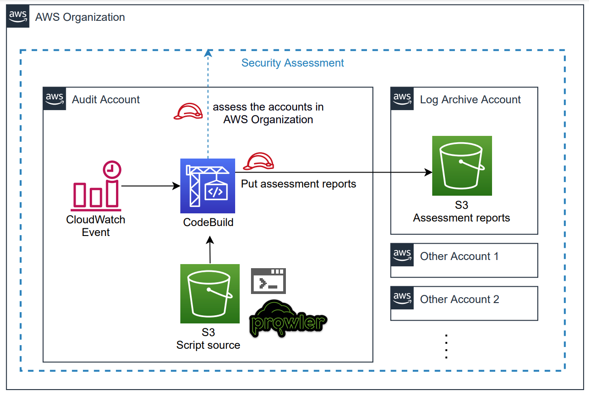
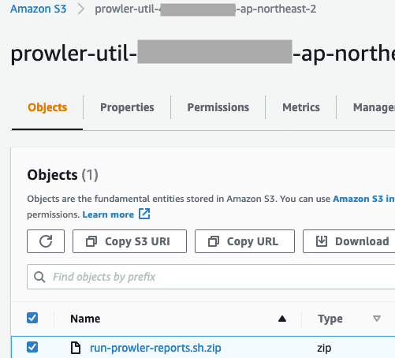

# Organizational Prowler with Serverless

Language: [English](README.md)

이 문서는 AWS Organization 내의 multi account 환경에서 prowler 를 적용하기 위해 작성된 문서입니다.
일정 시간마다 CloudWatch는 CodeBuild 를 트리거합니다.
CodeBuild 는 최신의 [prowler](https://github.com/prowler-cloud/prowler) 소스를 클론받고,
Organization 내의 모든 Account 에 대해 security assessment 를 수행합니다.
prowler 의 자세한 사용방법은 [이 곳](https://github.com/prowler-cloud/prowler#usagee) 을 참고합니다.

1. **Log Archive Account**에 접속합니다.
   1. 아래 템플릿을 CloudFormation console 에서 배포합니다. 이를 통해 prowler 의 security assessment report 가 저장되는 bucket 과 bucket policy 를 생성합니다.

      [ProwlerS3.yaml](templates/ProwlerS3.yaml)

      - AwsOrgId : AWS Organizations의 Organization ID
      - S3Prefix : 생성될 버킷의 이름에 포함되는 prefix
2. **Master Account** 에 접속합니다.
   1. 아래 템플릿을 이용하여 CloudFormation **Stack**을 생성합니다. StackSet은 Master account 에 적용되지 않으므로 Stack 으로도 배포가 필요합니다.

      [ProwlerRole.yaml](templates/ProwlerRole.yaml)

      - ProwlerCodeBuildAccount : CodeBuild 가 있는 Audit Account ID
      - ProwlerCodeBuildRole : CodeBuild의 생성될 Role 이름
      - ProwlerCrossAccountRole : Cross account 용 Assume할 Role 이름
      - ProwlerS3 : report 가 저장될 S3 bucket 명
   2. 아래 템플릿을 이용하여 CloudFormation **StackSet**을 생성하여, Organazation에 포함된 account 대상으로도 아래 템플릿을 배포합니다.

      [ProwlerRole.yaml](templates/ProwlerRole.yaml)

      - ProwlerCodeBuildAccount : CodeBuild 가 있는 Audit Account
      - ProwlerCodeBuildRole : CodeBuild에서 사용할 Role 이름
      - ProwlerCrossAccountRole : Cross account 용 Assume할 Role 이름
      - ProwlerS3 : report 가 저장될 S3 bucket 명
      - Permission : Service-managed permissions
      - Deploy target : Deploy to organization 선택, Enable, Delete stacks 선택
      - Specify regions : 배포할 대상 리전을 선택
3. **Audit Account**에 접속합니다.
   1. **S3 console** 로 이동하여 버킷을 생성하고 아래 항목을 **업로드**한 후, 버킷명을 복사해둡니다.

      [run-prowler-reports.sh.zip](src/run-prowler-reports.sh.zip)

      - bucket name : prowler-util-*<Account ID>*-*<region>*

        

   2. 아래 템플릿으로 **CloudFormation stack** 을 생성합니다. 이 템플릿은 CloudWatch Rule 을 생성하여 일정 시간마다 CodeBuild 를 실행하여 prowler 가 multi accounts 를 audit 할 수 있도록 합니다.

      [ProwlerCodeBuildStack.yaml](templates/ProwlerCodeBuildStack.yaml)

      - AwsOrgId : AWS Organizations의 Organization ID
      - CodeBuildRole : CodeBuild의 서비스 Role 이름
      - CodeBuildSourceS3 : a 에서 업로드한 object 위치
         - prowler-util-*<Account ID>*-*<region>/***run-prowler-reports.sh.zip**
      - CrossAccountRole : 2번에서 생성한 Cross Account 용 Role 이름
      - ProwlerReportS3 : report 가 저장될 S3 bucket 명
      - ProwlerReportS3Account : report 가 저장될 S3 bucket이 위치한 Account
   3. 스케줄 된 시간을 변경하고 싶은 경우
      1. [ProwlerCodeBuildStack.yaml](templates/ProwlerCodeBuildStack.yaml) 내에서 ScheduleExpression의 크론 표현식을 변경할 수 있습니다.
      2. 또는 CloudWatch console 에서 Events > Rules > ProwlerExecuteRule > Actions > Edit 에서 직접 변경할 수 있습니다.
