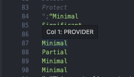

# prowler-dashboard
## To test it:
* Before using the app for the first time, ensure that you have installed all necessary ```node_modules```

    i. Run ```nvm install lts/hydrogen && nvm use``` to set a specific Node.js version. If you do not have nvm installed, ensure that your Node.js version is greater than 18 (node > v.18).

    ii. Run ```npm install``` to install the node modules.

    iii. Run ```npm run dev``` to start the watcher.

* Run ```python app.py``` to start the Dash application.

In the compliance page, we are taking the information about each compliance from the output folder. If you choose the mitre_attack compliance the app is failing because csv from both compliance are not in a correct format:
* Example:

    
