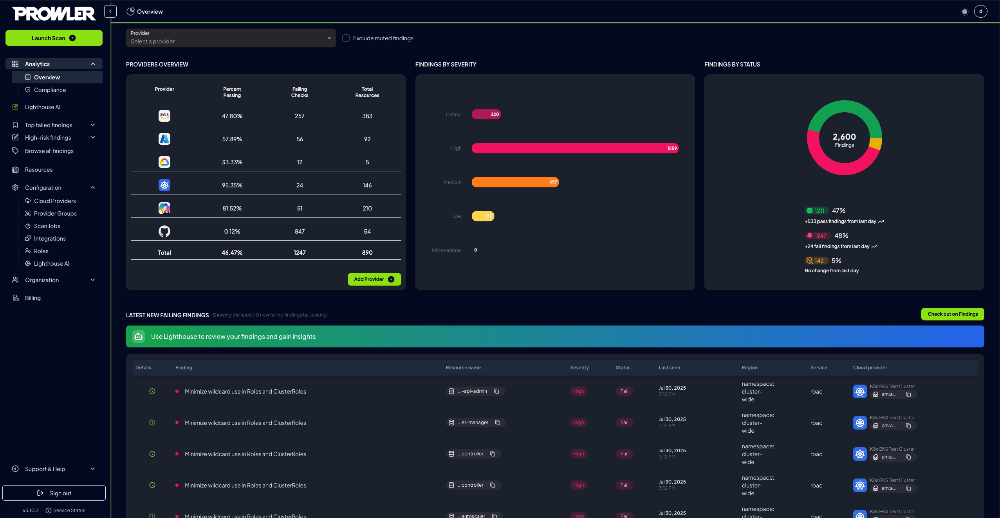
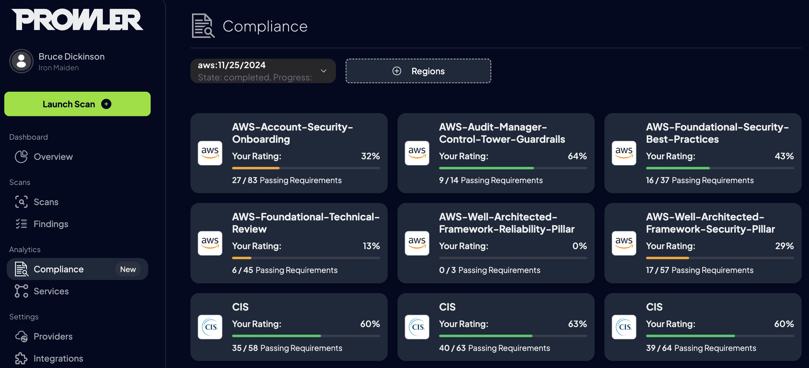

## Access Prowler App

After [installation](../installation/prowler-app.md), navigate to [http://localhost:3000](http://localhost:3000) and sign up with email and password.

???+ note "User creation and default tenant behavior"

    When creating a new user, the behavior depends on whether an invitation is provided:

    - **Without an invitation**:

        - A new tenant is automatically created.
        - The new user is assigned to this tenant.
        - A set of **RBAC admin permissions** is generated and assigned to the user for the newly-created tenant.

    - **With an invitation**: The user is added to the specified tenant with the permissions defined in the invitation.

    This mechanism ensures that the first user in a newly created tenant has administrative permissions within that tenant.

## Log In

Access Prowler App by logging in with **email and password**.

## Add Cloud Provider

Configure a cloud provider for scanning:

1. Navigate to `Settings > Cloud Providers` and click `Add Account`.
2. Select the cloud provider.
3. Enter the provider's identifier (Optional: Add an alias):
    - **AWS**: Account ID
    - **GCP**: Project ID
    - **Azure**: Subscription ID
    - **Kubernetes**: Cluster ID
    - **M365**: Domain ID
4. Follow the guided instructions to add and authenticate your credentials.

## Start a Scan

Once credentials are successfully added and validated, Prowler initiates a scan of your cloud environment.

Click `Go to Scans` to monitor progress.

## View Results

Review findings during scan execution in the following sections:

- **Overview** – Provides a high-level summary of your scans.
  

- **Compliance** – Displays compliance insights based on security frameworks.
  

> For detailed usage instructions, refer to the [Prowler App Guide](../tutorials/prowler-app.md).

???+ note
    Prowler will automatically scan all configured providers every **24 hours**, ensuring your cloud environment stays continuously monitored.
