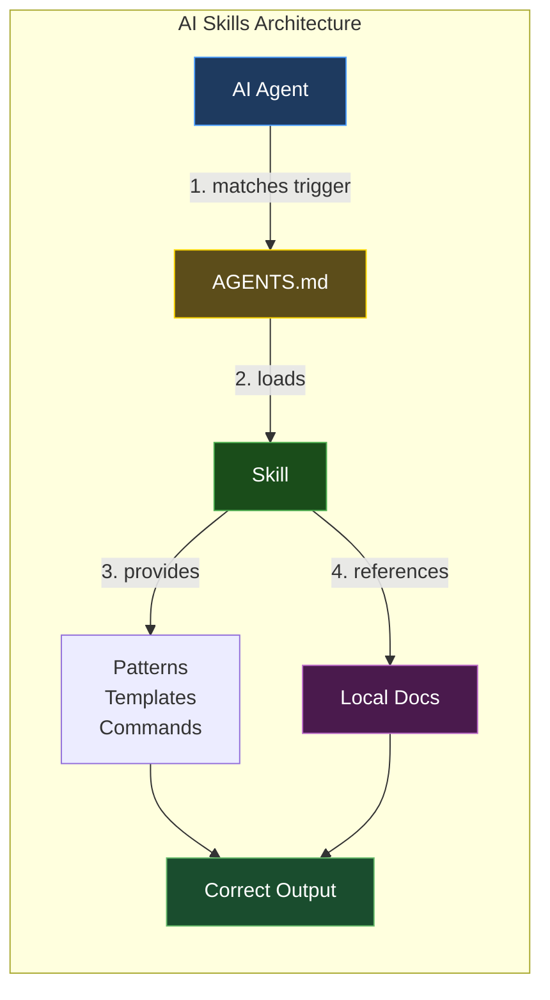
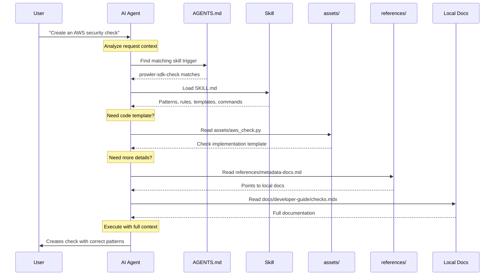
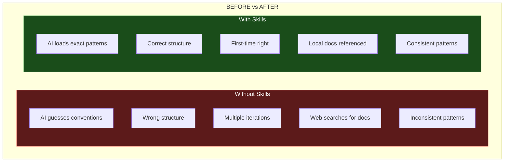
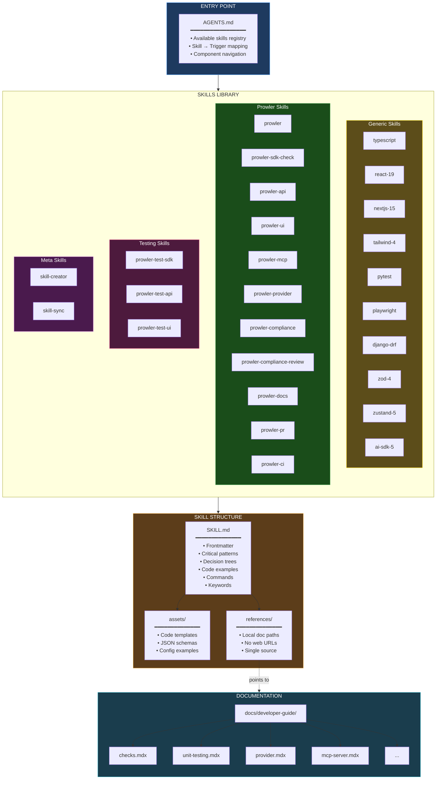

This guide explains the AI Skills system that provides on-demand context and patterns to AI agents working with the Prowler codebase.

<Info>
**What are AI Skills?** Skills are structured instructions that help AI agents (Claude Code, Cursor, Copilot, etc.) understand Prowler's conventions, patterns, and best practices.
</Info>

## Architecture Overview



## How It Works



## Before vs After



## Complete Architecture



## Skills Included

| Type | Skills |
|------|--------|
| **Generic** | typescript, react-19, nextjs-15, tailwind-4, pytest, playwright, django-drf, zod-4, zustand-5, ai-sdk-5 |
| **Prowler** | prowler, prowler-sdk-check, prowler-api, prowler-ui, prowler-mcp, prowler-provider, prowler-compliance, prowler-compliance-review, prowler-docs, prowler-pr, prowler-ci |
| **Testing** | prowler-test-sdk, prowler-test-api, prowler-test-ui |
| **Meta** | skill-creator, skill-sync |

## Skill Structure

Each skill follows the [Agent Skills spec](https://agentskills.io):

```
skills/{skill-name}/
├── SKILL.md          # Patterns, rules, decision trees
├── assets/           # Code templates, schemas
└── references/       # Links to local docs (single source of truth)
```

## Key Design Decisions

1. **Self-contained skills** - Critical patterns inline for fast loading
2. **Local doc references** - No web URLs, points to `docs/developer-guide/*.mdx`
3. **Single source of truth** - Skills reference docs, no duplication
4. **On-demand loading** - AI loads only what's needed for the task

## Creating New Skills

Use the `skill-creator` meta-skill to create new skills that follow the Agent Skills spec. See `AGENTS.md` for the full list of available skills and their triggers.
