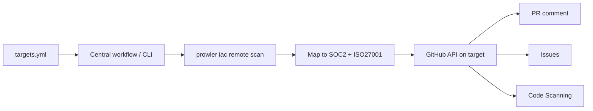

# Audit Agent

The Audit Agent continuously audits **any GitHub repository** against **SOC 2** and **ISO 27001**. It is Dependabot-like in spirit: enable a target, get compliance signal on PRs and on a schedule.

There is **no product UI**. Reporting is GitHub-only (PR comments, check runs, issues, Code Scanning).

## Zero-Touch Model

Target repositories do **not** need workflows, Actions, or config files.

| Piece | Where it lives |
|-------|----------------|
| Orchestrator + CLI | This Prowler repository (`contrib/audit-agent/`) |
| Target list | [`contrib/audit-agent/targets.yml`](https://github.com/prowler-cloud/prowler/blob/master/contrib/audit-agent/targets.yml) |
| Credentials | `AUDIT_AGENT_TOKEN` secret (PAT/installation token with access to targets) |
| Optional config | `.github/prowler-audit.yml` **in the target** only if customization is wanted; otherwise defaults apply |



## What It Checks

The agent runs **Prowler providers and compliance modules from this monorepo** (same SDK as `prowler-cli.py`):

| Aspect | Source |
|--------|--------|
| IaC / config | Trivy misconfig |
| Secrets in source | Trivy secret |
| Dependencies / CVEs | Trivy vuln |
| License compliance | Trivy license |
| Containers / Dockerfiles | IaC Dockerfile rules |
| GitHub hardening | Branch protection, secret scanning, Dependabot, org settings |
| GitHub Actions / CI-CD | Workflow security (+ CIS GitHub) |
| Cloud (aws/azure/gcp/…) | Optional — needs provider credentials |

The report lists **every enabled aspect** (with finding counts), not only those that failed.

## CLI

```bash
export AUDIT_AGENT_TOKEN="$(gh auth token)"
export PYTHONPATH=contrib/audit-agent

# Scan and print the compliance comment (no writes to the target)
python -m audit_agent --repo owner/name --dry-run

# Sticky PR comment + check run via API (still no commits to the target)
python -m audit_agent --repo owner/name --pr 12

# Open/close control-gap issues on the target
python -m audit_agent --repo owner/name --sync-issues
```

## Central Workflow

Workflow: [`.github/workflows/audit-agent.yml`](https://github.com/prowler-cloud/prowler/blob/master/.github/workflows/audit-agent.yml)

1. Add the repo to `contrib/audit-agent/targets.yml`
2. Set repository secret `AUDIT_AGENT_TOKEN` (must access private targets)
3. Run **Audit Agent (zero-touch)** via `workflow_dispatch` (optional `repo`, `pr_number`, `sync_issues`) or wait for the weekly schedule

## Configuration Defaults

```yaml
version: 1
frameworks: [soc2, iso27001_2022]
scanners:
  iac: true
  secrets: true
  dependencies: true
fail-pr-on:
  severity: high
  new-findings-only: true
reporting:
  pr-comment: true
  sarif: true
  issues: true
```

See [`contrib/audit-agent/prowler-audit.yml.example`](https://github.com/prowler-cloud/prowler/blob/master/contrib/audit-agent/prowler-audit.yml.example).

## Optional In-Repo Action

For teams that want CI **inside** the audited repo, copy the example workflows under `contrib/audit-agent/workflows/` and use `.github/actions/prowler-audit`. This is optional; zero-touch does not use it.

## Phase 2 — GitHub App (Planned)

A Marketplace GitHub App will install on an org/account, select repos, and receive `pull_request` webhooks automatically — still with **zero files** in target repos. Phase 1 uses the central workflow + CLI instead of App webhooks.

## Getting Started (Pilot)

<Steps>
  <Step title="Register the target">
    Add `owner/name` under `targets:` in `contrib/audit-agent/targets.yml`.
  </Step>
  <Step title="Provide a token">
    Create a PAT (or use `gh auth token`) with access to the target: contents read, pull requests write, issues write, security events write. Set `AUDIT_AGENT_TOKEN`.
  </Step>
  <Step title="Run a dry scan">
    `PYTHONPATH=contrib/audit-agent python -m audit_agent --repo owner/name --dry-run`
  </Step>
  <Step title="Attach to a PR (optional)">
    `python -m audit_agent --repo owner/name --pr <n>` posts the compliance comment on that PR via API.
  </Step>
</Steps>

<Note>
Nothing is committed to the target repository. The pilot target `amardizdarevic45-wq/Lindle` is registered in `targets.yml` for zero-touch validation.
</Note>
