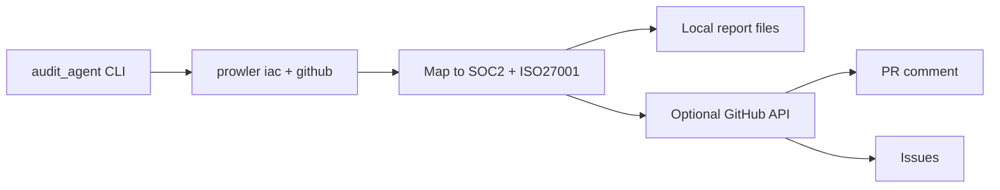

import { VersionBadge } from "/snippets/version-badge.mdx"

# Audit Agent

<VersionBadge version="5.40.0" />

The Audit Agent audits **any GitHub repository** against **SOC 2** and **ISO 27001** from the Prowler CLI. Pass `--repo owner/name` to scan; optionally post findings to a PR or sync issues via the GitHub API.

There is **no product UI**. Reporting is local markdown/JSON plus optional GitHub writes (PR comments, check runs, issues).

## Zero-Touch Model

Target repositories do **not** need workflows, Actions, or config files.

| Piece | Where it lives |
|-------|----------------|
| CLI | This Prowler repository (`contrib/audit-agent/`) |
| Credentials | `AUDIT_AGENT_TOKEN` (or `gh auth token`) with access to the target |
| Optional config | `.github/prowler-audit.yml` **in the target** only if customization is wanted; otherwise defaults apply |



## What It Checks

The agent runs **Prowler providers and compliance modules from this monorepo** (same SDK as `prowler-cli.py`):

| Aspect | Source |
|--------|--------|
| IaC / config | Trivy misconfig |
| Secrets in source | Trivy secret |
| Dependencies / CVEs | Trivy vuln |
| License compliance | Trivy license |
| Containers / Dockerfiles | IaC Dockerfile rules |
| GitHub hardening | Branch protection, secret scanning, Dependabot, org settings |
| GitHub Actions / CI-CD | Workflow security (+ CIS GitHub) |
| Cloud (aws/azure/gcp/…) | Optional — needs provider credentials |

The report lists **every enabled aspect** (with finding counts), not only those that failed.

## CLI

```bash
export AUDIT_AGENT_TOKEN="$(gh auth token)"
export PYTHONPATH=contrib/audit-agent

# Scan and print the compliance report (no writes to the target)
python -m audit_agent --repo owner/name --dry-run

# Sticky PR comment + check run via API (still no commits to the target)
python -m audit_agent --repo owner/name --pr 12

# Open/close control-gap issues on the target
python -m audit_agent --repo owner/name --sync-issues
```

## Configuration Defaults

```yaml
version: 1
frameworks: [soc2, iso27001_2022]
scanners:
  iac: true
  secrets: true
  dependencies: true
fail-pr-on:
  severity: high
  new-findings-only: true
reporting:
  pr-comment: true
  sarif: true
  issues: true
```

See [`contrib/audit-agent/prowler-audit.yml.example`](https://github.com/prowler-cloud/prowler/blob/master/contrib/audit-agent/prowler-audit.yml.example).

## Getting Started

<Steps>
  <Step title="Provide a token">
    Create a PAT (or use `gh auth token`) with access to the target: contents read, pull requests write, issues write, security events write. Set `AUDIT_AGENT_TOKEN`.
  </Step>
  <Step title="Run a dry scan">
    `PYTHONPATH=contrib/audit-agent python -m audit_agent --repo owner/name --dry-run`
  </Step>
  <Step title="Attach to a PR (optional)">
    `python -m audit_agent --repo owner/name --pr <n>` posts the compliance comment on that PR via API.
  </Step>
</Steps>

<Note>
Nothing is committed to the target repository. Pass `--repo owner/name` and run a dry scan to validate the flow.
</Note>
