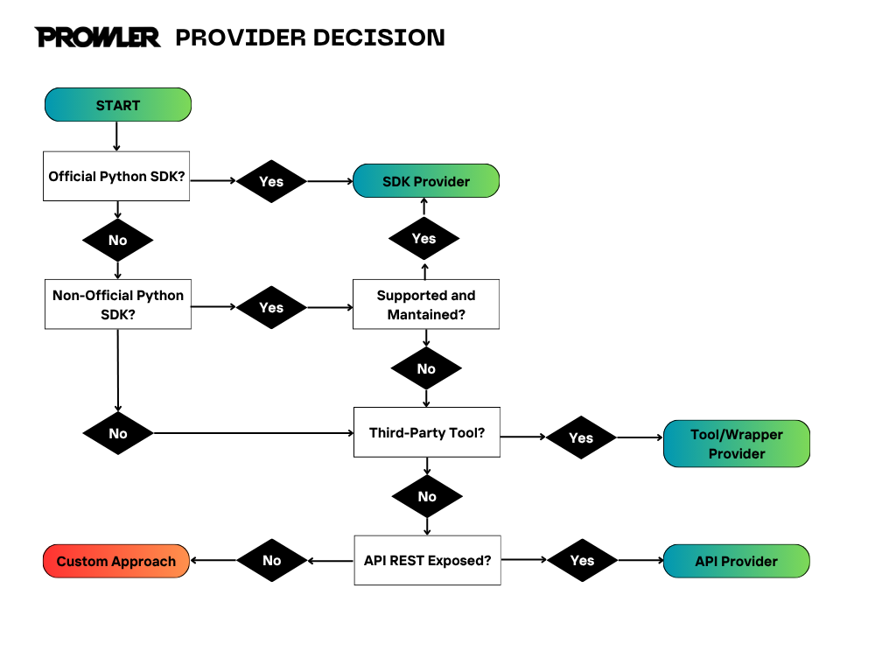

# Prowler Providers

## Introduction

Providers form the backbone of Prowler, enabling security assessments across various cloud environments.

A provider is any platform or service that offers resources, data, or functionality that can be audited for security and compliance. This includes:

- Cloud Infrastructure Providers (like Amazon Web Services, Microsoft Azure, and Google Cloud)
- Software as a Service (SaaS) Platforms (like Microsoft 365)
- Development Platforms (like GitHub)
- Container Orchestration Platforms (like Kubernetes)

For providers supported by Prowler, refer to [Prowler Hub](https://hub.prowler.com/).

???+ important
    There are some custom providers added by the community, like [NHN Cloud](https://www.nhncloud.com/), that are not maintained by the Prowler team, but can be used in the Prowler CLI. The main purpose of this documentation is to guide you through creating a new provider and integrating it not only in the CLI, but also in the API and UI. Non official providers can be checked directly at the [Prowler GitHub repository](https://github.com/prowler-cloud/prowler/tree/master/prowler/providers).

---

## Provider Types in Prowler

Prowler supports several types of providers, each with its own implementation pattern and use case. Understanding these differences is key to designing your provider correctly.

### Classifying your Provider

Before implementing a new provider, you need to determine which type it belongs to. This classification will guide your implementation approach and help you choose the right patterns and libraries.

#### Decision Criteria

Once you have decided the provider you want or need to add to Prowler, the next step is to study how to retrieve data from it. Based on that, the provider will fall into one of the following types: SDK, API or Tool/Wrapper (maybe in the future there will be new types but for now this are the only ones).

**Choose SDK Provider if:**

- The target platform/service has an **official Python SDK** available
- The target platform/service has a **non-official Python SDK** available but it's been updated and maintained
- You need to support **multiple authentication methods** (profiles, service principals, IAM roles, etc.)
- The SDK provides **built-in session management**, retry logic, and error handling
- You want to leverage **SDK-specific features** like credential chaining, role assumption, etc
- The platform is a **major cloud provider** (AWS, Azure, GCP, etc.) or has mature SDK support

**Choose API Provider if:**

- The target platform has a **REST API** but **no official Python SDK**
- The target platform has a **non-official Python SDK** available but it's not updated and maintained
- You need to implement **custom authentication flows** (OAuth, token-based, etc.)
- The platform is a **custom or community service** without official SDK support
- You want to use **standard HTTP libraries** like `requests` for API calls
- The platform exposes **well-documented REST endpoints** but lacks SDK tooling

**Choose Tool/Wrapper Provider if:**

- You're integrating a **third-party security tool** or library
- The tool provides **scanning capabilities** that need to be adapted to Prowler's interface
- You don't need **authentication or session management** (the tool handles this)
- You need to **map tool arguments** and **convert outputs** to Prowler's format

**Special Case - Hybrid Providers:**

- Some providers may **combine multiple approaches** (e.g., SDK + Tool wrapper, SDK + API, etc.)
- Example: M365 uses **msgraph SDK** for authentication and some checks, and **PowerShell wrapper** for other checks that the SDK doesn't support
- These require **custom implementation patterns** that blend different provider types

#### Classification Examples

| Provider    | Type   | Reasoning                                                         |
| ----------- | ------ | ----------------------------------------------------------------- |
| AWS         | SDK    | Official boto3 SDK, multiple auth methods, mature ecosystem       |
| Azure       | SDK    | Official azure-identity SDK, service principals, managed identity |
| GCP         | SDK    | Official google-auth SDK, service accounts, ADC support           |
| Kubernetes  | SDK    | Official kubernetes SDK, service accounts, ADC support            |
| NHN Cloud   | API    | Custom REST API, no official SDK, community provider              |
| IAC         | Tool   | Third-party security tool that uses trivy, no auth needed, output conversion|
| M365        | Hybrid | Combines msgraph SDK for auth + PowerShell wrapper for operations |
| GitHub      | Hybrid | Non-Official PyGithub SDK but it's been updated and maintained + Official graphql API requests|

#### Questions to Ask Yourself

**1. Does the platform have an official Python SDK?**

- Yes → Consider SDK Provider
- No → Continue to question 2

**2. Does the platform have a non-official Python SDK?**

- Yes → Then if the SDK is updated and maintained, consider SDK Provider, otherwise continue to question 3.
- No → Continue to question 3

**3. Is this a third-party security tool or library?**

- Yes → Consider Tool/Wrapper Provider
- No → Continue to question 4

**4. Does the platform expose a REST API?**

- Yes → Consider API Provider
- No → You may need a custom approach



#### Implementation Complexity

- **SDK Providers**: Low complexity. You have mature examples like AWS, Azure, GCP, Kubernetes, etc. that you can leverage to implement your provider.
- **API Providers**: Medium complexity. You need to implement the authentication and session management, and the API calls to the provider. You now have NHN as example to follow.
- **Tool/Wrapper Providers**: High complexity. You need to implement the argument/output mapping to the provider and handle problems that the tool/wrapper may have. You now have IAC and the PowerShell wrapper as example to follow.
- **Hybrid Providers**: High complexity. You need to "customize" your provider, mixing the other types of providers in order to achieve the desired result. You have M365 (msgraph SDK + PowerShell wrapper) and Github (PyGithub SDK + graphql API requests) as examples.

### Determining Regional vs Non-Regional Architecture

After classifying your provider type, the next critical decision is determining whether your provider operates with **regional concepts** or is **global/non-regional**. This decision fundamentally affects how your provider and services are structured and executed.

#### Regional Providers

Regional providers operate across multiple geographic locations and require region-specific resource discovery and iteration.

**Examples:**

- **AWS**: Has regions like `us-east-1`, `eu-west-1`, `ap-southeast-2`
- **Azure**: Has regions like `East US`, `West Europe`, `Australia East`
- **GCP**: Has regions like `us-central1`, `europe-west1`, `asia-southeast1`

**Implementation Requirements:**

- Must implement region discovery and iteration
- Services must be instantiated per region or handle multi-region data
- Checks must execute across all available/specified regions
- Resource ARNs/IDs must include region information
- Region-specific client initialization

**Execution Pattern:**

```python
# Regional provider execution pattern
for region in provider.get_regions():
    regional_client = service.get_regional_client(region)
    regional_resources = regional_client.discover_resources()
    # Process regional resources
```

#### Non-Regional (Global) Providers

Non-regional providers operate globally without geographic partitioning.

**Examples:**

- **GitHub**: Repositories, organizations are global concepts
- **M365**: Tenants operate globally across Microsoft datacenters
- **Kubernetes**: Clusters are independent units without regional concepts

**Implementation Requirements:**

- Single global client/session
- No region iteration required
- Global resource discovery
- Simpler resource identification (no region in ARNs/IDs)
- Single audit execution

**Execution Pattern:**

```python
# Non-regional provider execution pattern
global_client = service.get_client()
global_resources = global_client.discover_resources()
# Process all resources in single iteration
```

#### Decision Matrix

| Aspect                   | Regional Provider        | Non-Regional Provider  |
| ------------------------ | ------------------------ | ---------------------- |
| **Client Init**          | Per-region clients       | Single global client   |
| **Resource Discovery**   | Iterate through regions  | Single discovery call  |
| **Resource ARN/ID**      | Include region           | Global identifier/None |
| **Audit Execution**      | Multi-region loops       | Single execution       |
| **Service Architecture** | Region-aware services    | Global services        |
| **Performance**          | Parallelizable by region | Linear execution       |

#### Region Discovery

Region discovery is the process of getting the list of regions that are available for the account. This is done by the provider and is stored in the `prowler/providers/<provider_name>/lib/regions/<provider_name>_regions.py` file.

```python
# File: prowler/providers/aws/aws_provider.py
def get_aws_enabled_regions(self, current_session: Session) -> set:
    """get_aws_enabled_regions returns a set of enabled AWS regions"""
    try:
        # EC2 Client to check enabled regions
        service = "ec2"
        default_region = self.get_default_region(service)
        ec2_client = current_session.client(service, region_name=default_region)

        enabled_regions = set()
        # With AllRegions=False we only get the enabled regions for the account
        for region in ec2_client.describe_regions(AllRegions=False).get("Regions", []):
            enabled_regions.add(region.get("RegionName"))

        return enabled_regions
    except Exception as error:
        logger.error(f"{error.__class__.__name__}: {error}")
        return set()
```

The function returns a JSON file containing the list of regions for the provider. It is used to retrieve the provider’s regions and to validate the region specified by the user.

```json
# File: prowler/providers/aws/aws_regions_by_service.json (extract)
{
  "services": {
    "ec2": {
      "regions": {
        "aws": [
          "af-south-1", "ap-east-1", "ap-northeast-1", "ap-northeast-2",
          "ap-northeast-3", "ap-south-1", "ap-southeast-1", "ap-southeast-2",
          "ca-central-1", "eu-central-1", "eu-north-1", "eu-south-1",
          "eu-west-1", "eu-west-2", "eu-west-3", "me-south-1",
          "sa-east-1", "us-east-1", "us-east-2", "us-west-1", "us-west-2"
        ],
        "aws-cn": ["cn-north-1", "cn-northwest-1"],
        "aws-us-gov": ["us-gov-east-1", "us-gov-west-1"]
      }
    }
  }
}
```

### Regional Service Implementation

For detailed guidance on implementing services for regional services, including code examples, service architecture, and check execution patterns, see the [Regional Service Implementation](./services.md#regional-service-implementation) section in the Services documentation.

**Key concepts covered:**

- Threading and parallel processing across regions
- Service implementation patterns for regional providers
- Cross-region resource attribution and ARN handling
- Best practices for performance and error isolation

## Step 1: Create the Provider Backend (CLI Integration)

Once the type of provider and its regional architecture are determined, the next step is to start creating the code of the provider.

### SDK Providers

General aspects to consider when implementing a new SDK provider:

**Definition:**

- Use the official SDK of the provider to interact with its resources and APIs.
- Examples: AWS (boto3), Azure (azure-identity), GCP (google-auth), Kubernetes (kubernetes), M365 (msal/msgraph), GitHub (PyGithub).

**Typical Use Cases:**

- Cloud platforms and services with mature Python SDKs.
- Need to support multiple authentication methods (profiles, service principals, etc).
- Providers that offer comprehensive Python libraries for resource management.

**Key Characteristics:**

- Authentication and session management handled by the SDK.
- Arguments: Depends on the provider, but for example we can have `profile`, `region`, `tenant_id`, `client_id`, `client_secret`, etc.
- Outputs: Standardized via SDK models and responses.
- Session objects that can be reused across multiple API calls.
- Built-in retry logic and error handling.

**Implementation Details:**

- SDK providers typically use credential objects or session objects provided by the official SDK.
- They often support multiple authentication methods (several types of credentials, configuration files, IAM roles, etc.).
- Session management includes token refresh, connection pooling, and retry mechanisms.
- Resource discovery and enumeration is usually straightforward through SDK methods.

---

### Implementation Guide for SDK Providers

Now it's time to start creating the code needed to implement the provider.

#### Step 1: Create the Provider Structure

**Explanation:**
SDK providers require a specific folder structure to organize authentication, configuration, and service management. This structure follows Prowler's conventions and ensures proper integration with the CLI and API.

**Required Structure:**

```
prowler/providers/<provider_name>/
├── __init__.py
├── <provider_name>_provider.py
├── models.py
├── exceptions/
│   ├── __init__.py
│   └── exceptions.py
├── services/
│   ├── service_name1/
│   └── service_name2/
└── lib/
    ├── __init__.py
    ├── arguments/
    │   ├── __init__.py
    │   └── arguments.py
    ├── mutelist/
    │   ├── __init__.py
    │   └── mutelist.py
    ├── regions/
    │   ├── __init__.py
    │   └── <provider_name>_regions.py
    └── service/
        ├── __init__.py
        └── service.py
```

**Key Components:**

- **`<provider_name>_provider.py`**: Main provider class with authentication and session management
- **`models.py`**: Data structures for identity, session, and provider-specific information
- **`exceptions/`**: Custom exception classes for error handling
- **`services/`**: Folder that contains all the provider services, how to make a new service is explained in another section.
- **`lib/arguments/`**: CLI argument validation and parsing
- **`lib/mutelist/`**: Resource exclusion and muting functionality
- **`lib/regions/`**: Region management and validation. If the provider is NOT regional, this folder will not be created.
- **`lib/service/`**: Base service class for provider-specific services

#### Step 2: Implement the Provider Class

**Explanation:**
The provider class is the core component that handles authentication, session management, and identity information. It inherits from Prowler's base Provider class and implements SDK-specific authentication flows. All providers must share, as far as possible, common patterns for session setup, identity management, and credential validation.

Nevertheless, you may encounter changes and must adapt the implementation logic accordingly. A basic example of a common provider implementation is the following:

**File:** `prowler/providers/<provider_name>/<provider_name>_provider.py`

```python
import os
from typing import Optional, Union
from prowler.providers.common.provider import Provider
from prowler.providers.common.models import Audit_Metadata, Connection
from prowler.config.config import load_and_validate_config_file, get_default_mute_file_path
from prowler.lib.logger import logger
from prowler.lib.utils.utils import print_boxes

# Import your SDK and all the needed libraries for the provider.
import your_sdk_library
from your_sdk_library.auth_methods import ClientSecretCredential, ProfileCredential, DefaultCredential

# Import the needed exceptions, mutelist and models for the provider.
from prowler.providers.<provider_name>.exceptions.exceptions import <ProviderName>Exceptions
from prowler.providers.<provider_name>.mutelist.mutelist import <ProviderName>Mutelist
from prowler.providers.<provider_name>.models import <ProviderName>NeededModels

class YourProvider(Provider):
    """
    YourProvider class is the main class for the Your Provider.

    This class is responsible for initializing the provider, setting up the session,
    validating credentials, and managing identity information.

    Attributes:
        _type (str): The provider type.
        _session (YourSDKSession): The provider session.
        _identity (YourProviderIdentityInfo): The provider identity information.
        _audit_config (dict): The audit configuration.
        _mutelist (YourProviderMutelist): The provider mutelist.
        audit_metadata (Audit_Metadata): The audit metadata.
    """

    _type: str = "your_provider"
    _session: your_sdk_library.Session
    _identity: YourProviderIdentityInfo
    _audit_config: dict
    _mutelist: YourProviderMutelist
    audit_metadata: Audit_Metadata

    def __init__(
        self,
        # Authentication parameters
        client_id: str = None,
        client_secret: str = None,
        tenant_id: str = None,
        # Configuration
        config_path: str = None,
        config_content: dict = None,
        mutelist_path: str = None,
        mutelist_content: dict = None,
        # Additional provider-specific parameters
        region: str = None,
        profile: str = None,
    ):
        """
        Initializes the YourProvider instance.

        Args:
            client_id: The client ID for authentication
            client_secret: The client secret for authentication
            tenant_id: The tenant ID for authentication
            config_path: Path to the configuration file
            config_content: Configuration content as dictionary
            mutelist_path: Path to the mutelist file
            mutelist_content: Mutelist content as dictionary
            region: The region to use
            profile: The profile to use

        Raises:
            YourProviderSetUpSessionError: If session setup fails
            YourProviderInvalidCredentialsError: If credentials are invalid
        """
        logger.info("Initializing YourProvider ...")

        # Setup session using SDK
        self._session = self.setup_session(
            client_id, client_secret, tenant_id, region, profile
        )

        # Get identity information
        self._identity = self.setup_identity(self._session)

        # Load configuration
        if config_content:
            self._audit_config = config_content
        else:
            if not config_path:
                config_path = default_config_file_path
            self._audit_config = load_and_validate_config_file(self._type, config_path)

        # Setup mutelist
        if mutelist_content:
            self._mutelist = YourProviderMutelist(mutelist_content=mutelist_content)
        else:
            if not mutelist_path:
                mutelist_path = get_default_mute_file_path(self._type)
            self._mutelist = YourProviderMutelist(mutelist_path=mutelist_path)

        Provider.set_global_provider(self)

    @staticmethod
    def setup_session(
        client_id: str = None,
        client_secret: str = None,
        tenant_id: str = None,
        region: str = None,
        profile: str = None,
    ) -> your_sdk_library.Session:
        """
        Sets up the provider session using the provided credentials.

        This method handles the authentication flow and creates a session object
        that can be used to interact with the provider's services.

        Args:
            client_id: The client ID for authentication
            client_secret: The client secret for authentication
            tenant_id: The tenant ID for authentication
            region: The region to use
            profile: The profile to use

        Returns:
            YourSDKSession: The authenticated session object

        Raises:
            YourProviderSetUpSessionError: If session setup fails
        """
        try:
            logger.debug("Creating session ...")

            # Determine authentication method based on provided parameters
            if client_id and client_secret and tenant_id:
                # Use client credentials authentication
                credentials = your_sdk_library.ClientSecretCredential(
                    tenant_id=tenant_id,
                    client_id=client_id,
                    client_secret=client_secret
                )
                auth_method = "Client Credentials"
            elif profile:
                # Use profile-based authentication
                credentials = your_sdk_library.ProfileCredential(profile=profile)
                auth_method = "Profile"
            else:
                # Use default authentication (environment variables, etc.)
                credentials = your_sdk_library.DefaultCredential()
                auth_method = "Default"

            # Create session with credentials
            session = your_sdk_library.Session(
                credentials=credentials,
                region=region
            )

            logger.debug(f"Session created using {auth_method} authentication")
            return session

        except Exception as error:
            logger.critical(f"Failed to setup session: {error}")
            raise YourProviderSetUpSessionError(
                original_exception=error,
                file=os.path.basename(__file__),
            )

    def setup_identity(self, session: your_sdk_library.Session) -> YourProviderIdentityInfo:
        """
        Gets identity information from the provider session.

        This method retrieves account information, user details, and other
        identity-related data from the provider.

        Args:
            session: The authenticated session object

        Returns:
            YourProviderIdentityInfo: The identity information

        Raises:
            YourProviderSetUpIdentityError: If identity setup fails
        """
        try:
            # Use SDK to get account/identity information
            identity_info = session.get_identity()

            return YourProviderIdentityInfo(
                account_id=identity_info.account_id,
                account_name=identity_info.account_name,
                region=identity_info.region,
                user_id=identity_info.user_id,
                # Add other identity fields as needed
            )
        except Exception as e:
            logger.error(f"Failed to get identity information: {e}")
            raise YourProviderSetUpIdentityError(
                original_exception=e,
                file=os.path.basename(__file__),
            )

    @property
    def identity(self):
        """Returns the provider identity information."""
        return self._identity

    @property
    def session(self):
        """Returns the provider session object."""
        return self._session

    @property
    def type(self):
        """Returns the provider type."""
        return self._type

    @property
    def audit_config(self):
        """Returns the audit configuration."""
        return self._audit_config

    @property
    def mutelist(self):
        """Returns the provider mutelist."""
        return self._mutelist

    def print_credentials(self):
        """
        Display account information with color formatting.

        This method prints the provider credentials and account information
        in a formatted way using colorama for better readability.
        """
        from colorama import Fore, Style
        from prowler.lib.utils.utils import print_boxes

        report_lines = [
            f"  Account ID: {Fore.YELLOW}{self._identity.account_id}{Style.RESET_ALL}",
            f"  Account Name: {Fore.YELLOW}{self._identity.account_name}{Style.RESET_ALL}",
            f"  Region: {Fore.YELLOW}{self._identity.region}{Style.RESET_ALL}",
            f"  User ID: {Fore.YELLOW}{self._identity.user_id}{Style.RESET_ALL}",
        ]
        report_title = f"{Style.BRIGHT}Using the {self._type.upper()} credentials below:{Style.RESET_ALL}"
        print_boxes(report_lines, report_title)

    @staticmethod
    def test_connection(
        client_id: str = None,
        client_secret: str = None,
        tenant_id: str = None,
        region: str = None,
        profile: str = None,
        raise_on_exception: bool = True,
        provider_id: str = None,
    ) -> Connection:
        """
        Test connection to the provider.

        This method validates the provided credentials and tests the connection
        to the provider's services.

        Args:
            client_id: The client ID for authentication
            client_secret: The client secret for authentication
            tenant_id: The tenant ID for authentication
            region: The region to test
            profile: The profile to use
            raise_on_exception: Whether to raise exceptions or return Connection object
            provider_id: The provider ID to validate against

        Returns:
            Connection: Connection test result

        Raises:
            YourProviderSetUpSessionError: If session setup fails
            YourProviderInvalidCredentialsError: If credentials are invalid
        """
        try:
            # Create temporary session for testing
            test_session = YourProvider.setup_session(
                client_id, client_secret, tenant_id, region, profile
            )

            # Test the connection by getting identity
            identity = YourProvider.setup_identity(test_session)

            # Validate provider ID if provided
            if provider_id and identity.account_id != provider_id:
                raise YourProviderInvalidProviderIdError(
                    file=os.path.basename(__file__),
                )

            return Connection(
                status=True,
                message=f"Successfully connected to {provider_id or 'provider'}",
                error=None,
            )
        except Exception as e:
            if raise_on_exception:
                raise e
            return Connection(
                status=False,
                message="Failed to connect",
                error=str(e),
            )

    def get_regions(self) -> set:
        """
        Get available regions for the provider.

        Returns:
            set: Set of available region names
        """
        # Implementation depends on your provider
        # Example for cloud providers that support regions
        return {"region1", "region2", "region3"}

    def get_services(self) -> list:
        """
        Get available services for the provider.

        Returns:
            list: List of available service names
        """
        # Implementation depends on your provider
        return ["service1", "service2", "service3"]
```

#### Step 3: Create Models

**Explanation:**
Models define the data structures used by your provider. They include identity information, session details, and provider-specific configurations. These models ensure type safety and consistent data handling across the provider.

**File:** `prowler/providers/<provider_name>/models.py`

```python
# Import the needed generic libraries for the provider.
from pydantic import BaseModel
from dataclasses import dataclass
from typing import Optional, List

# Import the needed Prowler libraries for the provider.
from prowler.providers.common.models import ProviderOutputOptions
from prowler.config.config import output_file_timestamp

class YourProviderIdentityInfo:
    """
    Identity information for the provider.

    This class holds all the identity-related information retrieved
    from the provider, including account details and user information.
    """
    account_id: str
    account_name: str
    region: str
    user_id: str
    # Add other identity fields as needed

class YourProviderSession:
    """
    Session object that contains the credentials and authentication details for the provider.

    This class holds the actual credentials and authentication information needed
    to establish a connection with the provider's services.
    """
    # Authentication credentials
    access_key: str
    secret_key: str
    # Or for other providers:
    # client_id: str
    # client_secret: str
    # tenant_id: str

    # Connection details
    region: str
```

#### Step 4: Implement Arguments

**Explanation:**
Argument validation ensures that the provider receives valid configuration parameters. This step is crucial for preventing runtime errors and providing clear error messages to users. The validation should check for required parameters and validate their format.

**File:** `prowler/providers/<provider_name>/lib/arguments/arguments.py`

```python
def init_parser(self):
    """Init the <provider_name> Provider CLI parser"""
    <provider_name>_parser = self.subparsers.add_parser(
        "<provider_name>", parents=[self.common_providers_parser], help="<provider_name> Provider"
    )
    # Authentication Modes
    <provider_name>_auth_subparser = <provider_name>_parser.add_argument_group("Authentication Modes")
    <provider_name>_auth_modes_group = <provider_name>_auth_subparser.add_mutually_exclusive_group()
    <provider_name>_auth_modes_group.add_argument(
        "--credentials-file",
        nargs="?",
        metavar="FILE_PATH",
        help="Authenticate using a <provider_name> Service Account Application Credentials JSON file",
    )
    <provider_name>_auth_modes_group.add_argument(
        "--impersonate-service-account",
        nargs="?",
        metavar="SERVICE_ACCOUNT",
        help="Impersonate a <provider_name> Service Account",
    )
    <provider_name>_parser.add_argument(
        "--your-provider-region",
        help="Your Provider Region",
        type=str,
    )
    <provider_name>_parser.add_argument(
        "--env-auth",
        action="store_true",
        help="Use User and Password environment variables authentication to log in against <provider_name>",
    )
    # More arguments for the provider.
```

#### Step 5: Implement Mutelist

**Explanation:**
The mutelist functionality allows users to exclude specific resources or checks from the audit. This is useful for handling false positives or excluding resources that are intentionally configured differently.

**File:** `prowler/providers/<provider_name>/lib/mutelist/mutelist.py`

```python
from prowler.lib.mutelist.mutelist import Mutelist
from prowler.lib.check.models import CheckReportYourProvider

class YourProviderMutelist(Mutelist):
    """
    Mutelist implementation for YourProvider.

    This class handles the muting functionality for the provider,
    allowing users to exclude specific checks or resources from audits.
    """

    def is_finding_muted(self, finding: CheckReportYourProvider) -> bool:
        """
        Check if a specific finding is muted.

        Args:
            finding: The finding to check
        """
        return self.is_muted(finding.check_id, finding.resource_id)
```

#### Step 6: Implement Regions

**Explanation:**
Region management is essential for cloud providers that operate across multiple geographic locations. This component handles region validation and provides region-specific functionality.

???+ note
    Regions are optional, only if the provider has regions, for example Github does not have regions, but AWS does.

**File:** `prowler/providers/<provider_name>/lib/regions/<provider_name>_regions.py`

```python
from typing import List, Set

def get_regions() -> List[str]:
    """
    Get list of available regions for the provider.

    Returns:
        List[str]: List of available region names
    """
    return [
        "region1",
        "region2",
        "region3",
        # ... other regions
    ]

def validate_region(region: str) -> bool:
    """
    Validate if a region is supported.

    Args:
        region: The region to validate

    Returns:
        bool: True if the region is valid, False otherwise
    """
    return region in get_regions()

def get_default_region() -> str:
    """
    Get the default region for the provider.

    Returns:
        str: The default region name
    """
    return "region1"

def get_global_region() -> str:
    """
    Get the global region for the provider.

    Returns:
        str: The global region name
    """
    return "global"
```

#### Step 7: Create Custom Exceptions

**Explanation:**
Custom exceptions are needed to be able to handle the errors in a more specific way.

**File:** `prowler/providers/<provider_name>/exceptions.py`

```python
class YourSdkProviderError(Exception):
    """Base exception for YourSdk provider"""
    pass

class YourSdkAuthenticationError(YourSdkProviderError):
    """Authentication failed"""
    pass

class YourSdkConnectionError(YourSdkProviderError):
    """Connection to SDK failed"""
    pass

class YourSdkInvalidCredentialsError(YourSdkProviderError):
    """Invalid credentials provided"""
    pass
```

#### Step 8: Implement Service Base Class

**Explanation:**
The service base class defines a common interface for all services in your provider, since they will inherit from it. It defines the client to make requests to, the audit configuration and the fixer configuration.

**File:** `prowler/providers/<provider_name>/lib/service/service.py`

```python
from prowler.providers.<provider_name>.<provider_name>_provider import <ProviderName>Provider

class YourProviderService(BaseService):
    """
    Base service class for YourProvider services.

    This class provides common functionality for all services
    within the provider, including session management and error handling.
    """

    def __init__(self, provider: <ProviderName>Provider):
        """
        Initialize the service.

        Args:
            provider: The provider instance
        """
        self.client = provider.session.get_client(self.service_name)
        self.audit_config = provider.audit_config
        self.fixer_config = provider.fixer_config

```

#### Step 9: Register in CLI

**Explanation:**
Add your provider to the available providers in the CLI.

**File:** `prowler/lib/cli/parser.py`

```python
class ProwlerArgumentParser:
    # Set the default parser
    def __init__(self):
        # CLI Arguments
        self.parser = argparse.ArgumentParser(
            prog="prowler",
            formatter_class=RawTextHelpFormatter,
            usage="prowler [-h] [--version] {aws,azure,gcp,kubernetes,m365,github,nhn,dashboard,iac,your_provider} ...",
            epilog="""
Available Cloud Providers:
  {aws,azure,gcp,kubernetes,m365,github,iac,nhn,your_provider}
    aws                 AWS Provider
    azure               Azure Provider
    gcp                 GCP Provider
    kubernetes          Kubernetes Provider
    m365                Microsoft 365 Provider
    github              GitHub Provider
    iac                 IaC Provider (Preview)
    nhn                 NHN Provider (Unofficial)
    your_provider       Your Provider

Available components:
    dashboard           Local dashboard

To see the different available options on a specific component, run:
    prowler {provider|dashboard} -h|--help

Detailed documentation at https://docs.prowler.com
""",
```

#### Step 10: Register in Main

**Explanation:**
Main registration makes your provider discoverable by Prowler's core system. It's needed to add your provider to the output options and to the compliance evaluation.

**File:** `prowler/__main__.py`

```python
# In the prowler setup output options section
    if provider == "aws":
        output_options = AWSOutputOptions(
            args, bulk_checks_metadata, global_provider.identity
        )
    elif provider == "azure":
        output_options = AzureOutputOptions(
            args, bulk_checks_metadata, global_provider.identity
        )
    elif provider == "gcp":
        output_options = GCPOutputOptions(
            args, bulk_checks_metadata, global_provider.identity
        )
    elif provider == "kubernetes":
        output_options = KubernetesOutputOptions(
            args, bulk_checks_metadata, global_provider.identity
        )
    elif provider == "github":
        output_options = GithubOutputOptions(
            args, bulk_checks_metadata, global_provider.identity
        )
    elif provider == "m365":
        output_options = M365OutputOptions(
            args, bulk_checks_metadata, global_provider.identity
        )
    elif provider == "nhn":
        output_options = NHNOutputOptions(
            args, bulk_checks_metadata, global_provider.identity
        )
    elif provider == "iac":
        output_options = IACOutputOptions(
            args, bulk_checks_metadata
        )
    elif provider == "your_provider":
        output_options = YourProviderOutputOptions(
            args, bulk_checks_metadata, global_provider.identity
        )


    # Setup Compliance Options
    elif provider == "your_provider":
        for compliance_name in input_compliance_frameworks:
            if compliance_name.startswith("cis_"):
                # Generate CIS Finding Object (example of compliance with CIS framework)
                filename = (
                    f"{output_options.output_directory}/compliance/"
                    f"{output_options.output_filename}_{compliance_name}.csv"
                )
                cis = YourProviderCIS(
                    findings=finding_outputs,
                    compliance=bulk_compliance_frameworks[compliance_name],
                    file_path=filename,
                )
                generated_outputs["compliance"].append(cis)
                cis.batch_write_data_to_file()
```

#### Step 11: Register in the list of providers

**Explanation:**
This is needed to be able to use the provider in the generic checks. The provider must be registered in the `init_global_provider` method to handle CLI arguments and initialization.

**File:** `prowler/providers/common/provider.py`

```python
elif "your_provider" in provider_class_name.lower():
    provider_class(
        username=arguments.your_provider_username,
        password=arguments.your_provider_password,
        tenant_id=arguments.your_provider_tenant_id,
        config_path=arguments.config_file,
        mutelist_path=arguments.mutelist_file,
        fixer_config=fixer_config,
    )
```

#### Step 12: Add to Config

**Explanation:**
Configuration registration ensures your provider is recognized by Prowler's configuration system. This enables proper handling of provider-specific settings and defaults.

**File:** `prowler/config/config.py`

```python
class Provider(str, Enum):
    AWS = "aws"
    AZURE = "azure"
    GCP = "gcp"
    KUBERNETES = "kubernetes"
    M365 = "m365"
    GITHUB = "github"
    YOUR_PROVIDER = "your_provider"  # Add your provider here
```

In some cases, you may need to create a new configuration file for your provider, for example, the AWS one that is inside `prowler/providers/aws/config.py`.

#### Step 13: Create Compliance Files

**Explanation:**
Compliance files define the security checks and standards that your provider supports. These JSON files map security controls to specific checks and provide remediation guidance. It's needed to create the folder with an init file to ensure the provider will work, however, adding different compliance files is optional.

**Folder:** `prowler/compliance/<provider_name>/`

```json
{
  "Framework": "CIS",
  "Version": "1.0",
  "Provider": "your_provider",
  "Description": "Description of the compliance framework",
  # The requirements depends on the framework, for example, CIS has a requirements section with the checks and attributes.
  "Requirements": [
    {
      "Id": "1.1.1",
      "Description": "Description of the requirement",
      "Checks": ["your_provider_check_1", "your_provider_check_2"],
      "Attributes": []
    }
  ]
}
```

#### Step 14: Add Output Support

**Explanation:**
Output support ensures that your provider's results are properly formatted in Prowler's various output formats (CSV, JSON, HTML, etc.). This step integrates your provider with Prowler's reporting system.

**File:** `prowler/lib/outputs/summary_table.py`

```python
# Add your provider case in the display_summary_table function
elif provider.type == "your_provider":
    entity_type = "Your Entity Type"
    audited_entities = provider.identity.your_entity_field
```

**File:** `prowler/lib/outputs/finding.py`

```python
# Add your provider case in the fill_common_finding_data function
elif provider.type == "your_provider":
    output_data["auth_method"] = f"Your Auth Method: {get_nested_attribute(provider, 'identity.auth_type')}"
    output_data["account_uid"] = get_nested_attribute(provider, "identity.account_id")
    output_data["account_name"] = get_nested_attribute(provider, "identity.account_name")
    output_data["resource_name"] = check_output.resource_name
    output_data["resource_uid"] = check_output.resource_id
    output_data["region"] = check_output.location  # or your location field
```

**File:** `prowler/lib/outputs/outputs.py`

```python
# Add your provider case in the stdout_report function
if finding.check_metadata.Provider == "your_provider":
    details = finding.your_location_field  # e.g., finding.location, finding.namespace, etc.
```

#### Step 15: Generate the HTML Report

**Explanation:**
The HTML file is needed to be able to generate the HTML report. This step involves adding support for your provider in the HTML output generation system to ensure proper display of assessment summaries and findings.

**File:** `prowler/lib/outputs/html/html.py`

```python
@staticmethod
def get_your_provider_assessment_summary(provider: Provider) -> str:
    """
    get_your_provider_assessment_summary gets the HTML assessment summary for your provider

    Args:
        provider (Provider): the provider object

    Returns:
        str: the HTML assessment summary
    """
    try:
        return f"""
            <div class="col-md-2">
                <div class="card">
                    <div class="card-header">
                        Your Provider Assessment Summary
                    </div>
                    <ul class="list-group list-group-flush">
                        <li class="list-group-item">
                            <b>Your Entity Type:</b> {provider.identity.your_entity_field}
                        </li>
                        <li class="list-group-item">
                            <b>Your Location Field:</b> {provider.identity.your_location_field}
                        </li>
                    </ul>
                </div>
            </div>
            <div class="col-md-4">
                <div class="card">
                    <div class="card-header">
                        Your Provider Credentials
                    </div>
                    <ul class="list-group list-group-flush">
                        <li class="list-group-item">
                            <b>Authentication Method:</b> {provider.auth_method}
                        </li>
                        <li class="list-group-item">
                            <b>Identity ID:</b> {provider.identity.identity_id}
                        </li>
                    </ul>
                </div>
            </div>"""
    except Exception as error:
        logger.error(
            f"{error.__class__.__name__}[{error.__traceback__.tb_lineno}] -- {error}"
        )
        return ""
```

#### Step 16: Add the Check Report Model

**Explanation:**
Add the provider to the generic models, this is needed to be able to use the provider in the generic checks.

**File:** `prowler/providers/check/models.py`

```python
@dataclass
class CheckReportYourProvider(CheckReport):
    """
    Check report for YourProvider.
    """
    resource_name: str
    resource_id: str

    def _init_(self, metadata: Dict, resource: Any) -> None:
        super()._init_(metadata, resource)
        self.resource_name = resource.name
        self.resource_id = resource.id

```

#### Step 17: Add Dependencies

**Explanation:**
Dependencies ensure that your provider's required libraries are available when Prowler is installed. This step adds the necessary SDK or API client to Prowler's dependency management.

**File:** `pyproject.toml`

```toml
[tool.poetry.dependencies]
python = "^3.9"
# ... other dependencies
your-sdk-library = "^1.0.0"  # Add your SDK dependency
```

#### Step 18: Create Tests

**Explanation:**
Testing ensures that your provider works correctly and maintains compatibility as Prowler evolves. Comprehensive tests cover authentication, session management, and provider-specific functionality.

**Folder:** `tests/providers/<provider_name>/`

```python
import pytest
from prowler.providers.your_provider.your_provider import YourProvider

class TestYourProvider:
    """Test cases for YourProvider."""

    def test_provider_initialization_with_client_credentials(self):
        """Test provider initialization with client credentials."""
        provider = YourProvider(
            client_id="test_client_id",
            client_secret="test_client_secret",
            tenant_id="test_tenant_id"
        )
        assert provider.type == "your_provider"
        assert provider.identity is not None
        assert provider.session is not None

    def test_provider_initialization_with_profile(self):
        """Test provider initialization with profile."""
        provider = YourProvider(
            profile="test_profile"
        )
        assert provider.type == "your_provider"
        assert provider.identity is not None

    def test_connection_test(self):
        """Test connection functionality."""
        result = YourProvider.test_connection(
            client_id="test_client_id",
            client_secret="test_client_secret",
            tenant_id="test_tenant_id"
        )
        # Add assertions based on expected behavior

    def test_identity_retrieval(self):
        """Test identity information retrieval."""
        provider = YourProvider(
            client_id="test_client_id",
            client_secret="test_client_secret",
            tenant_id="test_tenant_id"
        )
        assert provider.identity.account_id is not None
        assert provider.identity.account_name is not None

    def test_argument_validation(self):
        """Test argument validation."""
        from prowler.providers.your_provider.lib.arguments.arguments import (
            validate_your_provider_arguments
        )

        # Valid arguments
        validate_your_provider_arguments(
            client_id="test_client_id",
            client_secret="test_client_secret",
            tenant_id="test_tenant_id"
        )

        # Invalid arguments
        with pytest.raises(ValueError, match="at least one authentication method"):
            validate_your_provider_arguments()
```

#### Step 19: Update Documentation

**Explanation:**
Documentation updates ensure that users can find information about your provider in Prowler's documentation. This includes examples, configuration guides, and troubleshooting information.

Update the provider documentation to include your new provider in the examples and implementation guidance.

---

### API Providers

**Definition:**

- Interact directly with the provider's REST API using HTTP requests (e.g., via `requests`).
- Examples: NHN Cloud.

**Typical Use Cases:**

- Providers without a mature or official Python SDK.
- Custom or community providers.
- Services that expose REST APIs but lack comprehensive SDKs.
- Legacy systems or custom integrations.

**Key Characteristics:**

- Manual management of authentication (tokens, username/password, etc).
- Arguments: Depends on the provider, for example, `username`, `password`, `tenant_id`, etc.
- Outputs: Dicts or custom models based on API responses.
- Custom HTTP session management with headers and authentication.
- Manual handling of pagination, rate limiting, and error responses.

**Implementation Details:**

- API providers require manual HTTP request management using libraries like `requests`.
- Authentication typically involves obtaining tokens via login endpoints or OAuth flows.
- Session management includes setting appropriate headers (Authorization, Content-Type, etc.).
- Resource discovery often requires multiple API calls to different endpoints.
- Error handling and retry logic must be implemented manually.

---

### Implementation Guide for API Providers

#### Step 1: Create the Provider Structure

**Explanation:**
API providers require a specific folder structure to organize authentication, configuration, and service management. This structure follows Prowler's conventions and ensures proper integration with the CLI and API.

**Required Structure:**

```
prowler/providers/<provider_name>/
├── __init__.py
├── <provider_name>_provider.py
├── models.py
├── exceptions/
│   ├── __init__.py
│   └── exceptions.py
├── services/
│   ├── service_name1/
│   └── service_name2/
└── lib/
    ├── __init__.py
    ├── arguments/
    │   ├── __init__.py
    │   └── arguments.py
    ├── mutelist/
    │   ├── __init__.py
    │   └── mutelist.py
    ├── regions/
    │   ├── __init__.py
    │   └── regions.py
    └── service/
        ├── __init__.py
        └── service.py
```

**Key Components:**

- **`<provider_name>_provider.py`**: Main provider class with HTTP session management
- **`models.py`**: Data structures for identity and API responses
- **`exceptions/`**: Custom exception classes for API errors
- **`services/`**: Folder that contains all the provider services
- **`lib/arguments/`**: CLI argument validation and parsing
- **`lib/mutelist/`**: Resource exclusion and muting functionality
- **`lib/regions/`**: Region management and validation. If the provider is NOT regional, this folder will not be created.
- **`lib/service/`**: Base service class for provider-specific services

#### Step 2: Implement the Provider Class

**Explanation:**
The provider class is the core component that handles HTTP session management, authentication, and identity information. It inherits from Prowler's base Provider class and implements API-specific authentication flows using direct HTTP requests.

**File:** `prowler/providers/<provider_name>/<provider_name>_provider.py`

```python
import os
from typing import Optional
import requests
from prowler.providers.common.provider import Provider
from prowler.providers.common.models import Audit_Metadata, Connection
from prowler.config.config import load_and_validate_config_file, get_default_mute_file_path
from prowler.lib.logger import logger
from prowler.lib.utils.utils import print_boxes

# Import the needed exceptions, mutelist and models for the provider.
from prowler.providers.<provider_name>.exceptions.exceptions import <ProviderName>Exceptions
from prowler.providers.<provider_name>.lib.mutelist.mutelist import <ProviderName>Mutelist
from prowler.providers.<provider_name>.models import <ProviderName>NeededModels

class YourApiProvider(Provider):
    """
    YourApiProvider class is the main class for the Your API Provider.

    This class is responsible for initializing the provider, setting up the HTTP session,
    validating credentials, and managing identity information through direct API calls.

    Attributes:
        _type (str): The provider type.
        _session (requests.Session): The HTTP session for API calls.
        _identity (YourApiIdentityInfo): The provider identity information.
        _audit_config (dict): The audit configuration.
        _mutelist (YourApiMutelist): The provider mutelist.
        audit_metadata (Audit_Metadata): The audit metadata.
    """

    _type: str = "your_api_provider"
    _session: Optional[requests.Session]
    _identity: YourApiIdentityInfo
    _audit_config: dict
    _mutelist: YourApiMutelist
    audit_metadata: Audit_Metadata

    def __init__(
        self,
        # Authentication parameters
        username: str = None,
        password: str = None,
        tenant_id: str = None,
        # Configuration
        config_path: str = None,
        config_content: dict = None,
        mutelist_path: str = None,
        mutelist_content: dict = None,
        fixer_config: dict = None,
    ):
        """
        Initializes the YourApiProvider instance.

        Args:
            username: The API username for authentication
            password: The API password for authentication
            tenant_id: The tenant ID for authentication
            config_path: Path to the configuration file
            config_content: Configuration content as dictionary
            mutelist_path: Path to the mutelist file
            mutelist_content: Mutelist content as dictionary
            fixer_config: Fixer configuration dictionary

        Raises:
            ValueError: If required authentication parameters are missing
        """
        logger.info("Initializing YourApiProvider ...")

        # 1) Store argument values with environment variable fallback
        self._username = username or os.getenv("YOUR_PROVIDER_USERNAME")
        self._password = password or os.getenv("YOUR_PROVIDER_PASSWORD")
        self._tenant_id = tenant_id or os.getenv("YOUR_PROVIDER_TENANT_ID")

        # Validate required parameters
        if not all([self._username, self._password, self._tenant_id]):
            raise ValueError("YourApiProvider requires username, password and tenant_id")

        # 2) Load audit_config, fixer_config, mutelist
        self._fixer_config = fixer_config if fixer_config else {}

        if config_content:
            self._audit_config = config_content
        else:
            if not config_path:
                config_path = default_config_file_path
            self._audit_config = load_and_validate_config_file(self._type, config_path)

        if mutelist_content:
            self._mutelist = YourApiMutelist(mutelist_content=mutelist_content)
        else:
            if not mutelist_path:
                mutelist_path = get_default_mute_file_path(self._type)
            self._mutelist = YourApiMutelist(mutelist_path=mutelist_path)

        # 3) Initialize session/token
        self._token = None
        self._session = None
        self.setup_session()

        # 4) Create identity object
        self._identity = YourApiIdentityInfo(
            tenant_id=self._tenant_id,
            username=self._username,
        )

        Provider.set_global_provider(self)

    @property
    def type(self) -> str:
        """Returns the type of the provider."""
        return self._type

    @property
    def identity(self) -> YourApiIdentityInfo:
        """Returns the provider identity information."""
        return self._identity

    @property
    def session(self) -> requests.Session:
        """Returns the HTTP session for API calls."""
        return self._session

    @property
    def audit_config(self) -> dict:
        """Returns the audit configuration."""
        return self._audit_config

    @property
    def fixer_config(self) -> dict:
        """Returns the fixer configuration."""
        return self._fixer_config

    @property
    def mutelist(self) -> YourApiMutelist:
        """Returns the provider mutelist."""
        return self._mutelist

    def print_credentials(self) -> None:
        """
        Display account information with color formatting.

        This method prints the provider credentials and account information
        in a formatted way using colorama for better readability.
        """
        from colorama import Style

        report_lines = [
            f"  Username: {self._username}",
            f"  TenantID: {self._tenant_id}",
        ]
        report_title = f"{Style.BRIGHT}Using the {self._type.upper()} credentials below:{Style.RESET_ALL}"
        print_boxes(report_lines, report_title)

    def setup_session(self) -> None:
        """
        Implement API authentication method by calling the provider's authentication endpoint.

        This method performs the authentication flow to obtain an access token
        and creates a requests.Session with the appropriate headers for API calls.
        """
        # Example for a Keystone-like authentication
        url = "https://api.your-provider.com/v2.0/tokens"
        data = {
            "auth": {
                "tenantId": self._tenant_id,
                "passwordCredentials": {
                    "username": self._username,
                    "password": self._password,
                },
            }
        }

        try:
            response = requests.post(url, json=data, timeout=10)
            if response.status_code == 200:
                resp_json = response.json()
                self._token = resp_json["access"]["token"]["id"]

                # Create session with authentication headers
                sess = requests.Session()
                sess.headers.update({
                    "X-Auth-Token": self._token,
                    "Content-Type": "application/json"
                })
                self._session = sess
                logger.info("API token acquired successfully and session is set up.")
            else:
                logger.critical(
                    f"Failed to get token. Status: {response.status_code}, Body: {response.text}"
                )
                raise ValueError("Failed to get API token")
        except Exception as e:
            logger.critical(f"[setup_session] Error: {e}")
            raise e

    @staticmethod
    def test_connection(
        username: str,
        password: str,
        tenant_id: str,
        raise_on_exception: bool = True,
    ) -> Connection:
        """
        Test connection to the API provider by performing:
          1) Authentication token request
          2) (Optional) a small test API call to confirm credentials are valid

        Args:
            username: The API username
            password: The API password
            tenant_id: The tenant ID
            raise_on_exception: If True, raise the caught exception;
                               if False, return Connection(error=exception).

        Returns:
            Connection: Connection test result
        """
        try:
            # 1) Validate arguments
            if not username or not password or not tenant_id:
                error_msg = "API test_connection error: missing username/password/tenant_id"
                logger.error(error_msg)
                raise ValueError(error_msg)

            # 2) Request authentication token
            token_url = "https://api.your-provider.com/v2.0/tokens"
            data = {
                "auth": {
                    "tenantId": tenant_id,
                    "passwordCredentials": {
                        "username": username,
                        "password": password,
                    },
                }
            }

            resp = requests.post(token_url, json=data, timeout=10)
            if resp.status_code != 200:
                error_msg = f"Failed to get token. Status: {resp.status_code}, Body: {resp.text}"
                logger.error(error_msg)
                if raise_on_exception:
                    raise Exception(error_msg)
                return Connection(error=Exception(error_msg))

            # Success
            token_json = resp.json()
            api_token = token_json["access"]["token"]["id"]
            logger.info("API test_connection: Successfully acquired token.")

            # 3) (Optional) Test API call to confirm credentials are valid
            test_endpoint = f"https://api.your-provider.com/v2/{tenant_id}/test"
            headers = {
                "X-Auth-Token": api_token,
                "Content-Type": "application/json",
            }

            test_resp = requests.get(test_endpoint, headers=headers, timeout=10)
            if test_resp.status_code == 200:
                logger.info("API test_connection: Test call success. Credentials valid.")
                return Connection(is_connected=True)
            else:
                error_msg = f"Test call failed. Status: {test_resp.status_code}, Body: {test_resp.text}"
                logger.error(error_msg)
                if raise_on_exception:
                    raise Exception(error_msg)
                return Connection(error=Exception(error_msg))

        except Exception as e:
            logger.critical(f"{e.__class__.__name__}[{e.__traceback__.tb_lineno}]: {e}")
            if raise_on_exception:
                raise e
            return Connection(error=e)

    @staticmethod
    def validate_arguments(username: str, password: str, tenant_id: str) -> None:
        """
        Ensures that username, password, and tenant_id are not empty.

        Args:
            username: The username to validate
            password: The password to validate
            tenant_id: The tenant ID to validate

        Raises:
            ValueError: If any required parameter is missing
        """
        if not username or not password or not tenant_id:
            raise ValueError("API Provider requires username, password and tenant_id.")
```

#### Step 3: Create Models

**Explanation:**
Models define the data structures used by your API provider. They include identity information and API response structures. These models ensure type safety and consistent data handling across the provider.

**File:** `prowler/providers/<provider_name>/models.py`

```python
# Import the needed generic libraries for the provider.
from pydantic import BaseModel
from dataclasses import dataclass
from typing import Optional, List

# Import the needed Prowler libraries for the provider.
from prowler.providers.common.models import ProviderOutputOptions
from prowler.config.config import output_file_timestamp

class YourApiIdentityInfo(BaseModel):
    """
    Identity information for the API provider.

    This class holds all the identity-related information retrieved
    from the API provider, including tenant details and user information.
    """
    identity_id: str = ""
    identity_type: str = ""
    tenant_domain: str = ""
    tenant_id: str
    username: str

class YourApiOutputOptions(ProviderOutputOptions):
    """
    YourApiOutputOptions overrides ProviderOutputOptions for API-specific output logic.
    For example, generating a filename that includes the tenant_id.

    Attributes inherited from ProviderOutputOptions:
        - output_filename (str): The base filename used for generated reports.
        - output_directory (str): The directory to store the output files.
        - ... see ProviderOutputOptions for more details.

    Methods:
        - __init__: Customizes the output filename logic for the API provider.
    """

    def __init__(self, arguments, bulk_checks_metadata, identity: YourApiIdentityInfo):
        super().__init__(arguments, bulk_checks_metadata)

        # If --output-filename is not specified, build a default name.
        if not getattr(arguments, "output_filename", None):
            # If tenant_id exists, include it in the filename
            if identity.tenant_id:
                self.output_filename = (
                    f"prowler-output-{identity.tenant_id}-{output_file_timestamp}"
                )
            # Otherwise just 'prowler-output-<timestamp>'
            else:
                self.output_filename = f"prowler-output-{output_file_timestamp}"
        # If --output-filename was explicitly given, respect that
        else:
            self.output_filename = arguments.output_filename
```

#### Step 4: Implement Arguments

**Explanation:**
Argument validation ensures that the API provider receives valid configuration parameters. This step is crucial for preventing runtime errors and providing clear error messages to users.

**File:** `prowler/providers/<provider_name>/lib/arguments/arguments.py`

```python
def init_parser(self):
    """Init the <provider_name> Provider CLI parser"""
    <provider_name>_parser = self.subparsers.add_parser(
        "<provider_name>", parents=[self.common_providers_parser], help="<provider_name> Provider"
    )

    # Authentication
    <provider_name>_auth_subparser = <provider_name>_parser.add_argument_group("Authentication")
    <provider_name>_auth_subparser.add_argument(
        "--<provider_name>-username", nargs="?", default=None, help="<Provider Name> API Username"
    )
    <provider_name>_auth_subparser.add_argument(
        "--<provider_name>-password", nargs="?", default=None, help="<Provider Name> API Password"
    )
    <provider_name>_auth_subparser.add_argument(
        "--<provider_name>-tenant-id", nargs="?", default=None, help="<Provider Name> Tenant ID"
    )

    <provider_name>_parser.add_argument(
        "--your-provider-region",
        help="Your Provider Region",
        type=str,
    )
    <provider_name>_parser.add_argument(
        "--env-auth",
        action="store_true",
        help="Use User and Password environment variables authentication to log in against <provider_name>",
    )
    # More arguments for the provider.
```

#### Step 5: Implement Mutelist

**Explanation:**
The mutelist functionality allows users to exclude specific resources or checks from the audit. This is useful for handling false positives or excluding resources that are intentionally configured differently.

**File:** `prowler/providers/<provider_name>/lib/mutelist/mutelist.py`

```python
from prowler.lib.mutelist.mutelist import Mutelist
from prowler.lib.check.models import CheckReportYourApi
from prowler.lib.outputs.utils import unroll_dict, unroll_tags

class YourApiMutelist(Mutelist):
    """
    Mutelist implementation for YourApiProvider.

    This class handles the muting functionality for the provider,
    allowing users to exclude specific checks or resources from audits.
    """

    def is_finding_muted(self, finding: CheckReportYourApi) -> bool:
        """
        Check if a specific finding is muted.

        Args:
            finding: The finding to check
        """
        return self.is_muted(
            finding.resource_id,
            finding.check_metadata.CheckID,
            finding.location,
            finding.resource_name,
            unroll_dict(unroll_tags(finding.resource_tags)),
        )
```

#### Step 6: Implement Regions

**Explanation:**
Region management is essential for cloud providers that operate across multiple geographic locations. This component handles region validation and provides region-specific functionality.

???+ note
    Regions are optional, only if the provider has regions, for example Github does not have regions, but AWS does.

**File:** `prowler/providers/<provider_name>/lib/regions/<provider_name>_regions.py`

```python
from typing import List, Set

def get_regions() -> List[str]:
    """
    Get list of available regions for the provider.

    Returns:
        List[str]: List of available region names
    """
    return [
        "region1",
        "region2",
        "region3",
        # ... other regions
    ]

def validate_region(region: str) -> bool:
    """
    Validate if a region is supported.

    Args:
        region: The region to validate

    Returns:
        bool: True if the region is valid, False otherwise
    """
    return region in get_regions()

def get_default_region() -> str:
    """
    Get the default region for the provider.

    Returns:
        str: The default region name
    """
    return "region1"

def get_global_region() -> str:
    """
    Get the global region for the provider.

    Returns:
        str: The global region name
    """
    return "global"
```

#### Step 7: Create Custom Exceptions

**Explanation:**
Custom exceptions provide specific error handling for API-related issues, making debugging and error reporting more effective.

**File:** `prowler/providers/<provider_name>/exceptions/exceptions.py`

```python
class YourApiProviderError(Exception):
    """Base exception for YourApi provider"""
    pass

class YourApiAuthenticationError(YourApiProviderError):
    """Authentication failed"""
    pass

class YourApiConnectionError(YourApiProviderError):
    """Connection to API failed"""
    pass

class YourApiInvalidCredentialsError(YourApiProviderError):
    """Invalid credentials provided"""
    pass

class YourApiRateLimitError(YourApiProviderError):
    """API rate limit exceeded"""
    pass
```

#### Step 8: Implement Service Base Class

**Explanation:**
The service base class defines a common interface for all services in your provider, since they will inherit from it. It defines the client to make requests to, the audit configuration and the fixer configuration.

**File:** `prowler/providers/<provider_name>/lib/service/service.py`

```python
from prowler.providers.<provider_name>.<provider_name>_provider import <ProviderName>Provider

class YourProviderService(BaseService):
    """
    Base service class for YourProvider services.

    This class provides common functionality for all services
    within the provider, including session management and error handling.
    """

    def __init__(self, provider: <ProviderName>Provider):
        """
        Initialize the service.

        Args:
            provider: The provider instance
        """
        self.client = provider.session.get_client(self.service_name)
        self.audit_config = provider.audit_config
        self.fixer_config = provider.fixer_config

```

#### Step 9: Register in CLI

**Explanation:**
Add your provider to the available providers in the CLI.

**File:** `prowler/lib/cli/parser.py`

```python
class ProwlerArgumentParser:
    # Set the default parser
    def __init__(self):
        # CLI Arguments
        self.parser = argparse.ArgumentParser(
            prog="prowler",
            formatter_class=RawTextHelpFormatter,
            usage="prowler [-h] [--version] {aws,azure,gcp,kubernetes,m365,github,nhn,dashboard,iac,your_provider} ...",
            epilog="""
Available Cloud Providers:
  {aws,azure,gcp,kubernetes,m365,github,iac,nhn,your_provider}
    aws                 AWS Provider
    azure               Azure Provider
    gcp                 GCP Provider
    kubernetes          Kubernetes Provider
    m365                Microsoft 365 Provider
    github              GitHub Provider
    iac                 IaC Provider (Preview)
    nhn                 NHN Provider (Unofficial)
    your_provider       Your Provider

Available components:
    dashboard           Local dashboard

To see the different available options on a specific component, run:
    prowler {provider|dashboard} -h|--help

Detailed documentation at https://docs.prowler.com
""",
```

#### Step 10: Register in Main

**Explanation:**
Main registration makes your provider discoverable by Prowler's core system. It's needed to add your provider to the output options and to the compliance evaluation.

**File:** `prowler/__main__.py`

```python
# In the prowler setup output options section
    if provider == "aws":
        output_options = AWSOutputOptions(
            args, bulk_checks_metadata, global_provider.identity
        )
    elif provider == "azure":
        output_options = AzureOutputOptions(
            args, bulk_checks_metadata, global_provider.identity
        )
    elif provider == "gcp":
        output_options = GCPOutputOptions(
            args, bulk_checks_metadata, global_provider.identity
        )
    elif provider == "kubernetes":
        output_options = KubernetesOutputOptions(
            args, bulk_checks_metadata, global_provider.identity
        )
    elif provider == "github":
        output_options = GithubOutputOptions(
            args, bulk_checks_metadata, global_provider.identity
        )
    elif provider == "m365":
        output_options = M365OutputOptions(
            args, bulk_checks_metadata, global_provider.identity
        )
    elif provider == "nhn":
        output_options = NHNOutputOptions(
            args, bulk_checks_metadata, global_provider.identity
        )
    elif provider == "iac":
        output_options = IACOutputOptions(
            args, bulk_checks_metadata
        )
    elif provider == "your_provider":
        output_options = YourProviderOutputOptions(
            args, bulk_checks_metadata, global_provider.identity
        )


    # Setup Compliance Options
    elif provider == "your_provider":
        for compliance_name in input_compliance_frameworks:
            if compliance_name.startswith("cis_"):
                # Generate CIS Finding Object (example of compliance with CIS framework)
                filename = (
                    f"{output_options.output_directory}/compliance/"
                    f"{output_options.output_filename}_{compliance_name}.csv"
                )
                cis = YourProviderCIS(
                    findings=finding_outputs,
                    compliance=bulk_compliance_frameworks[compliance_name],
                    file_path=filename,
                )
                generated_outputs["compliance"].append(cis)
                cis.batch_write_data_to_file()
```

#### Step 11: Register in the list of providers

**Explanation:**
This is needed to be able to use the provider in the generic checks. The provider must be registered in the `init_global_provider` method to handle CLI arguments and initialization.

**File:** `prowler/providers/common/provider.py`

```python
elif "your_provider" in provider_class_name.lower():
    provider_class(
        username=arguments.your_provider_username,
        password=arguments.your_provider_password,
        tenant_id=arguments.your_provider_tenant_id,
        config_path=arguments.config_file,
        mutelist_path=arguments.mutelist_file,
        fixer_config=fixer_config,
    )
```

#### Step 12: Add to Config

**Explanation:**
Configuration registration ensures your API provider is recognized by Prowler's configuration system. This enables proper handling of provider-specific settings and defaults.

**File:** `prowler/config/config.py`

```python
class Provider(str, Enum):
    AWS = "aws"
    AZURE = "azure"
    GCP = "gcp"
    KUBERNETES = "kubernetes"
    M365 = "m365"
    GITHUB = "github"
    NHN = "nhn"
    YOUR_API_PROVIDER = "your_api_provider"  # Add your API provider here
```

In some cases, you may need to create a new configuration file for your provider, for example, the AWS one that is inside `prowler/providers/aws/config.py`. In this case, you need to add the new provider to the `Provider` enum.

#### Step 13: Create Compliance Files

**Explanation:**
Compliance files define the security checks and standards that your provider supports. These JSON files map security controls to specific checks and provide remediation guidance. It's needed to create the folder with an init file to ensure the provider will work, however, adding different compliance files is optional.

**Folder:** `prowler/compliance/<provider_name>/`

```json
{
  "Framework": "CIS",
  "Version": "1.0",
  "Provider": "your_provider",
  "Description": "Description of the compliance framework",
  # The requirements depends on the framework, for example, CIS has a requirements section with the checks and attributes.
  "Requirements": [
    {
      "Id": "1.1.1",
      "Description": "Description of the requirement",
      "Checks": ["your_provider_check_1", "your_provider_check_2"],
      "Attributes": []
    }
  ]
}
```

#### Step 14: Add Output Support

**Explanation:**
Output support ensures that your provider's results are properly formatted in Prowler's various output formats (CSV, JSON, HTML, etc.). This step integrates your provider with Prowler's reporting system.

**File:** `prowler/lib/outputs/summary_table.py`

```python
# Add your provider case in the display_summary_table function
elif provider.type == "your_provider":
    entity_type = "Your Entity Type"
    audited_entities = provider.identity.your_entity_field
```

**File:** `prowler/lib/outputs/finding.py`

```python
# Add your provider case in the fill_common_finding_data function
elif provider.type == "your_provider":
    output_data["auth_method"] = f"Your Auth Method: {get_nested_attribute(provider, 'identity.auth_type')}"
    output_data["account_uid"] = get_nested_attribute(provider, "identity.account_id")
    output_data["account_name"] = get_nested_attribute(provider, "identity.account_name")
    output_data["resource_name"] = check_output.resource_name
    output_data["resource_uid"] = check_output.resource_id
    output_data["region"] = check_output.location  # or your location field
```

**File:** `prowler/lib/outputs/outputs.py`

```python
# Add your provider case in the stdout_report function
if finding.check_metadata.Provider == "your_provider":
    details = finding.your_location_field  # e.g., finding.location, finding.namespace, etc.
```

#### Step 15: Generate the HTML Report

**Explanation:**
The HTML file is needed to be able to generate the HTML report. This step involves adding support for your provider in the HTML output generation system to ensure proper display of assessment summaries and findings.

**File:** `prowler/lib/outputs/html/html.py`

```python
@staticmethod
def get_your_api_provider_assessment_summary(provider: Provider) -> str:
    """
    get_your_api_provider_assessment_summary gets the HTML assessment summary for your API provider

    Args:
        provider (Provider): the provider object

    Returns:
        str: the HTML assessment summary
    """
    try:
        return f"""
            <div class="col-md-2">
                <div class="card">
                    <div class="card-header">
                        Your API Provider Assessment Summary
                    </div>
                    <ul class="list-group list-group-flush">
                        <li class="list-group-item">
                            <b>Tenant ID:</b> {provider.identity.tenant_id}
                        </li>
                        <li class="list-group-item">
                            <b>Username:</b> {provider.identity.username}
                        </li>
                    </ul>
                </div>
            </div>
            <div class="col-md-4">
                <div class="card">
                    <div class="card-header">
                        Your API Provider Credentials
                    </div>
                    <ul class="list-group list-group-flush">
                        <li class="list-group-item">
                            <b>Authentication Method:</b> {provider.auth_method}
                        </li>
                        <li class="list-group-item">
                            <b>Identity Type:</b> {provider.identity.identity_type}
                        </li>
                    </ul>
                </div>
            </div>"""
    except Exception as error:
        logger.error(
            f"{error.__class__.__name__}[{error.__traceback__.tb_lineno}] -- {error}"
        )
        return ""
```

#### Step 16: Add the Check Report Model

**Explanation:**
Add the provider to the generic models, this is needed to be able to use the provider in the generic checks.

**File:** `prowler/providers/check/models.py`

```python
@dataclass
class CheckReportYourApi(CheckReport):
    """
    Check report for YourApiProvider.
    """
    resource_name: str
    resource_id: str

    def _init_(self, metadata: Dict, resource: Any) -> None:
        super()._init_(metadata, resource)
        self.resource_name = resource.name
        self.resource_id = resource.id
```

#### Step 17: Create Tests

**Explanation:**
Testing ensures that your API provider works correctly and maintains compatibility as Prowler evolves. Comprehensive tests cover authentication, session management, and API-specific functionality.

**Folder:** `tests/providers/<provider_name>/`

```python
import pytest
from prowler.providers.your_api_provider.your_api_provider import YourApiProvider

class TestYourApiProvider:
    """Test cases for YourApiProvider."""

    def test_provider_initialization(self):
        """Test provider initialization with valid credentials."""
        provider = YourApiProvider(
            username="test_user",
            password="test_password",
            tenant_id="test_tenant"
        )
        assert provider.type == "your_api_provider"
        assert provider.identity is not None
        assert provider.session is not None

    def test_connection_test(self):
        """Test connection functionality."""
        result = YourApiProvider.test_connection(
            username="test_user",
            password="test_password",
            tenant_id="test_tenant"
        )
        # Add assertions based on expected behavior

    def test_argument_validation(self):
        """Test argument validation."""
        from prowler.providers.your_api_provider.your_api_provider import (
            YourApiProvider
        )

        # Valid arguments
        YourApiProvider.validate_arguments(
            username="test_user",
            password="test_password",
            tenant_id="test_tenant"
        )

        # Invalid arguments
        with pytest.raises(ValueError, match="requires username, password and tenant_id"):
            YourApiProvider.validate_arguments("", "", "")

    def test_session_setup(self):
        """Test session setup."""
        provider = YourApiProvider(
            username="test_user",
            password="test_password",
            tenant_id="test_tenant"
        )
        assert provider.session is not None
        assert "X-Auth-Token" in provider.session.headers
```

#### Step 18: Update Documentation

**Explanation:**
Documentation updates ensure that users can find information about your API provider in Prowler's documentation. This includes examples, configuration guides, and troubleshooting information.

Update the provider documentation to include your new API provider in the examples and implementation guidance.

---

### Tool/Wrapper Providers

**Definition:**

- Integrate third-party tools as libraries or subprocesses (e.g., Trivy for IaC).
- Examples: IaC (Trivy).

**Typical Use Cases:**

- Providers that require integration with external security tools.
- Tools that need to be executed as subprocesses or imported as libraries.
- Providers that require specific tool configurations and argument mapping.
- Legacy systems or tools that don't have direct API access.

**Key Characteristics:**

- No session/identity management required (tool handles this internally).
- Arguments: specific to the tool, but for example: `scan_path`, `frameworks`, `exclude_path`, `scan_repository_url`, etc.
- Outputs: Tool-specific output formats that need to be parsed and converted.
- Tool execution and output parsing.
- Configuration file mapping and argument translation.

**Implementation Details:**

- Tool providers typically execute external tools as subprocesses (e.g., `pwsh` or `trivy` command).
- They require mapping between Prowler's interface and the tool's arguments.
- Output parsing and conversion to Prowler's standard format is crucial.
- Tool-specific configuration files and validation.
- Repository cloning and temporary file management for remote scans (if needed).

**Note:** This guide provides a general framework for integrating any external tool. The specific implementation details (like repository cloning, authentication tokens, etc.) will depend on your particular tool's requirements. The core pattern is: integrate with Prowler's CLI, execute your tool via subprocess, and parse the output into Prowler's format.

---

### Implementation Guide for Tool/Wrapper Providers

#### Step 1: Create the Provider Structure

**Explanation:**
Tool/Wrapper providers require a specific folder structure to organize tool integration, configuration, and service management. This structure follows Prowler's conventions and ensures proper integration with the CLI and API.

**Required Structure:**

```
prowler/providers/<provider_name>/
├── __init__.py
├── <provider_name>_provider.py
├── models.py
└── lib/
    ├── __init__.py
    └── arguments/
        ├── __init__.py
        └── arguments.py


```

**Key Components:**

- **`<provider_name>_provider.py`**: Main provider class with tool integration
- **`models.py`**: Data structures for tool output and configuration
- **`lib/arguments/`**: CLI argument validation and parsing

#### Step 2: Implement the Provider Class

**Explanation:**
The provider class is the core component that handles tool integration, execution, and output parsing. It inherits from Prowler's base Provider class and implements tool-specific execution flows using subprocesses or library calls.

**File:** `prowler/providers/<provider_name>/<provider_name>_provider.py`

```python
import json
import subprocess
import sys
from typing import List

from colorama import Fore, Style

from prowler.config.config import (
    default_config_file_path,
    load_and_validate_config_file,
)
from prowler.lib.check.models import CheckReportYourTool
from prowler.lib.logger import logger
from prowler.lib.utils.utils import print_boxes
from prowler.providers.common.models import Audit_Metadata
from prowler.providers.common.provider import Provider

class YourToolProvider(Provider):
    """
    YourToolProvider class is the main class for the Your Tool Provider.

    This class is responsible for initializing the provider, executing the external tool,
    parsing tool output, and converting results to Prowler's standard format.

    Attributes:
        _type (str): The provider type.
        _session: Not used for tool providers.
        _identity (str): Simple identity for tool providers.
        _audit_config (dict): The audit configuration.
        audit_metadata (Audit_Metadata): The audit metadata.
    """

    _type: str = "your_tool_provider"
    audit_metadata: Audit_Metadata

    def __init__(
        self,
        # Tool-specific parameters
        scan_path: str = ".",
        tool_specific_arg: str = "default_value",
        exclude_path: list[str] = [],
        # Configuration
        config_path: str = None,
        config_content: dict = None,
        fixer_config: dict = {},
        # Authentication (if needed for your tool)
        auth_token: str = None,
        auth_username: str = None,
    ):
        """
        Initializes the YourToolProvider instance.

        Args:
            scan_path: Path to the folder containing files to scan
            tool_specific_arg: Tool-specific argument for your external tool
            exclude_path: List of paths to exclude from scan
            config_path: Path to the configuration file
            config_content: Configuration content as dictionary
            fixer_config: Fixer configuration dictionary
            auth_token: Authentication token for your tool (if needed)
            auth_username: Username for your tool (if needed)

        Raises:
            ValueError: If required parameters are missing
        """
        logger.info("Instantiating YourTool Provider...")

        # Store tool-specific parameters
        self.scan_path = scan_path
        self.tool_specific_arg = tool_specific_arg
        self.exclude_path = exclude_path
        self.region = "global"
        self.audited_account = "local-tool"
        self._session = None
        self._identity = "prowler"
        self._auth_method = "No auth"

        # Handle tool authentication if needed
        if auth_token:
            self.auth_token = auth_token
            self._auth_method = "Token"
            logger.info("Using token for tool authentication")
        elif auth_username:
            self.auth_username = auth_username
            self._auth_method = "Username"
            logger.info("Using username for tool authentication")
                logger.info("Using username for tool authentication")
            else:
                logger.debug("No authentication method provided; proceeding without authentication.")

        # Audit Config
        if config_content:
            self._audit_config = config_content
        else:
            if not config_path:
                config_path = default_config_file_path
            self._audit_config = load_and_validate_config_file(self._type, config_path)

        # Fixer Config
        self._fixer_config = fixer_config

        # Mutelist (not needed for tool providers since tools have their own mutelist logic)
        self._mutelist = None

        Provider.set_global_provider(self)

    @property
    def auth_method(self):
        """Returns the authentication method used."""
        return self._auth_method

    @property
    def type(self):
        """Returns the type of the provider."""
        return self._type

    @property
    def identity(self):
        """Returns the provider identity."""
        return self._identity

    @property
    def session(self):
        """Returns the session (not used for tool providers)."""
        return self._session

    @property
    def audit_config(self):
        """Returns the audit configuration."""
        return self._audit_config

    @property
    def fixer_config(self):
        """Returns the fixer configuration."""
        return self._fixer_config

    def setup_session(self):
        """Tool providers don't need a session since they use external tools directly"""
        return None

    def _process_check(self, finding: dict, check: dict, status: str) -> CheckReportYourTool:
        """
        Process a single check (failed or passed) and create a CheckReportYourTool object.

        Args:
            finding: The finding object from tool output
            check: The individual check data
            status: The status of the check ("FAIL", "PASS", or "MUTED")

        Returns:
            CheckReportYourTool: The processed check report
        """
        try:
            metadata_dict = {
                "Provider": "your_tool_provider",
                "CheckID": check.get("check_id", ""),
                "CheckTitle": check.get("check_name", ""),
                "CheckType": ["Your Tool Provider"],
                "ServiceName": finding["check_type"],
                "SubServiceName": "",
                "ResourceIdTemplate": "",
                "Severity": (
                    check.get("severity", "low").lower()
                    if check.get("severity")
                    else "low"
                ),
                "ResourceType": "your_tool",
                "Description": check.get("check_name", ""),
                "Risk": "",
                "RelatedUrl": (
                    check.get("guideline", "") if check.get("guideline") else ""
                ),
                "Remediation": {
                    "Code": {
                        "NativeIaC": "",
                        "Terraform": "",
                        "CLI": "",
                        "Other": "",
                    },
                    "Recommendation": {
                        "Text": "",
                        "Url": (
                            check.get("guideline", "") if check.get("guideline") else ""
                        ),
                    },
                },
                "Categories": [],
                "DependsOn": [],
                "RelatedTo": [],
                "Notes": "",
            }

            # Convert metadata dict to JSON string
            metadata = json.dumps(metadata_dict)

            report = CheckReportYourTool(metadata=metadata, finding=check)
            report.status = status
            report.resource_tags = check.get("entity_tags", {})
            report.status_extended = check.get("check_name", "")
            if status == "MUTED":
                report.muted = True
            return report
        except Exception as error:
            logger.critical(
                f"{error.__class__.__name__}:{error.__traceback__.tb_lineno} -- {error}"
            )
            sys.exit(1)

    def run(self) -> List[CheckReportYourTool]:
        """
        Main execution method that handles tool execution.

        Returns:
            List[CheckReportYourTool]: List of check reports from the tool scan
        """
        return self.run_scan(self.scan_path, self.exclude_path)

    def run_scan(
        self, directory: str, exclude_path: list[str]
    ) -> List[CheckReportYourTool]:
        """
        Execute the external tool and parse its output.

        Args:
            directory: Directory to scan
            frameworks: List of frameworks to scan
            exclude_path: List of paths to exclude

        Returns:
            List[CheckReportYourTool]: List of check reports
        """
        try:
            logger.info(f"Running YourTool scan on {directory} ...")

            # Build the tool command
            tool_command = [
                "your_tool_command",
                # Add your tool-specific arguments here, this are just examples
                "-d",
                directory,
                "-o",
                "json",
                "-f",
                ",".join(frameworks),
            ]
            if exclude_path:
                tool_command.extend(["--skip-path", ",".join(exclude_path)])

            # Run the tool with JSON output
            process = subprocess.run(
                tool_command,
                capture_output=True,
                text=True,
            )

            # Log tool's error output if any
            if process.stderr:
                logger.error(process.stderr)

            try:
                output = json.loads(process.stdout)
                if not output:
                    logger.warning("No findings returned from YourTool scan")
                    return []
            except Exception as error:
                logger.critical(
                    f"{error.__class__.__name__}:{error.__traceback__.tb_lineno} -- {error}"
                )
                sys.exit(1)

            reports = []

            # If only one framework has findings, the output is a dict, otherwise it's a list of dicts
            if isinstance(output, dict):
                output = [output]

            # Process all frameworks findings
            for finding in output:
                results = finding.get("results", {})

                # Process failed checks
                failed_checks = results.get("failed_checks", [])
                for failed_check in failed_checks:
                    report = self._process_check(finding, failed_check, "FAIL")
                    reports.append(report)

                # Process passed checks
                passed_checks = results.get("passed_checks", [])
                for passed_check in passed_checks:
                    report = self._process_check(finding, passed_check, "PASS")
                    reports.append(report)

                # Process skipped checks (muted)
                skipped_checks = results.get("skipped_checks", [])
                for skipped_check in skipped_checks:
                    report = self._process_check(finding, skipped_check, "MUTED")
                    reports.append(report)

            return reports

        except Exception as error:
            if "No such file or directory: 'your_tool_command'" in str(error):
                logger.critical("Please, install your_tool using 'pip install your_tool'")
                sys.exit(1)
            logger.critical(
                f"{error.__class__.__name__}:{error.__traceback__.tb_lineno} -- {error}"
            )
            sys.exit(1)

    def print_credentials(self):
        """
        Display scan information with color formatting.

        This method prints the tool scan information in a formatted way
        using colorama for better readability.
        """
        if self.scan_repository_url:
            report_title = (
                f"{Style.BRIGHT}Scanning remote repository:{Style.RESET_ALL}"
            )
            report_lines = [
                f"Repository: {Fore.YELLOW}{self.scan_repository_url}{Style.RESET_ALL}",
            ]
        else:
            report_title = (
                f"{Style.BRIGHT}Scanning local directory:{Style.RESET_ALL}"
            )
            report_lines = [
                f"Directory: {Fore.YELLOW}{self.scan_path}{Style.RESET_ALL}",
            ]

        if self.exclude_path:
            report_lines.append(
                f"Excluded paths: {Fore.YELLOW}{', '.join(self.exclude_path)}{Style.RESET_ALL}"
            )

        report_lines.append(
            f"Frameworks: {Fore.YELLOW}{', '.join(self.frameworks)}{Style.RESET_ALL}"
        )

        report_lines.append(
            f"Authentication method: {Fore.YELLOW}{self.auth_method}{Style.RESET_ALL}"
        )

        print_boxes(report_lines, report_title)
```

#### Step 3: Create Models

**Explanation:**
Models define the data structures used by your tool provider. They include output options and tool-specific configurations. These models ensure type safety and consistent data handling across the provider.

**File:** `prowler/providers/<provider_name>/models.py`

```python
from prowler.config.config import output_file_timestamp
from prowler.providers.common.models import ProviderOutputOptions

class YourToolOutputOptions(ProviderOutputOptions):
    """
    YourToolOutputOptions overrides ProviderOutputOptions for tool-specific output logic.
    For example, generating a filename that includes the tool name.

    Attributes inherited from ProviderOutputOptions:
        - output_filename (str): The base filename used for generated reports.
        - output_directory (str): The directory to store the output files.
        - ... see ProviderOutputOptions for more details.

    Methods:
        - __init__: Customizes the output filename logic for the tool provider.
    """

    def __init__(self, arguments, bulk_checks_metadata):
        super().__init__(arguments, bulk_checks_metadata)

        # If --output-filename is not specified, build a default name.
        if not getattr(arguments, "output_filename", None):
            self.output_filename = f"prowler-output-your_tool-{output_file_timestamp}"
        # If --output-filename was explicitly given, respect that
        else:
            self.output_filename = arguments.output_filename
```

#### Step 4: Implement Arguments

**Explanation:**
Argument validation ensures that the tool provider receives valid configuration parameters. This step is crucial for preventing runtime errors and providing clear error messages to users.

**File:** `prowler/providers/<provider_name>/lib/arguments/arguments.py`

```python
# Add your tool-specific choices if needed
TOOL_SPECIFIC_CHOICES = [
    "option1",
    "option2",
    "option3",
    # Add your tool's supported options
]

def init_parser(self):
    """Init the <provider_name> Provider CLI parser"""
    <provider_name>_parser = self.subparsers.add_parser(
        "<provider_name>", parents=[self.common_providers_parser], help="<Provider Name> Provider"
    )

    # Scan Path
    <provider_name>_scan_subparser = <provider_name>_parser.add_argument_group("Scan Path")
    <provider_name>_scan_subparser.add_argument(
        "--scan-path",
        "-P",
        dest="scan_path",
        default=".",
        help="Path to the folder containing your files to scan. Default: current directory.",
    )

    <provider_name>_scan_subparser.add_argument(
        "--tool-specific-arg",
        dest="tool_specific_arg",
        default="default_value",
        choices=TOOL_SPECIFIC_CHOICES,
        help="Tool-specific argument for your external tool. Default: default_value",
    )

    <provider_name>_scan_subparser.add_argument(
        "--exclude-path",
        dest="exclude_path",
        nargs="+",
        default=[],
        help="Comma-separated list of paths to exclude from the scan. Default: none",
    )

    # Authentication (if needed for your tool)
    <provider_name>_scan_subparser.add_argument(
        "--auth-token",
        dest="auth_token",
        nargs="?",
        default=None,
        help="Authentication token for your tool. If not provided, will use YOUR_TOOL_AUTH_TOKEN env var.",
    )
    <provider_name>_scan_subparser.add_argument(
        "--auth-username",
        dest="auth_username",
        nargs="?",
        default=None,
        help="Username for your tool authentication. If not provided, will use YOUR_TOOL_AUTH_USERNAME env var.",
    )

def validate_arguments(arguments):
    """
    Validate tool-specific arguments.

    Args:
        arguments: The parsed arguments

    Returns:
        tuple: (is_valid, error_message)
    """
    scan_path = getattr(arguments, "scan_path", None)
    scan_repository_url = getattr(arguments, "scan_repository_url", None)

    if scan_path and scan_repository_url:
        # If scan_path is set to default ("."), allow scan_repository_url
        if scan_path != ".":
            return (
                False,
                "--scan-path (-P) and --scan-repository-url (-R) are mutually exclusive. Please specify only one.",
            )
    return (True, "")
```

#### Step 5: Register in CLI

**Explanation:**
Add your provider to the available providers in the CLI.

**File:** `prowler/lib/cli/parser.py`

```python
class ProwlerArgumentParser:
    # Set the default parser
    def __init__(self):
        # CLI Arguments
        self.parser = argparse.ArgumentParser(
            prog="prowler",
            formatter_class=RawTextHelpFormatter,
            usage="prowler [-h] [--version] {aws,azure,gcp,kubernetes,m365,github,nhn,dashboard,iac,your_provider} ...",
            epilog="""
Available Cloud Providers:
  {aws,azure,gcp,kubernetes,m365,github,iac,nhn,your_provider}
    aws                 AWS Provider
    azure               Azure Provider
    gcp                 GCP Provider
    kubernetes          Kubernetes Provider
    m365                Microsoft 365 Provider
    github              GitHub Provider
    iac                 IaC Provider (Preview)
    nhn                 NHN Provider (Unofficial)
    your_provider       Your Provider

Available components:
    dashboard           Local dashboard

To see the different available options on a specific component, run:
    prowler {provider|dashboard} -h|--help

Detailed documentation at https://docs.prowler.com
""",
```

#### Step 6: Register in Main

**Explanation:**
Main registration makes your provider discoverable by Prowler's core system. It's needed to add your provider to the output options and to the compliance evaluation.

**File:** `prowler/__main__.py`

```python
# In the prowler setup output options section
    if provider == "aws":
        output_options = AWSOutputOptions(
            args, bulk_checks_metadata, global_provider.identity
        )
    elif provider == "azure":
        output_options = AzureOutputOptions(
            args, bulk_checks_metadata, global_provider.identity
        )
    elif provider == "gcp":
        output_options = GCPOutputOptions(
            args, bulk_checks_metadata, global_provider.identity
        )
    elif provider == "kubernetes":
        output_options = KubernetesOutputOptions(
            args, bulk_checks_metadata, global_provider.identity
        )
    elif provider == "github":
        output_options = GithubOutputOptions(
            args, bulk_checks_metadata, global_provider.identity
        )
    elif provider == "m365":
        output_options = M365OutputOptions(
            args, bulk_checks_metadata, global_provider.identity
        )
    elif provider == "nhn":
        output_options = NHNOutputOptions(
            args, bulk_checks_metadata, global_provider.identity
        )
    elif provider == "iac":
        output_options = IACOutputOptions(
            args, bulk_checks_metadata
        )
    elif provider == "your_provider":
        output_options = YourProviderOutputOptions(
            args, bulk_checks_metadata, global_provider.identity
        )


    # Setup Compliance Options
    elif provider == "your_provider":
        for compliance_name in input_compliance_frameworks:
            if compliance_name.startswith("cis_"):
                # Generate CIS Finding Object (example of compliance with CIS framework)
                filename = (
                    f"{output_options.output_directory}/compliance/"
                    f"{output_options.output_filename}_{compliance_name}.csv"
                )
                cis = YourProviderCIS(
                    findings=finding_outputs,
                    compliance=bulk_compliance_frameworks[compliance_name],
                    file_path=filename,
                )
                generated_outputs["compliance"].append(cis)
                cis.batch_write_data_to_file()
```

#### Step 7: Register in the list of providers

**Explanation:**
This is needed to be able to use the provider in the generic checks. The provider must be registered in the `init_global_provider` method to handle CLI arguments and initialization.

**File:** `prowler/providers/common/provider.py`

```python
elif "your_tool_provider" in provider_class_name.lower():
    provider_class(
        # Add your tool-specific arguments here
        scan_path=arguments.scan_path,
        tool_specific_arg=arguments.tool_specific_arg,
        config_path=arguments.config_file,
        fixer_config=fixer_config,
    )
```

#### Step 8: Add to Config

**Explanation:**
Configuration registration ensures your tool provider is recognized by Prowler's configuration system. This enables proper handling of provider-specific settings and defaults.

**File:** `prowler/config/config.py`

```python
class Provider(str, Enum):
    AWS = "aws"
    AZURE = "azure"
    GCP = "gcp"
    KUBERNETES = "kubernetes"
    M365 = "m365"
    GITHUB = "github"
    NHN = "nhn"
    IAC = "iac"
    YOUR_TOOL_PROVIDER = "your_tool_provider"  # Add your tool provider here
```

In some cases, you may need to create a new configuration file for your provider, for example, the AWS one that is inside `prowler/providers/aws/config.py`.

#### Step 9: Create Compliance Files

**Explanation:**
Compliance files define the security checks and standards that your provider supports. These JSON files map security controls to specific checks and provide remediation guidance. It's needed to create the folder with an init file to ensure the provider will work, however, adding different compliance files is optional.

**Folder:** `prowler/compliance/<provider_name>/`

```json
{
  "Framework": "CIS",
  "Version": "1.0",
  "Provider": "your_provider",
  "Description": "Description of the compliance framework",
  # The requirements depends on the framework, for example, CIS has a requirements section with the checks and attributes.
  "Requirements": [
    {
      "Id": "1.1.1",
      "Description": "Description of the requirement",
      "Checks": ["your_provider_check_1", "your_provider_check_2"],
      "Attributes": []
    }
  ]
}
```

#### Step 10: Add Output Support

**Explanation:**
Output support ensures that your provider's results are properly formatted in Prowler's various output formats (CSV, JSON, HTML, etc.). This step integrates your provider with Prowler's reporting system.

**File:** `prowler/lib/outputs/summary_table.py`

```python
# Add your provider case in the display_summary_table function
elif provider.type == "your_provider":
    entity_type = "Your Entity Type"
    audited_entities = provider.identity.your_entity_field
```

**File:** `prowler/lib/outputs/finding.py`

```python
# Add your provider case in the fill_common_finding_data function
elif provider.type == "your_provider":
    output_data["auth_method"] = f"Your Auth Method: {get_nested_attribute(provider, 'identity.auth_type')}"
    output_data["account_uid"] = get_nested_attribute(provider, "identity.account_id")
    output_data["account_name"] = get_nested_attribute(provider, "identity.account_name")
    output_data["resource_name"] = check_output.resource_name
    output_data["resource_uid"] = check_output.resource_id
    output_data["region"] = check_output.location  # or your location field
```

**File:** `prowler/lib/outputs/outputs.py`

```python
# Add your provider case in the stdout_report function
if finding.check_metadata.Provider == "your_provider":
    details = finding.your_location_field  # e.g., finding.location, finding.namespace, etc.
```

#### Step 11: Generate the HTML Report

**Explanation:**
The HTML file is needed to be able to generate the HTML report. This step involves adding support for your provider in the HTML output generation system to ensure proper display of assessment summaries and findings.

**File:** `prowler/lib/outputs/html/html.py`

```python
@staticmethod
def get_your_tool_provider_assessment_summary(provider: Provider) -> str:
    """
    get_your_tool_provider_assessment_summary gets the HTML assessment summary for your tool provider

    Args:
        provider (Provider): the provider object

    Returns:
        str: the HTML assessment summary
    """
    try:
        return f"""
            <div class="col-md-2">
                <div class="card">
                    <div class="card-header">
                        Your Tool Provider Assessment Summary
                    </div>
                    <ul class="list-group list-group-flush">
                        <li class="list-group-item">
                            <b>Scan Path:</b> {provider.scan_path}
                        </li>
                        <li class="list-group-item">
                            <b>Tool Specific Arg:</b> {provider.tool_specific_arg}
                        </li>
                    </ul>
                </div>
            </div>
            <div class="col-md-4">
                <div class="card">
                    <div class="card-header">
                        Your Tool Provider Credentials
                    </div>
                    <ul class="list-group list-group-flush">
                        <li class="list-group-item">
                            <b>Authentication Method:</b> {provider.auth_method}
                        </li>
                        <li class="list-group-item">
                            <b>Excluded Paths:</b> {', '.join(provider.exclude_path) if provider.exclude_path else 'None'}
                        </li>
                    </ul>
                </div>
            </div>"""
    except Exception as error:
        logger.error(
            f"{error.__class__.__name__}[{error.__traceback__.tb_lineno}] -- {error}"
        )
        return ""
```

#### Step 12: Add the Check Report Model

**Explanation:**
Add the provider to the generic models, this is needed to be able to use the provider in the generic checks.

**File:** `prowler/providers/check/models.py`

```python
@dataclass
class CheckReportYourTool(CheckReport):
    """
    Check report for YourToolProvider.
    """
    resource_name: str
    resource_id: str

    def _init_(self, metadata: Dict, resource: Any) -> None:
        super()._init_(metadata, resource)
        self.resource_name = resource.name
        self.resource_id = resource.id
```
#### Step 13: Create Tests

**Explanation:**
Testing ensures that your tool provider works correctly and maintains compatibility as Prowler evolves. Comprehensive tests cover tool execution, output parsing, and provider-specific functionality.

**Folder:** `tests/providers/<provider_name>/`

```python
import pytest
import tempfile
import os
from prowler.providers.your_tool_provider.your_tool_provider import YourToolProvider

class TestYourToolProvider:
    """Test cases for YourToolProvider."""

    def test_provider_initialization(self):
        """Test provider initialization with valid parameters."""
        provider = YourToolProvider(
            scan_path=".",
            frameworks=["framework1"]
        )
        assert provider.type == "your_tool_provider"
        assert provider.identity == "prowler"
        assert provider.scan_path == "."

    def test_tool_execution(self):
        """Test tool execution and output parsing."""
        provider = YourToolProvider(scan_path=".")
        # Mock the subprocess call and test output parsing
        # This will depend on your specific tool's output format

    def test_argument_validation(self):
        """Test argument validation."""
        from prowler.providers.your_tool_provider.lib.arguments.arguments import (
            validate_arguments
        )

        # Valid arguments
        class MockArgs:
            scan_path = "."
            tool_specific_arg = "value"

        is_valid, message = validate_arguments(MockArgs())
        assert is_valid is True

        # Add more test cases as needed for your specific tool provider

    def test_print_credentials(self):
        """Test print_credentials method."""
        provider = YourToolProvider(
            scan_path="/test/path",
            frameworks=["framework1"]
        )
        # This should not raise any exceptions
        provider.print_credentials()
```

#### Step 14: Update Documentation

**Explanation:**
Documentation updates ensure that users can find information about your tool provider in Prowler's documentation. This includes examples, configuration guides, and troubleshooting information.

Update the provider documentation to include your new tool provider in the examples and implementation guidance.

---


## Step 2: Integrate the Provider in the API

This step is required only if you want your provider to be available in the API and UI. The API integration involves several components:

### 2.1. Backend API Models

**Location:** `api/src/backend/api/models.py`

Add your provider to the `ProviderChoices` enum and implement UID validation:

```python
class ProviderChoices(models.TextChoices):
    AWS = "aws", "AWS"
    AZURE = "azure", "Azure"
    GCP = "gcp", "GCP"
    KUBERNETES = "kubernetes", "Kubernetes"
    M365 = "m365", "Microsoft 365"
    GITHUB = "github", "GitHub"
    NHN = "nhn", "NHN Cloud"
    IAC = "iac", "Infrastructure as Code"
    YOUR_PROVIDER = "your_provider", "Your Provider"  # Add your provider here

@staticmethod
def validate_your_provider_uid(value):
    """Validate your provider UID format."""
    if not re.match(r"^your-regex-pattern$", value):
        raise ModelValidationError(
            detail="Your provider UID must follow the specified format.",
            code="your-provider-uid",
            pointer="/data/attributes/uid",
        )
```

**Provider Model:**
The `Provider` model already exists and supports all provider types. Ensure your provider type is included in the choices.

### 2.2. Add the provider to the Provider Choices

Update the `return_prowler_provider` function to include your provider. This function is crucial for the API to instantiate the correct provider class.

**File:** `api/src/backend/api/utils.py`

```python
from prowler.providers.your_provider.your_provider import YourProvider  # Add your import

def return_prowler_provider(
    provider: Provider,
) -> [
    AwsProvider
    | AzureProvider
    | GcpProvider
    | GithubProvider
    | KubernetesProvider
    | M365Provider
    | YourProvider  # Add your provider to the return type annotation
]:
    """Return the Prowler provider class based on the given provider type."""
    match provider.provider:
        case Provider.ProviderChoices.AWS.value:
            prowler_provider = AwsProvider
        case Provider.ProviderChoices.AZURE.value:
            prowler_provider = AzureProvider
        case Provider.ProviderChoices.GCP.value:
            prowler_provider = GcpProvider
        case Provider.ProviderChoices.KUBERNETES.value:
            prowler_provider = KubernetesProvider
        case Provider.ProviderChoices.M365.value:
            prowler_provider = M365Provider
        case Provider.ProviderChoices.GITHUB.value:
            prowler_provider = GithubProvider
        case Provider.ProviderChoices.YOUR_PROVIDER.value:  # Add your provider here
            prowler_provider = YourProvider
        case _:
            raise ValueError(f"Provider type {provider.provider} not supported")
    return prowler_provider
```

**Also update the `initialize_prowler_provider` function:**

```python
def initialize_prowler_provider(
    provider: Provider,
    mutelist_processor: Processor | None = None,
) -> (
    AwsProvider
    | AzureProvider
    | GcpProvider
    | GithubProvider
    | KubernetesProvider
    | M365Provider
    | YourProvider  # Add your provider to the return type annotation
):
    """Initialize a Prowler provider instance based on the given provider type."""
    prowler_provider = return_prowler_provider(provider)
    prowler_provider_kwargs = get_prowler_provider_kwargs(provider, mutelist_processor)
    return prowler_provider(**prowler_provider_kwargs)
```

**Note:** The `match` statement requires Python 3.10+. If you're using an older version, you can use traditional `if-elif` statements instead.

### 2.3. API Serializers

Create or update serializers for your provider. You'll need to add your provider to the validation logic:

**File:** `api/src/backend/api/v1/serializers.py`

```python
def validate_secret_based_on_provider(provider_type, secret):
    """Validate provider-specific secrets."""
    if provider_type == Provider.ProviderChoices.AWS.value:
        serializer = AWSProviderSecret(data=secret)
    elif provider_type == Provider.ProviderChoices.AZURE.value:
        serializer = AzureProviderSecret(data=secret)
    elif provider_type == Provider.ProviderChoices.GCP.value:
        serializer = GCPProviderSecret(data=secret)
    elif provider_type == Provider.ProviderChoices.YOUR_PROVIDER.value:  # Add your provider here
        serializer = YourProviderSecret(data=secret)
    # ... other providers

    if serializer.is_valid():
        return serializer.validated_data
    else:
        raise serializers.ValidationError(serializer.errors)

class YourProviderSecret(serializers.Serializer):
    """Serializer for your provider credentials."""
    your_auth_field = serializers.CharField(required=True)
    your_optional_field = serializers.CharField(required=False)

    class Meta:
        resource_name = "provider-secrets"
```

Also update the providers included in the serializer:

**File:** `api/src/backend/api/v1/serializer_utils/providers.py`

```python
@extend_schema_field(
    {
        "oneOf": [
            # ... existing provider schemas ...
            {
                "type": "object",
                "title": "Your Provider Credentials",
                "properties": {
                    "your_auth_field": {
                        "type": "string",
                        "description": "Your provider authentication field description.",
                    },
                    "your_optional_field": {
                        "type": "string",
                        "description": "Optional field for your provider (if applicable).",
                    },
                    "your_required_field": {
                        "type": "string",
                        "description": "Required field for your provider authentication.",
                    }
                },
                "required": ["your_auth_field", "your_required_field"]
            },
            # ... other existing schemas ...
        ]
    }
)

```

### 2.4. Database Migration

Create a new migration to add your provider to the database. This is crucial for the API to recognize your provider type.

**File:** `api/src/backend/api/migrations/XXXX_your_provider.py`

```python
# Generated by Django X.X.X on YYYY-MM-DD

from django.db import migrations

import api.db_utils


class Migration(migrations.Migration):
    dependencies = [
        ("api", "previous_migration_name"),  # Update this to the latest migration
    ]

    operations = [
        migrations.AlterField(
            model_name="provider",
            name="provider",
            field=api.db_utils.ProviderEnumField(
                choices=[
                    ("aws", "AWS"),
                    ("azure", "Azure"),
                    ("gcp", "GCP"),
                    ("kubernetes", "Kubernetes"),
                    ("m365", "M365"),
                    ("github", "GitHub"),
                    ("your_provider", "Your Provider"),  # Add your provider here
                ],
                default="aws",
            ),
        ),
        migrations.RunSQL(
            "ALTER TYPE provider ADD VALUE IF NOT EXISTS 'your_provider';",
            reverse_sql=migrations.RunSQL.noop,
        ),
    ]
```

**Important Notes:**

- **Migration Number**: Use the next sequential number (e.g., if latest is 0044, use 0045)
- **Dependencies**: Update the `dependencies` list to point to the most recent migration
- **Choices Array**: Add your provider to the `choices` array with proper display name
- **SQL Operation**: The `RunSQL` operation adds your provider to the PostgreSQL enum type
- **Reverse SQL**: Use `migrations.RunSQL.noop` since adding enum values cannot be easily reversed

**Migration Naming Convention:**

- Format: `XXXX_your_provider.py` (e.g., `0045_your_provider.py`)
- Use descriptive names that indicate what the migration does
- Follow the existing pattern in the migrations folder

### 2.5. Update the V1 Yaml

Update the OpenAPI specification (`v1.yaml`) to include your provider in all relevant endpoints and schemas. This is crucial for API documentation and client generation.

**File:** `api/src/backend/api/specs/v1.yaml`

#### 2.5.1. Provider Enum Values

Add your provider to the provider enum in the Provider schema:

```yaml
# Around line 12150 in v1.yaml
Provider:
  type: object
  properties:
    attributes:
      properties:
        provider:
          enum:
          - aws
          - azure
          - gcp
          - kubernetes
          - m365
          - github
          - your_provider  # Add your provider here
          type: string
          description: |-
            * `aws` - AWS
            * `azure` - Azure
            * `gcp` - GCP
            * `kubernetes` - Kubernetes
            * `m365` - M365
            * `github` - GitHub
            * `your_provider` - Your Provider  # Add your provider here
```

#### 2.5.2. Provider Credential Schemas

Add your provider's credential schema to the integration configuration. This defines how your provider's credentials are structured:

```yaml
# Around line 11100 in v1.yaml, in the integration configuration
- type: object
  title: Your Provider Credentials  # Add your provider here
  properties:
    your_auth_field:
      type: string
      description: Your provider authentication field description.
    your_optional_field:
      type: string
      description: Optional field for your provider (if applicable).
    your_required_field:
      type: string
      description: Required field for your provider authentication.
  required:
  - your_auth_field
  - your_required_field
```

#### 2.5.3. Example Provider Schemas

Here are examples of how existing providers are documented:

**AWS Provider:**
```yaml
- type: object
  title: AWS Static Credentials
  properties:
    aws_access_key_id:
      type: string
      description: The AWS access key ID.
    aws_secret_access_key:
      type: string
      description: The AWS secret access key.
  required:
  - aws_access_key_id
  - aws_secret_access_key

- type: object
  title: AWS Assume Role
  properties:
    role_arn:
      type: string
      description: The Amazon Resource Name (ARN) of the role to assume.
    external_id:
      type: string
      description: An identifier to enhance security for role assumption.
  required:
  - role_arn
  - external_id
```

**GitHub Provider:**
```yaml
- type: object
  title: GitHub Personal Access Token
  properties:
    personal_access_token:
      type: string
      description: GitHub personal access token for authentication.
  required:
  - personal_access_token

- type: object
  title: GitHub OAuth App Token
  properties:
    oauth_app_token:
      type: string
      description: GitHub OAuth App token for authentication.
  required:
  - oauth_app_token
```

**M365 Provider:**
```yaml
- type: object
  title: M365 Static Credentials
  properties:
    client_id:
      type: string
      description: The Azure application (client) ID for authentication in Azure AD.
    client_secret:
      type: string
      description: The client secret associated with the application (client) ID.
    tenant_id:
      type: string
      description: The Azure tenant ID, representing the directory where the application is registered.
    user:
      type: email
      description: User microsoft email address.
    password:
      type: string
      description: User password.
  required:
  - client_id
  - client_secret
  - tenant_id
  - user
  - password
```

#### 2.5.4. Important Notes

- **Position**: Add your schema in the `oneOf` array alongside existing providers
- **Structure**: Follow the exact pattern of other providers (title, properties, required fields)
- **Descriptions**: Provide clear, helpful descriptions for each field
- **Required Fields**: Specify which fields are mandatory in the `required` array
- **Field Types**: Use appropriate JSON schema types (`string`, `integer`, `boolean`, `email`, etc.)
- **Validation**: Add any field-specific validation patterns or constraints
- **Documentation**: Ensure your provider appears in the generated API documentation

### 2.6. Testing API Integration

Create tests for your provider:

**Location:** `api/src/backend/api/tests/`

```python
class YourProviderAPITestCase(APITestCase):
    def setUp(self):
        self.user = User.objects.create_user(username='testuser', password='testpass')
        self.client.force_authenticate(user=self.user)

    def test_create_your_provider(self):
        data = {
            'provider': 'your_provider',
            'uid': 'valid-uid-123',
            'alias': 'Test Account'
        }
        response = self.client.post('/api/v1/providers/', data)
        self.assertEqual(response.status_code, 201)
        self.assertEqual(response.data['provider'], 'your_provider')

    def test_your_provider_uid_validation(self):
        """Test UID validation for your provider."""
        invalid_uids = [
            'invalid@uid',
            '-invalid-start',
            'a' * 40,  # Too long
        ]

        for invalid_uid in invalid_uids:
            data = {
                'provider': 'your_provider',
                'uid': invalid_uid,
                'alias': 'Test'
            }
            response = self.client.post('/api/v1/providers/', data)
            self.assertEqual(response.status_code, 400)
            self.assertIn('your-provider-uid', str(response.data))

    def test_add_your_provider_credentials(self):
        # Create provider first
        provider = Provider.objects.create(
            user=self.user,
            provider='your_provider',
            uid='valid-uid-123'
        )

        # Add credentials
        credentials_data = {
            'secret_type': 'your_provider_credentials',
            'secret': {
                'your_auth_field': 'auth_value',
                'your_optional_field': 'optional_value'
            },
            'provider': provider.id
        }
        response = self.client.post('/api/v1/providers/secrets/', credentials_data)
        self.assertEqual(response.status_code, 201)
```

### 2.7. Compliance and Output Support

Add your provider to the compliance export functionality:

**File:** `api/src/backend/tasks/jobs/export.py`

```python
COMPLIANCE_FRAMEWORKS = {
    "aws": [...],
    "azure": [...],
    "gcp": [...],
    "kubernetes": [...],
    "m365": [...],
    "github": [...],
    "your_provider": [  # Add your provider here
        (lambda name: name.startswith("cis_"), YourProviderCIS),
        (lambda name: name.startswith("iso27001_"), YourProviderISO27001),
    ],
}
```

If your provider has specific fields, add them to the finding transformation:

**File:** `prowler/lib/outputs/finding.py`

```python
def transform_api_finding(cls, finding, provider) -> "Finding":
    # ... existing code ...

    # Your provider specific field
    if provider.type == "your_provider":
        finding.your_field = resource.your_field

    # ... rest of the code ...
```

### 2.8. API Endpoints

Your provider will be available through these endpoints:

- `GET /api/v1/providers/` - List all providers
- `POST /api/v1/providers/` - Create a new provider
- `GET /api/v1/providers/{id}/` - Get provider details
- `PUT /api/v1/providers/{id}/` - Update provider
- `DELETE /api/v1/providers/{id}/` - Delete provider
- `POST /api/v1/providers/secrets/` - Add provider credentials

### 2.9. Update the provider if needed

Depending on your provider's authentication requirements, you may need to add new authentication methods that are compatible with the API. This involves updating the provider class to support additional credential types beyond the basic ones.

#### 2.9.1. Adding New Authentication Methods

If your provider requires specific authentication methods, you'll need to:

1. **Update the provider constructor** to accept new authentication parameters
2. **Extend the credential handling** to support the new authentication method
3. **Update the API serializers** to include the new credential fields
4. **Modify the OpenAPI specification** to document the new authentication schema

#### 2.9.2. Example: GitHub Provider Authentication Methods

The GitHub provider demonstrates how to implement multiple authentication methods:

```python
# In prowler/providers/github/github_provider.py
def __init__(
    self,
    # Authentication methods
    personal_access_token: str = "",
    oauth_app_token: str = "",
    github_app_key: str = "",
    #Needed for the API integration
    github_app_key_content: str = "",
    github_app_id: int = 0,
    # Provider configuration
    config_path: str = None,
    # ... other parameters
):
    """
    Initialize GitHub provider.

    Args:
        personal_access_token (str): GitHub personal access token.
        oauth_app_token (str): GitHub OAuth App token.
        github_app_key (str): GitHub App key.
        github_app_key_content (str): GitHub App key content.
        github_app_id (int): GitHub App ID.
        config_path (str): Path to the audit configuration file.
        # ... other parameters
    """
    super().__init__(
        personal_access_token,
        oauth_app_token,
        github_app_id,
        github_app_key,
        github_app_key_content,
    )
```

---

## Step 3: Integrate the Provider in the UI

TBD

---

## Provider Implementation Guidance

Use existing providers as templates, this will help you to understand better the structure and the implementation will be easier:

- [AWS (SDK)](https://github.com/prowler-cloud/prowler/blob/master/prowler/providers/aws/aws_provider.py)
- [Azure (SDK)](https://github.com/prowler-cloud/prowler/blob/master/prowler/providers/azure/azure_provider.py)
- [GCP (SDK)](https://github.com/prowler-cloud/prowler/blob/master/prowler/providers/gcp/gcp_provider.py)
- [Kubernetes (SDK)](https://github.com/prowler-cloud/prowler/blob/master/prowler/providers/kubernetes/kubernetes_provider.py)
- [M365 (SDK/Wrapper)](https://github.com/prowler-cloud/prowler/blob/master/prowler/providers/m365/m365_provider.py)
- [GitHub (SDK)](https://github.com/prowler-cloud/prowler/blob/master/prowler/providers/github/github_provider.py)
- [NHN (API)](https://github.com/prowler-cloud/prowler/blob/master/prowler/providers/nhn/nhn_provider.py)
- [IAC (Tool)](https://github.com/prowler-cloud/prowler/blob/master/prowler/providers/iac/iac_provider.py)

---

## Best Practices

- **Code Quality & Documentation**

    - **Comprehensive Docstrings**: Every class, method, and function should have detailed docstrings following Prowler's format
    ```python
    def method_name(self, param: str) -> str:
        """
        Brief description of what the method does.

        Args:
            param: Description of the parameter

        Returns:
            Description of the return value

        Raises:
            ExceptionType: When and why this exception occurs
        """
    ```

    - **Type Hints**: Use type hints for all function parameters and return values
    ```python
    from typing import Optional, List, Dict, Any
    ```

    - **Logging**: Implement proper logging using Prowler's logger
    ```python
    from prowler.lib.logger import logger

    logger.info("Operation completed successfully")
    logger.warning("Something to be aware of")
    logger.error("Something went wrong")
    logger.critical("Critical error that may cause failure")
    ```

- **Error Handling & Validation**

    - **Custom Exceptions**: Create provider-specific exceptions for better error handling
    - **Input Validation**: Validate all inputs and provide clear error messages
    - **Graceful Degradation**: Handle errors gracefully without crashing the entire scan
    - **Raise on Exception**: Use `raise_on_exception` parameter for test methods

- **Testing & Quality Assurance**

    - **Comprehensive Test Coverage**: Aim for >80% test coverage
    - **Test Naming**: Use descriptive test names: `test_method_name_scenario`
    - **Test Organization**: Group related tests in test classes
    - **Mock External Dependencies**: Mock external API calls and services
    - **Test Edge Cases**: Include tests for error conditions and edge cases
    - **End-to-End Testing**: Test the provider on real infrastructure

- **Performance & Security**

    - **Session Management**: Reuse sessions when possible, don't create new ones unnecessarily
    - **Rate Limiting**: Implement rate limiting for API calls to avoid hitting limits
    - **Resource Cleanup**: Ensure proper cleanup of temporary resources
    - **Authentication Security**: Never log sensitive credentials or tokens

- **Code Organization**

    - **Single Responsibility**: Each method should have one clear purpose
    - **Consistent Naming**: Follow Prowler's naming conventions
    - **Modular Design**: Break complex functionality into smaller, testable methods
    - **Configuration Management**: Use configuration files for provider-specific settings

- **Documentation & Maintenance**

    - **README Updates**: Update provider-specific documentation
    - **Changelog**: Document changes and new features
    - **Examples**: Provide usage examples and common scenarios
    - **Troubleshooting**: Include common issues and solutions
    - **Documentation**: Update the provider documentation to include your new tool provider in the examples and implementation guidance.

- **Integration Standards**

    - **CLI Consistency**: Follow Prowler's CLI argument patterns
    - **Output Format**: Ensure outputs are compatible with Prowler's reporting system
    - **Compliance Mapping**: Map provider checks to relevant compliance frameworks
    - **Backward Compatibility**: Maintain compatibility when possible

- **AI-Assisted Development**

    - **Use Rules**: Use rules to ensure the code generated by AI is following the way of working in Prowler.

## Checklist for New Providers

### CLI Integration Only

**Phase 1: Research & Planning**

- [ ] Soft research completed
- [ ] Spike date scheduled
- [ ] Deeper research completed
- [ ] Action plan created

**Phase 2: Implementation**

- [ ] Folder and files created in `prowler/providers/<name>`
- [ ] Provider class implemented and inherits from `Provider`
- [ ] Authentication/session logic implemented
- [ ] Arguments/flags mapped and documented
- [ ] Outputs and metadata standardized
- [ ] Registered in the CLI
- [ ] Minimal usage example provided

**Phase 3: Delivery**

- [ ] PoC delivered
- [ ] MVP delivered
- [ ] Version 1 completed
- [ ] QA and documentation completed
- [ ] GA release ready

### API Integration

- [ ] All CLI integration items completed
- [ ] Provider added to `ProviderChoices` enum in API models
- [ ] API serializers created/updated for the provider
- [ ] API views support the new provider type
- [ ] Provider credentials model supports the new provider
- [ ] API endpoints tested and working
- [ ] Provider-specific validation implemented
- [ ] API tests created and passing

### UI Integration

- TBD

---

## Next Steps

- [How to add a new Service](./services.md)
- [How to add new Checks](./checks.md)
- [How to contribute](./introduction.md/#contributing-to-prowler)
