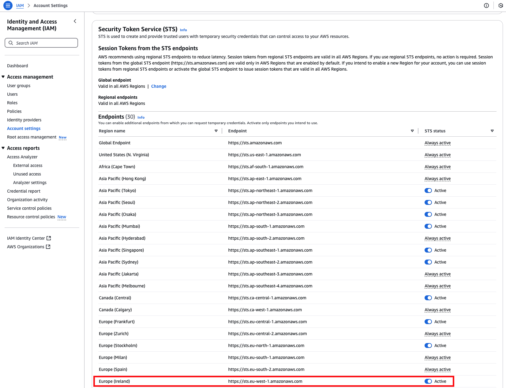

# FAQ
- <strong>I completed my onboarding but I see no data on the dashboards, what can I do?</strong>
   ProwlerPro takes several minutes to complete the first scan. Check the **Scan Status** progress bar on the **OVERVIEW** tab. Once the scan starts, information will start to populate the dashboards.

- <strong>When I click on the test connection button I see one of the following connection errors:</strong>
  

  

   Make sure that you correctly deploy our role by using either the Terraform or CloudFormation template, available in our [GitHub repository](https://github.com/prowler-cloud/prowlerpro-permissions-templates-public).
    Also check if your AWS Security Token Service (STS) has the **EU (Ireland)** endpoint active. If not we will not be able to connect to your AWS account.
    If that is the case your STS configuration may look like this:
    

  To solve this issue, please activate the **EU (Ireland)** STS endpoint.

- <strong>Where to get ProwlerPro help?</strong>
   Email the [ProwlerPro Support Team](support.md) at [**help.prowler.pro**](http://help.prowler.pro), which will open a help ticket and a member of our team will contact you.
