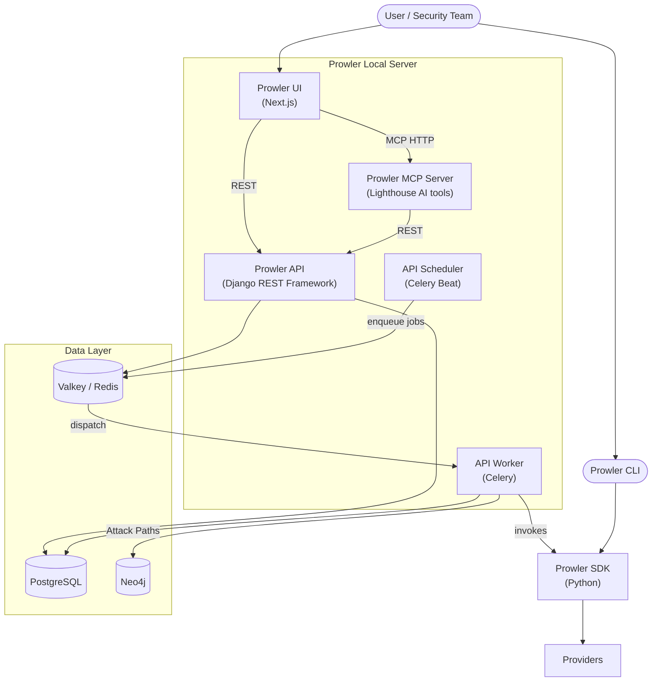

Prowler Local Server is a self-hosted web application that simplifies running Prowler. It provides:

- **User-friendly interface** for configuring and executing scans
- Dashboard to **view results** and manage **security findings**

## Components

Prowler Local Server consists of four main components:

- **Prowler UI**: User-friendly web interface for running Prowler and viewing results, powered by Next.js
- **Prowler API**: Backend API that executes Prowler scans and stores results, built with Django REST Framework
- **Prowler SDK**: Python SDK that integrates with Prowler CLI for advanced functionality
- **Prowler MCP Server**: Model Context Protocol server that exposes AI tools for Lighthouse, the AI-powered security assistant. Required dependency for Lighthouse.

Supporting infrastructure includes:

- **PostgreSQL**: Persistent storage of scan results
- **Celery Workers**: Asynchronous execution of Prowler scans
- **Celery Beat (API Scheduler)**: Schedules recurring scans and enqueues jobs on the broker
- **Valkey**: In-memory database serving as message broker for Celery workers
- **Neo4j**: Graph database used by the Attack Paths feature to combine cloud inventory with Prowler findings (currently populated by AWS scans)

