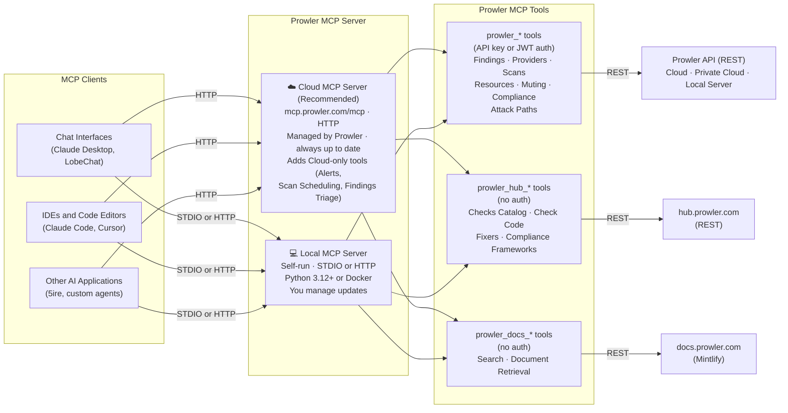

**Prowler MCP Server** brings the entire Prowler ecosystem to AI assistants through the Model Context Protocol (MCP). It enables seamless integration with AI tools like Claude Desktop, Cursor, and other MCP clients, allowing interaction with Prowler's security capabilities through natural language.

<Warning>
**Preview Feature**: This MCP server is currently under active development. Features and functionality may change. We welcome your feedback—please report any issues on [GitHub](https://github.com/prowler-cloud/prowler/issues) or join our [Slack community](https://goto.prowler.com/slack) to discuss and share your thoughts.
</Warning>

## Quickest Way to Connect: Cloud MCP Server

The fastest way to get started is the **Cloud MCP Server** at `https://mcp.prowler.com/mcp` — no installation, always up to date, and maintained by Prowler. Just point your MCP client at the URL and authenticate with a [Prowler API key](/user-guide/tutorials/prowler-app-api-keys) as a Bearer token:

```json
{
  "mcpServers": {
    "prowler": {
      "url": "https://mcp.prowler.com/mcp",
      "headers": {
        "Authorization": "Bearer <your-api-key-here>"
      }
    }
  }
}
```

<Card title="Connect Your MCP Client to the Cloud MCP Server" icon="cloud" href="/getting-started/basic-usage/prowler-mcp#cloud-mcp-server-configuration-recommended" horizontal>
  Step-by-step setup for Claude Code, Codex, Cursor, VS Code, and other agents.
</Card>

<Note>
Prefer to run it yourself? The **Local MCP Server** runs on your own machine or infrastructure. The Cloud MCP Server additionally provides tools for Prowler Cloud-specific features such as [Alerts](/user-guide/tutorials/prowler-alerts), [Scan Scheduling](/user-guide/tutorials/prowler-scan-scheduling), and [Findings Triage](/user-guide/tutorials/prowler-app-findings-triage). See [Cloud vs Local MCP Server](#cloud-vs-local-mcp-server).
</Note>

## What is the Model Context Protocol?

The [Model Context Protocol (MCP)](https://modelcontextprotocol.io) is an open standard developed by Anthropic that enables AI assistants to securely connect to external data sources and tools. It functions as a universal adapter enabling AI assistants to interact with various services through a standardized interface.

## Key Capabilities

The Prowler MCP Server provides three main integration points:

### 1. Prowler Cloud, Private Cloud & Local Server

Full access to your Prowler deployment — Prowler Cloud, Prowler Private Cloud, or Prowler Local Server — for:
- **Findings Analysis**: Query, filter, and analyze security findings across all your cloud environments
- **Provider Management**: Create, configure, and manage your configured Prowler providers (AWS, Azure, GCP, etc.)
- **Scan Orchestration**: Trigger on-demand scans and schedule recurring security assessments
- **Resource Inventory**: Search and view detailed information about your audited resources
- **Muting Management**: Create and manage muting lists/rules to suppress non-relevant findings
- **Attack Paths Analysis**: Analyze privilege escalation chains and security misconfigurations through graph-based analysis of cloud resource relationships
- **User & Role Management**: List the users in your tenant, identify the authenticated user, browse RBAC roles, and assign or remove a user's roles

### 2. Prowler Hub

Access to Prowler's comprehensive security knowledge base:
- **Security Checks Catalog**: Browse and search **over 2,000 security checks** across multiple cloud providers.
- **Check Implementation**: View the Python code that powers each security check.
- **Automated Fixers**: Access remediation scripts for common security issues.
- **Compliance Frameworks**: Explore mappings to **over 70 compliance standards and frameworks**.
- **Provider Services**: View available services and checks for each cloud provider.

### 3. Prowler Documentation

Search and retrieve official Prowler documentation:
- **Intelligent Search**: Full-text search across all Prowler documentation.
- **Contextual Results**: Get relevant documentation pages with highlighted snippets.
- **Document Retrieval**: Access complete markdown content of any documentation file.

## MCP Server Architecture

The following diagram illustrates the Prowler MCP Server architecture and its integration points. MCP clients connect to either the **Cloud MCP Server** (recommended) or a **Local MCP Server**; both expose the same tools and reach the same Prowler backends:



The architecture shows how AI assistants connect through the MCP protocol to access Prowler's three main components:
- Prowler Cloud, Prowler Private Cloud, or Prowler Local Server for security operations
- Prowler Hub for security knowledge
- Prowler Documentation for guidance and reference.

## Use Cases

The Prowler MCP Server enables powerful workflows through AI assistants:

**Security Operations**
- "Show me all critical findings from my AWS production accounts"
- "Register my new AWS account in Prowler and run a scheduled scan every day"
- "List all muted findings and detect what findgings are muted by a not enough good reason in relation to their severity"
- "Run an attack paths query to find EC2 instances exposed to the Internet with access to sensitive S3 buckets"

**Security Research**
- "Explain what the S3 bucket public access Prowler check does"
- "Find all Prowler checks related to encryption at rest"
- "What is the latest version of the CIS that Prowler is covering per provider?"

**Documentation & Learning**
- "How do I configure Prowler to scan my GCP organization?"
- "What authentication methods does Prowler support for Azure?"
- "How can I contribute with a new security check to Prowler?"

### Example: Creating a custom dashboard with Prowler extracted data

In the next example you can see how to create a dashboard using Prowler MCP Server and Claude Desktop.

**Used Prompt:**
```
Generate me a security dashboard for the Prowler open source project using live data from Prowler MCP tools.

REQUIREMENTS:
1. Fetch real-time data from Prowler Findings using MCP tools
2. Create a single self-contained HTML file and display it
3. Dashboard must be production-ready with modern design

DATA TO FETCH:
Use these MCP tools in this order:
1. Prowler list providers - To get all available configured provider in the account
2. Prowler get latest findings - To get findings information, if there are so many you can use the filter_fields to get less information, or pagination to get in different batches
3. For most critical findings you can get more context and remediation with Prowler Hub to get remediations for example

DESIGN REQUIREMENTS:
- Dark theme (gradient background: #0a0e27 to #131830)
- Card-based layout with glassmorphism effects
- Color scheme:
 * Primary green
 * Secondary purple
- Modern, professional look
- Animated "LIVE DATA" indicator (pulsing green badge)
- Hover effects on all cards (lift, glow, border color change)
- Responsive grid layout
- Mobile-responsive breakpoints at 768px
- Single HTML file with all CSS and JavaScript embedded
- No external dependencies

SPECIFIC DETAILS TO INCLUDE:
- Show actual counts from the data (don't hardcode numbers)
- Add timestamp showing when dashboard was generated
- Link to GitHub repository: https://github.com/prowler-cloud/prowler

OUTPUT:
Generate the complete HTML file and display it
```

**Video:**
<iframe
  className="w-full aspect-video rounded-xl"
  src="https://www.youtube.com/embed/li29KNmYd4g?si=P3m6eB2z0Cqqse_H"
  title="Prowler MCP Server - Creating a dashboard"
  frameBorder="0"
  allow="accelerometer; autoplay; clipboard-write; encrypted-media; gyroscope; picture-in-picture"
  allowFullScreen
></iframe>


## Cloud vs Local MCP Server

There are two ways to run the Prowler MCP Server. For almost everyone, the **Cloud MCP Server** is the right choice — it needs no installation and is maintained by Prowler. The **Local MCP Server** exists for users who need to run it on their own machine or infrastructure.

| | ☁️ **Cloud MCP Server** (Recommended) | 💻 **Local MCP Server** |
|---|---|---|
| **Endpoint** | `https://mcp.prowler.com/mcp` | Runs on your machine or infrastructure |
| **Setup** | Just configure your MCP client | Install via Docker, or source |
| **Transport** | HTTP | STDIO (subprocess) or self-hosted HTTP |
| **Maintenance** | Managed by Prowler, always up to date | You manage updates |
| **Requirements** | None (just an MCP client) | Python 3.12+ or Docker |
| **Cloud-only tools** | ✅ Alerts, Scan Scheduling, Findings Triage | ❌ Not available |
| **Authentication** | API key or JWT token | API key/JWT (HTTP) or env vars (STDIO) |

### ☁️ Cloud MCP Server (Recommended)

Prowler's managed MCP server at `https://mcp.prowler.com/mcp`. No installation, always up to date, and it includes tools for Prowler Cloud-specific features such as Alerts, Scan Scheduling, and Findings Triage. This is the path we recommend for nearly all users — go straight to the [Configuration guide](/getting-started/basic-usage/prowler-mcp#cloud-mcp-server-configuration-recommended).

### 💻 Local MCP Server

Run the server yourself when you need full control over the deployment. It connects to Prowler Cloud, Prowler Private Cloud, or Prowler Local Server and can run in two modes:

- **STDIO mode** — the server runs as a subprocess of your MCP client. Authentication via environment variables.
- **Self-hosted HTTP mode** — deploy your own remote HTTP server. Authentication via API key or JWT token.

Both require Python 3.12+ or Docker, plus network access to `https://hub.prowler.com` (Prowler Hub), `https://docs.prowler.com` (Prowler Documentation), and the Prowler API or Prowler Local Server API (Prowler features). See the [Installation guide](/getting-started/installation/prowler-mcp) to get started.

<Note>
**No Authentication Required**: Prowler Hub and Prowler Documentation features work without authentication on both the Cloud and Local MCP Server. A Prowler API key is only required to access Prowler features (Prowler Cloud, Prowler Private Cloud, or Prowler Local Server).
</Note>

## Next Steps

<CardGroup cols={2}>
  <Card title="Configuration" icon="gear" href="/getting-started/basic-usage/prowler-mcp">
    Connect your MCP client to the Cloud MCP Server
  </Card>
  <Card title="Tools Reference" icon="wrench" href="/getting-started/basic-usage/prowler-mcp-tools">
    Explore all available tools and capabilities
  </Card>
</CardGroup>

<Card title="Local Installation" icon="download" href="/getting-started/installation/prowler-mcp" horizontal>
  Run the Local MCP Server yourself using Docker, source, or uvx
</Card>
