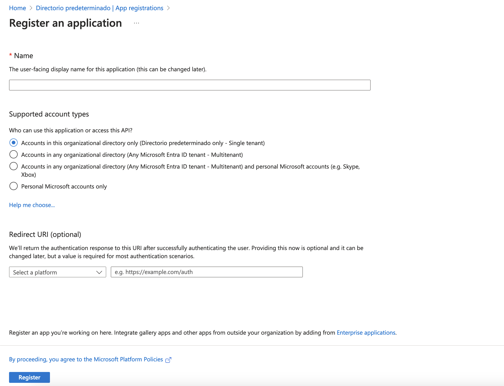
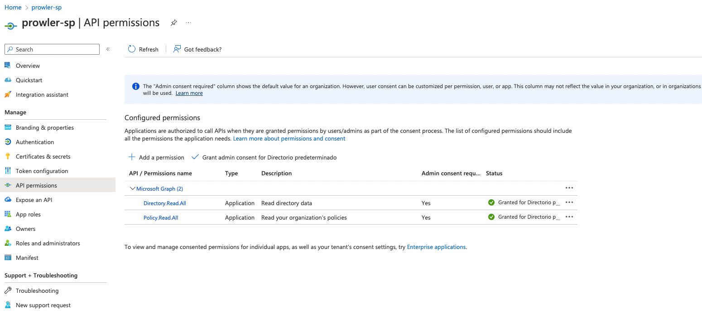

# Requirements

Prowler has been written in Python using the [AWS SDK (Boto3)](https://boto3.amazonaws.com/v1/documentation/api/latest/index.html#), [Azure SDK](https://azure.github.io/azure-sdk-for-python/) and [GCP API Python Client](https://github.com/googleapis/google-api-python-client/).
## AWS

Since Prowler uses AWS Credentials under the hood, you can follow any authentication method as described [here](https://docs.aws.amazon.com/cli/latest/userguide/cli-configure-quickstart.html#cli-configure-quickstart-precedence).

### AWS Authentication

Make sure you have properly configured your AWS-CLI with a valid Access Key and Region or declare AWS variables properly (or instance profile/role):

```console
aws configure
```

or

```console
export AWS_ACCESS_KEY_ID="ASXXXXXXX"
export AWS_SECRET_ACCESS_KEY="XXXXXXXXX"
export AWS_SESSION_TOKEN="XXXXXXXXX"
```

Those credentials must be associated to a user or role with proper permissions to do all checks. To make sure, add the following AWS managed policies to the user or role being used:

  - `arn:aws:iam::aws:policy/SecurityAudit`
  - `arn:aws:iam::aws:policy/job-function/ViewOnlyAccess`

  > Moreover, some read-only additional permissions are needed for several checks, make sure you attach also the custom policy [prowler-additions-policy.json](https://github.com/prowler-cloud/prowler/blob/master/permissions/prowler-additions-policy.json) to the role you are using.

  > If you want Prowler to send findings to [AWS Security Hub](https://aws.amazon.com/security-hub), make sure you also attach the custom policy [prowler-security-hub.json](https://github.com/prowler-cloud/prowler/blob/master/permissions/prowler-security-hub.json).

### Multi-Factor Authentication

If your IAM entity enforces MFA you can use `--mfa` and Prowler will ask you to input the following values to get a new session:

- ARN of your MFA device
- TOTP (Time-Based One-Time Password)

## Azure

Prowler for azure supports the following authentication types:

- Service principal authentication by environment variables (Enterprise Application)
- Current az cli credentials stored
- Interactive browser authentication
- Managed identity authentication

### Service Principal authentication

To allow Prowler assume the service principal identity to start the scan it is needed to configure the following environment variables:

```console
export AZURE_CLIENT_ID="XXXXXXXXX"
export AZURE_TENANT_ID="XXXXXXXXX"
export AZURE_CLIENT_SECRET="XXXXXXX"
```

If you try to execute Prowler with the `--sp-env-auth` flag and those variables are empty or not exported, the execution is going to fail.
### AZ CLI / Browser / Managed Identity authentication

The other three cases does not need additional configuration, `--az-cli-auth` and `--managed-identity-auth` are automated options. To use `--browser-auth`  the user needs to authenticate against Azure using the default browser to start the scan, also `tenant-id` is required.

### Permissions

To use each one you need to pass the proper flag to the execution. Prowler fro Azure handles two types of permission scopes, which are:

- **Azure Active Directory permissions**: Used to retrieve metadata from the identity assumed by Prowler and future AAD checks (not mandatory to have access to execute the tool)
- **Subscription scope permissions**: Required to launch the checks against your resources, mandatory to launch the tool.


#### Azure Active Directory scope

Microsoft Entra ID (AAD earlier) permissions required by the tool are the following:

- `Directory.Read.All`
- `Policy.Read.All`

The best way to assign it is through the azure web console:

1. Access to Microsoft Entra ID
2. Go to "App registrations" and register a new application
  
3. Once your application is registered, select "API permissions" blade
4. Add the needed permissions:
    - `Directory.Read.All`
    - `Policy.Read.All`

    


#### Subscriptions scope

Regarding the subscription scope, Prowler by default scans all the subscriptions that is able to list, so it is required to add the following RBAC builtin roles per subscription  to the entity that is going to be assumed by the tool:

- `Security Reader`
- `Reader`

To assign this roles, follow the instructions:

1. Access your subscription, then select your subscription.
2. Select "Access control (IAM)".
3. In the overview, select "Roles"
  
4. Click on Add and select 'Add role assigment'
5. In the bar, search `Security Reader` and select it.
6. In the Members blade, select a member.
7. Review + assign to apply the new role.

*Repeat these steps for `Reader`role*

## Google Cloud

### GCP Authentication

Prowler will follow the same credentials search as [Google authentication libraries](https://cloud.google.com/docs/authentication/application-default-credentials#search_order):

1. [GOOGLE_APPLICATION_CREDENTIALS environment variable](https://cloud.google.com/docs/authentication/application-default-credentials#GAC)
2. [User credentials set up by using the Google Cloud CLI](https://cloud.google.com/docs/authentication/application-default-credentials#personal)
3. [The attached service account, returned by the metadata server](https://cloud.google.com/docs/authentication/application-default-credentials#attached-sa)

Those credentials must be associated to a user or service account with proper permissions to do all checks. To make sure, add the `Viewer` role to the member associated with the credentials.

> By default, `prowler` will scan all accessible GCP Projects, use flag `--project-ids` to specify the projects to be scanned.
