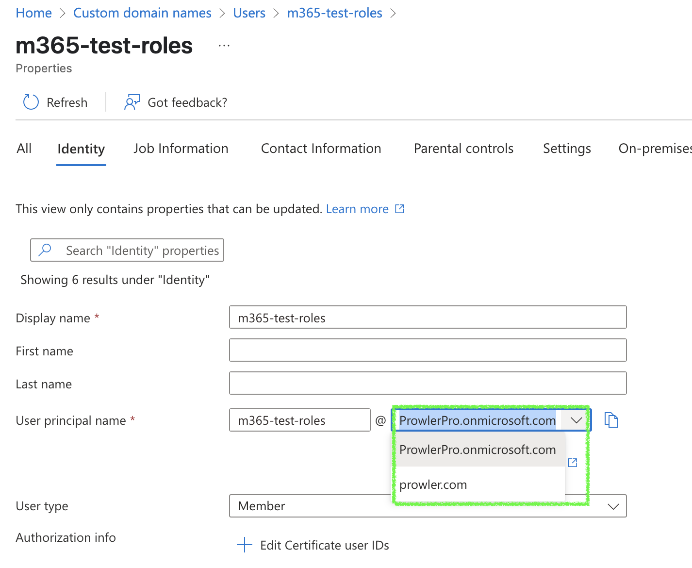

# Requirements

Prowler has been written in Python using the [AWS SDK (Boto3)](https://boto3.amazonaws.com/v1/documentation/api/latest/index.html#), [Azure SDK](https://azure.github.io/azure-sdk-for-python/) and [GCP API Python Client](https://github.com/googleapis/google-api-python-client/).
## AWS

Since Prowler uses AWS Credentials under the hood, you can follow any authentication method as described [here](https://docs.aws.amazon.com/cli/latest/userguide/cli-configure-quickstart.html#cli-configure-quickstart-precedence).

### Authentication

Make sure you have properly configured your AWS-CLI with a valid Access Key and Region or declare AWS variables properly (or instance profile/role):

```console
aws configure
```

or

```console
export AWS_ACCESS_KEY_ID="ASXXXXXXX"
export AWS_SECRET_ACCESS_KEY="XXXXXXXXX"
export AWS_SESSION_TOKEN="XXXXXXXXX"
```

Those credentials must be associated to a user or role with proper permissions to do all checks. To make sure, add the following AWS managed policies to the user or role being used:

  - `arn:aws:iam::aws:policy/SecurityAudit`
  - `arn:aws:iam::aws:policy/job-function/ViewOnlyAccess`

???+ note
    Moreover, some read-only additional permissions are needed for several checks, make sure you attach also the custom policy [prowler-additions-policy.json](https://github.com/prowler-cloud/prowler/blob/master/permissions/prowler-additions-policy.json) to the role you are using. If you want Prowler to send findings to [AWS Security Hub](https://aws.amazon.com/security-hub), make sure you also attach the custom policy [prowler-security-hub.json](https://github.com/prowler-cloud/prowler/blob/master/permissions/prowler-security-hub.json).

### Multi-Factor Authentication

If your IAM entity enforces MFA you can use `--mfa` and Prowler will ask you to input the following values to get a new session:

- ARN of your MFA device
- TOTP (Time-Based One-Time Password)

## Azure

Prowler for Azure supports the following authentication types. To use each one you need to pass the proper flag to the execution:

- [Service Principal Application](https://learn.microsoft.com/en-us/entra/identity-platform/app-objects-and-service-principals?tabs=browser#service-principal-object) (recommended).
- Current AZ CLI credentials stored.
- Interactive browser authentication.
- [Managed identity](https://learn.microsoft.com/en-us/entra/identity/managed-identities-azure-resources/overview) authentication.

???+ warning
    For Prowler App only the Service Principal authentication method is supported.

### Service Principal Application authentication

To allow Prowler assume the service principal application identity to start the scan it is needed to configure the following environment variables:

```console
export AZURE_CLIENT_ID="XXXXXXXXX"
export AZURE_TENANT_ID="XXXXXXXXX"
export AZURE_CLIENT_SECRET="XXXXXXX"
```

If you try to execute Prowler with the `--sp-env-auth` flag and those variables are empty or not exported, the execution is going to fail.
Follow the instructions in the [Create Prowler Service Principal](../tutorials/azure/create-prowler-service-principal.md#how-to-create-prowler-service-principal-application) section to create a service principal.

### AZ CLI / Browser / Managed Identity authentication

The other three cases does not need additional configuration, `--az-cli-auth` and `--managed-identity-auth` are automated options. To use `--browser-auth`  the user needs to authenticate against Azure using the default browser to start the scan, also `tenant-id` is required.

### Needed permissions

Prowler for Azure needs two types of permission scopes to be set:

- **Microsoft Entra ID permissions**: used to retrieve metadata from the identity assumed by Prowler and specific Entra checks (not mandatory to have access to execute the tool). The permissions required by the tool are the following:
    - `Domain.Read.All`
    - `Policy.Read.All`
    - `UserAuthenticationMethod.Read.All` (used only for the Entra checks related with multifactor authentication)
- **Subscription scope permissions**: required to launch the checks against your resources, mandatory to launch the tool. It is required to add the following RBAC builtin roles per subscription to the entity that is going to be assumed by the tool:
    - `Reader`
    - `ProwlerRole` (custom role with minimal permissions defined in [prowler-azure-custom-role](https://github.com/prowler-cloud/prowler/blob/master/permissions/prowler-azure-custom-role.json))
    ???+ note
        Please, notice that the field `assignableScopes` in the JSON custom role file must be changed to be the subscription or management group where the role is going to be assigned. The valid formats for the field are `/subscriptions/<subscription-id>` or `/providers/Microsoft.Management/managementGroups/<management-group-id>`.

To assign the permissions, follow the instructions in the [Microsoft Entra ID permissions](../tutorials/azure/create-prowler-service-principal.md#assigning-the-proper-permissions) section and the [Azure subscriptions permissions](../tutorials/azure/subscriptions.md#assign-the-appropriate-permissions-to-the-identity-that-is-going-to-be-assumed-by-prowler) section, respectively.

???+ warning
    Some permissions in `ProwlerRole` are considered **write** permissions, so if you have a `ReadOnly` lock attached to some resources you may get an error and will not get a finding for that check.

#### Checks that require ProwlerRole

The following checks require the `ProwlerRole` permissions to be executed, if you want to run them, make sure you have assigned the role to the identity that is going to be assumed by Prowler:

- `app_function_access_keys_configured`
- `app_function_ftps_deployment_disabled`

## Google Cloud

### Authentication

Prowler will follow the same credentials search as [Google authentication libraries](https://cloud.google.com/docs/authentication/application-default-credentials#search_order):

1. [GOOGLE_APPLICATION_CREDENTIALS environment variable](https://cloud.google.com/docs/authentication/application-default-credentials#GAC)
2. [User credentials set up by using the Google Cloud CLI](https://cloud.google.com/docs/authentication/application-default-credentials#personal)
3. [The attached service account, returned by the metadata server](https://cloud.google.com/docs/authentication/application-default-credentials#attached-sa)

### Needed permissions

Prowler for Google Cloud needs the following permissions to be set:

- **Viewer (`roles/viewer`) IAM role**: granted at the project / folder / org level in order to scan the target projects

- **Project level settings**: you need to have at least one project with the below settings:
    - Identity and Access Management (IAM) API (`iam.googleapis.com`) enabled by either using the
    [Google Cloud API UI](https://console.cloud.google.com/apis/api/iam.googleapis.com/metrics) or
    by using the gcloud CLI `gcloud services enable iam.googleapis.com --project <your-project-id>` command
    - Service Usage Consumer (`roles/serviceusage.serviceUsageConsumer`) IAM role
    - Set the quota project to be this project by either running `gcloud auth application-default set-quota-project <project-id>` or by setting an environment variable:
    `export GOOGLE_CLOUD_QUOTA_PROJECT=<project-id>`


The above settings must be associated to a user or service account.


???+ note
    By default, `prowler` will scan all accessible GCP Projects, use flag `--project-ids` to specify the projects to be scanned.

## Microsoft 365

Prowler for M365 currently supports the following authentication types:

- [Service Principal Application](https://learn.microsoft.com/en-us/entra/identity-platform/app-objects-and-service-principals?tabs=browser#service-principal-object).
- Service Principal Application and Microsoft User Credentials (**recommended**).
- Current AZ CLI credentials stored.
- Interactive browser authentication.


???+ warning
    For Prowler App only the Service Principal with User Credentials authentication method is supported.

### Service Principal authentication

Authentication flag: `--sp-env-auth`

To allow Prowler assume the service principal identity to start the scan it is needed to configure the following environment variables:

```console
export AZURE_CLIENT_ID="XXXXXXXXX"
export AZURE_CLIENT_SECRET="XXXXXXXXX"
export AZURE_TENANT_ID="XXXXXXXXX"
```

If you try to execute Prowler with the `--sp-env-auth` flag and those variables are empty or not exported, the execution is going to fail.
Follow the instructions in the [Create Prowler Service Principal](../tutorials/microsoft365/getting-started-m365.md#create-the-service-principal-app) section to create a service principal.

With this credentials you will only be able to run the checks that work through MS Graph, this means that you won't run all the provider. If you want to scan all the checks from M365 you will need to use the recommended authentication method.

### Service Principal and User Credentials authentication (recommended)

Authentication flag: `--env-auth`

This authentication method follows the same approach as the service principal method but introduces two additional environment variables for user credentials:  `M365_USER` and `M365_PASSWORD`.

```console
export AZURE_CLIENT_ID="XXXXXXXXX"
export AZURE_CLIENT_SECRET="XXXXXXXXX"
export AZURE_TENANT_ID="XXXXXXXXX"
export M365_USER="your_email@example.com"
export M365_PASSWORD="examplepassword"
```

These two new environment variables are **required** to execute the PowerShell modules needed to retrieve information from M365 services. Prowler uses Service Principal authentication to access Microsoft Graph and user credentials to authenticate to Microsoft PowerShell modules.

- `M365_USER` should be your Microsoft account email using the **assigned domain in the tenant**. This means it must look like `example@YourCompany.onmicrosoft.com` or `example@YourCompany.com`, but it must be the exact domain assigned to that user in the tenant.

    ???+ warning
        The user must not be MFA capable. Microsoft does not allow MFA capable users to authenticate programmatically. See [Microsoft documentation](https://learn.microsoft.com/en-us/entra/identity-platform/scenario-desktop-acquire-token-username-password?tabs=dotnet) for more information.

    ???+ warning
        Using a tenant domain other than the one assigned — even if it belongs to the same tenant — will cause Prowler to fail, as Microsoft authentication will not succeed.

    Ensure you are using the right domain for the user you are trying to authenticate with.

    

- `M365_PASSWORD` must be the user password.

    ???+ note
        Before we asked for a encrypted password, but now we ask for the user password directly. Prowler will now handle the password encryption for you.


### Interactive Browser authentication

Authentication flag: `--browser-auth`

This authentication method requires the user to authenticate against Azure using the default browser to start the scan, also `--tenant-id` flag is required.

With this credentials you will only be able to run the checks that work through MS Graph, this means that you won't run all the provider. If you want to scan all the checks from M365 you will need to use the recommended authentication method.

Since this is a delegated permission authentication method, necessary permissions should be given to the user, not the app.


### Needed permissions

Prowler for M365 requires two types of permission scopes to be set (if you want to run the full provider including PowerShell checks). Both must be configured using Microsoft Entra ID:

- **Service Principal Application Permissions**: These are set at the **application** level and are used to retrieve data from the identity being assessed:
    - `AuditLog.Read.All`: Required for Entra service.
    - `Domain.Read.All`: Required for all services.
    - `Organization.Read.All`: Required for retrieving tenant information.
    - `Policy.Read.All`: Required for all services.
    - `SharePointTenantSettings.Read.All`: Required for SharePoint service.
    - `User.Read` (IMPORTANT: this must be set as **delegated**): Required for the sign-in.


- **Powershell Modules Permissions**: These are set at the `M365_USER` level, so the user used to run Prowler must have one of the following roles:
    - `Global Reader` (recommended): this allows you to read all roles needed.
    - `Exchange Administrator` and `Teams Administrator`: user needs both roles but with this [roles](https://learn.microsoft.com/en-us/exchange/permissions-exo/permissions-exo#microsoft-365-permissions-in-exchange-online) you can access to the same information as a Global Reader (since only read access is needed, Global Reader is recommended).

In order to know how to assign those permissions and roles follow the instructions in the Microsoft Entra ID [permissions](../tutorials/microsoft365/getting-started-m365.md#grant-required-api-permissions) and [roles](../tutorials/microsoft365/getting-started-m365.md#assign-required-roles-to-your-user) section.


### Supported PowerShell versions

You must have PowerShell installed to run certain M365 checks.
Currently, we support **PowerShell version 7.4 or higher** (7.5 is recommended).

This requirement exists because **PowerShell 5.1** (the version that comes by default on some Windows systems) does not support several cmdlets needed to run the checks properly.
Additionally, earlier [PowerShell Cross-Platform versions](https://learn.microsoft.com/en-us/powershell/scripting/install/powershell-support-lifecycle?view=powershell-7.5) are no longer under technical support, which may cause unexpected errors.


???+ note
    Installing powershell will be only needed if you install prowler from pip or other sources, these means that the SDK and API containers contain PowerShell installed by default.

Installing PowerShell is different depending on your OS.

- [Windows](https://learn.microsoft.com/es-es/powershell/scripting/install/installing-powershell-on-windows?view=powershell-7.5#install-powershell-using-winget-recommended): you will need to update PowerShell to +7.4 to be able to run prowler, if not some checks will not show findings and the provider could not work as expected. This version of PowerShell is [supported](https://learn.microsoft.com/es-es/powershell/scripting/install/installing-powershell-on-windows?view=powershell-7.4#supported-versions-of-windows) on Windows 10, Windows 11, Windows Server 2016 and higher versions.

```console
winget install --id Microsoft.PowerShell --source winget
```


- [MacOS](https://learn.microsoft.com/es-es/powershell/scripting/install/installing-powershell-on-macos?view=powershell-7.5#install-the-latest-stable-release-of-powershell): installing PowerShell on MacOS needs to have installed [brew](https://brew.sh/), once you have it is just running the command above, Pwsh is only supported in macOS 15 (Sequoia) x64 and Arm64, macOS 14 (Sonoma) x64 and Arm64, macOS 13 (Ventura) x64 and Arm64

```console
brew install powershell/tap/powershell
```

Once it's installed run `pwsh` on your terminal to verify it's working.

- Linux: installing PowerShell on Linux depends on the distro you are using:

    - [Ubuntu](https://learn.microsoft.com/es-es/powershell/scripting/install/install-ubuntu?view=powershell-7.5#installation-via-package-repository-the-package-repository): The required version for installing PowerShell +7.4 on Ubuntu are Ubuntu 22.04 and Ubuntu 24.04. The recommended way to install it is downloading the package available on PMC. You just need to follow the following steps:

    ```console
    ###################################
    # Prerequisites

    # Update the list of packages
    sudo apt-get update

    # Install pre-requisite packages.
    sudo apt-get install -y wget apt-transport-https software-properties-common

    # Get the version of Ubuntu
    source /etc/os-release

    # Download the Microsoft repository keys
    wget -q https://packages.microsoft.com/config/ubuntu/$VERSION_ID/packages-microsoft-prod.deb

    # Register the Microsoft repository keys
    sudo dpkg -i packages-microsoft-prod.deb

    # Delete the Microsoft repository keys file
    rm packages-microsoft-prod.deb

    # Update the list of packages after we added packages.microsoft.com
    sudo apt-get update

    ###################################
    # Install PowerShell
    sudo apt-get install -y powershell

    # Start PowerShell
    pwsh
    ```

    - [Alpine](https://learn.microsoft.com/es-es/powershell/scripting/install/install-alpine?view=powershell-7.5#installation-steps): The only supported version for installing PowerShell +7.4 on Alpine is Alpine 3.20. The unique way to install it is downloading the tar.gz package available on [PowerShell github](https://github.com/PowerShell/PowerShell/releases/download/v7.5.0/powershell-7.5.0-linux-musl-x64.tar.gz). You just need to follow the following steps:

    ```console
    # Install the requirements
    sudo apk add --no-cache \
        ca-certificates \
        less \
        ncurses-terminfo-base \
        krb5-libs \
        libgcc \
        libintl \
        libssl3 \
        libstdc++ \
        tzdata \
        userspace-rcu \
        zlib \
        icu-libs \
        curl

    apk -X https://dl-cdn.alpinelinux.org/alpine/edge/main add --no-cache \
        lttng-ust \
        openssh-client \

    # Download the powershell '.tar.gz' archive
    curl -L https://github.com/PowerShell/PowerShell/releases/download/v7.5.0/powershell-7.5.0-linux-musl-x64.tar.gz -o /tmp/powershell.tar.gz

    # Create the target folder where powershell will be placed
    sudo mkdir -p /opt/microsoft/powershell/7

    # Expand powershell to the target folder
    sudo tar zxf /tmp/powershell.tar.gz -C /opt/microsoft/powershell/7

    # Set execute permissions
    sudo chmod +x /opt/microsoft/powershell/7/pwsh

    # Create the symbolic link that points to pwsh
    sudo ln -s /opt/microsoft/powershell/7/pwsh /usr/bin/pwsh

    # Start PowerShell
    pwsh
    ```

    - [Debian](https://learn.microsoft.com/es-es/powershell/scripting/install/install-debian?view=powershell-7.5#installation-on-debian-11-or-12-via-the-package-repository): The required version for installing PowerShell +7.4 on Debian are Debian 11 and Debian 12. The recommended way to install it is downloading the package available on PMC. You just need to follow the following steps:

    ```console
    ###################################
    # Prerequisites

    # Update the list of packages
    sudo apt-get update

    # Install pre-requisite packages.
    sudo apt-get install -y wget

    # Get the version of Debian
    source /etc/os-release

    # Download the Microsoft repository GPG keys
    wget -q https://packages.microsoft.com/config/debian/$VERSION_ID/packages-microsoft-prod.deb

    # Register the Microsoft repository GPG keys
    sudo dpkg -i packages-microsoft-prod.deb

    # Delete the Microsoft repository GPG keys file
    rm packages-microsoft-prod.deb

    # Update the list of packages after we added packages.microsoft.com
    sudo apt-get update

    ###################################
    # Install PowerShell
    sudo apt-get install -y powershell

    # Start PowerShell
    pwsh
    ```

    - [Rhel](https://learn.microsoft.com/es-es/powershell/scripting/install/install-rhel?view=powershell-7.5#installation-via-the-package-repository): The required version for installing PowerShell +7.4 on Red Hat are RHEL 8 and RHEL 9. The recommended way to install it is downloading the package available on PMC. You just need to follow the following steps:

    ```console
    ###################################
    # Prerequisites

    # Get version of RHEL
    source /etc/os-release
    if [ ${VERSION_ID%.*} -lt 8 ]
    then majorver=7
    elif [ ${VERSION_ID%.*} -lt 9 ]
    then majorver=8
    else majorver=9
    fi

    # Download the Microsoft RedHat repository package
    curl -sSL -O https://packages.microsoft.com/config/rhel/$majorver/packages-microsoft-prod.rpm

    # Register the Microsoft RedHat repository
    sudo rpm -i packages-microsoft-prod.rpm

    # Delete the downloaded package after installing
    rm packages-microsoft-prod.rpm

    # Update package index files
    sudo dnf update
    # Install PowerShell
    sudo dnf install powershell -y
    ```

- [Docker](https://learn.microsoft.com/es-es/powershell/scripting/install/powershell-in-docker?view=powershell-7.5#use-powershell-in-a-container): The following command download the latest stable versions of PowerShell:

    ```console
    docker pull mcr.microsoft.com/dotnet/sdk:9.0
    ```

    To start an interactive shell of Pwsh you just need to run:

    ```console
    docker run -it mcr.microsoft.com/dotnet/sdk:9.0 pwsh
    ```


### Needed PowerShell modules

To obtain the required data for this provider, we use several PowerShell cmdlets.
These cmdlets come from different modules that must be installed.

The installation of these modules will be performed automatically if you run Prowler with the flag `--init-modules`. This an example way of running Prowler and installing the modules:

```console
python3 prowler-cli.py m365 --verbose --log-level ERROR --env-auth --init-modules
```

If you already have them installed, there is no problem even if you use the flag because it will automatically check if the needed modules are already installed.

???+ note
    Prowler installs the modules using `-Scope CurrentUser`.
    If you encounter any issues with services not working after the automatic installation, try installing the modules manually using `-Scope AllUsers` (administrator permissions are required for this).
    The command needed to install a module manually is:
    ```powershell
    Install-Module -Name "ModuleName" -Scope AllUsers -Force
    ```

The required modules are:

- [ExchangeOnlineManagement](https://www.powershellgallery.com/packages/ExchangeOnlineManagement/3.6.0): Minimum version 3.6.0. Required for several checks across Exchange, Defender, and Purview.
- [MicrosoftTeams](https://www.powershellgallery.com/packages/MicrosoftTeams/6.6.0): Minimum version 6.6.0. Required for all Teams checks.

## GitHub
### Authentication

Prowler supports multiple methods to [authenticate with GitHub](https://docs.github.com/en/rest/authentication/authenticating-to-the-rest-api). These include:

- **Personal Access Token (PAT)**
- **OAuth App Token**
- **GitHub App Credentials**

This flexibility allows you to scan and analyze your GitHub account, including repositories, organizations, and applications, using the method that best suits your use case.

The provided credentials must have the appropriate permissions to perform all the required checks.

???+ note
    GitHub App Credentials support less checks than other authentication methods.
