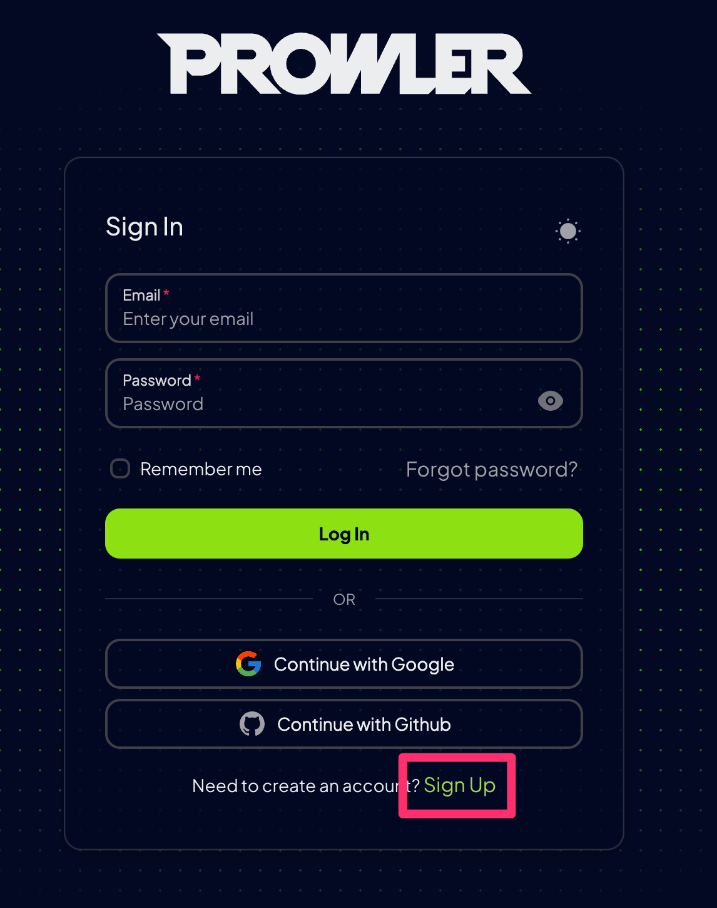
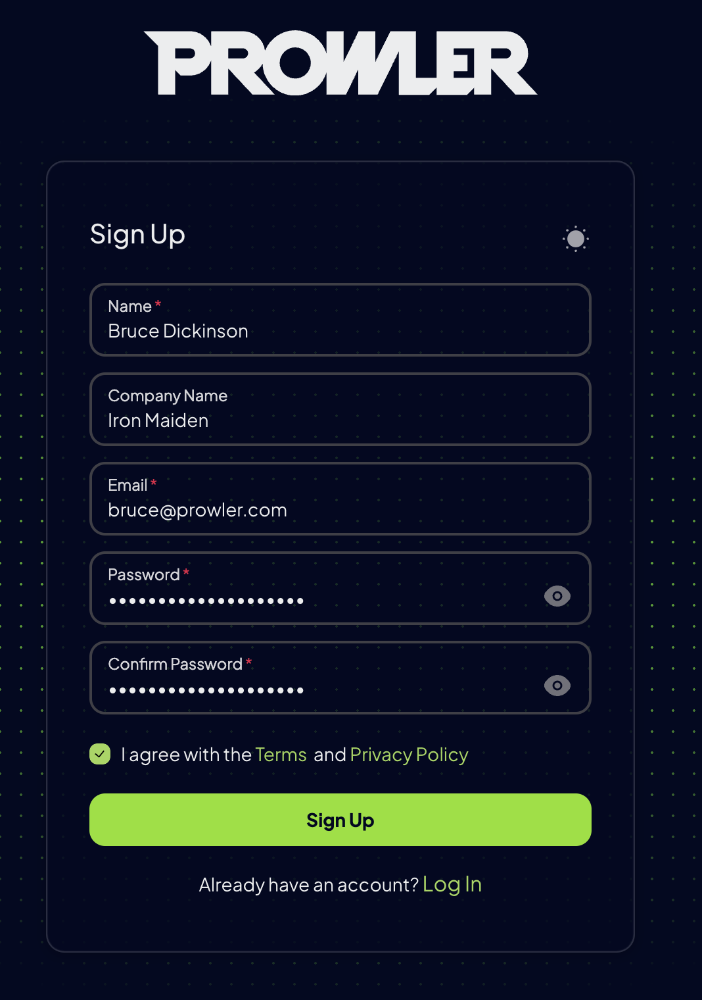
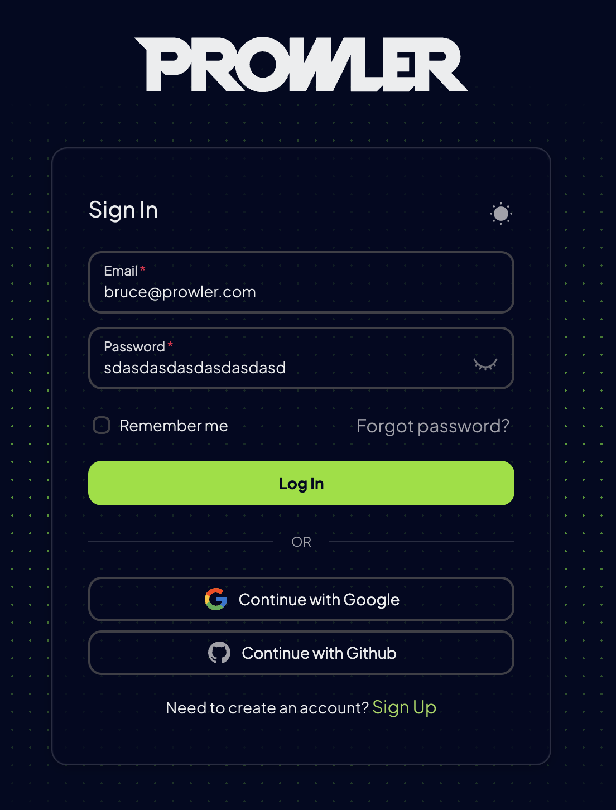

**Prowler** is an Open Source security tool to perform AWS, Azure, Google Cloud and Kubernetes security best practices assessments, audits, incident response, continuous monitoring, hardening and forensics readiness, and also remediations! We have Prowler CLI (Command Line Interface) that we call Prowler Open Source and a service on top of it that we call <a href="https://prowler.com">Prowler SaaS</a>.

## Prowler App


Prowler App is a web application that allows you to run Prowler in a simple way. It provides a user-friendly interface to configure and run scans, view results, and manage your security findings.

See how to install the Prowler App in the [Quick Start](#prowler-app-installation) section.

## Prowler CLI

```console
prowler <provider>
```


## Prowler Dashboard

```console
prowler dashboard
```


It contains hundreds of controls covering CIS, NIST 800, NIST CSF, CISA, RBI, FedRAMP, PCI-DSS, GDPR, HIPAA, FFIEC, SOC2, GXP, AWS Well-Architected Framework Security Pillar, AWS Foundational Technical Review (FTR), ENS (Spanish National Security Scheme) and your custom security frameworks.

## Quick Start
### Prowler App Installation

Prowler App can be installed in different ways, depending on your environment:

> See how to use Prowler App in the [Prowler App](tutorials/prowler-app.md) section.

=== "Docker Compose"

    _Requirements_:

    * `Docker Compose` installed: https://docs.docker.com/compose/install/.

    _Commands_:

    ``` bash
    curl -LO https://raw.githubusercontent.com/prowler-cloud/prowler/refs/heads/master/docker-compose.yml
    curl -LO https://raw.githubusercontent.com/prowler-cloud/prowler/refs/heads/master/.env
    docker compose up -d
    ```

    > Enjoy Prowler App at http://localhost:3000 by signing up with your email and password.

    ???+ note
        You can change the environment variables in the `.env` file. Note that it is not recommended to use the default values in production environments.

    ???+ note
        There is a development mode available, you can use the file https://github.com/prowler-cloud/prowler/blob/master/docker-compose.dev.yml to run the app in development mode.

    ???+ warning
        Google and GitHub authentication is only available in [Prowler Cloud](https://prowler.com).

=== "GitHub"

    _Requirements_:

    * `git` installed.
    * `poetry` installed: [poetry installation](https://python-poetry.org/docs/#installation).
    * `npm` installed: [npm installation](https://docs.npmjs.com/downloading-and-installing-node-js-and-npm).
    * `Docker Compose` installed: https://docs.docker.com/compose/install/.

    _Commands to run the API_:

    ``` bash
    git clone https://github.com/prowler-cloud/prowler \
    cd prowler/api \
    poetry install \
    poetry shell \
    set -a \
    source .env \
    docker compose up postgres valkey -d \
    cd src/backend \
    python manage.py migrate --database admin \
    gunicorn -c config/guniconf.py config.wsgi:application
    ```

    > Now, you can access the API documentation at http://localhost:8080/api/v1/docs.

    _Commands to run the API Worker_:

    ``` bash
    git clone https://github.com/prowler-cloud/prowler \
    cd prowler/api \
    poetry install \
    poetry shell \
    set -a \
    source .env \
    cd src/backend \
    python -m celery -A config.celery worker -l info -E
    ```

    _Commands to run the UI_:

    ``` bash
    git clone https://github.com/prowler-cloud/prowler \
    cd prowler/ui \
    npm install \
    npm run build \
    npm start
    ```

    > Enjoy Prowler App at http://localhost:3000 by signing up with your email and password.

    ???+ warning
        Make sure to have `api/.env` and `ui/.env.local` files with the required environment variables. You can find the required environment variables in the [`api/.env.template`](https://github.com/prowler-cloud/prowler/blob/master/api/.env.example) and [`ui/.env.template`](https://github.com/prowler-cloud/prowler/blob/master/ui/.env.template) files.

    ???+ warning
        Google and GitHub authentication is only available in [Prowler Cloud](https://prowler.com).

### Prowler CLI Installation

Prowler is available as a project in [PyPI](https://pypi.org/project/prowler/), thus can be installed as Python package with `Python >= 3.9`:

=== "pipx"

    [pipx](https://pipx.pypa.io/stable/) is a tool to install Python applications in isolated environments. It is recommended to use `pipx` for a global installation.

    _Requirements_:

    * `Python >= 3.9`
    * `pipx` installed: [pipx installation](https://pipx.pypa.io/stable/installation/).
    * AWS, GCP, Azure and/or Kubernetes credentials

    _Commands_:

    ``` bash
    pipx install prowler
    prowler -v
    ```

    To upgrade Prowler to the latest version, run:

    ``` bash
    pipx upgrade prowler
    ```

=== "pip"

    ???+ warning
        This method is not recommended because it will modify the environment which you choose to install. Consider using [pipx](https://docs.prowler.com/projects/prowler-open-source/en/latest/#__tabbed_1_1) for a global installation.

    _Requirements_:

    * `Python >= 3.9`
    * `Python pip >= 21.0.0`
    * AWS, GCP, Azure and/or Kubernetes credentials

    _Commands_:

    ``` bash
    pip install prowler
    prowler -v
    ```

    To upgrade Prowler to the latest version, run:

    ``` bash
    pip install --upgrade prowler
    ```

=== "Docker"

    _Requirements_:

    * Have `docker` installed: https://docs.docker.com/get-docker/.
    * In the command below, change `-v` to your local directory path in order to access the reports.
    * AWS, GCP, Azure and/or Kubernetes credentials

    _Commands_:

    ``` bash
    docker run -ti --rm -v /your/local/dir/prowler-output:/home/prowler/output \
    --name prowler \
    --env AWS_ACCESS_KEY_ID \
    --env AWS_SECRET_ACCESS_KEY \
    --env AWS_SESSION_TOKEN toniblyx/prowler:latest
    ```

=== "GitHub"

    _Requirements for Developers_:

    * `git`
    * `poetry` installed: [poetry installation](https://python-poetry.org/docs/#installation).
    * AWS, GCP, Azure and/or Kubernetes credentials

    _Commands_:

    ```
    git clone https://github.com/prowler-cloud/prowler
    cd prowler
    poetry install
    poetry run python prowler.py -v
    ```
    ???+ note
        If you want to clone Prowler from Windows, use `git config core.longpaths true` to allow long file paths.

=== "Amazon Linux 2"

    _Requirements_:

    * `Python >= 3.9`
    * AWS, GCP, Azure and/or Kubernetes credentials

    _Commands_:

    ```
    python3 -m pip install --user pipx
    python3 -m pipx ensurepath
    pipx install prowler
    prowler -v
    ```

=== "Ubuntu"

    _Requirements_:

    * `Ubuntu 23.04` or above, if you are using an older version of Ubuntu check [pipx installation](https://docs.prowler.com/projects/prowler-open-source/en/latest/#__tabbed_1_1) and ensure you have `Python >= 3.9`.
    * `Python >= 3.9`
    * AWS, GCP, Azure and/or Kubernetes credentials

    _Commands_:

    ``` bash
    sudo apt update
    sudo apt install pipx
    pipx ensurepath
    pipx install prowler
    prowler -v
    ```

=== "Brew"

    _Requirements_:

    * `Brew` installed in your Mac or Linux
    * AWS, GCP, Azure and/or Kubernetes credentials

    _Commands_:

    ``` bash
    brew install prowler
    prowler -v
    ```

=== "AWS CloudShell"

    After the migration of AWS CloudShell from Amazon Linux 2 to Amazon Linux 2023 [[1]](https://aws.amazon.com/about-aws/whats-new/2023/12/aws-cloudshell-migrated-al2023/) [[2]](https://docs.aws.amazon.com/cloudshell/latest/userguide/cloudshell-AL2023-migration.html), there is no longer a need to manually compile Python 3.9 as it's already included in AL2023. Prowler can thus be easily installed following the Generic method of installation via pip. Follow the steps below to successfully execute Prowler v4 in AWS CloudShell:

    _Requirements_:

    * Open AWS CloudShell `bash`.

    _Commands_:

    ```bash
    sudo bash
    adduser prowler
    su prowler
    python3 -m pip install --user pipx
    python3 -m pipx ensurepath
    pipx install prowler
    cd /tmp
    prowler aws
    ```

    ???+ note
        To download the results from AWS CloudShell, select Actions -> Download File and add the full path of each file. For the CSV file it will be something like `/tmp/output/prowler-output-123456789012-20221220191331.csv`

=== "Azure CloudShell"

    _Requirements_:

    * Open Azure CloudShell `bash`.

    _Commands_:

    ```bash
    python3 -m pip install --user pipx
    python3 -m pipx ensurepath
    pipx install prowler
    cd /tmp
    prowler azure --az-cli-auth
    ```

## Prowler container versions

The available versions of Prowler CLI are the following:

- `latest`: in sync with `master` branch (bear in mind that it is not a stable version)
- `v4-latest`: in sync with `v4` branch (bear in mind that it is not a stable version)
- `v3-latest`: in sync with `v3` branch (bear in mind that it is not a stable version)
- `<x.y.z>` (release): you can find the releases [here](https://github.com/prowler-cloud/prowler/releases), those are stable releases.
- `stable`: this tag always point to the latest release.
- `v4-stable`: this tag always point to the latest release for v4.
- `v3-stable`: this tag always point to the latest release for v3.

The container images are available here:
- Prowler CLI:
    - [DockerHub](https://hub.docker.com/r/toniblyx/prowler/tags)
    - [AWS Public ECR](https://gallery.ecr.aws/prowler-cloud/prowler)
- Prowler App:
    - [DockerHub - Prowler UI](https://hub.docker.com/r/prowlercloud/prowler-ui/tags)
    - [DockerHub - Prowler API](https://hub.docker.com/r/prowlercloud/prowler-api/tags)

## High level architecture

You can run Prowler from your workstation, a Kubernetes Job, a Google Compute Engine, an Azure VM, an EC2 instance, Fargate or any other container, CloudShell and many more.


### Prowler App

The **Prowler App** consists of three main components:

- **Prowler UI**: A user-friendly web interface for running Prowler and viewing results, powered by Next.js.
- **Prowler API**: The backend API that executes Prowler scans and stores the results, built with Django REST Framework.
- **Prowler SDK**: A Python SDK that integrates with the Prowler CLI for advanced functionality.

The app leverages the following supporting infrastructure:

- **PostgreSQL**: Used for persistent storage of scan results.
- **Celery Workers**: Facilitate asynchronous execution of Prowler scans.
- **Valkey**: An in-memory database serving as a message broker for the Celery workers.


## Deprecations from v3

### General
- `Allowlist` now is called `Mutelist`.
- The `--quiet` option has been deprecated, now use the `--status` flag to select the finding's status you want to get from PASS, FAIL or MANUAL.
- All `INFO` finding's status has changed to `MANUAL`.
- The CSV output format is common for all the providers.

We have deprecated some of our outputs formats:

- The native JSON is replaced for the JSON [OCSF](https://schema.ocsf.io/) v1.1.0, common for all the providers.

### AWS
- Deprecate the AWS flag --sts-endpoint-region since we use AWS STS regional tokens.
- To send only FAILS to AWS Security Hub, now use either `--send-sh-only-fails` or `--security-hub --status FAIL`.

## Basic Usage
### Prowler App

#### **Access the App**
Go to [http://localhost:3000](http://localhost:3000) after installing the app (see [Quick Start](#prowler-app-installation)). Sign up with your email and password.




#### **Log In**
Log in with your email and password to start using the Prowler App.



#### **Add a Provider**
- Go to `Settings > Cloud Providers` and click `Add Account`.
- Select the provider you want to scan (AWS, GCP, Azure, Kubernetes).
- Enter the provider's ID (AWS Account ID, GCP Project ID, Azure Subscription ID, Kubernetes Cluster) and optional alias.
- Follow the instructions to add your credentials.

#### **Start a Scan**
After successfully adding and testing your credentials, Prowler will start scanning your cloud environment, click on the `Go to Scans` button to see the progress.

#### **View Results**
While the scan is running, start exploring the findings in these sections:

- **Overview**: High-level summary of the scans. 
- **Compliance**: Insights into compliance status. 

> See more details about the Prowler App usage in the [Prowler App](tutorials/prowler-app.md) section.

???+ note
    Prowler will automatically scan all configured providers every **24 hours**, ensuring your cloud environment stays continuously monitored.

### Prowler CLI

To run Prowler, you will need to specify the provider (e.g `aws`, `gcp`, `azure` or `kubernetes`):

???+ note
    If no provider specified, AWS will be used for backward compatibility with most of v2 options.

```console
prowler <provider>
```


???+ note
    Running the `prowler` command without options will use your environment variable credentials, see [Requirements](./getting-started/requirements.md) section to review the credentials settings.

If you miss the former output you can use `--verbose` but Prowler v4 is smoking fast, so you won't see much ;

By default, Prowler generates CSV, JSON-OCSF and HTML reports. However, you can generate a JSON-ASFF report (used by AWS Security Hub) with `-M` or `--output-modes`:

```console
prowler <provider> -M csv json-asff json-ocsf html
```
The html report will be located in the output directory as the other files and it will look like:


You can use `-l`/`--list-checks` or `--list-services` to list all available checks or services within the provider.

```console
prowler <provider> --list-checks
prowler <provider> --list-services
```

For executing specific checks or services you can use options `-c`/`checks` or `-s`/`services`:

```console
prowler azure --checks storage_blob_public_access_level_is_disabled
prowler aws --services s3 ec2
prowler gcp --services iam compute
prowler kubernetes --services etcd apiserver
```

Also, checks and services can be excluded with options `-e`/`--excluded-checks` or `--excluded-services`:

```console
prowler aws --excluded-checks s3_bucket_public_access
prowler azure --excluded-services defender iam
prowler gcp --excluded-services kms
prowler kubernetes --excluded-services controllermanager
```

More options and executions methods that will save your time in [Miscellaneous](tutorials/misc.md).

You can always use `-h`/`--help` to access to the usage information and all the possible options:

```console
prowler --help
```

#### AWS

Use a custom AWS profile with `-p`/`--profile` and/or AWS regions which you want to audit with `-f`/`--filter-region`:

```console
prowler aws --profile custom-profile -f us-east-1 eu-south-2
```

???+ note
    By default, `prowler` will scan all AWS regions.

See more details about AWS Authentication in [Requirements](getting-started/requirements.md#aws)

#### Azure

With Azure you need to specify which auth method is going to be used:

```console
# To use service principal authentication
prowler azure --sp-env-auth

# To use az cli authentication
prowler azure --az-cli-auth

# To use browser authentication
prowler azure --browser-auth --tenant-id "XXXXXXXX"

# To use managed identity auth
prowler azure --managed-identity-auth
```

See more details about Azure Authentication in [Requirements](getting-started/requirements.md#azure)

Prowler by default scans all the subscriptions that is allowed to scan, if you want to scan a single subscription or various specific subscriptions you can use the following flag (using az cli auth as example):
```console
prowler azure --az-cli-auth --subscription-ids <subscription ID 1> <subscription ID 2> ... <subscription ID N>
```

#### Google Cloud

Prowler will use by default your User Account credentials, you can configure it using:

- `gcloud init` to use a new account
- `gcloud config set account <account>` to use an existing account

Then, obtain your access credentials using: `gcloud auth application-default login`

Otherwise, you can generate and download Service Account keys in JSON format (refer to https://cloud.google.com/iam/docs/creating-managing-service-account-keys) and provide the location of the file with the following argument:

```console
prowler gcp --credentials-file path
```

Prowler by default scans all the GCP Projects that is allowed to scan, if you want to scan a single project or various specific projects you can use the following flag:
```console
prowler gcp --project-ids <Project ID 1> <Project ID 2> ... <Project ID N>
```

See more details about GCP Authentication in [Requirements](getting-started/requirements.md#google-cloud)

#### Kubernetes

Prowler allows you to scan your Kubernetes Cluster either from within the cluster or from outside the cluster.

For non in-cluster execution, you can provide the location of the KubeConfig file with the following argument:

```console
prowler kubernetes --kubeconfig-file path
```
???+ note
    If no `--kubeconfig-file` is provided, Prowler will use the default KubeConfig file location (`~/.kube/config`).

For in-cluster execution, you can use the supplied yaml to run Prowler as a job within a new Prowler namespace:
```console
kubectl apply -f kubernetes/job.yaml
kubectl apply -f kubernetes/prowler-role.yaml
kubectl apply -f kubernetes/prowler-rolebinding.yaml
kubectl get pods --namespace prowler-ns --> prowler-XXXXX
kubectl logs prowler-XXXXX --namespace prowler-ns
```

???+ note
    By default, `prowler` will scan all namespaces in your active Kubernetes context. Use the flag `--context` to specify the context to be scanned and `--namespaces` to specify the namespaces to be scanned.

## Prowler v2 Documentation
For **Prowler v2 Documentation**, please check it out [here](https://github.com/prowler-cloud/prowler/blob/8818f47333a0c1c1a457453c87af0ea5b89a385f/README.md).
