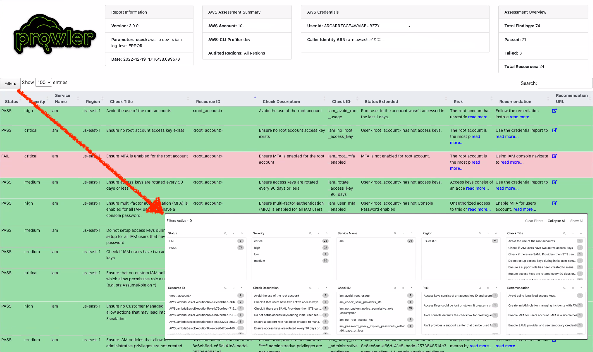

**Prowler** is an Open Source security tool to perform AWS, Azure and Google Cloud security best practices assessments, audits, incident response, continuous monitoring, hardening and forensics readiness. We have Prowler CLI (Command Line Interface) that we call Prowler Open Source and a service on top of it that we call <a href="https://prowler.com">Prowler SaaS</a>.


Prowler offers hundreds of controls covering more than 25 standards and compliance frameworks like CIS, PCI-DSS, ISO27001, GDPR, HIPAA, FFIEC, SOC2, AWS FTR, ENS and custom security frameworks.

## Quick Start
### Installation

Prowler is available as a project in [PyPI](https://pypi.org/project/prowler/), thus can be installed using pip with `Python >= 3.9`:

=== "Generic"

    _Requirements_:

    * `Python >= 3.9`
    * `Python pip >= 3.9`
    * AWS, GCP and/or Azure credentials

    _Commands_:

    ``` bash
    pip install prowler
    prowler -v
    ```

=== "Docker"

    _Requirements_:

    * Have `docker` installed: https://docs.docker.com/get-docker/.
    * AWS, GCP and/or Azure credentials
    * In the command below, change `-v` to your local directory path in order to access the reports.

    _Commands_:

    ``` bash
    docker run -ti --rm -v /your/local/dir/prowler-output:/home/prowler/output \
    --name prowler \
    --env AWS_ACCESS_KEY_ID \
    --env AWS_SECRET_ACCESS_KEY \
    --env AWS_SESSION_TOKEN toniblyx/prowler:latest
    ```

=== "Ubuntu"

    _Requirements for Ubuntu 20.04.3 LTS_:

    * AWS, GCP and/or Azure credentials
    * Install python 3.9 with: `sudo apt-get install python3.9`
    * Remove python 3.8 to avoid conflicts if you can: `sudo apt-get remove python3.8`
    * Make sure you have the python3 distutils package installed: `sudo apt-get install python3-distutils`
    * To make sure you use pip for 3.9 get the get-pip script with: `curl https://bootstrap.pypa.io/get-pip.py -o get-pip.py`
    * Execute it with the proper python version: `sudo python3.9 get-pip.py`
    * Now you should have pip for 3.9 ready: `pip3.9 --version`

    _Commands_:

    ```
    pip3.9 install prowler
    export PATH=$PATH:/home/$HOME/.local/bin/
    prowler -v
    ```

=== "GitHub"

    _Requirements for Developers_:

    * AWS, GCP and/or Azure credentials
    * `git`, `Python >= 3.9`, `pip` and `poetry` installed (`pip install poetry`)

    _Commands_:

    ```
    git clone https://github.com/prowler-cloud/prowler
    cd prowler
    poetry shell
    poetry install
    python prowler.py -v
    ```

=== "Amazon Linux 2"

    _Requirements_:

    * AWS, GCP and/or Azure credentials
    * Latest Amazon Linux 2 should come with Python 3.9 already installed however it may need pip. Install Python pip 3.9 with: `sudo yum install -y python3-pip`.
    * Make sure setuptools for python is already installed with: `pip3 install setuptools`

    _Commands_:

    ```
    pip3.9 install prowler
    export PATH=$PATH:/home/$HOME/.local/bin/
    prowler -v
    ```

=== "Brew"

    _Requirements_:

    * `Brew` installed in your Mac or Linux
    * AWS, GCP and/or Azure credentials

    _Commands_:

    ``` bash
    brew install prowler
    prowler -v
    ```

=== "AWS CloudShell"

    After the migration of AWS CloudShell from Amazon Linux 2 to Amazon Linux 2023 [[1]](https://aws.amazon.com/about-aws/whats-new/2023/12/aws-cloudshell-migrated-al2023/) [2](https://docs.aws.amazon.com/cloudshell/latest/userguide/cloudshell-AL2023-migration.html), there is no longer a need to manually compile Python 3.9 as it's already included in AL2023. Prowler can thus be easily installed following the Generic method of installation via pip. Follow the steps below to successfully execute Prowler v3 in AWS CloudShell:

    _Requirements_:

    * Open AWS CloudShell `bash`.

    _Commands_:

    ```
    pip install prowler
    prowler -v
    ```

    > To download the results from AWS CloudShell, select Actions -> Download File and add the full path of each file. For the CSV file it will be something like `/home/cloudshell-user/output/prowler-output-123456789012-20221220191331.csv`

=== "Azure CloudShell"

    _Requirements_:

    * Open Azure CloudShell `bash`.

    _Commands_:

    ```
    pip install prowler
    prowler -v
    ```

## Prowler container versions

The available versions of Prowler are the following:

- `latest`: in sync with master branch (bear in mind that it is not a stable version)
- `<x.y.z>` (release): you can find the releases [here](https://github.com/prowler-cloud/prowler/releases), those are stable releases.
- `stable`: this tag always point to the latest release.

The container images are available here:

- [DockerHub](https://hub.docker.com/r/toniblyx/prowler/tags)
- [AWS Public ECR](https://gallery.ecr.aws/prowler-cloud/prowler)

## High level architecture

You can run Prowler from your workstation, an EC2 instance, Fargate or any other container, Codebuild, CloudShell, Cloud9 and many more.


## Basic Usage

To run Prowler, you will need to specify the provider (e.g aws, gcp or azure):
> If no provider specified, AWS will be used for backward compatibility with most of v2 options.

```console
prowler <provider>
```

> Running the `prowler` command without options will use your environment variable credentials, see [Requirements](./getting-started/requirements.md) section to review the credentials settings.

If you miss the former output you can use `--verbose` but Prowler v3 is smoking fast, so you won't see much ;)

By default, Prowler will generate a CSV, JSON and HTML reports, however you can generate a JSON-ASFF (used by AWS Security Hub) report with `-M` or `--output-modes`:

```console
prowler <provider> -M csv json json-asff html
```
The html report will be located in the output directory as the other files and it will look like:



You can use `-l`/`--list-checks` or `--list-services` to list all available checks or services within the provider.

```console
prowler <provider> --list-checks
prowler <provider> --list-services
```

For executing specific checks or services you can use options `-c`/`checks` or `-s`/`services`:

```console
prowler azure --checks storage_blob_public_access_level_is_disabled
prowler aws --services s3 ec2
prowler gcp --services iam compute
```

Also, checks and services can be excluded with options `-e`/`--excluded-checks` or `--excluded-services`:

```console
prowler aws --excluded-checks s3_bucket_public_access
prowler azure --excluded-services defender iam
prowler gcp --excluded-services kms
```

More options and executions methods that will save your time in [Miscellaneous](tutorials/misc.md).

You can always use `-h`/`--help` to access to the usage information and all the possible options:

```console
prowler --help
```

### AWS

Use a custom AWS profile with `-p`/`--profile` and/or AWS regions which you want to audit with `-f`/`--filter-region`:

```console
prowler aws --profile custom-profile -f us-east-1 eu-south-2
```
> By default, `prowler` will scan all AWS regions.

See more details about AWS Authentication in [Requirements](getting-started/requirements.md)

### Azure

With Azure you need to specify which auth method is going to be used:

```console
# To use service principal authentication
prowler azure --sp-env-auth

# To use az cli authentication
prowler azure --az-cli-auth

# To use browser authentication
prowler azure --browser-auth --tenant-id "XXXXXXXX"

# To use managed identity auth
prowler azure --managed-identity-auth
```

See more details about Azure Authentication in [Requirements](getting-started/requirements.md)

Prowler by default scans all the subscriptions that is allowed to scan, if you want to scan a single subscription or various specific subscriptions you can use the following flag (using az cli auth as example):
```console
prowler azure --az-cli-auth --subscription-ids <subscription ID 1> <subscription ID 2> ... <subscription ID N>
```

### Google Cloud

Prowler will use by default your User Account credentials, you can configure it using:

- `gcloud init` to use a new account
- `gcloud config set account <account>` to use an existing account

Then, obtain your access credentials using: `gcloud auth application-default login`

Otherwise, you can generate and download Service Account keys in JSON format (refer to https://cloud.google.com/iam/docs/creating-managing-service-account-keys) and provide the location of the file with the following argument:

```console
prowler gcp --credentials-file path
```

Prowler by default scans all the GCP Projects that is allowed to scan, if you want to scan a single project or various specific projects you can use the following flag:
```console
prowler gcp --project-ids <Project ID 1> <Project ID 2> ... <Project ID N>
```

See more details about GCP Authentication in [Requirements](getting-started/requirements.md)

## Prowler v2 Documentation
For **Prowler v2 Documentation**, please check it out [here](https://github.com/prowler-cloud/prowler/blob/8818f47333a0c1c1a457453c87af0ea5b89a385f/README.md).
