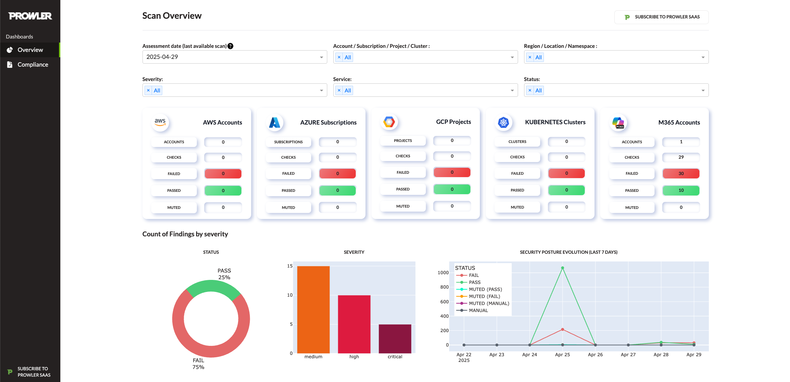

Prowler CLI is a command-line interface for running Prowler scans from the terminal.

```console
prowler <provider>
```


## Prowler Dashboard

```console
prowler dashboard
```


Prowler includes hundreds of security controls aligned with widely recognized industry frameworks and standards, including:

- CIS Benchmarks (AWS, Azure, Microsoft 365, Kubernetes, GitHub)
- NIST SP 800-53 (rev. 4 and 5) and NIST SP 800-171
- NIST Cybersecurity Framework (CSF)
- CISA Guidelines
- FedRAMP Low & Moderate
- PCI DSS v3.2.1 and v4.0
- ISO/IEC 27001:2013 and 2022
- SOC 2
- GDPR (General Data Protection Regulation)
- HIPAA (Health Insurance Portability and Accountability Act)
- FFIEC (Federal Financial Institutions Examination Council)
- ENS RD2022 (Spanish National Security Framework)
- GxP 21 CFR Part 11 and EU Annex 11
- RBI Cybersecurity Framework (Reserve Bank of India)
- KISA ISMS-P (Korean Information Security Management System)
- MITRE ATT&CK
- AWS Well-Architected Framework (Security & Reliability Pillars)
- AWS Foundational Technical Review (FTR)
- Microsoft NIS2 Directive (EU)
- Custom threat scoring frameworks (prowler_threatscore)
- Custom security frameworks for enterprise needs
