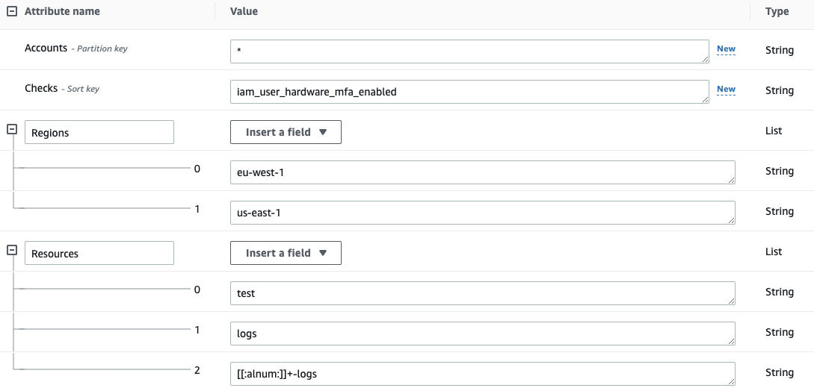

# Allowlisting
Sometimes you may find resources that are intentionally configured in a certain way that may be a bad practice but it is all right with it, for example an AWS S3 Bucket open to the internet hosting a web site, or an AWS Security Group with an open port needed in your use case.

Allowlist option works along with other options and adds a `WARNING` instead of `INFO`, `PASS` or `FAIL` to any output format.

You can use `-w`/`--allowlist-file` with the path of your allowlist yaml file, but first, let's review the syntax.

## Allowlist Yaml File Syntax

    ### Account, Check and/or Region can be * to apply for all the cases.
    ### Resources and tags are lists that can have either Regex or Keywords.
    ### Tags is an optional list that matches on tuples of 'key=value' and are "ANDed" together.
    ### Use an alternation Regex to match one of multiple tags with "ORed" logic.
    ###########################  ALLOWLIST EXAMPLE  ###########################
    Allowlist:
      Accounts:
        "123456789012":
          Checks:
            "iam_user_hardware_mfa_enabled":
              Regions:
                - "us-east-1"
              Resources:
                - "user-1"           # Will ignore user-1 in check iam_user_hardware_mfa_enabled
                - "user-2"           # Will ignore user-2 in check iam_user_hardware_mfa_enabled
            "ec2_*":
              Regions:
                - "*"
              Resources:
                - "*"                 # Will ignore every EC2 check in every account and region
            "*":
              Regions:
                - "*"
              Resources:
                - "test"
              Tags:
                - "test=test"         # Will ignore every resource containing the string "test" and the tags 'test=test' and
                - "project=test|project=stage" # either of ('project=test' OR project=stage) in account 123456789012 and every region

        "*":
          Checks:
            "s3_bucket_object_versioning":
              Regions:
                - "eu-west-1"
                - "us-east-1"
              Resources:
                - "ci-logs"           # Will ignore bucket "ci-logs" AND ALSO bucket "ci-logs-replica" in specified check and regions
                - "logs"              # Will ignore EVERY BUCKET containing the string "logs" in specified check and regions
                - ".+-logs"           # Will ignore all buckets containing the terms ci-logs, qa-logs, etc. in specified check and regions
            "*":
              Regions:
                - "*"
              Resources:
                - "*"
              Tags:
                - "environment=dev"    # Will ignore every resource containing the tag 'environment=dev' in every account and region


## Supported Allowlist Locations

The allowlisting flag supports the following locations:

### Local file
You will need to pass the local path where your Allowlist YAML file is located:
```
prowler <provider> -w allowlist.yaml
```
### AWS S3 URI
You will need to pass the S3 URI where your Allowlist YAML file was uploaded to your bucket:
```
prowler aws -w s3://<bucket>/<prefix>/allowlist.yaml
```
> Make sure that the used AWS credentials have s3:GetObject permissions in the S3 path where the allowlist file is located.

### AWS DynamoDB Table ARN

You will need to pass the DynamoDB Allowlist Table ARN:

```
prowler aws -w arn:aws:dynamodb:<region_name>:<account_id>:table/<table_name>
```

1. The DynamoDB Table must have the following String keys:


- The Allowlist Table must have the following columns:
    - Accounts (String): This field can contain either an Account ID or an `*` (which applies to all the accounts that use this table as an allowlist).
    - Checks (String): This field can contain either a Prowler Check Name or an `*` (which applies to all the scanned checks).
    - Regions (List): This field contains a list of regions where this allowlist rule is applied (it can also contains an `*` to apply all scanned regions).
    - Resources (List): This field contains a list of regex expressions that applies to the resources that are wanted to be allowlisted.
    - Tags (List): -Optional- This field contains a list of tuples in the form of 'key=value' that applies to the resources tags that are wanted to be allowlisted.



> Make sure that the used AWS credentials have `dynamodb:PartiQLSelect` permissions in the table.

### AWS Lambda ARN

You will need to pass the AWS Lambda Function ARN:

```
prowler aws -w arn:aws:lambda:REGION:ACCOUNT_ID:function:FUNCTION_NAME
```

Make sure that the credentials that Prowler uses can invoke the Lambda Function:

```
- PolicyName: GetAllowList
  PolicyDocument:
    Version: '2012-10-17'
    Statement:
      - Action: 'lambda:InvokeFunction'
        Effect: Allow
        Resource: arn:aws:lambda:REGION:ACCOUNT_ID:function:FUNCTION_NAME
```

The Lambda Function can then generate an Allowlist dynamically. Here is the code an example Python Lambda Function that
generates an Allowlist:

```
def handler(event, context):
  checks = {}
  checks["vpc_flow_logs_enabled"] = { "Regions": [ "*" ], "Resources": [ "" ], Optional("Tags"): [ "key:value" ] }

  al = { "Allowlist": { "Accounts": { "*": { "Checks": checks } } } }
  return al
```
