# Getting Started with AWS on Prowler Cloud

<iframe width="560" height="380" src="https://www.youtube-nocookie.com/embed/RPgIWOCERzY" title="Prowler Cloud Onboarding AWS" frameborder="0" allow="accelerometer; autoplay; clipboard-write; encrypted-media; gyroscope; picture-in-picture" allowfullscreen="1"></iframe>


You can set-up your AWS account in order to scan it using Prowler cloud.

Setting up the AWS Account requires:

1. Access to Prowler Cloud
2. Setting the AWS account to allow the authentication (Credentials or Assumed Role) and add them to Prowler Cloud

## Common Set-Up: Get your AWS Account ID

Go to [AWS console](https://console.aws.amazon.com) and get your AWS account id (top right hand dropdown):

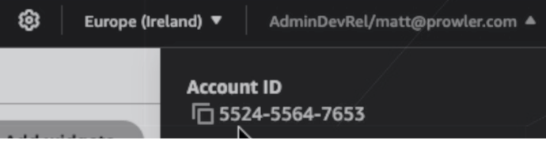

## Access to Prowler Cloud

1. Go to [Prowler Cloud](https://cloud.prowler.com/) and go inside `Configuration` > `Cloud Providers` page:

    

2. Click on `Add Cloud Provider`

    

3. Select `Amazon Web Services`

    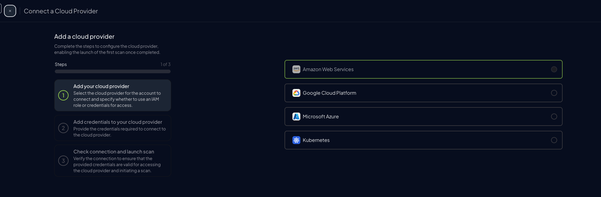

4. Add the account ID from the previous step and add a provider alias (optional)

    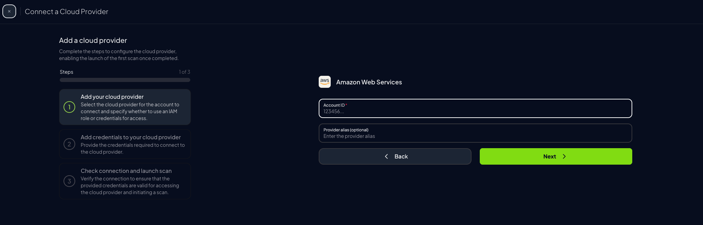

5. Set the AWS account using the prefered auth mode (next step)

    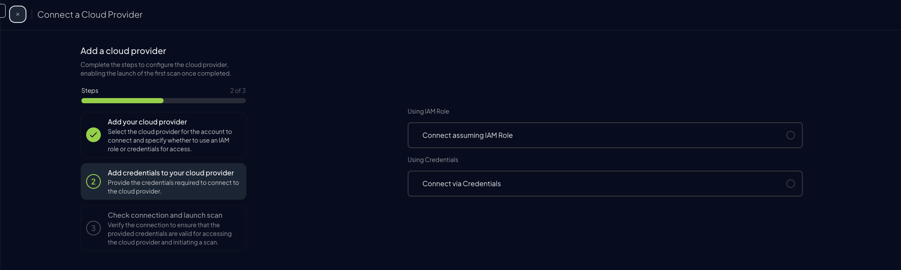


## Setting the AWS account

Before setting up the AWS account, understand how it works in different authentication modes:

Credentials

* Quick scan as current user ✅
* No extra setup ✅
* Credentials time out ❌

Assumed Role

* Preferred Setup ✅
* Permanent Credentials ✅
* Requires access to create role ❌


### Assume Role

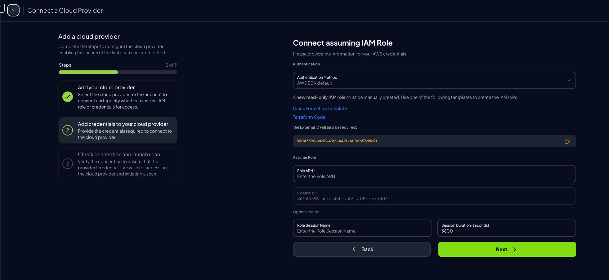

This method provides permanent credentials and is the prefered one.

=== "CloudFormation"

    1. Download the [Prowler Scan Role Template](https://raw.githubusercontent.com/prowler-cloud/prowler/refs/heads/master/permissions/templates/cloudformation/prowler-scan-role.yml):

        1.1 Go to [Prowler Scan Role Template](https://github.com/prowler-cloud/prowler/blob/master/permissions/templates/cloudformation/prowler-scan-role.yml)

        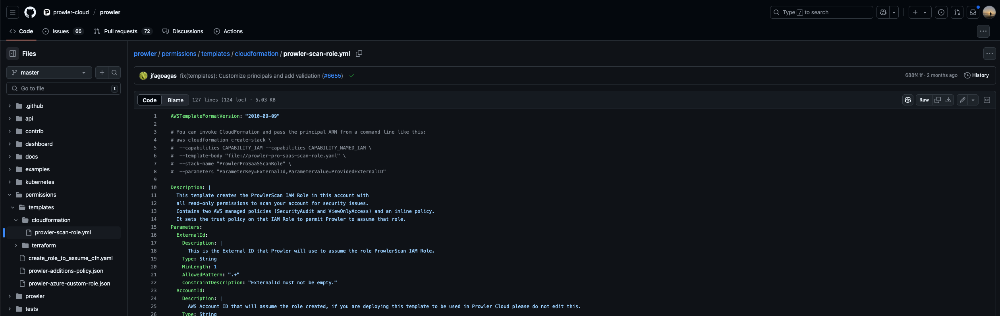

        1.2 Download the file

        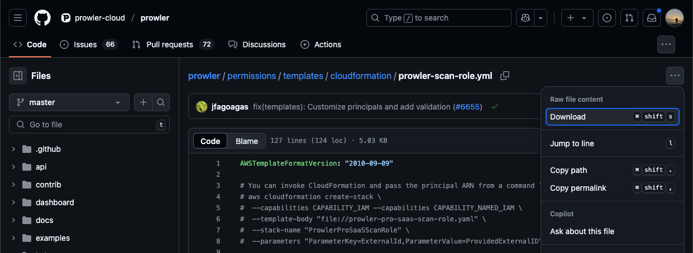

    2. Go to [AWS console](https://console.aws.amazon.com) and search for CloudFormation on the bar:

        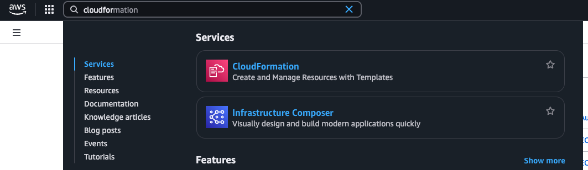

    3. Inside CloudFormation, go to Stacks and click on `Create stack` > `With new resources (standard)`

        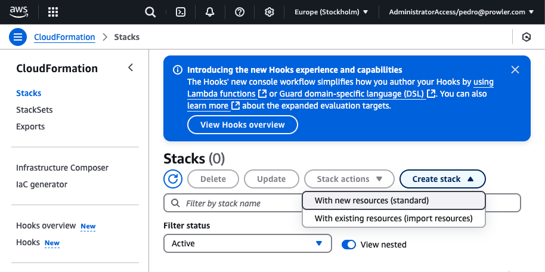

    4. Inside `Create Stack` > `Specify Template` choose the `Upload a template file` option

        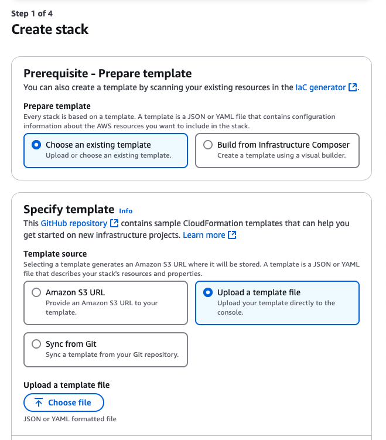

    5. Select the previous downloaded template and click on open

        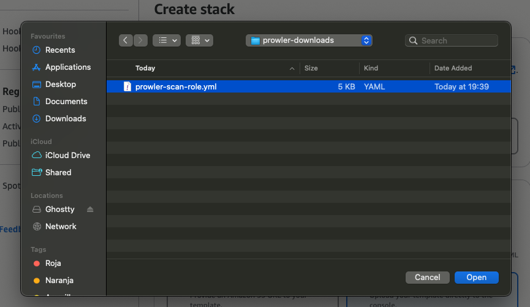

    6. Click on `next`

        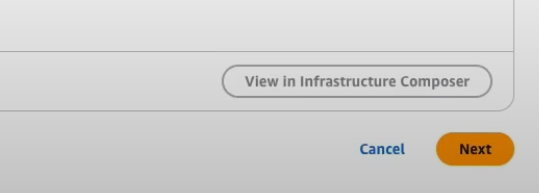

    7. Provide an stack name and the `External ID` shown inside the Prowler Cloud page:

        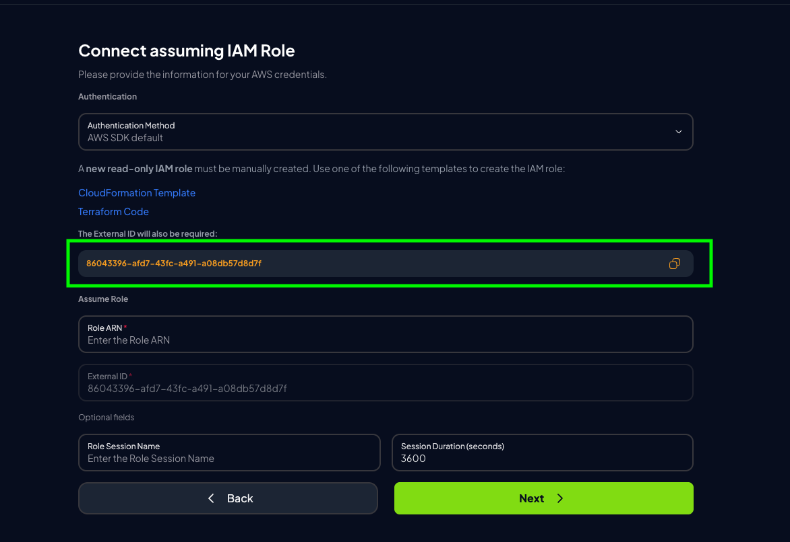
        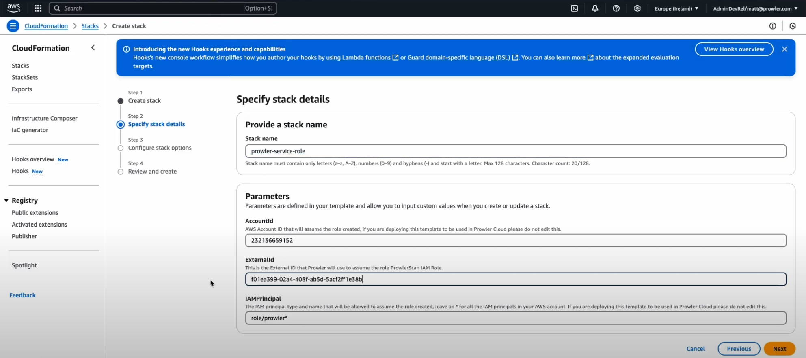

    8. On the next page for Stack Creation, select `I acknowledge that AWS CloudFormation might create IAM resources with customised names.` and select `next`

        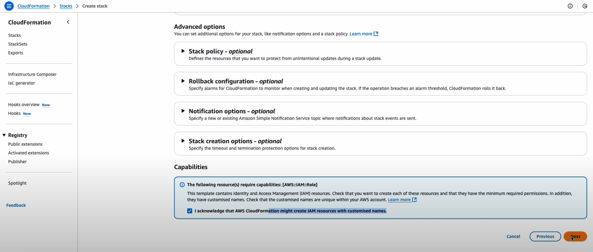


    9. Click `Submit` on the third page

        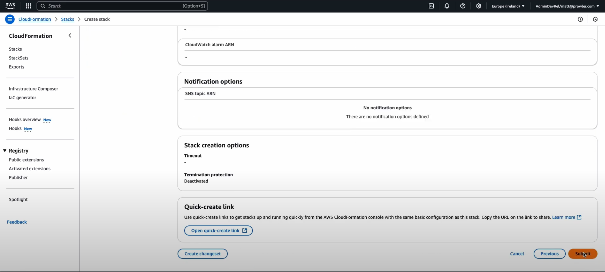

=== "Terraform"

    To deploy the Prowler Scan Role in order to allow to scan you AWS account from Prowler, please run the following commands in your terminal:

    1. `terraform init`
    2. `terraform plan`
    3. `terraform apply`

    > During the terraform plan and terraform apply steps you will be asked for an External ID to be configured in the ProwlerScan IAM role. You'll find the role on the Prowler Cloud page:

    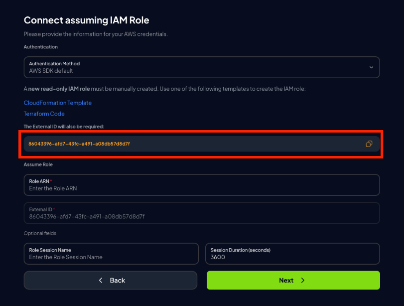

    ???+ note
        Terraform will use the AWS credentials of your default profile.


10. Once that the role is created, we have to get the Role ARN. Click on the `ProwlerScan` role to check the role info

    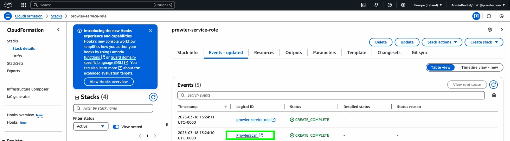

11. Copy the Role ARN

    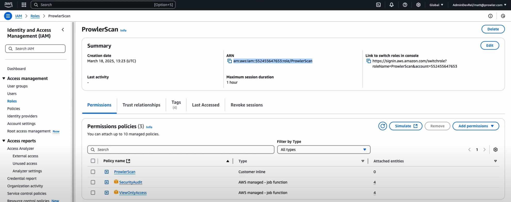

12. Paste the Role ARN on Prowler Cloud page

    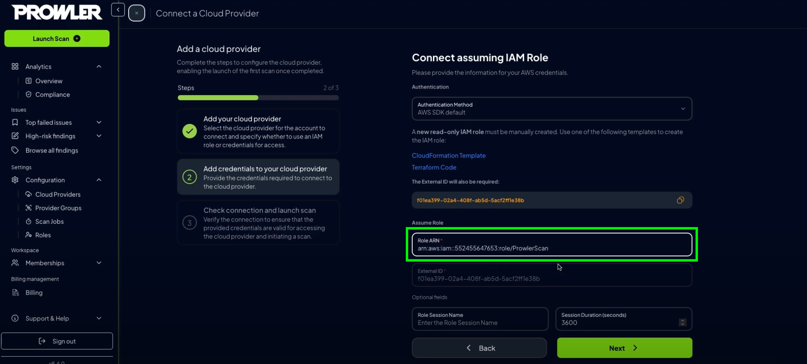

13. Click on `Next`

    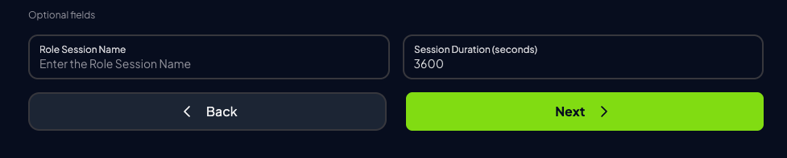


14. Click on `Launch Scan`

    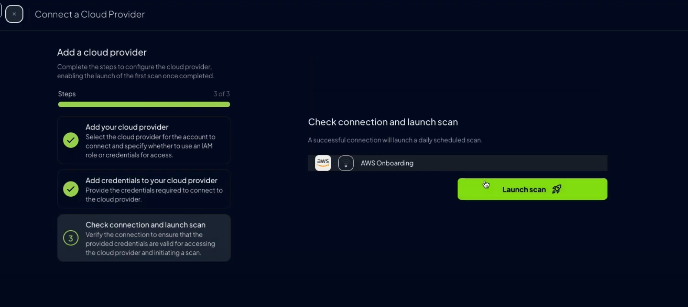


### Credentials Auth

This method will allow you to set up your AWS account on Prowler using the static credentials.

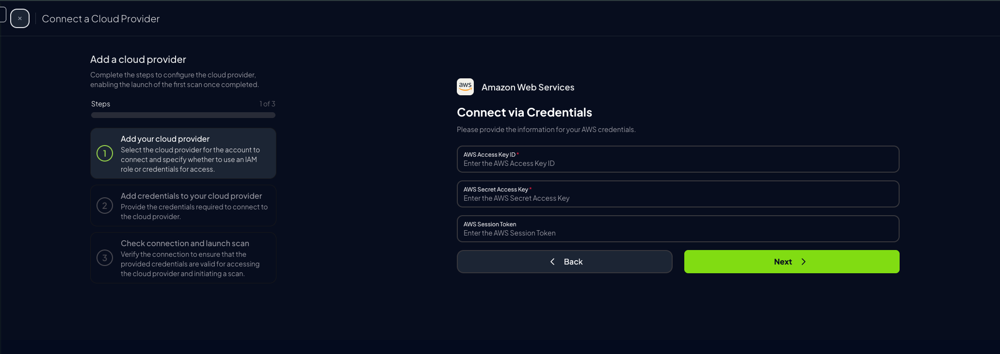

1. Go to [AWS console](https://console.aws.amazon.com) and use CloudShell to retrieve the necessary credentials.

    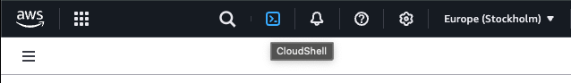

2. Once the session is created, type this inside the console:

    ```bash
        aws iam create-access-key
    ```

3. The output of this command will give you all the needed information to set-up your account on Prowler Cloud!

    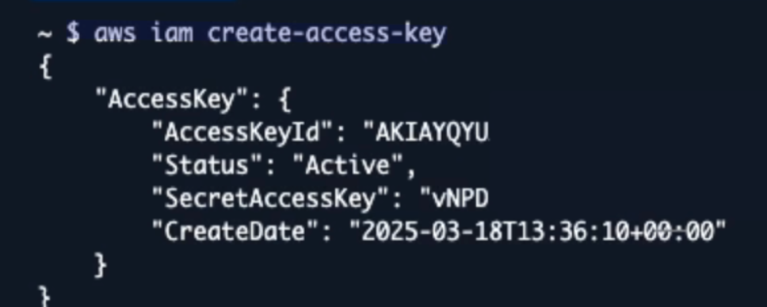

    ???+ note
        Save the following values and paste them on Prowler Cloud page:

        * `"AccessKeyId"`
        * `"SecretAccessKey"`

4. Fill the credentials on Prowler Cloud and click next

    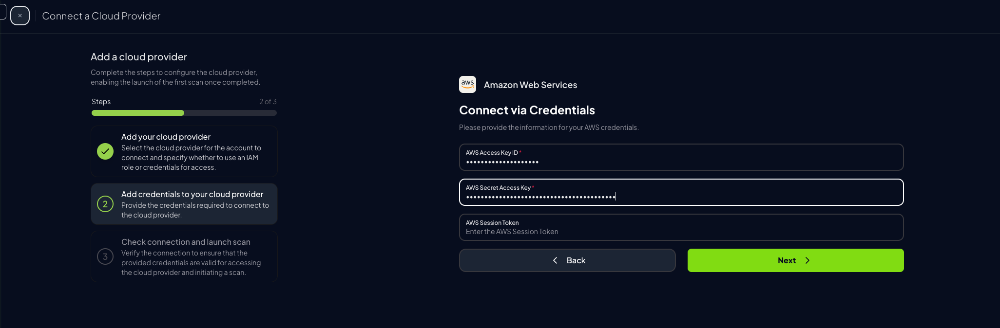

5. Click on `Launch Scan`

    
