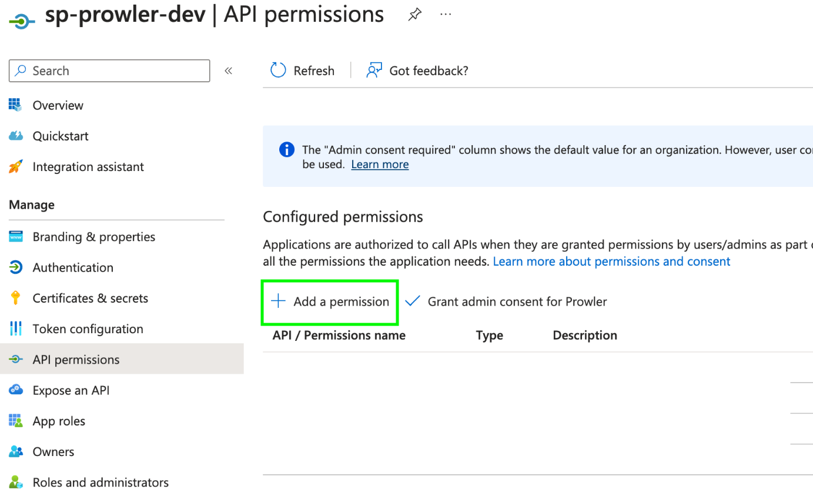
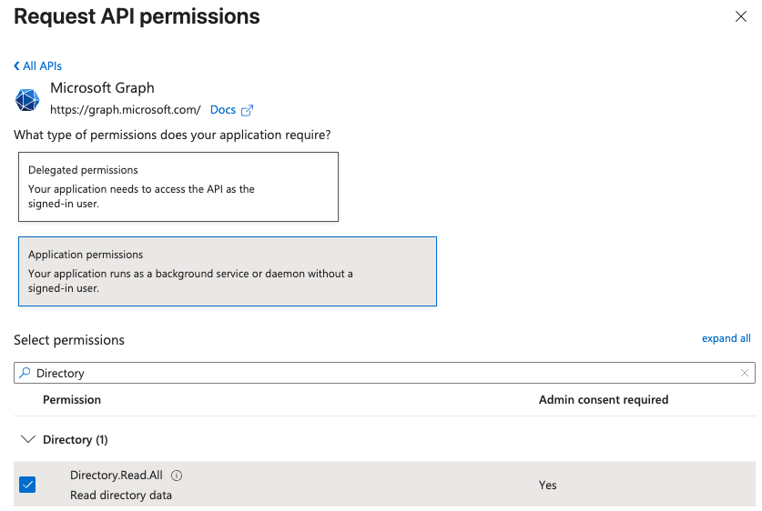
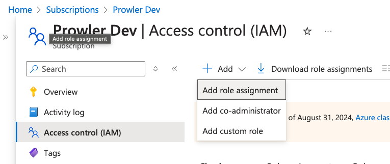
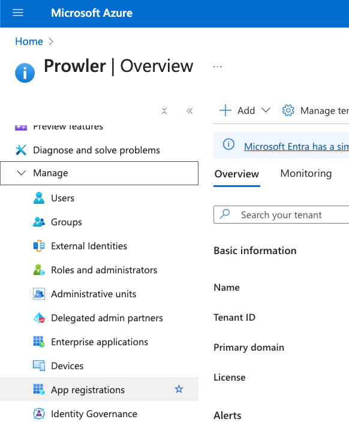

# Azure Authentication in Prowler

Prowler for Azure supports multiple authentication types. Authentication methods vary between Prowler App and Prowler CLI:

**Prowler App:**

- [**Service Principal Application**](#service-principal-application-authentication-recommended)

**Prowler CLI:**

- [**Service Principal Application**](#service-principal-application-authentication-recommended) (**Recommended**)
- [**AZ CLI credentials**](#az-cli-authentication)
- [**Interactive browser authentication**](#browser-authentication)
- [**Managed Identity Authentication**](#managed-identity-authentication)

## Required Permissions

Prowler for Azure requires two types of permission scopes:

### Microsoft Entra ID Permissions

These permissions allow Prowler to retrieve metadata from the assumed identity and perform specific Entra checks. While not mandatory for execution, they enhance functionality.

#### Assigning Required API Permissions

Assign the following Microsoft Graph permissions:

- `Directory.Read.All`
- `Policy.Read.All`
- `UserAuthenticationMethod.Read.All` (optional, for multifactor authentication (MFA) checks)

???+ note
    Replace `Directory.Read.All` with `Domain.Read.All` for more restrictive permissions. Note that Entra checks related to DirectoryRoles and GetUsers will not run with this permission.

1. Go to your App Registration > "API permissions"

    

2. Click "+ Add a permission" > "Microsoft Graph" > "Application permissions"

    
    

3. Search and select:

    - `Directory.Read.All`
    - `Policy.Read.All`
    - `UserAuthenticationMethod.Read.All`

    

4. Click "Add permissions", then grant admin consent

    


### Subscription Scope Permissions

These permissions are required to perform security checks against Azure resources. The following **RBAC roles** must be assigned per subscription to the entity used by Prowler:

- `Reader` – Grants read-only access to Azure resources.
- `ProwlerRole` – A custom role with minimal permissions, defined in the [prowler-azure-custom-role](https://github.com/prowler-cloud/prowler/blob/master/permissions/prowler-azure-custom-role.json).

#### Assigning Permissions at the Subscription Level

1. Download the [Prowler Azure Custom Role](https://github.com/prowler-cloud/prowler/blob/master/permissions/prowler-azure-custom-role.json)

    

2. Modify `assignableScopes` to match your Subscription ID (e.g. `/subscriptions/xxxx-xxxx-xxxx-xxxx`)

3. Go to your Azure Subscription > "Access control (IAM)"

    

4. Click "+ Add" > "Add custom role", choose "Start from JSON" and upload the modified file

    

5. Click "Review + Create" to finish

    

6. Return to "Access control (IAM)" > "+ Add" > "Add role assignment"

    - Assign the `Reader` role to the Application created in the previous step
    - Then repeat the same process assigning the custom `ProwlerRole`

    

???+ note
    The `assignableScopes` field in the JSON custom role file must be updated to reflect the correct subscription or management group. Use one of the following formats: `/subscriptions/<subscription-id>` or `/providers/Microsoft.Management/managementGroups/<management-group-id>`.

### Additional Resources

For more detailed guidance on subscription management and permissions:

- [Azure subscription permissions](subscriptions.md)
- [Create Prowler Service Principal](create-prowler-service-principal.md)

???+ warning
     Some permissions in `ProwlerRole` involve **write access**. If a `ReadOnly` lock is attached to certain resources, you may encounter errors, and findings for those checks will not be available.

#### Checks Requiring `ProwlerRole`

The following security checks require the `ProwlerRole` permissions for execution. Ensure the role is assigned to the identity assumed by Prowler before running these checks:

- `app_function_access_keys_configured`
- `app_function_ftps_deployment_disabled`

---

## Service Principal Application Authentication (Recommended)

This method is required for Prowler App and recommended for Prowler CLI.

### Creating the Service Principal

1. Access **Microsoft Entra ID** in the [Azure Portal](https://portal.azure.com)

    

2. Navigate to "Manage" > "App registrations"

    

3. Click "+ New registration", complete the form, and click "Register"

    

4. Go to "Certificates & secrets" > "+ New client secret"

    
    

5. Fill in the required fields and click "Add", then copy the generated value

| Value | Description |
|-------|-----------|
| Client ID | Application ID |
| Client Secret | AZURE_CLIENT_SECRET |
| Tenant ID | Azure Active Directory tenant ID |

### Environment Variables (CLI)

For Prowler CLI, set up the following environment variables:

```console
export AZURE_CLIENT_ID="XXXXXXXXX"
export AZURE_TENANT_ID="XXXXXXXXX"
export AZURE_CLIENT_SECRET="XXXXXXX"
```

Execution with the `--sp-env-auth` flag fails if these variables are not set or exported.

## AZ CLI Authentication

*Available only for Prowler CLI*

Use stored Azure CLI credentials:

```console
prowler azure --az-cli-auth
```

## Managed Identity Authentication

*Available only for Prowler CLI*

Authenticate via Azure Managed Identity (when running on Azure resources):

```console
prowler azure --managed-identity-auth
```

## Browser Authentication

*Available only for Prowler CLI*

Authenticate using the default browser:

```console
prowler azure --browser-auth --tenant-id <tenant-id>
```

> **Note:** The `tenant-id` parameter is mandatory for browser authentication.

