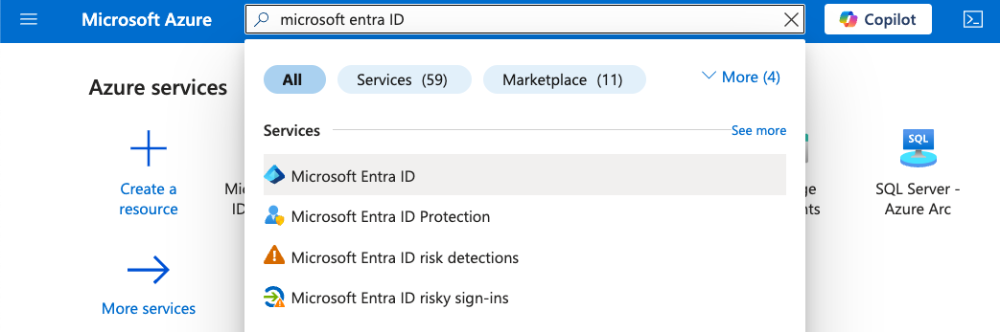
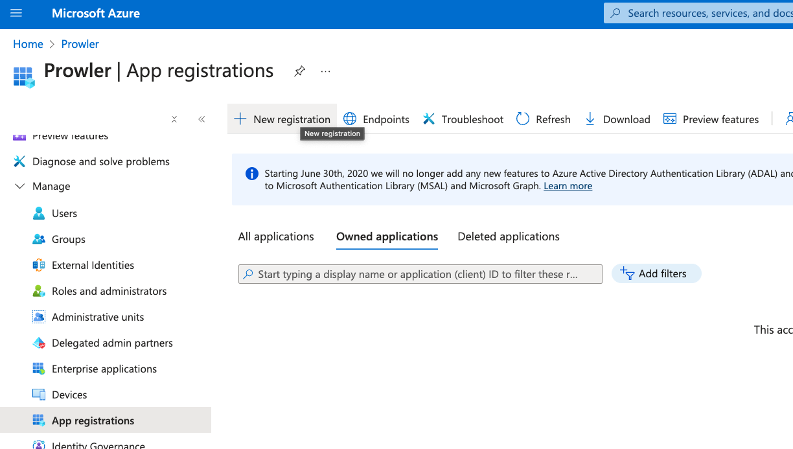
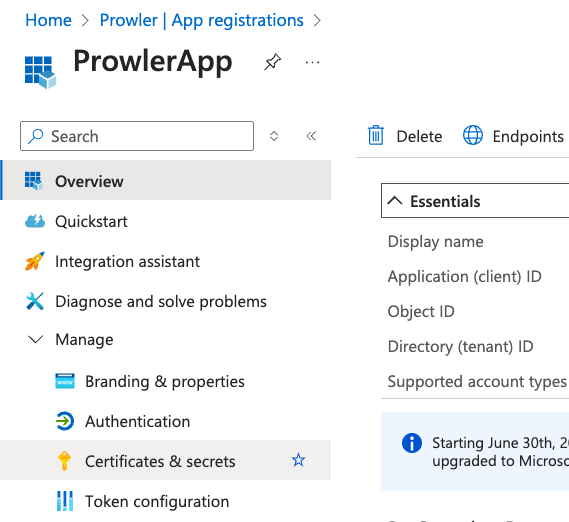
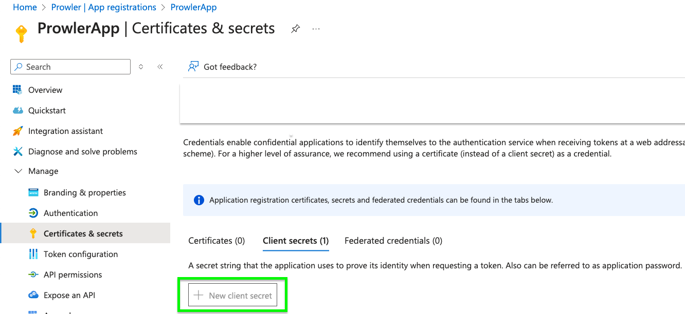

# Creating a Prowler Service Principal Application

To enable Prowler to assume an identity for scanning with the required privileges, a Service Principal must be created. This Service Principal authenticates against Azure and retrieves necessary metadata for checks.

Service Principal Applications can be created using either the Azure Portal or the Azure CLI.


## Creating a Service Principal via Azure Portal / Entra Admin Center

1. Access **Microsoft Entra ID** in the [Azure Portal](https://portal.azure.com)

    

2. Navigate to "Manage" > "App registrations"

    

3. Click "+ New registration", complete the form, and click "Register"

    

4. Go to "Certificates & secrets" > "+ New client secret"

    
    

5. Fill in the required fields and click "Add", then copy the generated value

| Value | Description |
|-------|-----------|
| Client ID | Application ID |
| Client Secret | Secret to Connect to the App |
| Tenant ID | Microsoft Entra Tenant ID |


## Creating a Service Principal from Azure CLI

To create a Service Principal using the Azure CLI, follow these steps:

1. Open a terminal and execute the following command:

      ```console
      az ad sp create-for-rbac --name "ProwlerApp"
      ```

2. The output will be similar to:

      ```json
      {
      "appId": "XXXXXXXX-XXXX-XXXX-XXXX-XXXXXXXXXXXX",
      "displayName": "ProwlerApp",
      "password": "XXXXXXXXXXXXXXXXXXXXXXXXXXXXXXXXXXXXXXXX",
      "tenant": "XXXXXXXX-XXXX-XXXX-XXXX-XXXXXXXXXXXX"
      }
      ```

3. Save the values of `appId`, `password` and `tenant`, as they will be used as credentials in Prowler.

## Assigning Proper Permissions

Go to [Assigning Proper Permissions](./authentication.md#required-permissions) to learn how to assign the necessary permissions to the Service Principal.