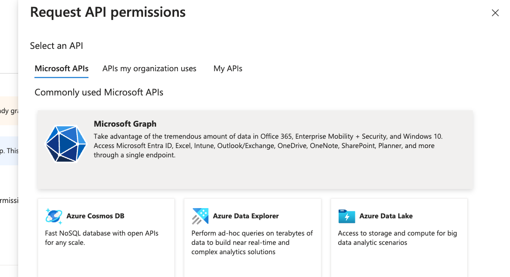
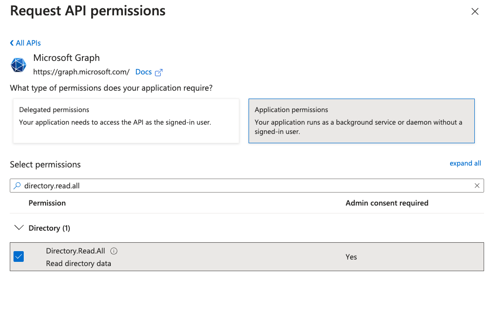
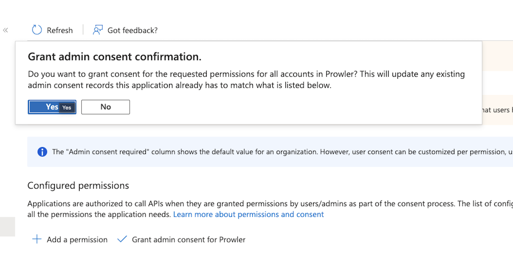
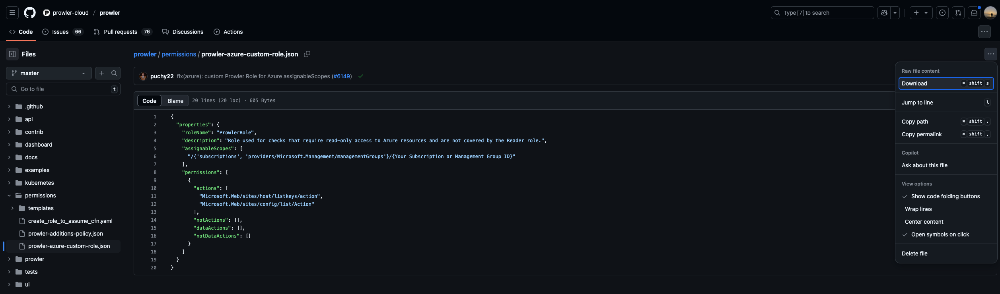
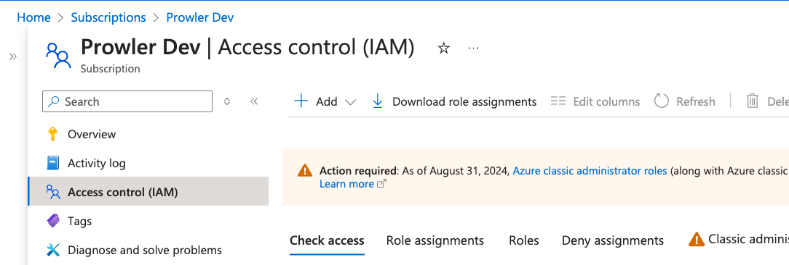
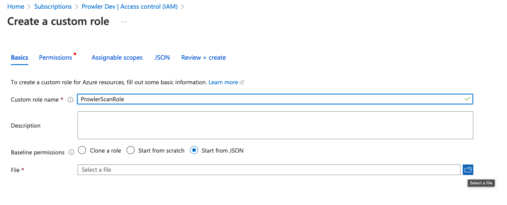
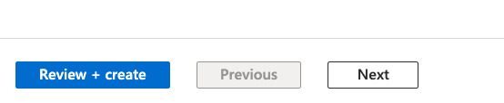
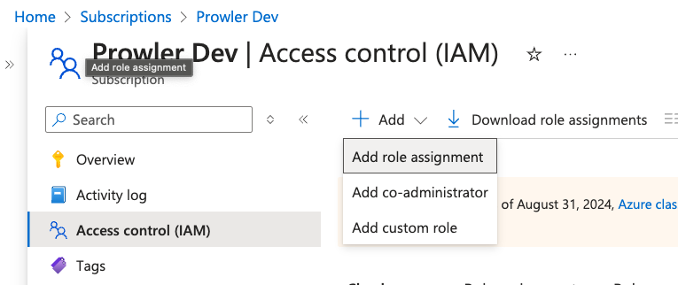

# Getting Started with Azure on Prowler Cloud

<iframe width="560" height="380" src="https://www.youtube-nocookie.com/embed/v1as8vTFlMg" title="Prowler Cloud Onboarding Azure" frameborder="0" allow="accelerometer; autoplay; clipboard-write; encrypted-media; gyroscope; picture-in-picture" allowfullscreen="1"></iframe>

Set up your Azure subscription to enable security scanning using Prowler Cloud.

## Requirements

To configure your Azure subscription, you’ll need:

1. Get the `Subscription ID`
2. Access to Prowler Cloud
3. Configure authentication in Azure:

    3.1 Create a Service Principal

    3.2 Assign required permissions

    3.3 Assign permissions at the subscription level

4. Add the credentials to Prowler Cloud

---

## Step 1: Get the Subscription ID

1. Go to the [Azure Portal](https://portal.azure.com/#home) and search for `Subscriptions`
2. Locate and copy your Subscription ID

    
    

---

## Step 2: Access Prowler Cloud

1. Go to [Prowler Cloud](https://cloud.prowler.com/)
2. Navigate to `Configuration` > `Cloud Providers`

    

3. Click on `Add Cloud Provider`

    

4. Select `Microsoft Azure`

    

5. Add the Subscription ID and an optional alias, then click `Next`

    

---

## Step 3: Configure the Azure Subscription

### Create the Service Principal

A Service Principal is required to grant Prowler the necessary privileges.

1. Access **Microsoft Entra ID**

    

2. Navigate to `Manage` > `App registrations`

    

3. Click `+ New registration`, complete the form, and click `Register`

    

4. Go to `Certificates & secrets` > `+ New client secret`

    
    

5. Fill in the required fields and click `Add`, then copy the generated value

| Value | Description |
|-------|-------------|
| Client ID | Application ID |
| Client Secret | AZURE_CLIENT_SECRET |
| Tenant ID | Azure Active Directory tenant ID |

---

### Assign Required API Permissions

Assign the following Microsoft Graph permissions:

    - Directory.Read.All

    - Policy.Read.All

    - UserAuthenticationMethod.Read.All (optional, for MFA checks)

1. Go to your App Registration > `API permissions`

    

2. Click `+ Add a permission` > `Microsoft Graph` > `Application permissions`

    
    

3. Search and select:

    - `Directory.Read.All`
    - `Policy.Read.All`
    - `UserAuthenticationMethod.Read.All`

    

4. Click `Add permissions`, then grant admin consent

    

---

### Assign Permissions at the Subscription Level

1. Download the [Prowler Azure Custom Role](https://github.com/prowler-cloud/prowler/blob/master/permissions/prowler-azure-custom-role.json)

    

2. Modify `assignableScopes` to match your Subscription ID (e.g. `/subscriptions/xxxx-xxxx-xxxx-xxxx`)

3. Go to your Azure Subscription > `Access control (IAM)`

    

4. Click `+ Add` > `Add custom role`, choose "Start from JSON" and upload the modified file

    

5. Click `Review + Create` to finish

    

6. Return to `Access control (IAM)` > `+ Add` > `Add role assignment`

    - Assign the `Reader` role
    - Then repeat and assign the custom `ProwlerRole`

    

---

## Step 4: Add Credentials to Prowler Cloud

1. Go to your App Registration overview and copy the `Client ID` and `Tenant ID`

    

2. Go to Prowler Cloud and paste:

    - `Client ID`
    - `Tenant ID`
    - `AZURE_CLIENT_SECRET` from earlier

    

3. Click `Next`

    

4. Click `Launch Scan`

    
