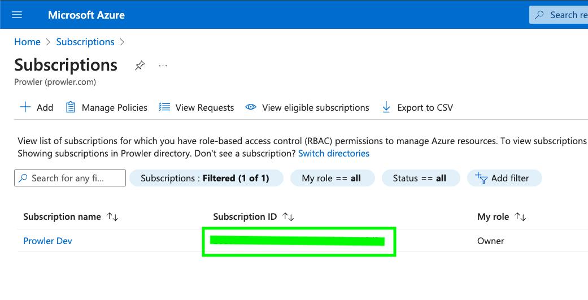

# Getting Started with Azure on Prowler Cloud

<iframe width="560" height="380" src="https://www.youtube-nocookie.com/embed/RPgIWOCERzY" title="Prowler Cloud Onboarding Azure" frameborder="0" allow="accelerometer; autoplay; clipboard-write; encrypted-media; gyroscope; picture-in-picture" allowfullscreen="1"></iframe>

You can set-up your Azure subscription in order to scan it using Prowler cloud.

Setting up the Azure Subscription requires:

1. Get the `Subscription ID`
2. Access to Prowler Cloud
3. Setting the Azure subscription to allow the authentication
    3.1 Create the Service Principal
    3.2 Assign the needed Permissions
4. Add the credentials to Prowler Cloud

## First Step - Get the Subscription ID:

Got to [Azure Portal](https://portal.azure.com/#home) and search for `Subscriptions` on the bar:

Get the Azure Subscription ID inside this page:

## Access to Prowler Cloud

1. Go to [Prowler Cloud](https://cloud.prowler.com/) and go inside `Configuration` > `Cloud Providers` page:

    

2. Click on `Add Cloud Provider`

    

3. Select `Microsoft Azure`

    

4. Add the Subscription ID from the first step, input a provider alias (optional) and click on `Next`

    

## Setting the Azure Subscription

To make the needed changes on the Subscription configuration you'll need to access to [Azure Portal](https://portal.azure.com/#home)

### Create the Service Principal

To allow Prowler to assume an identity with the necessary privileges to start the scan, a Service Principal must be created. This Service Principal will be used to authenticate with Azure and retrieve the metadata required to perform the scan.

1. Access to Microsoft Entra ID

    

2. In the left menu bar, go to "Manage" > "App registrations"

    

3. Once there, in the menu bar click on "+ New registration" to register a new application

    

4. Fill the "Name", select the "Supported account types" and click on "Register". You will be redirected to the applications page.

5. Once in the application page, in the left menu bar, select "Manage" > "Certificates & secrets"

    

6. In the "Certificates & secrets" view, click on "+ New client secret"

    

7. Fill the "Description" and "Expires" fields and click on "Add"
8. Copy the value of the secret, it is going to be used as `AZURE_CLIENT_SECRET` environment variable.

| Value |  |
| -------- | -------- |
| Client ID | applicationId for the Service Principal |
| Client Secret | AZURE_CLIENT_SECRET |
| Tenant ID | Azure active directory app the tenant Id is shown in the overview |

### Assign the needed Permissions

To allow Prowler to retrieve metadata from the identity assumed and run specific Entra checks, it is needed to assign the following permissions:

    * `Directory.Read.All`
    * `Policy.Read.All`
    * `UserAuthenticationMethod.Read.All` (used only for the Entra checks related with multifactor authentication)

1. Access to Microsoft Entra ID

    

2. In the left menu bar, go to "Manage" > "App registrations"

    

3. Once there, select the application that you have created

    

4. In the left menu bar, select "Manage" > "API permissions"

    

5. Then click on "+ Add a permission" and select "Microsoft Graph"

    

6. Once in the "Microsoft Graph" view, select "Application permissions"
7. Finally, search for "Directory", "Policy" and "UserAuthenticationMethod" select the following permissions:
    * `Directory.Read.All`
    * `Policy.Read.All`
    * `UserAuthenticationMethod.Read.All`
8. Click on "Add permissions" to apply the new permissions.
9. Finally, an admin should click on "Grant admin consent for [your tenant]" to apply the permissions.

    

## Add the credentials to Prowler Cloud

1. Go to the Registered App overview and get the `Client ID` and `Tenant ID`:

    

2. Go back to Prowler Cloud and fill the information needed (The client secret is the `AZURE_CLIENT_SECRET` that we got on previous steps):

    

3. Click on `Next`

    

4. Click on `Launch Scan`

    
