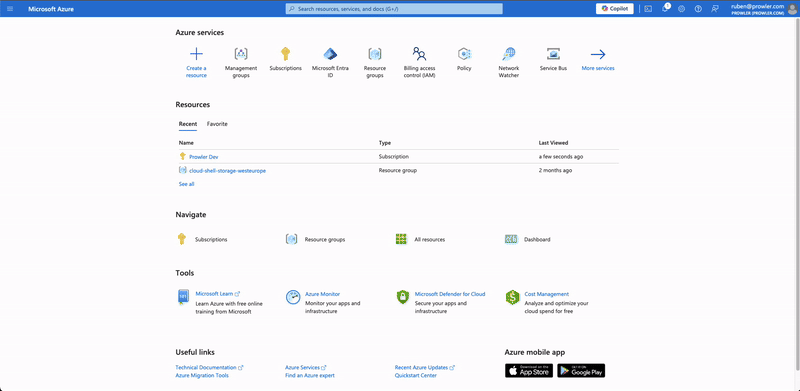
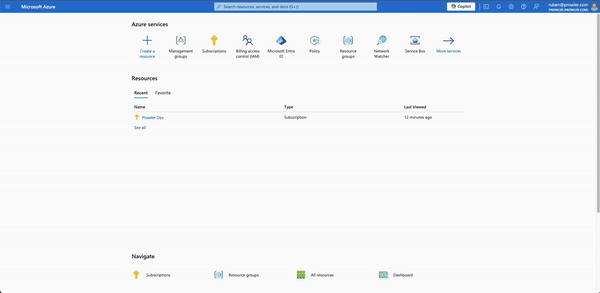
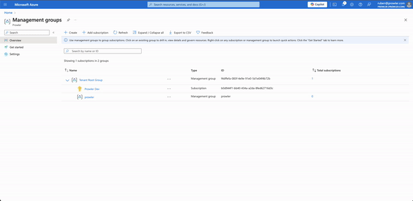

# Azure subscriptions scope

By default, Prowler is multisubscription, which means that is going to scan all the subscriptions is able to list. If you only assign permissions to one subscription, it is going to scan a single one.
Prowler also has the ability to limit the subscriptions to scan to a set passed as input argument, to do so:

```console
prowler azure --az-cli-auth --subscription-ids <subscription ID 1> <subscription ID 2> ... <subscription ID N>
```

Where you can pass from 1 up to N subscriptions to be scanned.

## Assigning proper permissions

Regarding the subscription scope, Prowler by default scans all subscriptions that it is able to list, so it is necessary to add the `Reader` RBAC built-in roles per subscription or management group (recommended for multiple subscriptions, see it in the [next section](#recommendation-for-multiple-subscriptions)) to the entity that will be adopted by the tool:

To assign this roles, follow the instructions:

1. Access your subscription, then select your subscription.
2. Select "Access control (IAM)".
3. In the overview, select "Roles".
4. Click on "+ Add" and select "Add role assignment".
5. In the search bar, type `Reader`, select it and click on "Next".
6. In the Members tab, click on "+ Select members" and add the members you want to assign this role.
7. Click on "Review + assign" to apply the new role.



Moreover, some additional read-only permissions are needed for some checks, for this kind of checks that are not covered by built-in roles we use a custom role. This role is defined in [prowler-azure-custom-role](https://github.com/prowler-cloud/prowler/blob/master/permissions/prowler-azure-custom-role.json). Once the cusotm role is created, repeat the steps mentioned above to assign the new `ProwlerRole` to an identity.

## Recommendation for multiple subscriptions

While scanning multiple subscriptions could be tedious to create and assign roles for each one. For this reason in Prowler we recommend the usage of *[management groups](https://learn.microsoft.com/en-us/azure/governance/management-groups/overview)* to group all subscriptions that are going to be audited by Prowler.

To do this in a proper way you have to [create a new management group](https://learn.microsoft.com/en-us/azure/governance/management-groups/create-management-group-portal) and add all roles in the same way that have been done for subscription scope.



Once the management group is properly set you can add all the subscription that you want to audit.



???+ note
    By default, `prowler` will scan all subscriptions in the Azure tenant, use the flag `--subscription-id` to specify the subscriptions to be scanned.
