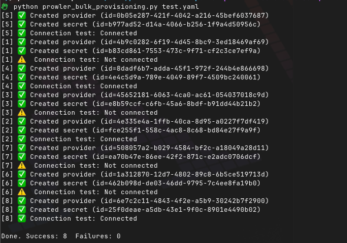

# Bulk Provider Provisioning in Prowler

Prowler enables automated provisioning of multiple cloud providers through the Bulk Provider Provisioning tool. This approach streamlines the onboarding process for organizations managing numerous cloud accounts, subscriptions, and projects across AWS, Azure, GCP, Kubernetes, Microsoft 365, and GitHub.

The tool is available in the Prowler repository at: [util/prowler-bulk-provisioning](https://github.com/prowler-cloud/prowler/tree/master/util/prowler-bulk-provisioning)



## Overview

The Bulk Provider Provisioning tool automates the creation of cloud providers in Prowler App or Prowler Cloud by:

* Reading provider configurations from YAML files
* Creating providers with appropriate authentication credentials
* Testing connections to verify successful authentication
* Processing multiple providers concurrently for efficiency


## Prerequisites

### Requirements

* Python 3.7 or higher
* Prowler API token (from Prowler Cloud or self-hosted Prowler App)
    * For self-hosted Prowler App, remember to [point to your API base URL](#custom-api-endpoints)
* Authentication credentials for target cloud providers

### Installation

Clone the repository and install the required dependencies:

```bash
git clone https://github.com/prowler-cloud/prowler.git
cd prowler/util/prowler-bulk-provisioning
pip install -r requirements.txt
```

### Authentication Setup

Configure your Prowler API token:

```bash
export PROWLER_API_TOKEN="your-prowler-api-token"
```

To obtain an API token programmatically:

```bash
export PROWLER_API_TOKEN=$(curl --location 'https://api.prowler.com/api/v1/tokens' \
  --header 'Content-Type: application/vnd.api+json' \
  --header 'Accept: application/vnd.api+json' \
  --data-raw '{
    "data": {
      "type": "tokens",
      "attributes": {
        "email": "your@email.com",
        "password": "your-password"
      }
    }
  }' | jq -r .data.attributes.access)
```

## Configuration File Structure

Create a YAML file listing your cloud providers and credentials:

```yaml
# providers.yaml
- provider: aws
  uid: "123456789012"              # AWS Account ID
  alias: "production-account"
  auth_method: role
  credentials:
    role_arn: "arn:aws:iam::123456789012:role/ProwlerScanRole"
    external_id: "prowler-external-id"

- provider: azure
  uid: "00000000-1111-2222-3333-444444444444"  # Subscription ID
  alias: "azure-production"
  auth_method: service_principal
  credentials:
    tenant_id: "aaaaaaaa-bbbb-cccc-dddd-eeeeeeeeeeee"
    client_id: "ffffffff-1111-2222-3333-444444444444"
    client_secret: "your-client-secret"

- provider: gcp
  uid: "my-gcp-project"            # Project ID
  alias: "gcp-production"
  auth_method: service_account
  credentials:
    service_account_key_json_path: "./service-account.json"
```

## Running the Bulk Provisioning Tool

### Basic Usage

To provision all providers from your configuration file:

```bash
python prowler_bulk_provisioning.py providers.yaml
```

The tool automatically tests each provider connection after creation (enabled by default).

### Dry Run Mode

Test your configuration without making API calls:

```bash
python prowler_bulk_provisioning.py providers.yaml --dry-run
```

### Skip Connection Testing

To provision providers without testing connections:

```bash
python prowler_bulk_provisioning.py providers.yaml --test-provider false
```

### Test Existing Providers Only

To verify connections for already provisioned providers:

```bash
python prowler_bulk_provisioning.py providers.yaml --test-provider-only
```

## Provider-Specific Configuration

### AWS Provider Configuration

#### Using IAM Role (Recommended)

```yaml
- provider: aws
  uid: "123456789012"
  alias: "aws-production"
  auth_method: role
  credentials:
    role_arn: "arn:aws:iam::123456789012:role/ProwlerScanRole"
    external_id: "optional-external-id"
    session_name: "prowler-scan-session"  # optional
    duration_seconds: 3600                # optional
```

#### Using Access Keys

```yaml
- provider: aws
  uid: "123456789012"
  alias: "aws-development"
  auth_method: credentials
  credentials:
    access_key_id: "AKIA..."
    secret_access_key: "..."
    session_token: "..."  # optional for temporary credentials
```

### Azure Provider Configuration

```yaml
- provider: azure
  uid: "subscription-uuid"
  alias: "azure-production"
  auth_method: service_principal
  credentials:
    tenant_id: "tenant-uuid"
    client_id: "client-uuid"
    client_secret: "client-secret"
```

### GCP Provider Configuration

#### Using Service Account JSON

```yaml
- provider: gcp
  uid: "project-id"
  alias: "gcp-production"
  auth_method: service_account
  credentials:
    service_account_key_json_path: "/path/to/key.json"
```

#### Using OAuth2 Credentials

```yaml
- provider: gcp
  uid: "project-id"
  alias: "gcp-production"
  auth_method: oauth2
  credentials:
    client_id: "123456789.apps.googleusercontent.com"
    client_secret: "GOCSPX-xxxx"
    refresh_token: "1//0exxxxxx"
```

### Kubernetes Provider Configuration

```yaml
- provider: kubernetes
  uid: "context-name"
  alias: "eks-production"
  auth_method: kubeconfig
  credentials:
    kubeconfig_path: "~/.kube/config"
    # OR inline configuration:
    # kubeconfig_inline: |
    #   apiVersion: v1
    #   clusters: ...
```

### Microsoft 365 Provider Configuration

```yaml
- provider: m365
  uid: "domain.onmicrosoft.com"
  alias: "m365-tenant"
  auth_method: service_principal
  credentials:
    tenant_id: "tenant-uuid"
    client_id: "client-uuid"
    client_secret: "client-secret"
```

### GitHub Provider Configuration

#### Using Personal Access Token

```yaml
- provider: github
  uid: "organization-name"
  alias: "github-org"
  auth_method: personal_access_token
  credentials:
    token: "ghp_..."
```

#### Using GitHub App

```yaml
- provider: github
  uid: "organization-name"
  alias: "github-org"
  auth_method: github_app
  credentials:
    app_id: "123456"
    private_key_path: "/path/to/private-key.pem"
```

## Advanced Configuration

### Concurrent Processing

Adjust the number of concurrent provider creations:

```bash
python prowler_bulk_provisioning.py providers.yaml --concurrency 10
```

### Custom API Endpoints

For self-hosted Prowler App installations:

```bash
python prowler_bulk_provisioning.py providers.yaml \
  --base-url http://localhost:8080/api/v1
```

### Timeout Configuration

Set custom timeout for API requests:

```bash
python prowler_bulk_provisioning.py providers.yaml --timeout 120
```

## Bulk Provider Management

### Deleting Multiple Providers

To remove all providers from your Prowler account:

```bash
python nuke_providers.py --confirm
```

Filter deletions by provider type:

```bash
python nuke_providers.py --confirm --filter-provider aws
```

Filter deletions by alias pattern:

```bash
python nuke_providers.py --confirm --filter-alias "test-*"
```

## Configuration File Format

The tool uses YAML format for provider configuration files. Each provider entry requires:

* `provider`: The cloud provider type (aws, azure, gcp, kubernetes, m365, github)
* `uid`: Unique identifier for the provider (account ID, subscription ID, project ID, etc.)
* `alias`: A friendly name for the provider
* `auth_method`: Authentication method to use
* `credentials`: Authentication credentials specific to the provider and method

Example YAML structure:

```yaml
- provider: aws
  uid: "123456789012"
  alias: "production"
  auth_method: role
  credentials:
    role_arn: "arn:aws:iam::123456789012:role/ProwlerScan"
```

## Example Output

Successful provider provisioning:

```
[1] ✅ Created provider (id=db9a8985-f9ec-4dd8-b5a0-e05ab3880bed)
[1] ✅ Created secret (id=466f76c6-5878-4602-a4bc-13f9522c1fd2)
[1] ✅ Connection test: Connected

[2] ✅ Created provider (id=7a99f789-0cf5-4329-8279-2d443a962676)
[2] ✅ Created secret (id=c5702180-f7c4-40fd-be0e-f6433479b126)
[2] ⚠️  Connection test: Not connected

Done. Success: 2  Failures: 0
```

## Troubleshooting

### Invalid API Token

```
Error: 401 Unauthorized
Solution: Verify your PROWLER_API_TOKEN or --token parameter
```

### Network Timeouts

```
Error: Connection timeout
Solution: Increase timeout with --timeout 120
```

### Provider Already Exists

```
Error: Provider with this UID already exists
Solution: Use different UID or delete existing provider first
```

### Authentication Failures

```
Connection test: Not connected
Solution: Verify credentials and IAM permissions
```
