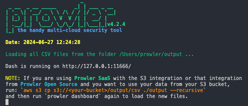
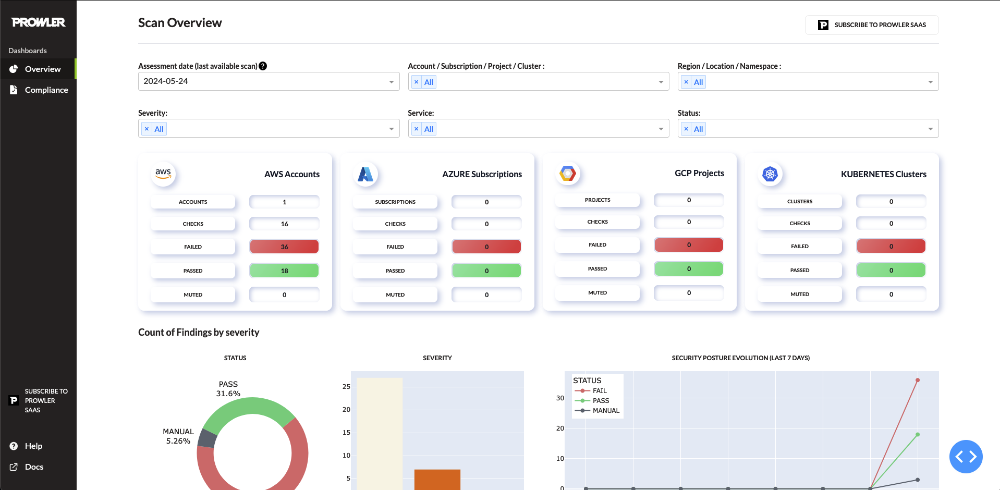
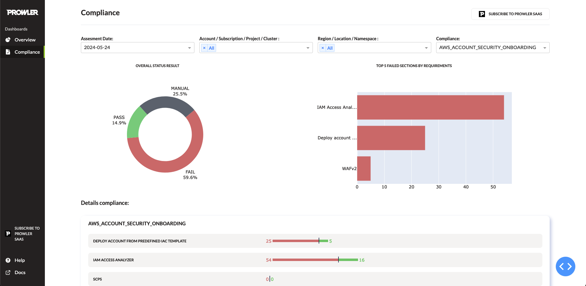

# Dashboard
Prowler allows you to run your own local dashboards using the csv outputs provided by Prowler

```sh
prowler dashboard
```

The banner and additional info about the dashboard will be shown on your console:


## Overview Page

The overview page provides a full impression of your findings obtained from Prowler:



In this page you can do multiple functions:
* Apply filters (Assessment Date / Account / Region)
* See wich files has been scaned to generate the dashboard placing your mouse on the `?` icon:
    
* Download the `Top 25 Failed Findings by Severity` table using the button `DOWNLOAD THIS TABLE AS CSV`

## Compliance Page

This page shows all the info related to the compliance selected, you can apply multiple filters depending on your preferences.



## S3 Integration

If you are a Prowler Saas customer and you want to use your data from your S3 bucket, you can run:

```sh
aws s3 cp s3://<your-bucket>/output/csv ./output --recursive
```
to load the dashboard with the new files.

## Output Path

Prowler will use the outputs from the folder `/output` (for common prowler outputs) and `/output/compliance` (for prowler compliance outputs) to generate the dashboard.

To change the path modify the values `folder_path_overview` or `folder_path_compliance` from `/dashboard/config.py`

## Output Support

Prowler dashboard supports the detailed outputs:

| Provider | V3 | V4 | COMPLIANCE-V3 | COMPLIANCE-V4|
|---|---|---|---|---|
| AWS | ✅ | ✅ | ✅ | ✅ |
| Azure | ❌ | ✅ | ❌ | ✅ |
| Kubernetes | ❌ | ✅ | ❌ | ✅ |
| GCP | ❌ | ✅ | ❌ | ✅ |
