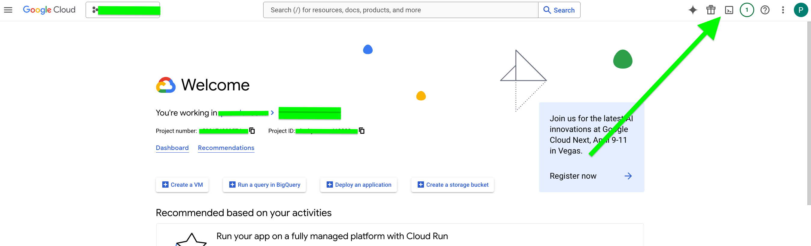
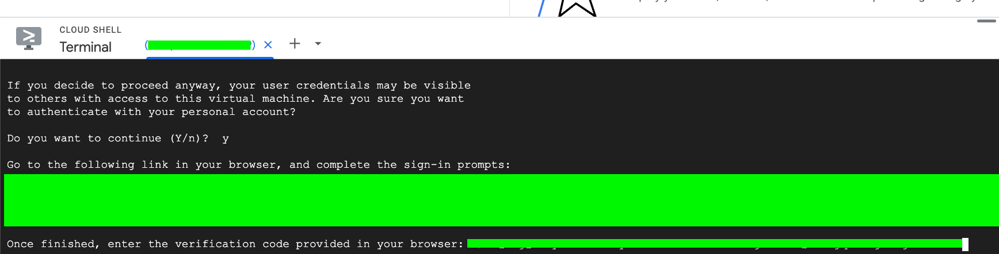
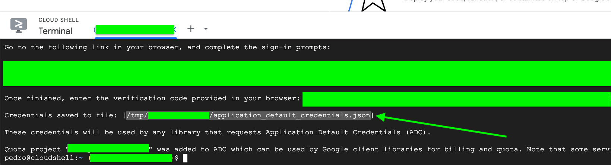

# GCP Authentication in Prowler

Prowler for Google Cloud supports multiple authentication methods. To use a specific method, configure the appropriate credentials during execution:

- [**User Credentials** (Application Default Credentials)](#application-default-credentials-user-credentials)
- [**Service Account Key File**](#service-account-key-file)
- [**Access Token**](#access-token)
- [**Service Account Impersonation**](#service-account-impersonation)

## Required Permissions

Prowler for Google Cloud requires the following permissions:

### IAM Roles
- **Reader (`roles/reader`)** – Must be granted at the **project, folder, or organization** level to allow scanning of target projects.

### Project-Level Settings

At least one project must have the following configurations:

- **Identity and Access Management (IAM) API (`iam.googleapis.com`)** – Must be enabled via:

    - The [Google Cloud API UI](https://console.cloud.google.com/apis/api/iam.googleapis.com/metrics), or
    - The `gcloud` CLI:
    ```sh
    gcloud services enable iam.googleapis.com --project <your-project-id>
    ```

- **Service Usage Consumer (`roles/serviceusage.serviceUsageConsumer`)** IAM Role – Required for resource scanning.

- **Quota Project Setting** – Define a quota project using either:

    - The `gcloud` CLI:
    ```sh
    gcloud auth application-default set-quota-project <project-id>
    ```
    - Setting an environment variable:
    ```sh
    export GOOGLE_CLOUD_QUOTA_PROJECT=<project-id>
    ```

???+ note
    Prowler will scan the GCP project associated with the credentials.


## Application Default Credentials (User Credentials)

This method uses the Google Cloud CLI to authenticate and is suitable for development and testing environments.

### Setup Application Default Credentials

1. In the [GCP Console](https://console.cloud.google.com/), click on "Activate Cloud Shell"

    

2. Click "Authorize Cloud Shell"

    

3. Run the following command:

    ```bash
    gcloud auth application-default login
    ```

    - Type `Y` when prompted

    

4. Open the authentication URL provided in a browser and select your Google account

    

5. Follow the steps to obtain the authentication code

    

6. Paste the authentication code back in Cloud Shell

    

7. Use `cat <file_name>` to view the temporary credentials file

    

8. Extract the following values for Prowler Cloud/App:

    - `client_id`
    - `client_secret`
    - `refresh_token`

    

### Using with Prowler CLI

Once application default credentials are set up, run Prowler directly:

```console
prowler gcp --project-ids <project-id>
```

## Service Account Key File

This method uses a service account with a downloaded key file for authentication.

### Create Service Account and Key

1. Go to the [Service Accounts page](https://console.cloud.google.com/iam-admin/serviceaccounts) in the GCP Console
2. Click "Create Service Account"
3. Fill in the service account details and click "Create and Continue"
4. Grant the service account the "Reader" role
5. Click "Done"
6. Find your service account in the list and click on it
7. Go to the "Keys" tab
8. Click "Add Key" > "Create new key"
9. Select "JSON" and click "Create"
10. Save the downloaded key file securely

### Using with Prowler CLI

Set the `GOOGLE_APPLICATION_CREDENTIALS` environment variable:

```console
export GOOGLE_APPLICATION_CREDENTIALS="/path/to/service-account-key.json"
prowler gcp --project-ids <project-id>
```

## Access Token

For existing access tokens (e.g., generated with `gcloud auth print-access-token`), run Prowler with:

```bash
export CLOUDSDK_AUTH_ACCESS_TOKEN=$(gcloud auth print-access-token)
prowler gcp --project-ids <project-id>
```

???+ note
    When using this method, also set the default project explicitly:
    ```bash
    export GOOGLE_CLOUD_PROJECT=<project-id>
    ```

## Service Account Impersonation

To impersonate a GCP service account, use the `--impersonate-service-account` argument followed by the service account email:

```console
prowler gcp --impersonate-service-account <service-account-email>
```

This command leverages the default credentials to impersonate the specified service account.

### Prerequisites for Impersonation

The identity running Prowler must have the following permission on the target service account:

- `roles/iam.serviceAccountTokenCreator`

Or the more specific permission:

- `iam.serviceAccounts.generateAccessToken`
