# Getting Started with GCP on Prowler Cloud/App

<iframe width="560" height="380" src="https://www.youtube-nocookie.com/embed/v1as8vTFlMg" title="Prowler Cloud Onboarding GCP" frameborder="0" allow="accelerometer; autoplay; clipboard-write; encrypted-media; gyroscope; picture-in-picture" allowfullscreen="1"></iframe>

Set up your GCP project to enable security scanning using Prowler Cloud/App.

## Requirements

To configure your GCP project, you’ll need:

1. Get the `Project ID`
2. Access to Prowler Cloud/App
3. Configure authentication in GCP:

    3.1 Retrieve credentials from Google Cloud

4. Add the credentials to Prowler Cloud/App

---

## Step 1: Get the Project ID

1. Go to the [GCP Console](https://console.cloud.google.com/)
2. Locate your Project ID on the welcome screen

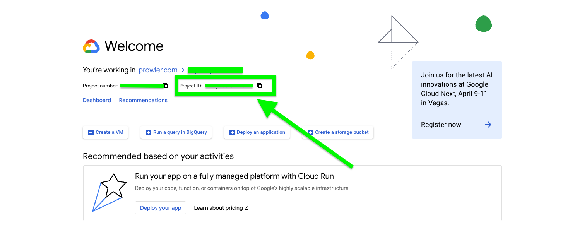

---

## Step 2: Access Prowler Cloud/App

1. Go to [Prowler Cloud](https://cloud.prowler.com/) or launch [Prowler App](../prowler-app.md)
2. Navigate to `Configuration` > `Cloud Providers`

    

3. Click `Add Cloud Provider`

    

4. Select `Google Cloud Platform`

    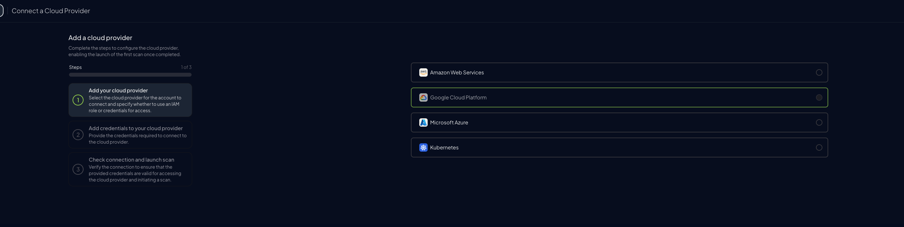

5. Add the Project ID and optionally provide a provider alias, then click `Next`

    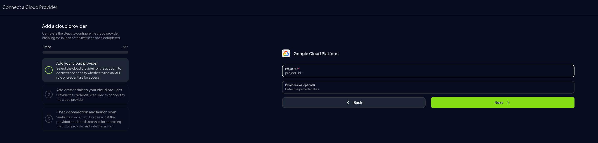

---

## Step 3: Configure Authentication in GCP

### Retrieve Credentials from Google Cloud

1. In the [GCP Console](https://console.cloud.google.com/), click on `Activate Cloud Shell`

    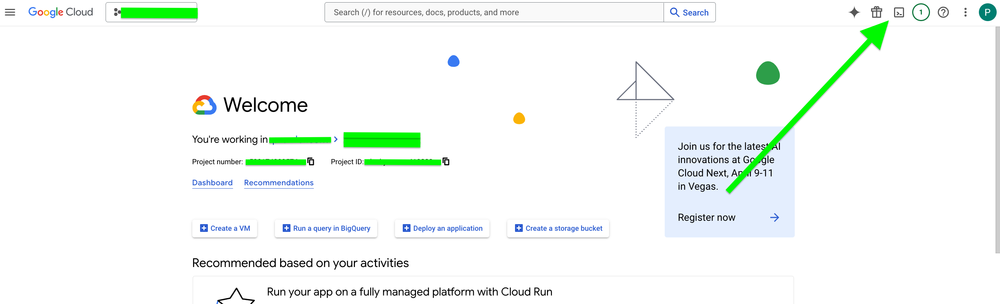

2. Click `Authorize Cloud Shell`

    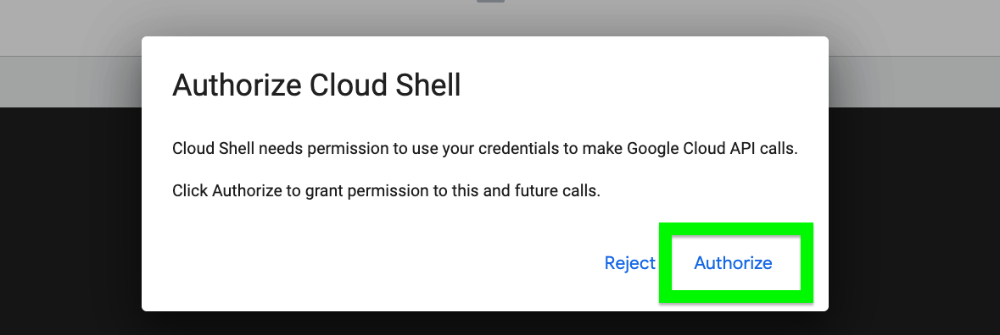

3. Run the following command:

    ```bash
    gcloud auth application-default login
    ```

    - Type `Y` when prompted

    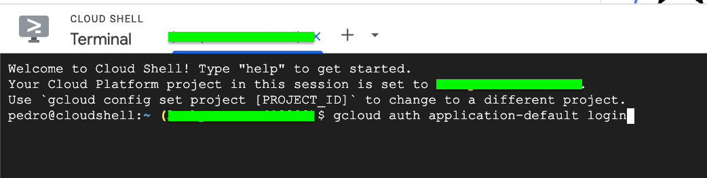

4. Open the authentication URL provided in a browser and select your Google account

    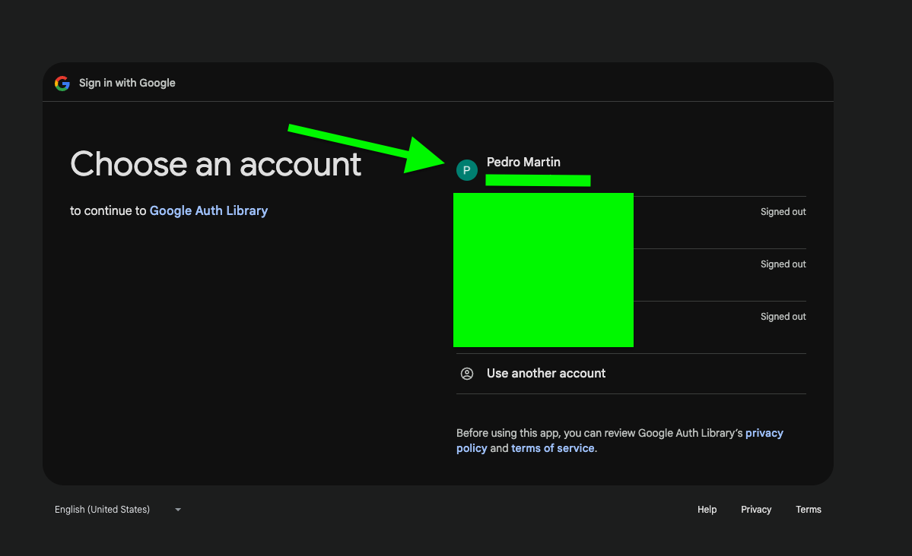

5. Follow the steps to obtain the authentication code

    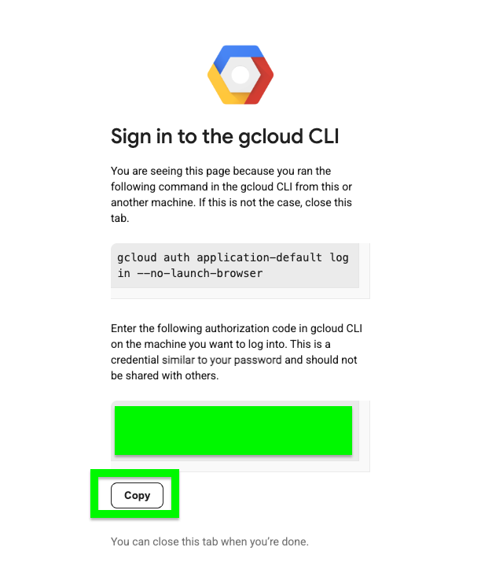

6. Paste the authentication code back in Cloud Shell

    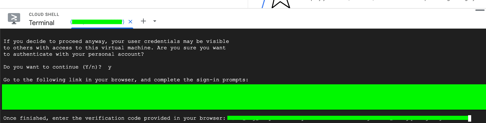

7. Use `cat <file_name>` to view the temporary credentials file

    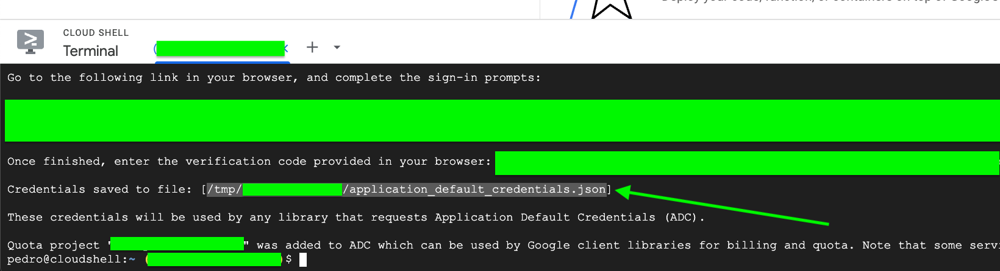

8. Extract the following values for Prowler Cloud/App:

    - `client_id`
    - `client_secret`
    - `refresh_token`

    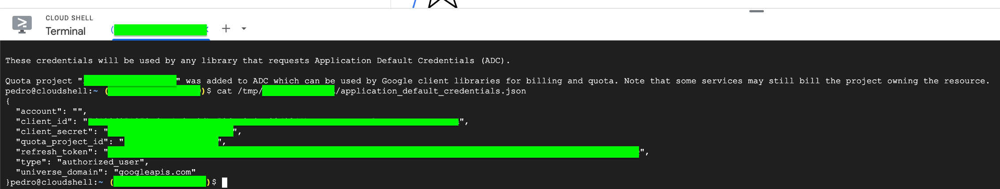

---

## Step 4: Add Credentials to Prowler Cloud/App

1. Go back to Prowler Cloud/App and enter the required credentials, then click `Next`

    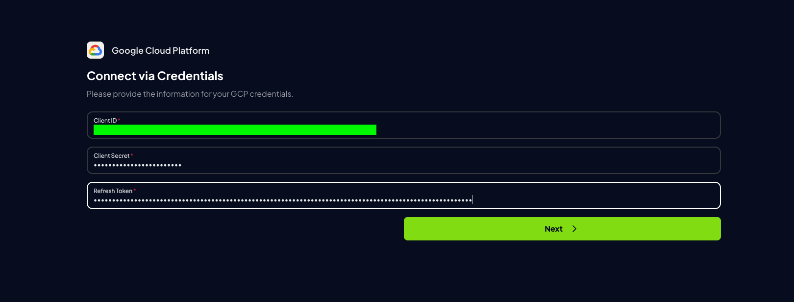

2. Click `Launch Scan` to begin scanning your GCP environment

    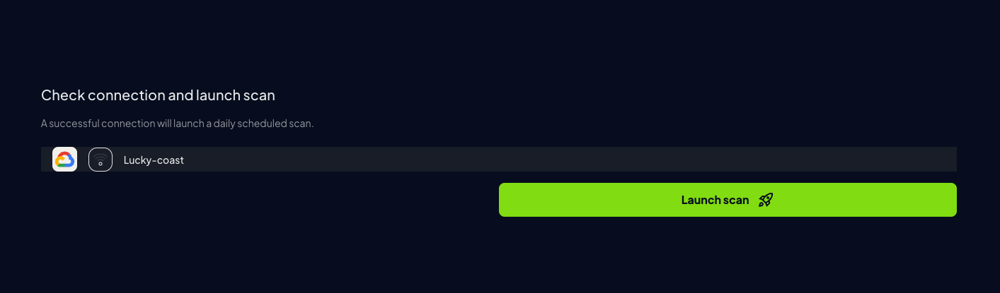
