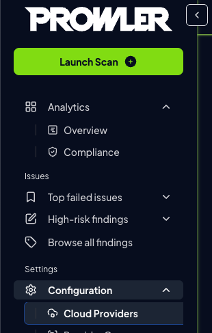

# Getting Started with GCP on Prowler Cloud

<iframe width="560" height="380" src="https://www.youtube-nocookie.com/embed/v1as8vTFlMg" title="Prowler Cloud Onboarding GCP" frameborder="0" allow="accelerometer; autoplay; clipboard-write; encrypted-media; gyroscope; picture-in-picture" allowfullscreen="1"></iframe>

You can set-up your GCP Project in order to scan it using Prowler cloud.

Setting up the GCP project requires:

1. Get the `Project ID`
2. Access to Prowler Cloud
3. Setting the Project ID to allow the authentication

    3.1 Retrieve the credentials from Google Cloud

4. Add the credentials to Prowler Cloud

## First Step - Get the Project ID:

Go to [Gcloud Console](https://console.cloud.google.com/) and in the welcome page, get your project ID:

## Access to Prowler Cloud

1. Go to [Prowler Cloud](https://cloud.prowler.com/) and go inside `Configuration` > `Cloud Providers` page:

    

2. Click on `Add Cloud Provider`

    

4. Select `Google Cloud Platform`

    

4. Add the Project ID from the first step, input a provider alias (optional) and click on `Next`

    

## Setting the Project ID to allow the authentication

To get the needed credentials you'll need to access [Gcloud Console](https://console.cloud.google.com/)

### Retrieve the credentials from Google Cloud

1. Click on `Activate Cloud Shell`

    

2. Click on `Authorize Cloud Shell`

    

3. Run `gcloud auth application-default login` inside the console and type `Y` when asked:

    

4. Open the given link on a new browser tab and choose your account:

    

5. Fill the next steps until you get your auth code:

    

6. Go back to google console and paste the auth code:

    

7. View the content from the file using: `cat <file_name>`

    

8. Get the neeed values to use in Prowler Cloud (`client_id`, `client_secret`, `refresh_token`):

    

## Add the credentials to Prowler Cloud

1. Go back to Prowler Cloud and fill the information needed and click on `Next`:

    

2. Click on `Launch Scan`

    
