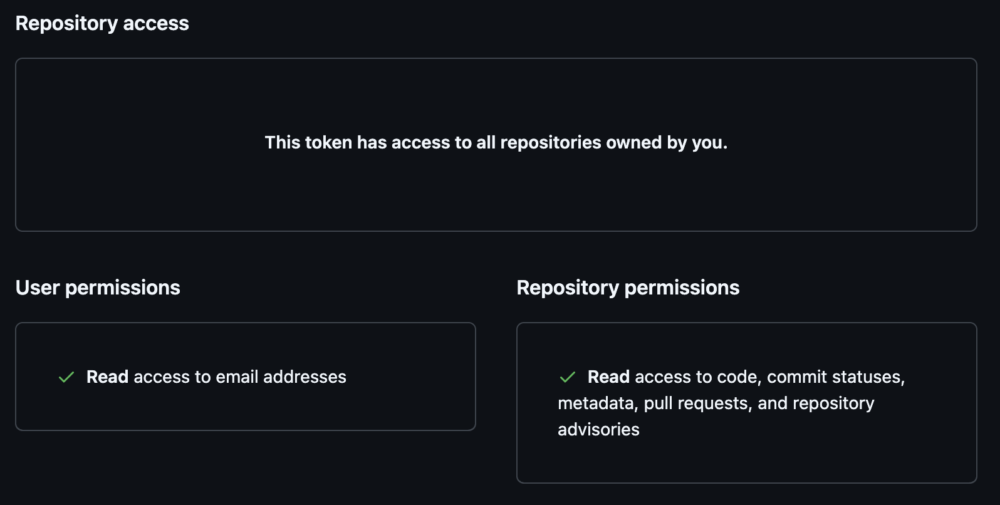

# GitHub Authentication in Prowler

Prowler supports multiple methods to [authenticate with GitHub](https://docs.github.com/en/rest/authentication/authenticating-to-the-rest-api). These include:

- [Personal Access Token (PAT)](./authentication.md#personal-access-token-pat)
- [OAuth App Token](./authentication.md#oauth-app-token)
- [GitHub App Credentials](./authentication.md#github-app-credentials)

This flexibility enables scanning and analysis of GitHub accounts, including repositories, organizations, and applications, using the method that best suits the use case.

## Personal Access Token (PAT)

Personal Access Tokens provide the simplest GitHub authentication method, but it can only access resources owned by a single user or organization.

???+ warning "Classic Tokens Deprecated"
    GitHub has deprecated Personal Access Tokens (classic) in favor of fine-grained Personal Access Tokens. We recommend using fine-grained tokens as they provide better security through more granular permissions and resource-specific access control.

#### **Option 1: Create a Fine-Grained Personal Access Token (Recommended)**

1. **Navigate to GitHub Settings**
    - Open [GitHub](https://github.com) and sign in
    - Click the profile picture in the top right corner
    - Select "Settings" from the dropdown menu

2. **Access Developer Settings**
    - Scroll down the left sidebar
    - Click "Developer settings"

3. **Generate Fine-Grained Token**
    - Click "Personal access tokens"
    - Select "Fine-grained tokens"
    - Click "Generate new token"

4. **Configure Token Settings**
    - **Token name**: Give your token a descriptive name (e.g., "Prowler Security Scanner")
    - **Expiration**: Set an appropriate expiration date (recommended: 90 days or less)
    - **Repository access**: Choose "All repositories" or "Only select repositories" based on your needs

    ???+ note "Public repositories"
        Even if you select 'Only select repositories', the token will have access to the public repositories that you own or are a member of.

5. **Configure Token Permissions**
    To enable Prowler functionality, configure the following permissions:

    - **Repository permissions:**
        - **Administration**: Read-only access
        - **Contents**: Read-only access
        - **Metadata**: Read-only access
        - **Pull requests**: Read-only access

    - **Organization permissions:**
        - **Administration**: Read-only access
        - **Members**: Read-only access

    - **Account permissions:**
        - **Email addresses**: Read-only access

6. **Copy and Store the Token**
    - Copy the generated token immediately (GitHub displays tokens only once)
    - Store tokens securely using environment variables



#### **Option 2: Create a Classic Personal Access Token (Not Recommended)**

???+ warning "Security Risk"
    Classic tokens provide broad permissions that may exceed what Prowler actually needs. Use fine-grained tokens instead for better security.

1. **Navigate to GitHub Settings**
    - Open [GitHub](https://github.com) and sign in
    - Click the profile picture in the top right corner
    - Select "Settings" from the dropdown menu

2. **Access Developer Settings**
    - Scroll down the left sidebar
    - Click "Developer settings"

3. **Generate Classic Token**
    - Click "Personal access tokens"
    - Select "Tokens (classic)"
    - Click "Generate new token"

4. **Configure Token Permissions**
    To enable Prowler functionality, configure the following scopes:
    - `repo`: Full control of private repositories (includes `repo:status` and `repo:contents`)
    - `read:org`: Read organization and team membership
    - `read:user`: Read user profile data
    - `security_events`: Access security events (secret scanning and Dependabot alerts)
    - `read:enterprise`: Read enterprise data (if using GitHub Enterprise)

5. **Copy and Store the Token**
    - Copy the generated token immediately (GitHub displays tokens only once)
    - Store tokens securely using environment variables

## OAuth App Token

OAuth Apps enable applications to act on behalf of users with explicit consent.

### Create an OAuth App Token

1. **Navigate to Developer Settings**
    - Open GitHub Settings → Developer settings
    - Click "OAuth Apps"

2. **Register New Application**
    - Click "New OAuth App"
    - Complete the required fields:
        - **Application name**: Descriptive application name
        - **Homepage URL**: Application homepage
        - **Authorization callback URL**: User redirection URL after authorization

3. **Obtain Authorization Code**
    - Request authorization code (replace `{app_id}` with the application ID):
   ```
   https://github.com/login/oauth/authorize?client_id={app_id}
   ```

4. **Exchange Code for Token**
    - Exchange authorization code for access token (replace `{app_id}`, `{secret}`, and `{code}`):
   ```
   https://github.com/login/oauth/access_token?code={code}&client_id={app_id}&client_secret={secret}
   ```

## GitHub App Credentials
GitHub Apps provide the recommended integration method for accessing multiple repositories or organizations.

### Create a GitHub App

1. **Navigate to Developer Settings**
    - Open GitHub Settings → Developer settings
    - Click "GitHub Apps"

2. **Create New GitHub App**
    - Click "New GitHub App"
    - Complete the required fields:
        - **GitHub App name**: Unique application name
        - **Homepage URL**: Application homepage
        - **Webhook URL**: Webhook payload URL (optional)
        - **Permissions**: Configure application permission requirements following the next step

3. **Configure Permissions**
    To enable Prowler functionality, configure these permissions:
    - **Repository permissions**:
        - Contents (Read)
        - Metadata (Read)
        - Pull requests (Read)
    - **Organization permissions**:
        - Members (Read)
        - Administration (Read)
    - **Account permissions**:
        - Email addresses (Read)

4. **Where can this GitHub App be installed?**
    - Select "Any account" to be able to install the GitHub App in any organization.

5. **Generate Private Key**
    - Scroll to the "Private keys" section after app creation
    - Click "Generate a private key"
    - Download the `.pem` file and store securely

5. **Record App ID**
    - Locate the App ID at the top of the GitHub App settings page

### Install the GitHub App

1. **Install Application**
    - Navigate to GitHub App settings
    - Click "Install App" in the left sidebar
    - Select the target account/organization
    - Choose specific repositories or select "All repositories"

## Best Practices

### Security Considerations

Implement the following security measures:

- **Secure Credential Storage**: Store credentials using environment variables instead of hardcoding tokens
- **Secrets Management**: Use dedicated secrets management systems in production environments
- **Regular Token Rotation**: Rotate tokens and keys regularly
- **Least Privilege Principle**: Grant only minimum required permissions
- **Permission Auditing**: Review and audit permissions regularly
- **Token Expiration**: Set appropriate expiration times for tokens
- **Usage Monitoring**: Monitor token usage and revoke unused tokens

### Authentication Method Selection

Choose the appropriate method based on use case:

- **Personal Access Token**: Individual use, testing, or simple automation
- **OAuth App Token**: Applications requiring user consent and delegation
- **GitHub App**: Production integrations, especially for organizations

## Troubleshooting Common Issues

### Insufficient Permissions
- Verify token/app has necessary scopes/permissions
- Check organization restrictions on third-party applications

### Token Expiration
- Confirm token has not expired
- Verify fine-grained tokens have correct resource access

### Rate Limiting
- GitHub implements API call rate limits
- Consider GitHub Apps for higher rate limits

### Organization Settings
- Some organizations restrict third-party applications
- Contact organization administrator if access is denied
