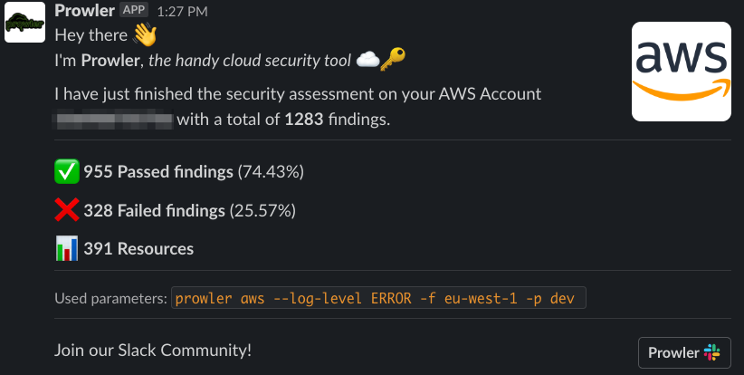
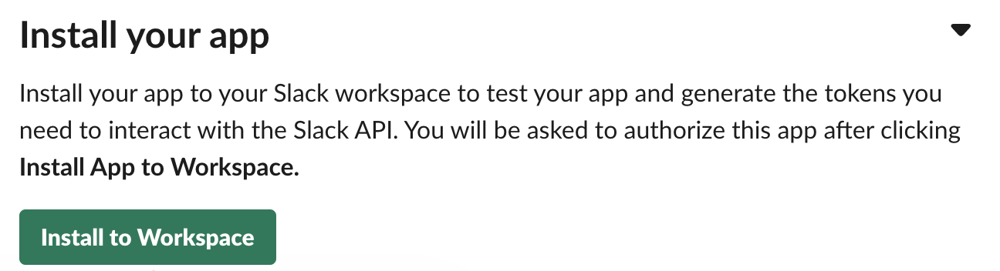
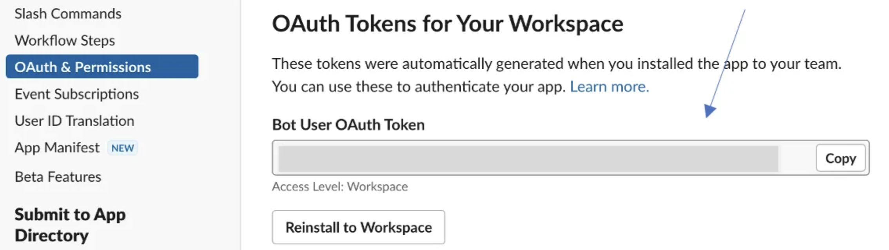
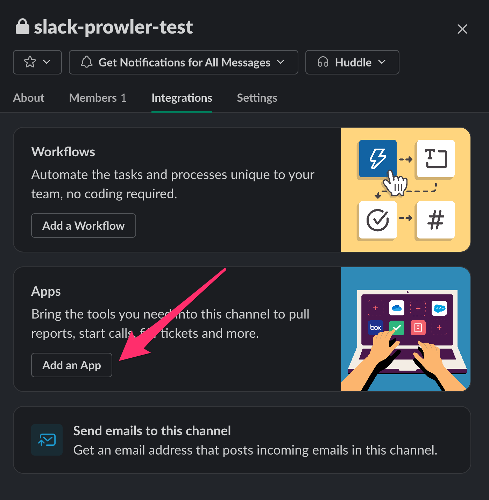

# Integrations

## Integration with Slack

Prowler can be integrated with [Slack](https://slack.com/) to send a summary of the execution having configured a Slack APP in your channel with the following command:

```sh
prowler <provider> --slack
```



???+ note
   Slack integration needs SLACK\_API\_TOKEN and SLACK\_CHANNEL\_NAME environment variables.


### Configuration of the Integration with Slack

To configure the Slack Integration, follow the next steps:

   1. Create a Slack Application:

      - Go to [Slack API page](https://api.slack.com/tutorials/tracks/getting-a-token "Create Slack App"), scroll down to the *Create app* button and select your workspace: 

      - Install the application in your selected workspaces: 

      - Get the *Slack App OAuth Token* that Prowler needs to send the message: 

   2. Optionally, create a Slack Channel (you can use an existing one)

   3. Integrate the created Slack App to your Slack channel:

      - Click the channel, go to the Integrations tab, and Add an App. 

   4. Set the following environment variables that Prowler will read:

      - `SLACK_API_TOKEN`: the *Slack App OAuth Token* that was previously get.
      - `SLACK_CHANNEL_NAME`: the name of your Slack Channel where Prowler will send the message.
