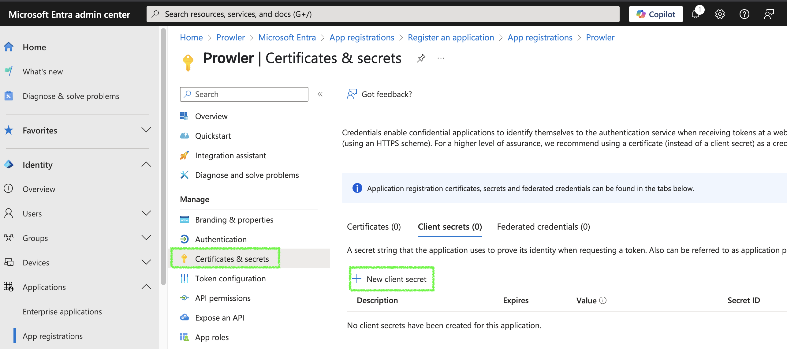
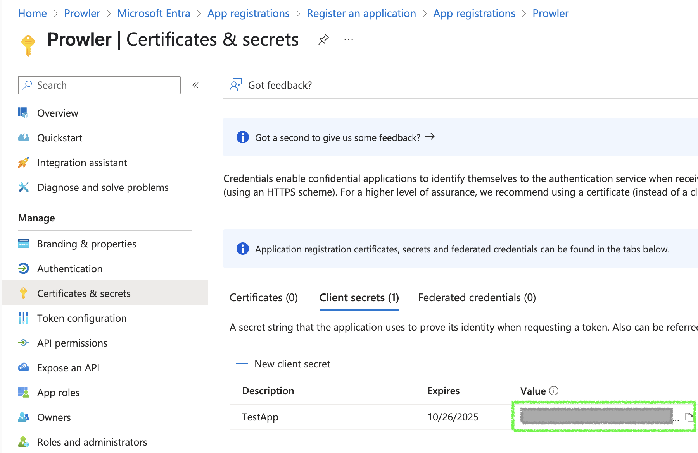
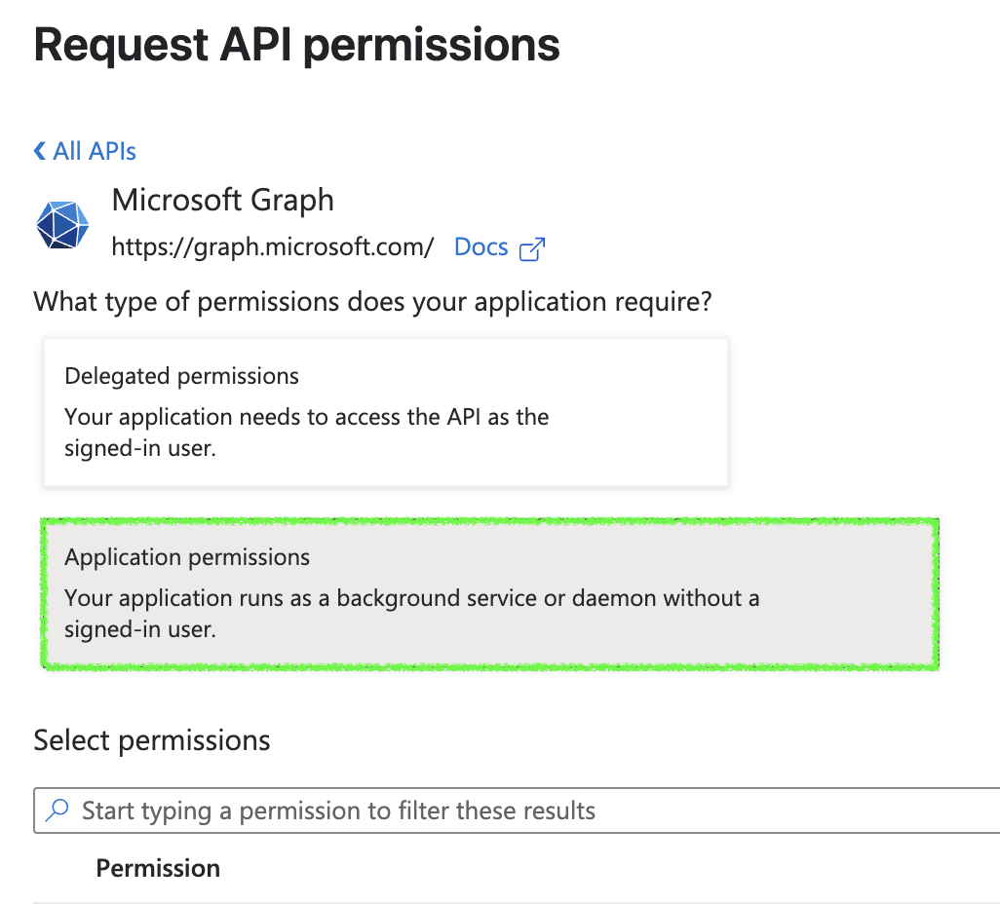
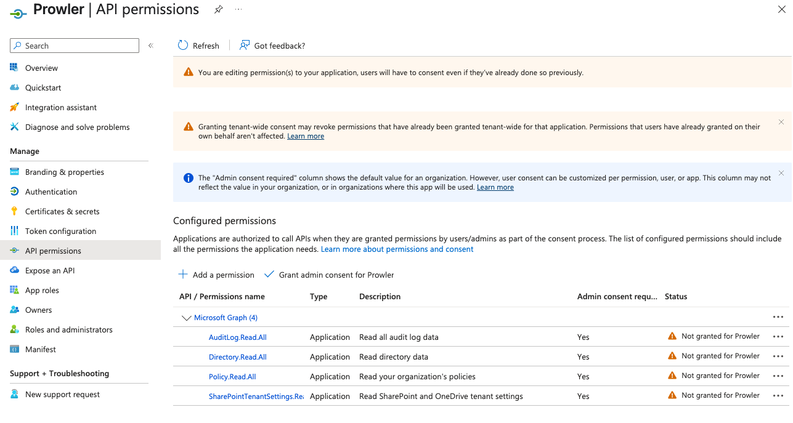
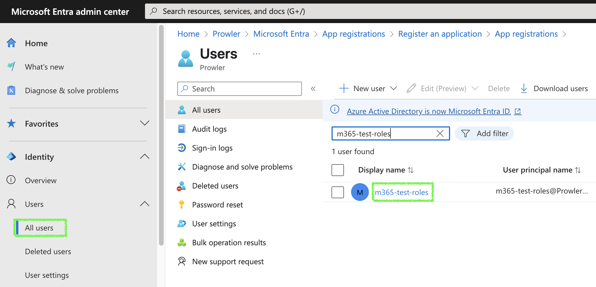

# Microsoft 365 Authentication in Prowler

Prowler for Microsoft 365 supports multiple authentication types. Authentication methods vary between Prowler App and Prowler CLI:

**Prowler App:**

- [**Service Principal Application**](#service-principal-authentication-recommended) (**Recommended**)
- [**Service Principal with User Credentials**](#service-principal-and-user-credentials-authentication) (Being deprecated)

**Prowler CLI:**

- [**Service Principal Application**](#service-principal-authentication-recommended) (**Recommended**)
- [**Service Principal with User Credentials**](#service-principal-and-user-credentials-authentication) (Being deprecated)
- [**Interactive browser authentication**](#interactive-browser-authentication)

???+ warning
    The Service Principal with User Credentials method will be deprecated in October 2025 when Microsoft enforces multifactor authentication (MFA) in all tenants, which will not allow user authentication without interactive methods.

## Required Permissions

To run the full Prowler provider, including PowerShell checks, two types of permission scopes must be set in **Microsoft Entra ID**.

### Service Principal Authentication Permissions (Recommended)

When using service principal authentication, add the following **Application Permissions**:

**Microsoft Graph API Permissions:**

- `AuditLog.Read.All`: Required for Entra service.
- `Directory.Read.All`: Required for all services.
- `Policy.Read.All`: Required for all services.
- `SharePointTenantSettings.Read.All`: Required for SharePoint service.
- `User.Read` (IMPORTANT: this must be set as **delegated**): Required for the sign-in.

**External API Permissions:**

- `Exchange.ManageAsApp` from external API `Office 365 Exchange Online`: Required for Exchange PowerShell module app authentication. You also need to assign the `Global Reader` role to the app.
- `application_access` from external API `Skype and Teams Tenant Admin API`: Required for Teams PowerShell module app authentication.

???+ note
    `Directory.Read.All` can be replaced with `Domain.Read.All` for more restrictive permissions, but Entra checks related to DirectoryRoles and GetUsers will not run. If using this option, you must also add the `Organization.Read.All` permission to the service principal application for authentication.

???+ note
    This is the **recommended authentication method** because it allows running the full M365 provider including PowerShell checks, providing complete coverage of all available security checks.

### Service Principal + User Credentials Authentication Permissions

When using service principal with user credentials authentication, you need **both** sets of permissions:

**1. Service Principal Application Permissions**:

- All the Microsoft Graph API permissions listed above are required.
- External API permissions listed above are **not needed**.

**2. User-Level Permissions**: These are set at the `M365_USER` level, so the user used to run Prowler must have one of the following roles:

- `Global Reader` (recommended): Allows reading all required information.
- `Exchange Administrator` and `Teams Administrator`: User needs both roles for the same access as Global Reader.

### Browser Authentication Permissions

When using browser authentication, permissions are delegated to the user, so the user must have the appropriate permissions rather than the application.

???+ warning
    With browser authentication, you will only be able to run checks that work through MS Graph API. PowerShell module checks will not be executed.

### Step-by-Step Permission Assignment

#### Create Service Principal Application

1. Access **Microsoft Entra ID**

    

2. Navigate to `Applications` > `App registrations`

    

3. Click `+ New registration`, complete the form, and click `Register`

    

4. Go to `Certificates & secrets` > `Client secrets` > `+ New client secret`

    

5. Fill in the required fields and click `Add`, then copy the generated `value` (this will be `AZURE_CLIENT_SECRET`)

    

#### Grant Microsoft Graph API Permissions

1. Go to App Registration > Select your Prowler App > click on `API permissions`

    

2. Click `+ Add a permission` > `Microsoft Graph` > `Application permissions`

    

3. Search and select the required permissions:
    - `AuditLog.Read.All`: Required for Entra service
    - `Directory.Read.All`: Required for all services
    - `Policy.Read.All`: Required for all services
    - `SharePointTenantSettings.Read.All`: Required for SharePoint service

    

    

4. Click `Add permissions`, then click `Grant admin consent for <your-tenant-name>`

#### Grant PowerShell Module Permissions (For Service Principal Authentication)

1. **Add Exchange API:**

    - Search and select `Office 365 Exchange Online` API in **APIs my organization uses**

    

    - Select `Exchange.ManageAsApp` permission and click `Add permissions`

    

    - Assign `Global Reader` role to the app: Go to `Roles and administrators` > click `here` for directory level assignment

    

    - Search for `Global Reader` and assign it to your application

    

2. **Add Teams API:**

    - Search and select `Skype and Teams Tenant Admin API` in **APIs my organization uses**

    

    - Select `application_access` permission and click `Add permissions`

    

3. Click `Grant admin consent for <your-tenant-name>` to grant admin consent

    

#### Assign User Roles (For User Authentication)

If using Service Principal with User Credentials authentication, assign the following roles to the user:

1. Go to Users > All Users > Click on the email for the user

    

2. Click `Assigned Roles`

    

3. Click `Add assignments`, then search and select:

    - `Global Reader` (recommended)
    - OR `Exchange Administrator` and `Teams Administrator` (both required)

    

4. Click next, assign the role as `Active`, and click `Assign`

    

---

## Service Principal Authentication (Recommended)

*Available for both Prowler App and Prowler CLI*

**Authentication flag for CLI:** `--sp-env-auth`

Authenticate using the **Service Principal Application** by configuring the following environment variables:

```console
export AZURE_CLIENT_ID="XXXXXXXXX"
export AZURE_CLIENT_SECRET="XXXXXXXXX"
export AZURE_TENANT_ID="XXXXXXXXX"
```

If these variables are not set or exported, execution using `--sp-env-auth` will fail.

Refer to the [Step-by-Step Permission Assignment](#step-by-step-permission-assignment) section below for setup instructions.

If the external API permissions described in the mentioned section above are not added only checks that work through MS Graph will be executed. This means that the full provider will not be executed.

???+ note
    In order to scan all the checks from M365 required permissions to the service principal application must be added. Refer to the [PowerShell Module Permissions](#grant-powershell-module-permissions-for-service-principal-authentication) section for more information.

## Service Principal and User Credentials Authentication

*Available for both Prowler App and Prowler CLI*

**Authentication flag for CLI:** `--env-auth`

???+ warning
    This method is not recommended and will be deprecated in October 2025. Use the **Service Principal Application** authentication method instead.

This method builds upon Service Principal authentication by adding User Credentials. Configure the following environment variables: `M365_USER` and `M365_PASSWORD`.

```console
export AZURE_CLIENT_ID="XXXXXXXXX"
export AZURE_CLIENT_SECRET="XXXXXXXXX"
export AZURE_TENANT_ID="XXXXXXXXX"
export M365_USER="your_email@example.com"
export M365_PASSWORD="examplepassword"
```

These two new environment variables are **required** in this authentication method to execute the PowerShell modules needed to retrieve information from M365 services. Prowler uses Service Principal authentication to access Microsoft Graph and user credentials to authenticate to Microsoft PowerShell modules.

- `M365_USER` should be your Microsoft account email using the **assigned domain in the tenant**. This means it must look like `example@YourCompany.onmicrosoft.com` or `example@YourCompany.com`, but it must be the exact domain assigned to that user in the tenant.

    ???+ warning
        Newly created users must sign in with the account first, as Microsoft prompts for password change. Without completing this step, user authentication fails because Microsoft marks the initial password as expired.

    ???+ warning
        The user must not be MFA capable. Microsoft does not allow MFA capable users to authenticate programmatically. See [Microsoft documentation](https://learn.microsoft.com/en-us/entra/identity-platform/scenario-desktop-acquire-token-username-password?tabs=dotnet) for more information.

    ???+ warning
        Using a tenant domain other than the one assigned — even if it belongs to the same tenant — will cause Prowler to fail, as Microsoft authentication will not succeed.

    Ensure the correct domain is used for the authenticating user.

    

- `M365_PASSWORD` must be the user password.

    ???+ note
        Previously an encrypted password was required, but now the user password is accepted directly. Prowler handles the password encryption.


## Interactive Browser Authentication

*Available only for Prowler CLI*

**Authentication flag:** `--browser-auth`

Authenticate against Azure using the default browser to start the scan. The `--tenant-id` flag is also required.

These credentials only enable checks that rely on Microsoft Graph. The entire provider cannot be run with this method. To perform a full M365 security scan, use the **recommended authentication method**.

Since this is a **delegated permission** authentication method, necessary permissions should be assigned to the user rather than the application.

## Supported PowerShell Versions

PowerShell is required to run certain M365 checks.

**Supported versions:**
- **PowerShell 7.4 or higher** (7.5 is recommended)

#### Why Is PowerShell 7.4+ Required?

- **PowerShell 5.1** (default on some Windows systems) does not support required cmdlets.
- Older [cross-platform PowerShell versions](https://learn.microsoft.com/en-us/powershell/scripting/install/powershell-support-lifecycle?view=powershell-7.5) are **unsupported**, leading to potential errors.

???+ note
    Installing PowerShell is only necessary if you install Prowler via **pip or other sources**. **SDK and API containers include PowerShell by default.**

### Installing PowerShell

Installing PowerShell is different depending on your OS:

=== "Windows"

    [Windows](https://learn.microsoft.com/es-es/powershell/scripting/install/installing-powershell-on-windows?view=powershell-7.5#install-powershell-using-winget-recommended): you will need to update PowerShell to +7.4 to be able to run prowler, if not some checks will not show findings and the provider could not work as expected. This version of PowerShell is [supported](https://learn.microsoft.com/es-es/powershell/scripting/install/installing-powershell-on-windows?view=powershell-7.4#supported-versions-of-windows) on Windows 10, Windows 11, Windows Server 2016 and higher versions.

    ```console
    winget install --id Microsoft.PowerShell --source winget
    ```

=== "MacOS"

    [MacOS](https://learn.microsoft.com/es-es/powershell/scripting/install/installing-powershell-on-macos?view=powershell-7.5#install-the-latest-stable-release-of-powershell): installing PowerShell on MacOS needs to have installed [brew](https://brew.sh/), once you have it is just running the command above, Pwsh is only supported in macOS 15 (Sequoia) x64 and Arm64, macOS 14 (Sonoma) x64 and Arm64, macOS 13 (Ventura) x64 and Arm64

    ```console
    brew install powershell/tap/powershell
    ```

    Once it's installed run `pwsh` on your terminal to verify it's working.

=== "Linux (Ubuntu)"

    [Ubuntu](https://learn.microsoft.com/es-es/powershell/scripting/install/install-ubuntu?view=powershell-7.5#installation-via-package-repository-the-package-repository): The required version for installing PowerShell +7.4 on Ubuntu are Ubuntu 22.04 and Ubuntu 24.04.
    The recommended way to install it is downloading the package available on PMC.

    You just need to follow the following steps:

    ```console
    ###################################
    # Prerequisites

    # Update the list of packages
    sudo apt-get update

    # Install pre-requisite packages.
    sudo apt-get install -y wget apt-transport-https software-properties-common

    # Get the version of Ubuntu
    source /etc/os-release

    # Download the Microsoft repository keys
    wget -q https://packages.microsoft.com/config/ubuntu/$VERSION_ID/packages-microsoft-prod.deb

    # Register the Microsoft repository keys
    sudo dpkg -i packages-microsoft-prod.deb

    # Delete the Microsoft repository keys file
    rm packages-microsoft-prod.deb

    # Update the list of packages after we added packages.microsoft.com
    sudo apt-get update

    ###################################
    # Install PowerShell
    sudo apt-get install -y powershell

    # Start PowerShell
    pwsh
    ```

=== "Linux (Alpine)"

    [Alpine](https://learn.microsoft.com/es-es/powershell/scripting/install/install-alpine?view=powershell-7.5#installation-steps): The only supported version for installing PowerShell +7.4 on Alpine is Alpine 3.20. The unique way to install it is downloading the tar.gz package available on [PowerShell github](https://github.com/PowerShell/PowerShell/releases/download/v7.5.0/powershell-7.5.0-linux-musl-x64.tar.gz).

    You just need to follow the following steps:

    ```console
    # Install the requirements
    sudo apk add --no-cache \
        ca-certificates \
        less \
        ncurses-terminfo-base \
        krb5-libs \
        libgcc \
        libintl \
        libssl3 \
        libstdc++ \
        tzdata \
        userspace-rcu \
        zlib \
        icu-libs \
        curl

    apk -X https://dl-cdn.alpinelinux.org/alpine/edge/main add --no-cache \
        lttng-ust \
        openssh-client \

    # Download the powershell '.tar.gz' archive
    curl -L https://github.com/PowerShell/PowerShell/releases/download/v7.5.0/powershell-7.5.0-linux-musl-x64.tar.gz -o /tmp/powershell.tar.gz

    # Create the target folder where powershell will be placed
    sudo mkdir -p /opt/microsoft/powershell/7

    # Expand powershell to the target folder
    sudo tar zxf /tmp/powershell.tar.gz -C /opt/microsoft/powershell/7

    # Set execute permissions
    sudo chmod +x /opt/microsoft/powershell/7/pwsh

    # Create the symbolic link that points to pwsh
    sudo ln -s /opt/microsoft/powershell/7/pwsh /usr/bin/pwsh

    # Start PowerShell
    pwsh
    ```

=== "Linux (Debian)"

    [Debian](https://learn.microsoft.com/es-es/powershell/scripting/install/install-debian?view=powershell-7.5#installation-on-debian-11-or-12-via-the-package-repository): The required version for installing PowerShell +7.4 on Debian are Debian 11 and Debian 12. The recommended way to install it is downloading the package available on PMC.

    You just need to follow the following steps:

    ```console
    ###################################
    # Prerequisites

    # Update the list of packages
    sudo apt-get update

    # Install pre-requisite packages.
    sudo apt-get install -y wget

    # Get the version of Debian
    source /etc/os-release

    # Download the Microsoft repository GPG keys
    wget -q https://packages.microsoft.com/config/debian/$VERSION_ID/packages-microsoft-prod.deb

    # Register the Microsoft repository GPG keys
    sudo dpkg -i packages-microsoft-prod.deb

    # Delete the Microsoft repository GPG keys file
    rm packages-microsoft-prod.deb

    # Update the list of packages after we added packages.microsoft.com
    sudo apt-get update

    ###################################
    # Install PowerShell
    sudo apt-get install -y powershell

    # Start PowerShell
    pwsh
    ```


=== "Linux (RHEL)"

    [Rhel](https://learn.microsoft.com/es-es/powershell/scripting/install/install-rhel?view=powershell-7.5#installation-via-the-package-repository): The required version for installing PowerShell +7.4 on Red Hat are RHEL 8 and RHEL 9. The recommended way to install it is downloading the package available on PMC.

    You just need to follow the following steps:

    ```console
    ###################################
    # Prerequisites

    # Get version of RHEL
    source /etc/os-release
    if [ ${VERSION_ID%.*} -lt 8 ]
    then majorver=7
    elif [ ${VERSION_ID%.*} -lt 9 ]
    then majorver=8
    else majorver=9
    fi

    # Download the Microsoft RedHat repository package
    curl -sSL -O https://packages.microsoft.com/config/rhel/$majorver/packages-microsoft-prod.rpm

    # Register the Microsoft RedHat repository
    sudo rpm -i packages-microsoft-prod.rpm

    # Delete the downloaded package after installing
    rm packages-microsoft-prod.rpm

    # Update package index files
    sudo dnf update
    # Install PowerShell
    sudo dnf install powershell -y
    ```

=== "Docker"

    [Docker](https://learn.microsoft.com/es-es/powershell/scripting/install/powershell-in-docker?view=powershell-7.5#use-powershell-in-a-container): The following command download the latest stable versions of PowerShell:

    ```console
    docker pull mcr.microsoft.com/dotnet/sdk:9.0
    ```

    To start an interactive shell of Pwsh you just need to run:

    ```console
    docker run -it mcr.microsoft.com/dotnet/sdk:9.0 pwsh
    ```


### Required PowerShell Modules

Prowler relies on several PowerShell cmdlets to retrieve necessary data.
These cmdlets come from different modules that must be installed.

#### Automatic Installation

The required modules are automatically installed when running Prowler with the `--init-modules` flag.

Example command:

```console
python3 prowler-cli.py m365 --verbose --log-level ERROR --env-auth --init-modules
```
If the modules are already installed, running this command will not cause issues—it will simply verify that the necessary modules are available.

???+ note
    Prowler installs the modules using `-Scope CurrentUser`.
    If you encounter any issues with services not working after the automatic installation, try installing the modules manually using `-Scope AllUsers` (administrator permissions are required for this).
    The command needed to install a module manually is:
    ```powershell
    Install-Module -Name "ModuleName" -Scope AllUsers -Force
    ```

#### Modules Version

- [ExchangeOnlineManagement](https://www.powershellgallery.com/packages/ExchangeOnlineManagement/3.6.0) (Minimum version: 3.6.0) Required for checks across Exchange, Defender, and Purview.
- [MicrosoftTeams](https://www.powershellgallery.com/packages/MicrosoftTeams/6.6.0) (Minimum version: 6.6.0) Required for all Teams checks.
- [MSAL.PS](https://www.powershellgallery.com/packages/MSAL.PS/4.32.0): Required for Exchange module via application authentication.
- [MSAL.PS](https://www.powershellgallery.com/packages/MSAL.PS/4.32.0): Required for Exchange module via application authentication.
