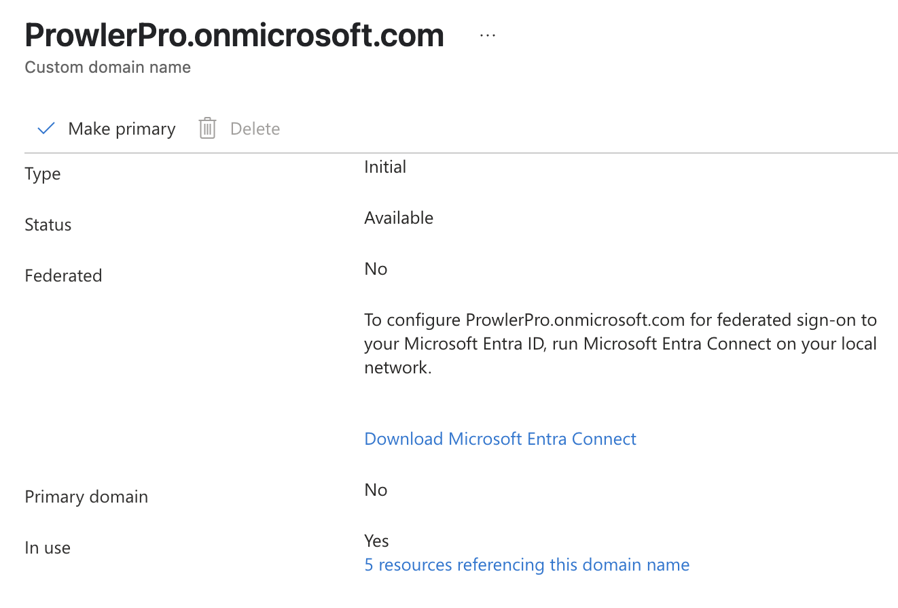
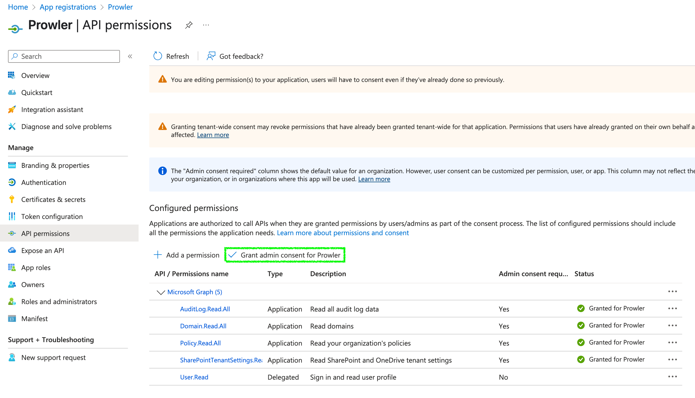

# Getting Started with M365 on Prowler Cloud

Set up your M365 account to enable security scanning using Prowler Cloud.

## Requirements

To configure your M365 account, you’ll need:

1. Obtain your `Default Domain` from the Entra ID portal.

2. Access Prowler Cloud and add a new cloud provider `Microsoft 365`.

3. Configure your M365 account:

    3.1 Create the Service Principal app.

    3.2 Grant the required API permissions.

    3.3 Assign the required roles to your user.

    3.4 Retrieve your encrypted password.

4. Add the credentials to Prowler Cloud.

## Step 1: Obtain your Domain

Go to the Entra ID portal, then you can search for `Domain` or go to Identity > Settings > Domain Names.


<br>


Once you are there just look for the `Default Domain` this should be something similar to `YourCompany.onmicrosoft.com`. To ensure that you are picking the correct domain just click on it and verify that the type is `Initial` and you can't delete it.



---

## Step 2: Access Prowler Cloud

1. Go to [Prowler Cloud](https://cloud.prowler.com/)
2. Navigate to `Configuration` > `Cloud Providers`

    

3. Click on `Add Cloud Provider`

    

4. Select `Microsoft 365`

    

5. Add the Domain ID and an optional alias, then click `Next`

    

---

## Step 3: Configure your M365 account


### Create the Service Principal app

A Service Principal is required to grant Prowler the necessary privileges.

1. Access **Microsoft Entra ID**

    

2. Navigate to `Applications` > `App registrations`

    

3. Click `+ New registration`, complete the form, and click `Register`

    

4. Go to `Certificates & secrets` > `+ New client secret`

    

5. Fill in the required fields and click `Add`, then copy the generated value (that value will be `AZURE_CLIENT_SECRET`)

    

With this done you will have all the needed keys, summarized in the following table

| Value | Description |
|-------|-------------|
| Client ID | Application (client) ID |
| Client Secret | AZURE_CLIENT_SECRET |
| Tenant ID | Directory (tenant) ID |

---

### Grant required API permissions

Assign the following Microsoft Graph permissions:

- `Directory.Read.All`: Required for all services.
- `Policy.Read.All`: Required for all services.
- `User.Read` (IMPORTANT: this is set as **delegated**): Required for the sign-in.
- `Sites.Read.All`: Required for SharePoint service.
- `SharePointTenantSettings.Read.All`: Required for SharePoint service.

Follow these steps to assign the permissions:

1. Go to your App Registration > Select your Prowler App created before > click on `API permissions`

    

2. Click `+ Add a permission` > `Microsoft Graph` > `Application permissions`

    

3. Search and select every permission below and once all are selected click on `Add permissions`:

    - `Directory.Read.All`
    - `Policy.Read.All`
    - `Sites.Read.All`
    - `SharePointTenantSettings.Read.All`

    

4. Click `Add permissions`, then grant admin consent

    

5. Click `+ Add a permission` > `Microsoft Graph` > `Delegated permissions`

    

6. Search and select:

    - `User.Read`

    

7. Click `Add permissions`, then grant admin consent

    

---

### Assign required roles to your user

Assign one of the following roles to your User:

- `Global Reader` (recommended): this allows you to read all roles needed.
- `Exchange Administrator` and `Teams Administrator`: user needs both roles but with this [roles](https://learn.microsoft.com/en-us/exchange/permissions-exo/permissions-exo#microsoft-365-permissions-in-exchange-online) you can access to the same information as a Global Reader (here you only read so that's why we recomend that role).

Follow these steps to assign the role:

1. Go to Users > All Users > Click on the email for the user you will use

    

2. Click `Assigned Roles`

    

3. Click on `Add assignments`, then search and select:

    - `Global Reader` This is the recommended, if you want to use the others just search for them

    

4. Click on next, then assign the role as `Active`, and click on `Assign` to grant admin consent

    

---

### Get your encrypted password

For this step you will need to use PowerShell, here you will have to create your Encrypted Password based on the password of the User that you are going to use. For more information about how to generate this Password go [here](../../getting-started/requirements.md#service-principal-and-user-credentials-authentication-recommended) and see how to obtain `M365_ENCRYPTED_PASSWORD`.

The general PowerShell command to generate that Password is the following but there are some things to take into account before doing this so please read the documentation from the previous link before doing this.

```console
$securePassword = ConvertTo-SecureString "examplepassword" -AsPlainText -Force
$encryptedPassword = $securePassword | ConvertFrom-SecureString
Write-Output $encryptedPassword
6500780061006d0070006c006500700061007300730077006f0072006400
```

---

## Step 4: Add credentials to Prowler Cloud

1. Go to your App Registration overview and copy the `Client ID` and `Tenant ID`

    

2. Go to Prowler Cloud and paste:

    - `Client ID`
    - `Tenant ID`
    - `AZURE_CLIENT_SECRET` from earlier
    - `M365_USER` your user using the default domain, more info [here](../../getting-started/requirements.md#service-principal-and-user-credentials-authentication-recommended)
    - `M365_ENCRYPTED_PASSWORD` generated before

    

3. Click `Next`

    

4. Click `Launch Scan`

    
