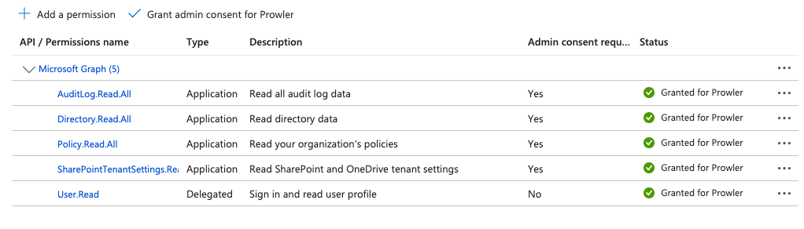

# Getting Started with M365 on Prowler Cloud/App

Set up your M365 account to enable security scanning using Prowler Cloud/App.

## Requirements

To configure your M365 account, you'll need:

1. Obtain a domain from the Entra ID portal.

2. Access Prowler Cloud/App and add a new cloud provider `Microsoft 365`.

3. Configure your M365 account:

    3.1 Create the Service Principal app.

    3.2 Grant the required API permissions.

    3.3 Assign the required roles to your user.

4. Add the credentials to Prowler Cloud/App.

## Step 1: Obtain your Domain

Go to the Entra ID portal, then you can search for `Domain` or go to Identity > Settings > Domain Names.

 

Once you are there just select the domain you want to use.

---

## Step 2: Access Prowler Cloud/App

1. Go to [Prowler Cloud](https://cloud.prowler.com/) or launch [Prowler App](../prowler-app.md)
2. Navigate to `Configuration` > `Cloud Providers`

    

3. Click on `Add Cloud Provider`

    

4. Select `Microsoft 365`

    

5. Add the Domain ID and an optional alias, then click `Next`

    

---

## Step 3: Configure your M365 account

### Create the Service Principal app

A Service Principal is required to grant Prowler the necessary privileges.

1. Access **Microsoft Entra ID**

    

2. Navigate to `Applications` > `App registrations`

    

3. Click `+ New registration`, complete the form, and click `Register`

    

4. Go to `Certificates & secrets` > `Client secrets` > `+ New client secret`

    

5. Fill in the required fields and click `Add`, then copy the generated `value` (that value will be `AZURE_CLIENT_SECRET`)

    

With this done you will have all the needed keys, summarized in the following table

| Value | Description |
|-------|-------------|
| Client ID | Application (client) ID |
| Client Secret | AZURE_CLIENT_SECRET |
| Tenant ID | Directory (tenant) ID |

---

### Grant required API permissions

Assign the following Microsoft Graph permissions:
- `AuditLog.Read.All`: Required for Entra service.
- `Domain.Read.All`: Required for all services.
- `Policy.Read.All`: Required for all services.
- `SharePointTenantSettings.Read.All`: Required for SharePoint service.
- `User.Read` (IMPORTANT: this is set as **delegated**): Required for the sign-in.

Follow these steps to assign the permissions:

1. Go to your App Registration > Select your Prowler App created before > click on `API permissions`

    

2. Click `+ Add a permission` > `Microsoft Graph` > `Application permissions`

    

3. Search and select every permission below and once all are selected click on `Add permissions`:
    - `AuditLog.Read.All`: Required for Entra service.
    - `Domain.Read.All`
    - `Organization.Read.All`
    - `Policy.Read.All`
    - `SharePointTenantSettings.Read.All`

    

    

4. Click `+ Add a permission` > `Microsoft Graph` > `Delegated permissions`

    

5. Search and select:

    - `User.Read`

    

6. Click `Add permissions`, then **grant admin consent**

    

    The final result of permission assignment should be this:

    

---

### Assign required roles to your user

Assign one of the following roles to your User:

- `Global Reader` (recommended): this allows you to read all roles needed.
- `Exchange Administrator` and `Teams Administrator`: user needs both roles but with this [roles](https://learn.microsoft.com/en-us/exchange/permissions-exo/permissions-exo#microsoft-365-permissions-in-exchange-online) you can access to the same information as a Global Reader (here you only read so that's why we recomend that role).

Follow these steps to assign the role:

1. Go to Users > All Users > Click on the email for the user you will use

    

2. Click `Assigned Roles`

    

3. Click on `Add assignments`, then search and select:

    - `Global Reader` This is the recommended, if you want to use the others just search for them

    

4. Click on next, then assign the role as `Active`, and click on `Assign` to grant admin consent

    

---

## Step 4: Add credentials to Prowler Cloud/App

1. Go to your App Registration overview and copy the `Client ID` and `Tenant ID`

    

2. Go to Prowler Cloud/App and paste:

    - `Client ID`
    - `Tenant ID`
    - `AZURE_CLIENT_SECRET` from earlier
    - `M365_USER` the user using the correct assigned domain, more info [here](../../getting-started/requirements.md#service-principal-and-user-credentials-authentication-recommended)
    - `M365_PASSWORD` the password of the user

    

3. Click `Next`

    

4. Click `Launch Scan`

    
