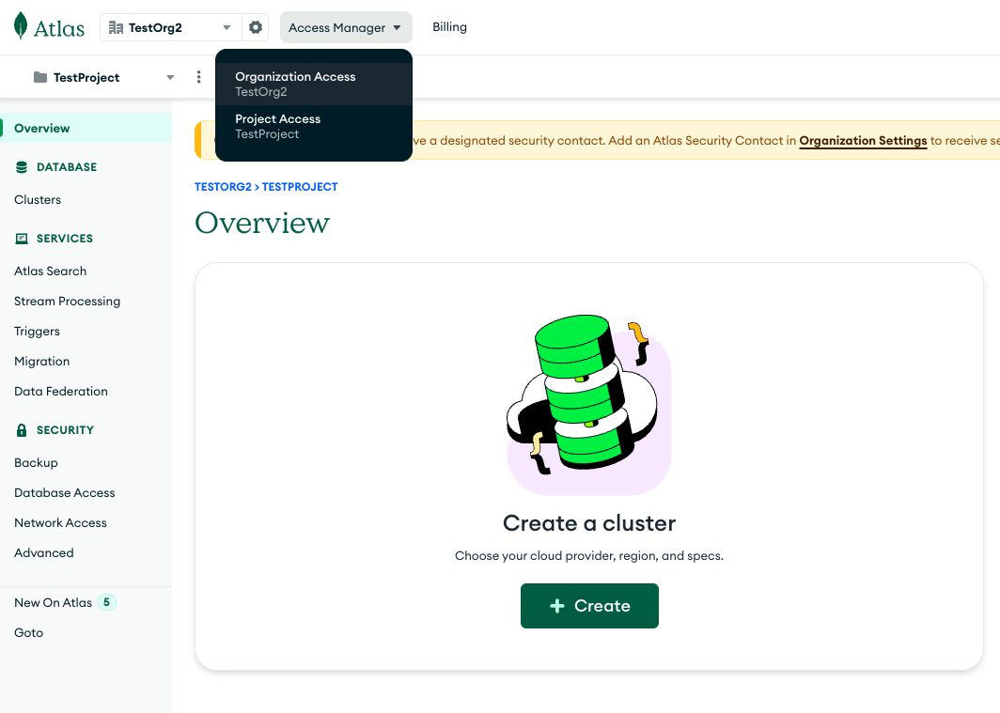
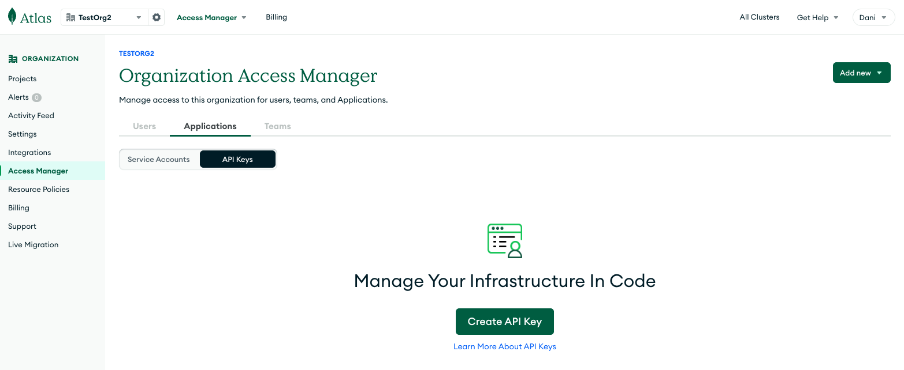
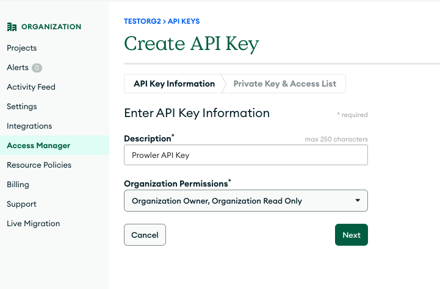
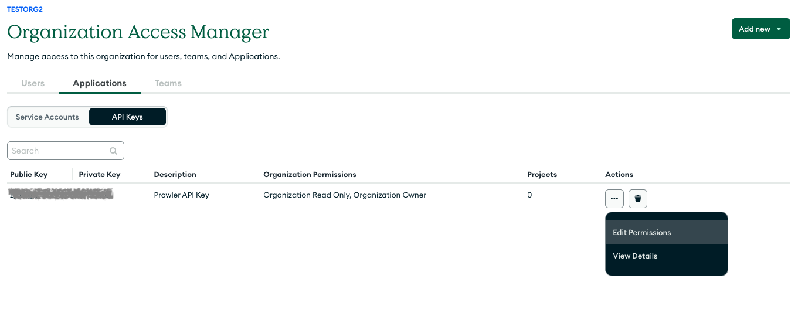
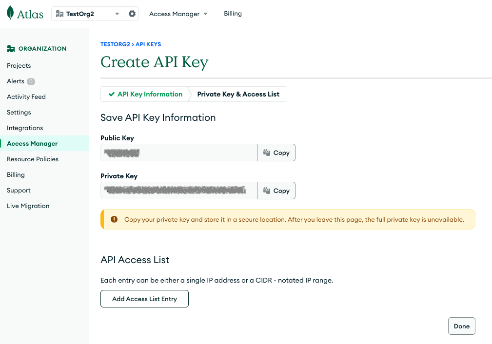

# Getting Started with MongoDB Atlas

MongoDB Atlas provider enables security assessments of MongoDB Atlas cloud database deployments.

## Features

- **Authentication**: Supports MongoDB Atlas API key authentication
- **Services**: Projects and clusters services
- **Checks**: Network access security and encryption at rest validation

## Creating API Keys

To create MongoDB Atlas API keys:

1. **Log into MongoDB Atlas**: Access the MongoDB Atlas console
2. **Navigate to Access Manager**: Go to the organization access management section:

    - Click on Access Manager and Organization Access:

        

    - After that click on the Applications tab inside the Access Manager:

        

3. **Select API Keys Tab**: Click on the "API Keys" tab that appears in the image above

4. **Create API Key**: Click "Create API Key" and provide a description

    

5. **Set Permissions**: Project permissions are recommended for security, you can modify them after creating the key

    

6. **Save Credentials**: Note the public key and private key and store them securely

    

## Basic Usage

### Scan All Projects and Clusters

After storing your API keys, you can run Prowler with the following command:

```bash
prowler mongodbatlas --atlas-public-key <key> --atlas-private-key <secret>
```

Also, you can set your API keys as environment variables:

```bash
export ATLAS_PUBLIC_KEY=<key>
export ATLAS_PRIVATE_KEY=<secret>
```

And then just run Prowler with the following command:

```bash
prowler mongodbatlas
```

### Scanning a Specific Project

If you want to scan a specific project, you can use the following argument added to the command above:

```bash
prowler mongodbatlas --atlas-project-id <project-id>
```

### Needed Permissions

MongoDB Atlas API keys require appropriate permissions to perform security checks:

- **Organization Read Only**: Provides read-only access to everything in the organization, including all projects in the organization.
    - If you want to be able to [audit the Auditing configuration for the project](https://www.mongodb.com/docs/api/doc/atlas-admin-api-v2/group/endpoint-auditing), **Organization Owner** is needed.
