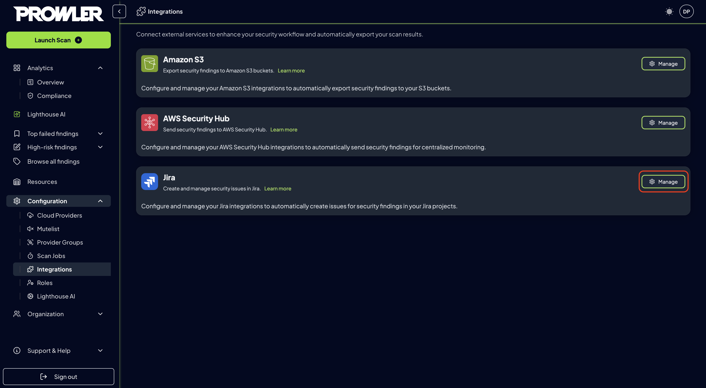
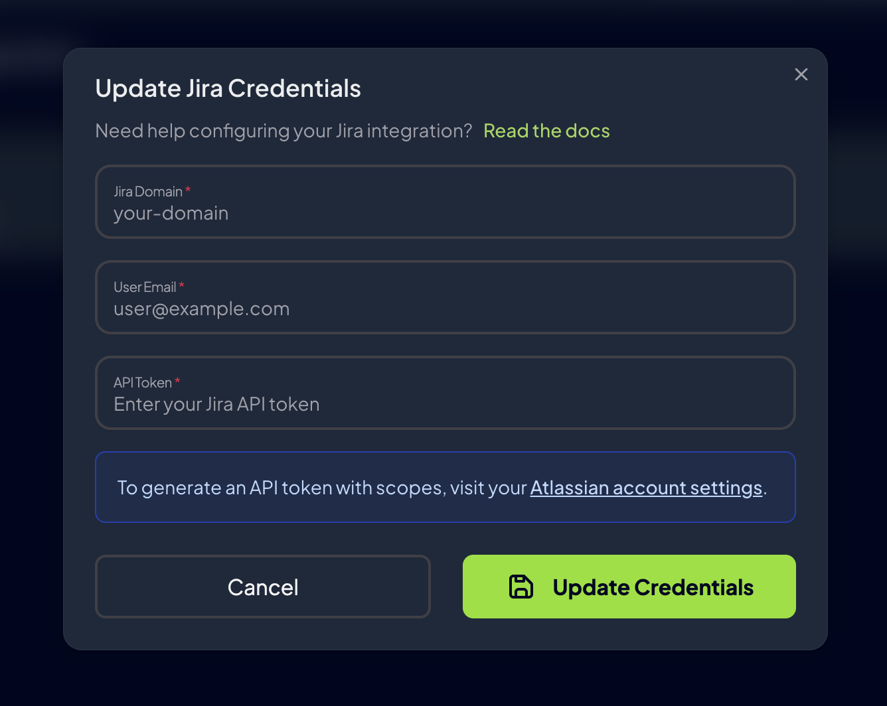
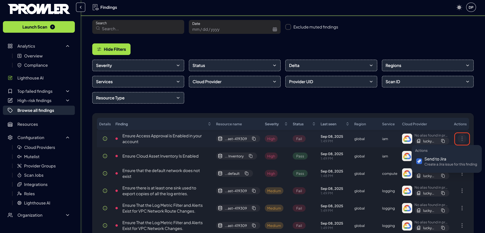

# Jira Integration

Prowler App enables automatic export of security findings to Jira, providing seamless integration with Atlassian's issue tracking and project management platform. This comprehensive guide demonstrates how to configure and manage Jira integrations to streamline security incident management and enhance team collaboration across security workflows.

Integrating Prowler App with Jira provides:

* **Streamlined incident management:** Convert security findings directly into actionable Jira issues
* **Enhanced team collaboration:** Leverage existing project management workflows for security remediation
* **Automated ticket creation:** Reduce manual effort in tracking and assigning security issues

## How It Works

When enabled and configured:

1. Security findings can be manually sent to Jira from the Findings table
2. Each finding creates a corresponding Jira issue with detailed information
3. Issues are populated with all the metadata from the finding

## Configuration

To configure Jira integration in Prowler App:

1. Navigate to **Integrations** in the Prowler App interface
2. Locate the **Jira** card and click **Manage**, then select **Add integration**

    

3. Complete the integration settings:

### Connection Settings

* **Jira domain:** Enter the Jira domain (e.g., from `https://your-domain.atlassian.net` -> `your-domain`)
* **Email:** Your Jira account email
* **API Token:** API token with the following scopes: `read:jira-user`, `read:jira-work`, `write:jira-work` [How to generate an API token](https://id.atlassian.com/manage-profile/security/api-tokens)

    

Once configured successfully, the integration is ready to send findings to Jira.

## Sending Findings to Jira

### Manual Export

To manually send individual findings to Jira:

1. Navigate to the **Findings** section in Prowler App
2. Select one finding you want to export
3. Click the action button on the table row and select **Send to Jira**
4. Select the Jira integration and project
5. Click **Send to Jira**

    

## Integration Status

Monitor and manage your Jira integrations through the management interface:

1. Review configured integrations in the integrations dashboard
2. Each integration displays:

    - **Connection Status:** Connected or Disconnected indicator
    - **Instance Information:** Jira domain and last checked timestamp

### Actions

Each Jira integration provides management actions through dedicated buttons:

| Button | Purpose | Available Actions | Notes |
|--------|---------|------------------|-------|
| **Test** | Verify integration connectivity | • Test Jira API access • Validate credentials • Check project permissions • Verify issue creation capability | Results displayed in notification message |
| **Credentials** | Update authentication settings | • Change API token • Update email • Update Jira domain | Click "Update Credentials" to save changes |
| **Enable/Disable** | Toggle integration status | • Enable or disable integration | Status change takes effect immediately |
| **Delete** | Remove integration permanently | • Permanently delete integration • Remove all configuration data | ⚠️ **Cannot be undone** - confirm before deleting |

## Troubleshooting

**Connection test fails:**

- Verify Jira instance domain is correct and accessible
- Confirm API token or credentials are valid
- Ensure API access is enabled in Jira settings and the needed scopes are granted
