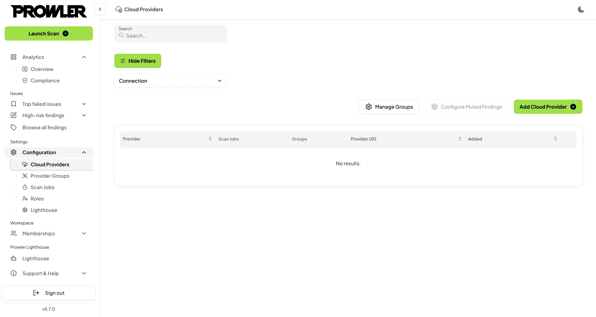
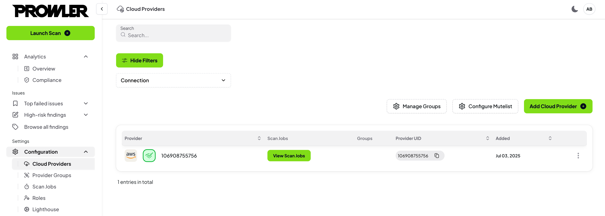
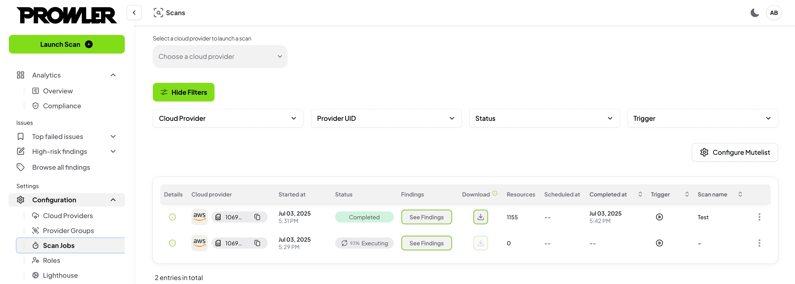
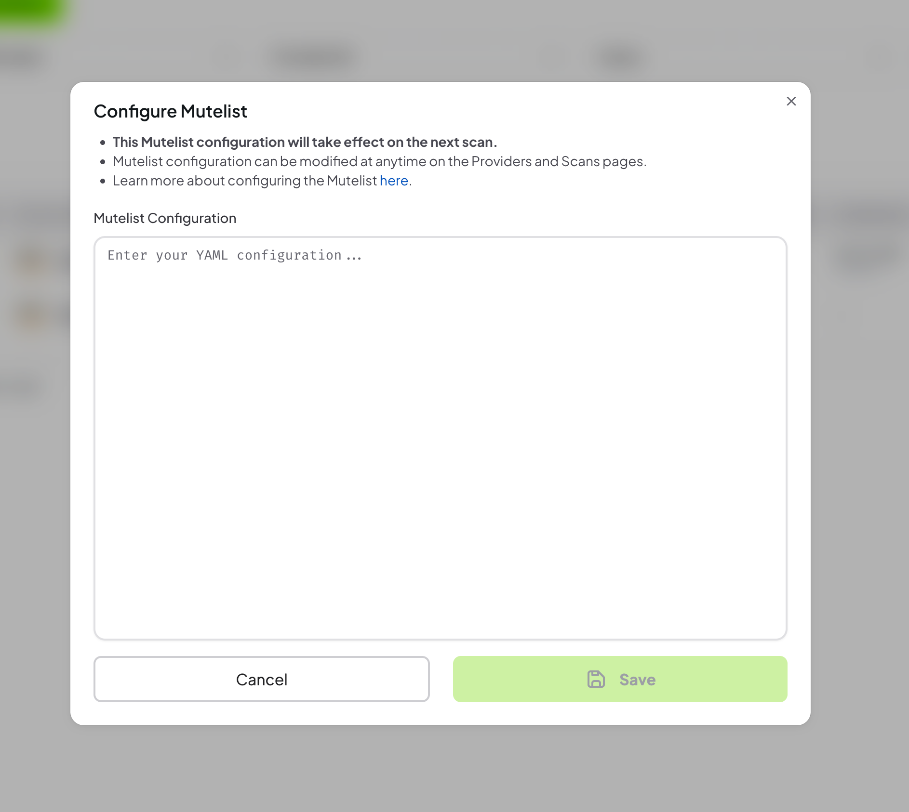
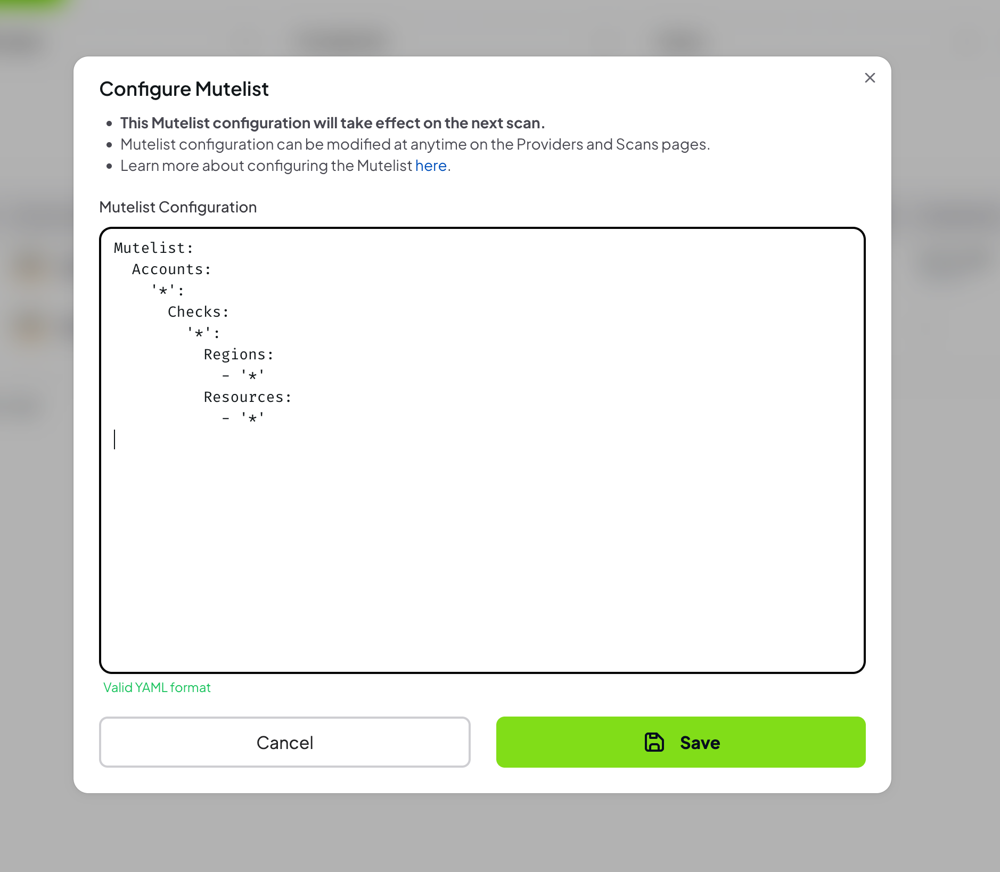
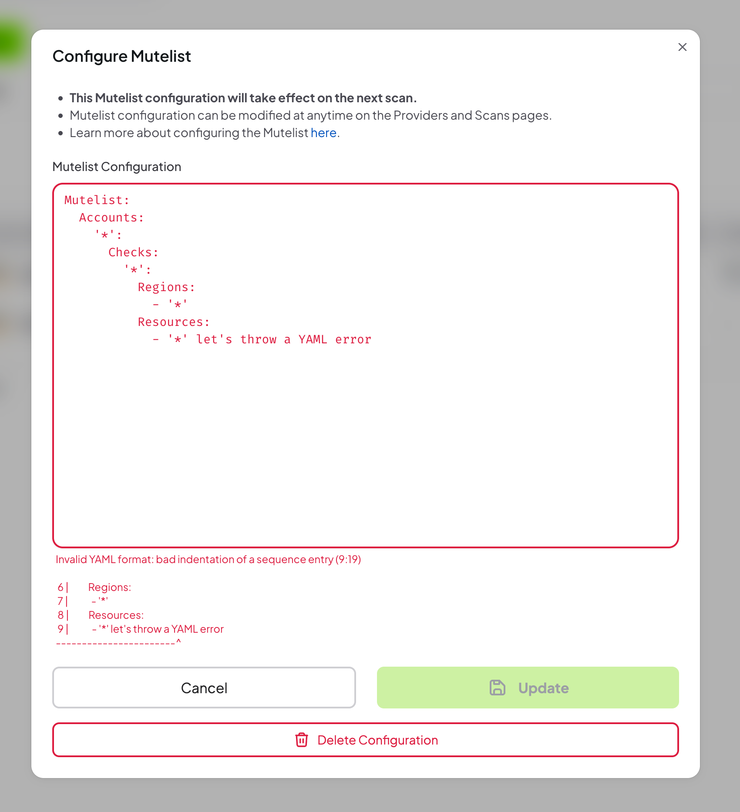
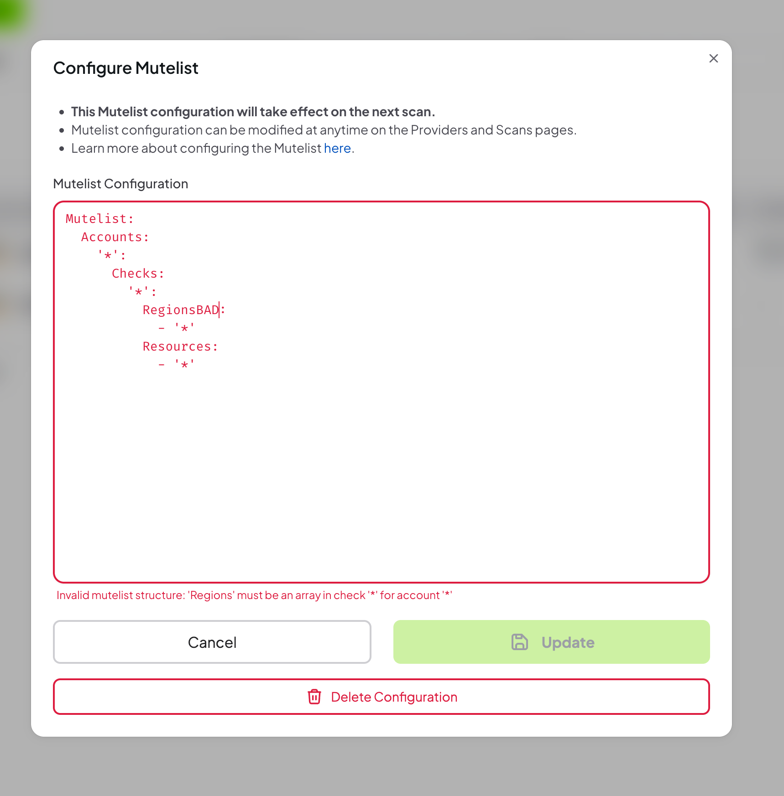
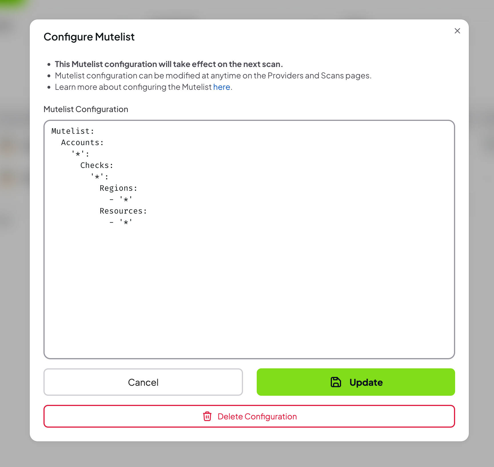
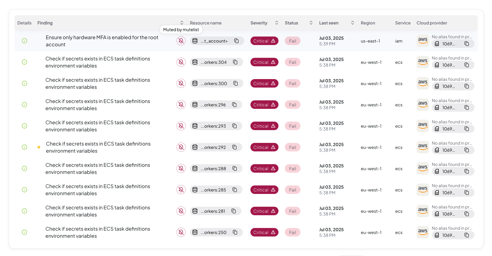

<!-- Crea 8 steps -->

# Mute Findings (Mutelist)

Prowler App allows users to mute specific findings to focus on the most critical security issues. This comprehensive guide demonstrates how to effectively use the mutelist feature to manage and prioritize security findings.

## What Is the Mutelist Feature?

The mutelist feature enables users to:
* **Suppress specific findings** from appearing in future scans
* **Focus on critical issues** by hiding resolved or accepted risks
* **Maintain audit trails** of muted findings for compliance purposes
* **Streamline security workflows** by reducing noise from non-critical findings

## Prerequisites

Before muting findings, ensure:
* Valid access to Prowler App with appropriate permissions
* A provider added to the Prowler App
* Understanding of the security implications of muting specific findings

**Warning:** Muting findings does not resolve underlying security issues. Review each finding carefully before muting to ensure it represents an acceptable risk or has been properly addressed.

## Step 1: Add a provider

To configure mutelist:

1. Log into Prowler App
2. Navigate to the providers page

3. Add a provider, then "Configure Muted Findings" button will be enabled in providers page and scans page

## Step 2: Configure Muting Parameters

1. Open the modal by clicking "Configure Muted Findings" button

2. Provide a valid YAML configuration (more information in [Mutelist](../tutorials/mutelist.md))

If the YAML configuration is invalid, an error message will be displayed

## Step 3: Review the muted findings

1. Once added, the cofiguration can be removed or updated

## Step 4: Check muted findings in the scan results

1. Run a new scan
2. Check the muted findings in the scan results
