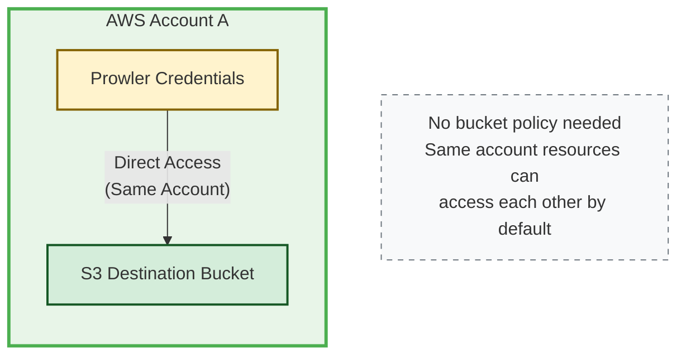
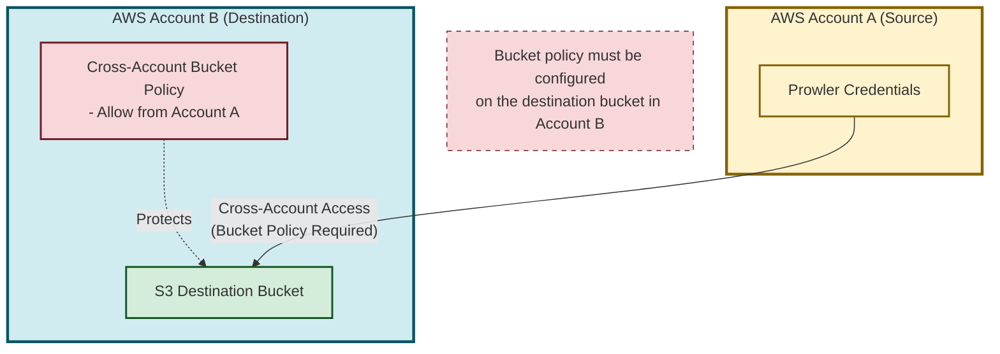
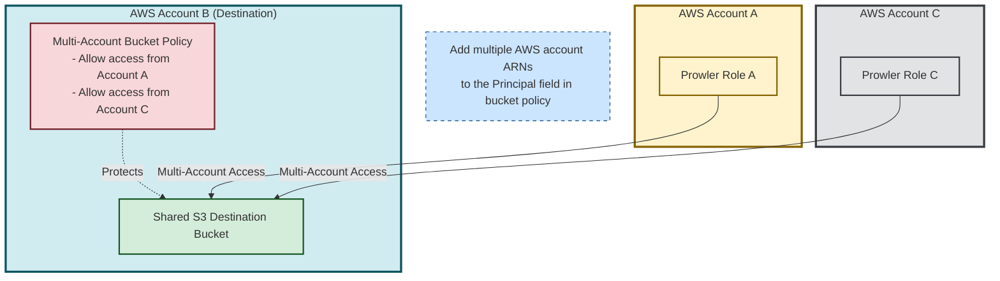

# Amazon S3 Integration

**Prowler App** allows users to automatically export scan results to Amazon S3 buckets, enabling seamless integration with existing data workflows and storage infrastructure. This comprehensive guide demonstrates how to configure and manage Amazon S3 integrations to streamline security finding management and reporting.

When enabled and configured, scan results will be automatically stored in your chosen bucket. Results are provided in the `csv`, `html` and `json-ocsf`, offering flexibility for custom integrations:

<!-- TODO: remove the comment once the AWS Security Hub integration is completed -->
<!-- - json-asff -->
<!--
???+ note
    The `json-asff` file will be only present in your configured Amazon S3 Bucket if you have the AWS Security Hub integration enabled. You can get more information about that integration here. -->

???+ note
    Take into account that enabling this integration will incur in costs in Amazon S3, please refer to its [pricing here](https://aws.amazon.com/s3/pricing/) for more information.


The Amazon S3 Integration enables users to:

- **Automate scan result exports** to designated S3 buckets after each scan

- **Configure separate bucket destinations** for different cloud providers or use cases

- **Customize export paths** within buckets for organized storage

- **Support multiple authentication methods** including IAM roles and static credentials

- **Verify connection reliability** through built-in connection testing

- **Manage integrations independently** with separate configuration and credential controls

???+ info "Prerequisites"
    Before configuring S3 Integration, ensure you have:

    - A user with a Role that has `MANAGE_INTEGRATIONS` permission
    - At least one cloud provider configured
    - Access to an Amazon S3 bucket with proper write permissions
    - AWS credentials with S3 write permissions (or IAM role configuration)

## Required Permissions

Before configuring the Amazon S3 Integration, ensure the AWS credentials, and optionally the IAM Role, used for S3 access have the necessary permissions to write scan results to the designated S3 bucket. This applies whether using static credentials, session credentials, or an IAM role (either self-created or generated using [Prowler's permissions templates](#available-templates)).

### IAM Policy

The S3 integration requires the following permissions. Add these to your IAM role policy, or ensure your AWS credentials have these permissions:

```json title="s3:DeleteObject"
{
    "Version": "2012-10-17",
    "Statement": [
        {
            "Condition": {
                "StringEquals": {
                    "s3:ResourceAccount": "<BUCKET AWS ACCOUNT NUMBER>"
                }
            },
            "Action": [
                "s3:DeleteObject"
            ],
            "Resource": [
                "arn:aws:s3:::<BUCKET NAME>/*test-prowler-connection.txt"
            ],
            "Effect": "Allow"
        }
    ]
}
```

???+ note
    The delete object permission is required for connection testing. When you test the S3 integration, Prowler creates a temporary beacon file (`test-prowler-connection.txt`) to verify write permissions, then deletes it to confirm the connection is working properly.

```json title="s3:PutObject"
{
    "Version": "2012-10-17",
    "Statement": [
        {
            "Condition": {
                "StringEquals": {
                    "s3:ResourceAccount": "<BUCKET AWS ACCOUNT NUMBER>"
                }
            },
            "Action": [
                "s3:PutObject"
            ],
            "Resource": [
                "arn:aws:s3:::<BUCKET NAME>/*"
            ],
            "Effect": "Allow"
        }
    ]
}
```

```json title="s3:GetBucketLocation"
{
    "Version": "2012-10-17",
    "Statement": [
        {
            "Condition": {
                "StringEquals": {
                    "s3:ResourceAccount": "<BUCKET AWS ACCOUNT NUMBER>"
                }
            },
            "Action": [
                "s3:GetBucketLocation"
            ],
            "Resource": [
                "arn:aws:s3:::<BUCKET NAME>"
            ],
            "Effect": "Allow"
        }
    ]
}
```

???+ note
    Replace `<BUCKET AWS ACCOUNT NUMBER>` with the AWS account ID that owns the destination S3 bucket, and `<BUCKET NAME>` with the actual bucket name.

### Cross-Account S3 Bucket Policy

If your S3 destination bucket is in a different AWS account than the one providing the credentials for S3 access, you must also configure a bucket policy on the destination bucket to allow cross-account access.

The following diagrams illustrate the three common S3 integration scenarios:

##### Same Account Setup (No Bucket Policy Required)

When both the Prowler credentials and destination S3 bucket are in the same AWS account, no additional bucket policy is required.



##### Cross-Account Setup (Bucket Policy Required)

When the S3 bucket is in a different AWS account, you must configure a bucket policy to allow cross-account access.



##### Multi-Account Setup (Multiple Principals in Bucket Policy)

When multiple AWS accounts need to write to the same destination bucket, configure the bucket policy with multiple principals.



#### S3 Bucket Policy

Apply the following bucket policy to your destination S3 bucket:

```json
{
  "Version": "2012-10-17",
  "Statement": [
      {
          "Effect": "Allow",
          "Principal": {
              "AWS": "arn:aws:iam::<SOURCE ACCOUNT ID>:role/ProwlerScan"
          },
          "Action": "s3:PutObject",
          "Resource": "arn:aws:s3:::<BUCKET NAME>/*"
      },
      {
          "Effect": "Allow",
          "Principal": {
              "AWS": "arn:aws:iam::<SOURCE ACCOUNT ID>:role/ProwlerScan"
          },
          "Action": "s3:DeleteObject",
          "Resource": "arn:aws:s3:::<BUCKET NAME>/*test-prowler-connection.txt"
      },
       {
          "Effect": "Allow",
          "Principal": {
              "AWS": "arn:aws:iam::<SOURCE ACCOUNT ID>:role/ProwlerScan"
          },
          "Action": "s3:GetBucketLocation",
          "Resource": "arn:aws:s3:::<BUCKET NAME>"
      }
  ]
}
```

???+ note
    Replace `<SOURCE ACCOUNT ID>` with the AWS account ID that contains your IAM role and `<BUCKET NAME>` with your destination bucket name. The role name `ProwlerScan` is the default name when using Prowler's permissions templates. If you're using your own IAM role or different authentication method, replace `ProwlerScan` with your actual role name.

##### Multi-Account Configuration

For multiple AWS accounts, change the `Principal` field to an array:

```json
"Principal": {
    "AWS": [
        "arn:aws:iam::<ACCOUNT-1>:role/ProwlerScan",
        "arn:aws:iam::<ACCOUNT-2>:role/ProwlerScan"
    ]
}
```

???+ note
    Replace `ProwlerScan` with your actual role name if using custom IAM roles.

### Available Templates

**Prowler App** provides Infrastructure as Code (IaC) templates to automate IAM role setup with S3 integration permissions.

???+ note
    Templates are optional. You can use your own IAM roles or static credentials.

Choose from the following deployment options:

- [CloudFormation](https://prowler-cloud-public.s3.eu-west-1.amazonaws.com/permissions/templates/aws/cloudformation/prowler-scan-role-with-s3-integration.yml)
- [Terraform](https://github.com/prowler-cloud/prowler/tree/master/permissions/templates/terraform)

#### CloudFormation

##### AWS CLI Deployment

If you're using Prowler's CloudFormation template, execute the following command to update the existing ProwlerScan stack:

```bash
aws cloudformation update-stack \
  --capabilities CAPABILITY_IAM --capabilities CAPABILITY_NAMED_IAM \
  --stack-name "ProwlerScan" \
  --template-url "https://prowler-cloud-public.s3.eu-west-1.amazonaws.com/permissions/templates/aws/cloudformation/prowler-scan-role-with-s3-integration.yml" \
  --parameters \
      ParameterKey=ExternalID,ParameterValue="your-external-id" \
      ParameterKey=S3IntegrationBucketName,ParameterValue="your-bucket-name" \
      ParameterKey=S3IntegrationBucketAccount,ParameterValue="your-bucket-aws-account-id-owner"
```

##### AWS Console Deployment

1. Navigate to CloudFormation service
2. Select "ProwlerScan" stack and click "Update"
3. Replace template with the new template file
4. Configure parameters:
    - `ExternalID`: Keep existing value
    - `S3IntegrationBucketName`: Your bucket name
    - `S3IntegrationBucketAccount`: Bucket owner's AWS account ID
5. Click "Update stack"

#### Terraform

1. Download from [GitHub repository](https://github.com/prowler-cloud/prowler/tree/master/permissions/templates/terraform)
2. Run Terraform commands:

```bash
terraform init
terraform plan \
  -var="external_id=your-external-id-here" \
  -var="enable_s3_integration=true" \
  -var="s3_integration_bucket_name=your-s3-bucket-name" \
  -var="s3_integration_bucket_account=123456789012"
terraform apply \
  -var="external_id=your-external-id-here" \
  -var="enable_s3_integration=true" \
  -var="s3_integration_bucket_name=your-s3-bucket-name" \
  -var="s3_integration_bucket_account=123456789012"
```

???+ info
    For detailed information about deploying the Terraform stack for Amazon S3 integration, refer to the [Terraform README](https://github.com/prowler-cloud/prowler/blob/master/permissions/templates/terraform/README.md).

---

## Configuration

Once you have set up the required permissions, you can proceed to configure the S3 integration in **Prowler App**.

1. Navigate to "Integrations"
    
2. Locate the Amazon S3 Integration card on the integrations page
3. Click on the "Configure" button on the S3 integration card to access the dedicated management page
    
4. Click the "Add Integration" button
    
5. Complete the configuration form with the following details:

    - **Cloud Providers:** Select the providers whose scan results should be exported to this S3 bucket
    - **Bucket Name:** Enter the name of your target S3 bucket (e.g., `my-security-findings-bucket`)
    - **Output Directory:** Specify the directory path within the bucket (e.g., `/prowler-findings/`, defaults to `output`)

    

6. Click "Next" to configure credentials
7. Configure AWS authentication using one of the supported methods:

    - **AWS SDK Default:** Use default AWS credentials from the environment. For Prowler Cloud users, this is the recommended option as the service has AWS credentials to assume IAM roles with ARNs matching `arn:aws:iam::*:role/Prowler*` or `arn:aws:iam::*:role/prowler*`
    - **Access Keys:** Provide AWS access key ID and secret access key
    - **IAM Role (optional):** Specify the IAM Role ARN, external ID, and optional session parameters

    

8. Optional - For IAM role authentication, complete the required fields:

    - **Role ARN:** The Amazon Resource Name of the IAM role
    - **External ID:** Unique identifier for additional security (defaults to Tenant/Organization ID) - mandatory and automatically filled
    - **Role Session Name:** Optional - name for the assumed role session
    - **Session Duration:** Optional - duration in seconds for the session

9. Click "Test and Create Integration" to verify the connection and complete the setup

???+ success
    Once your credentials are configured and the connection test passes, your S3 integration will be active. Scan results will automatically be exported to your specified bucket after each scan completes. Run a new scan and check your S3 bucket to verify the integration is working.

???+ note
    Scan outputs are processed after scan completion. Depending on scan size and network conditions, exports may take a few minutes to appear in your S3 bucket.
---


### Integration Status

Once your integration is active, you can monitor its status and make adjustments as needed through the integrations management interface.

1. Review configured integrations in the management interface
2. Each integration displays:

    - **Connection Status:** Connected or Disconnected indicator
    - **Bucket Information:** Bucket name and output directory
    - **Last Checked:** Timestamp of the most recent connection test

    

#### Actions


Each S3 integration provides several management actions accessible through dedicated buttons:

| Button | Purpose | Available Actions | Notes |
|--------|---------|------------------|-------|
| **Test** | Verify integration connectivity | • Test AWS credential validity<br/>• Check S3 bucket accessibility<br/>• Verify write permissions<br/>• Validate connection setup | Results displayed in notification message |
| **Config** | Modify integration settings | • Update selected cloud providers<br/>• Change bucket name<br/>• Modify output directory path | Click "Update Configuration" to save changes |
| **Credentials** | Update authentication settings | • Modify AWS access keys<br/>• Update IAM role configuration<br/>• Change authentication method | Click "Update Credentials" to save changes |
| **Enable/Disable** | Toggle integration status | • Enable integration to start exporting results<br/>• Disable integration to pause exports | Status change takes effect immediately |
| **Delete** | Remove integration permanently | • Permanently delete integration<br/>• Remove all configuration data | ⚠️ **Cannot be undone** - confirm before deleting |

???+ tip "Management Best Practices"
    - Test your integration after any configuration changes
    - Use the Enable/Disable toggle for temporary changes instead of deleting
    - Regularly verify connection status to ensure continuous export functionality

---

## Understanding S3 Export Structure

When the S3 integration is enabled and a scan completes, Prowler automatically creates an organized folder structure in your destination bucket to store the scan results.

### Default Output Structure

Prowler creates a folder inside your specified bucket path (using `output` as the default folder name) with subfolders for each output format:

```
output/
├── csv/
│   ├── prowler-output-{provider-uid}-{timestamp}.csv
│   └── prowler-output-111122223333-20250805120000.csv
├── html/
│   ├── prowler-output-{provider-uid}-{timestamp}.html
│   └── prowler-output-111122223333-20250805120000.html
├── json/
│   ├── prowler-output-{provider-uid}-{timestamp}.json
│   └── prowler-output-111122223333-20250805120000.json
└── json-ocsf/
    ├── prowler-output-{provider-uid}-{timestamp}.ocsf.json
    └── prowler-output-111122223333-20250805120000.ocsf.json
```


### File Naming Convention

Scan result files follow a consistent naming pattern:

```
prowler-output-{provider-uid}-{timestamp}.{extension}
```

- `prowler-output`: Fixed prefix identifying Prowler scan results
- `{provider-uid}`: Account identifier (AWS Account ID, Azure Subscription ID, etc.)
- `{timestamp}`: Scan completion time in `YYYYMMDDHHMMSS` format
- `{extension}`: File format extension (`csv`, `html`, `ocsf.json`)

For detailed information about Prowler's reporting formats, refer to the [Prowler reporting documentation](https://docs.prowler.com/projects/prowler-open-source/en/latest/tutorials/reporting/).

## Troubleshooting

**Connection test fails:**

- Check AWS credentials are valid
- Verify bucket permissions and region
- Confirm network access to S3

**No scan results in bucket:**

- Ensure integration shows "Connected"
- Check provider is associated with integration
- Verify bucket policies allow writes
