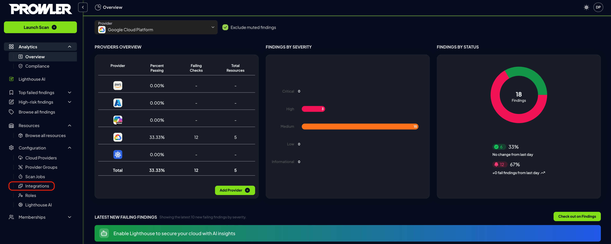

# S3 Integration (Amazon S3)

**Prowler App** allows users to automatically export scan results to Amazon S3 buckets, enabling seamless integration with existing data workflows and storage infrastructure. This comprehensive guide demonstrates how to configure and manage Amazon S3 integrations to streamline security finding management and reporting.

## What Is the S3 Integration Feature?

The S3 Integration feature enables users to:

- **Automate scan result exports** to designated S3 buckets after each scan
- **Configure multiple bucket destinations** for different providers or use cases
- **Customize export paths** within buckets for organized storage
- **Support multiple authentication methods** including IAM roles and static credentials
- **Test connection reliability** to ensure proper configuration
- **Manage integrations independently** with separate configuration and credential controls

## Prerequisites

Before configuring S3 Integration, ensure:

- A user with a Role that has `MANAGE_INTEGRATIONS`
- At least one cloud provider configured
- Access to an Amazon S3 bucket with proper write permissions
- AWS credentials (IAM role or access keys) with S3 write permissions
- Understanding of AWS IAM policies and S3 bucket permissions

???+ warning
    Ensure your AWS credentials have the minimum required permissions for S3 operations. Overly permissive credentials may pose security risks. Review AWS IAM best practices before configuring credentials.

## Step 1: Navigate to Integrations

To access S3 Integration:

1. Log into Prowler App
2. Navigate to  "Integrations"

3. The integrations page displays the available integrations

## Step 2: Access S3 Integration Management

1. Locate the Amazon S3 Integration card on the integrations page
2. Click on the "Configure" button on the S3 integration card to access the dedicated management interface

3. Review the S3 integration features and capabilities displayed on the page

## Step 3: Add New S3 Integration

### Configuration Step

1. Click the "Add Integration" button to start the configuration process

2. Complete the configuration form with the following details:
    - **Cloud Providers:** Select the providers whose scan results should be exported to this S3 bucket
    - **Bucket Name:** Enter the name of your target S3 bucket (e.g., `my-security-findings-bucket`)
    - **Output Directory:** Specify the directory path within the bucket (e.g., `/prowler-findings/`)

3. Click "Next" to proceed to the credentials step

### Credentials Step

1. Configure AWS authentication using one of the supported methods:
    - **AWS SDK Default:** Use default AWS credentials from the environment
    - **Access Keys:** Provide AWS access key ID and secret access key
    - **IAM Role (optional):** Specify role ARN, external ID, and optional session parameters

2. For IAM role authentication, complete the required fields:
    - **Role ARN:** The Amazon Resource Name of the IAM role
    - **External ID:** Unique identifier for additional security (defaults to Tenant/Organization ID)
    - **Role Session Name:** Optional name for the assumed role session
    - **Session Duration:** Optional duration in seconds for the session
3. Click "Create Integration" to complete the setup

???+ note
    When using IAM roles, ensure the role trusts the appropriate AWS account and includes the external ID condition for enhanced security.

## Step 4: Manage Existing Integrations

### View Integration Status

1. Review configured integrations in the management interface
2. Each integration displays:
    - **Connection Status:** Connected or Disconnected indicator
    - **Bucket Information:** Bucket name and output directory
    - **Last Checked:** Timestamp of the most recent connection test

### Action buttons

### Test Integration Connection

1. Click the "Test" button for any configured integration

2. The system will verify:
    - AWS credential validity
    - S3 bucket accessibility
    - Write permission verification
3. Review the test results in the notification message

### Edit Integration Configuration

1. Click the "Config" button to modify integration settings

2. Update any of the following:
    - Selected cloud providers
    - Bucket name
    - Output directory path
3. Click "Update Configuration" to save changes

### Update Integration Credentials

1. Click the "Credentials" button to modify authentication settings
2. Update AWS credentials or authentication method
3. Click "Update Credentials" to save the new authentication configuration

### Delete Integration

1. Click the "Delete" button for the integration you want to remove
2. Confirm the deletion in the modal dialog
3. The integration will be permanently removed from your configuration

???+ warning
    Deleting an integration cannot be undone. Ensure you no longer need the integration before confirming deletion.

### Enable/Disable Integration

1. Click the "Enable/Disable" button
2. The integration will be enabled or disabled accordingly

## Step 5: Verify Export Functionality

1. Run a new scan with a provider configured in the S3 integration
2. Check your S3 bucket for the exported scan results
3. Verify the files appear in the specified output directory

???+ note
    S3 exports are processed after scan completion. Depending on scan size and network conditions, exports may take a few minutes to appear in your bucket.

## Troubleshooting Common Issues

### Connection Test Failures

If connection tests fail, verify:

- **AWS Credentials:** Ensure credentials are valid and not expired
- **Bucket Permissions:** Confirm the credentials have write access to the specified bucket
- **Network Connectivity:** Check if network policies allow access to AWS S3
- **Bucket Region:** Verify the bucket exists in the expected AWS region

### Export Failures

If scan results are not appearing in S3:

- **Integration Status:** Ensure the integration shows "Connected" status
- **Provider Association:** Verify the scanned provider is associated with the S3 integration
- **Bucket Policies:** Check for bucket policies that might block writes
- **Path Permissions:** Ensure the output directory path is accessible

For additional assistance, consult the AWS documentation for S3 permissions and IAM role configuration.