# Amazon S3 Integration

**Prowler App** allows users to automatically export scan results to Amazon S3 buckets, enabling seamless integration with existing data workflows and storage infrastructure. This comprehensive guide demonstrates how to configure and manage Amazon S3 integrations to streamline security finding management and reporting.

When enabled and configured, scan results will be automatically stored in your chosen bucket. Results are provided in the following formats, offering flexibility for custom integrations:

- csv
- html
- json
- json-ocsf
<!-- TODO: remove the comment once the AWS Security Hub integration is completed -->
<!-- - json-asff -->
<!--
???+ note
    The `json-asff` file will be only present in your configured Amazon S3 Bucket if you have the AWS Security Hub integration enabled. You can get more information about that integration here. -->

???+ note
    Take into account that enabling this integration will incur in costs in Amazon S3, please refer to its [pricing here](https://aws.amazon.com/s3/pricing/) for more information.


The Amazon S3 Integration feature enables users to:

- **Automate scan result exports** to designated S3 buckets after each scan

- **Configure separate bucket destinations** for different cloud providers or use cases

- **Customize export paths** within buckets for organized storage

- **Support multiple authentication methods** including IAM roles and static credentials

- **Verify connection reliability** through built-in connection testing

- **Manage integrations independently** with separate configuration and credential controls

???+ info "Prerequisites"
    Before configuring S3 Integration, ensure you have:

    - A user with a Role that has `MANAGE_INTEGRATIONS` permission
    - At least one cloud provider configured in **Prowler App**
    - Access to an Amazon S3 bucket with proper write permissions
    - AWS credentials with S3 write permissions (or IAM role configuration)

## Required Permissions

Before configuring S3 Integration, ensure the AWS credentials, and optionally the IAM Role, used for S3 access have the necessary permissions to write scan results to the designated S3 bucket. This applies whether using static credentials, session credentials, or an IAM role (either self-created or generated using Prowler's infrastructure templates).

### IAM Policy

The S3 integration requires the following permissions. Add these to your IAM role policy, or ensure your AWS credentials have these permissions:

```json title="s3:DeleteObject"
{
    "Version": "2012-10-17",
    "Statement": [
        {
            "Condition": {
                "StringEquals": {
                    "s3:ResourceAccount": "<BUCKET AWS ACCOUNT NUMBER>"
                }
            },
            "Action": [
                "s3:DeleteObject"
            ],
            "Resource": [
                "arn:aws:s3:::<BUCKET NAME>/*test-prowler-connection.txt"
            ],
            "Effect": "Allow"
        }
    ]
}
```

???+ note
    The delete object permission is required for connection testing. When you test the S3 integration, Prowler creates a temporary beacon file (`test-prowler-connection.txt`) to verify write permissions, then deletes it to confirm the connection is working properly.

```json title="s3:PutObject"
{
    "Version": "2012-10-17",
    "Statement": [
        {
            "Condition": {
                "StringEquals": {
                    "s3:ResourceAccount": "<BUCKET AWS ACCOUNT NUMBER>"
                }
            },
            "Action": [
                "s3:PutObject"
            ],
            "Resource": [
                "arn:aws:s3:::<BUCKET NAME>/*"
            ],
            "Effect": "Allow"
        }
    ]
}
```

```json title="s3:GetBucketLocation"
{
    "Version": "2012-10-17",
    "Statement": [
        {
            "Condition": {
                "StringEquals": {
                    "s3:ResourceAccount": "<BUCKET AWS ACCOUNT NUMBER>"
                }
            },
            "Action": [
                "s3:GetBucketLocation"
            ],
            "Resource": [
                "arn:aws:s3:::<BUCKET NAME>"
            ],
            "Effect": "Allow"
        }
    ]
}
```

???+ note
    Replace `<BUCKET AWS ACCOUNT NUMBER>` with the AWS account ID that owns the destination S3 bucket, and `<BUCKET NAME>` with the actual bucket name.

### Cross-Account S3 Bucket Policy

If your S3 destination bucket is in a different AWS account than the one providing the credentials for S3 access, you must also configure a bucket policy on the destination bucket to allow cross-account access.

#### When Bucket Policy Is Required

The following diagrams illustrate the three common S3 integration scenarios:

##### Scenario 1: Same Account Setup (No Bucket Policy Required)

When both the Prowler credentials and destination S3 bucket are in the same AWS account, no additional bucket policy is required.

```mermaid
graph TB
    subgraph Account["AWS Account A"]
        direction TB
        Role["🔑 Prowler Role/Credentials<br/>- S3:PutObject ✅<br/>- S3:DeleteObject ✅<br/>- S3:GetBucketLocation ✅"]
        Bucket["🪣 S3 Destination Bucket"]

        Role -->|"✅ Direct Access<br/>(Same Account)"| Bucket
    end

    Note["📝 No bucket policy needed<br/>Same account resources can<br/>access each other by default"]

    style Account fill:#e8f5e8,stroke:#4caf50,stroke-width:3px
    style Role fill:#fff3cd,stroke:#856404,stroke-width:2px
    style Bucket fill:#d4edda,stroke:#155724,stroke-width:2px
    style Note fill:#f8f9fa,stroke:#6c757d,stroke-width:1px,stroke-dasharray: 5 5
```



##### Scenario 2: Cross-Account Setup (Bucket Policy Required)

When the S3 bucket is in a different AWS account, you must configure a bucket policy to allow cross-account access.

```mermaid
graph TB
    subgraph AccountA["AWS Account A (Source)"]
        RoleA["🔑 Prowler Role/Credentials<br/>- S3:PutObject ✅<br/>- S3:DeleteObject ✅<br/>- S3:GetBucketLocation ✅"]
    end

    subgraph AccountB["AWS Account B (Destination)"]
        BucketB["🪣 S3 Destination Bucket"]
        PolicyB["🛡️ Cross-Account Bucket Policy<br/>- Allow PutObject from Account A<br/>- Allow DeleteObject from Account A<br/>- Allow GetBucketLocation from Account A"]

        PolicyB -.->|"Protects"| BucketB
    end

    RoleA -->|"✅ Cross-Account Access<br/>(Bucket Policy Required)"| BucketB

    Warning["⚠️ Bucket policy must be configured<br/>on the destination bucket in Account B"]

    style AccountA fill:#fff3cd,stroke:#856404,stroke-width:3px
    style AccountB fill:#d1ecf1,stroke:#0c5460,stroke-width:3px
    style RoleA fill:#fff3cd,stroke:#856404,stroke-width:2px
    style BucketB fill:#d4edda,stroke:#155724,stroke-width:2px
    style PolicyB fill:#f8d7da,stroke:#721c24,stroke-width:2px
    style Warning fill:#f8d7da,stroke:#721c24,stroke-width:1px,stroke-dasharray: 5 5
```



##### Scenario 3: Multi-Account Setup (Multiple Principals in Bucket Policy)

When multiple AWS accounts need to write to the same destination bucket, configure the bucket policy with multiple principals.

```mermaid
graph TB
    subgraph AccountA["AWS Account A"]
        RoleA["🔑 Prowler Role A<br/>- S3:PutObject ✅<br/>- S3:DeleteObject ✅<br/>- S3:GetBucketLocation ✅"]
    end

    subgraph AccountC["AWS Account C"]
        RoleC["🔑 Prowler Role C<br/>- S3:PutObject ✅<br/>- S3:DeleteObject ✅<br/>- S3:GetBucketLocation ✅"]
    end

    subgraph AccountB["AWS Account B (Destination)"]
        BucketB["🪣 Shared S3 Destination Bucket"]
        PolicyB["🛡️ Multi-Account Bucket Policy<br/>- Allow access from Account A<br/>- Allow access from Account C<br/>- Multiple principals in policy"]

        PolicyB -.->|"Protects"| BucketB
    end

    RoleA -->|"✅ Multi-Account Access"| BucketB
    RoleC -->|"✅ Multi-Account Access"| BucketB

    Info["💡 Add multiple AWS account ARNs<br/>to the Principal field in bucket policy"]

    style AccountA fill:#fff3cd,stroke:#856404,stroke-width:3px
    style AccountC fill:#e2e3e5,stroke:#383d41,stroke-width:3px
    style AccountB fill:#d1ecf1,stroke:#0c5460,stroke-width:3px
    style RoleA fill:#fff3cd,stroke:#856404,stroke-width:2px
    style RoleC fill:#e2e3e5,stroke:#383d41,stroke-width:2px
    style BucketB fill:#d4edda,stroke:#155724,stroke-width:2px
    style PolicyB fill:#f8d7da,stroke:#721c24,stroke-width:2px
    style Info fill:#cce5ff,stroke:#004085,stroke-width:1px,stroke-dasharray: 5 5
```



#### Configuration Summary

- **Same account**: If the S3 bucket is in the same AWS account as your credentials, no bucket policy changes are needed
- **Different account**: If the S3 bucket is in a different AWS account, **you must add the bucket policy below**
- **Multi-account setup**: If multiple AWS accounts write to the same destination bucket, add multiple principals to the bucket policy

#### Required S3 Bucket Policy

Apply the following bucket policy to your destination S3 bucket:

```json
{
  "Version": "2012-10-17",
  "Statement": [
      {
          "Effect": "Allow",
          "Principal": {
              "AWS": "arn:aws:iam::<SOURCE ACCOUNT ID>:role/ProwlerScan"
          },
          "Action": "s3:PutObject",
          "Resource": "arn:aws:s3:::<BUCKET NAME>/*"
      },
      {
          "Effect": "Allow",
          "Principal": {
              "AWS": "arn:aws:iam::<SOURCE ACCOUNT ID>:role/ProwlerScan"
          },
          "Action": "s3:DeleteObject",
          "Resource": "arn:aws:s3:::<BUCKET NAME>/*test-prowler-connection.txt"
      },
       {
          "Effect": "Allow",
          "Principal": {
              "AWS": "arn:aws:iam::<SOURCE ACCOUNT ID>:role/ProwlerScan"
          },
          "Action": "s3:GetBucketLocation",
          "Resource": "arn:aws:s3:::<BUCKET NAME>"
      }
  ]
}
```

???+ note
    Replace `<SOURCE ACCOUNT ID>` with the AWS account ID that contains your IAM role and `<BUCKET NAME>` with your destination bucket name. The role name `ProwlerScan` is the default name when using Prowler's permissions templates. If you're using your own IAM role or different authentication method, replace `ProwlerScan` with your actual role name.

#### Multi-Account Configuration

For multi-account setups where multiple AWS accounts write to the same bucket, modify the `Principal` field to include multiple roles:

```json
{
  "Version": "2012-10-17",
  "Statement": [
      {
          "Effect": "Allow",
          "Principal": {
              "AWS": [
                  "arn:aws:iam::<ACCOUNT-1>:role/ProwlerScan",
                  "arn:aws:iam::<ACCOUNT-2>:role/ProwlerScan"
              ]
          },
          "Action": "s3:PutObject",
          "Resource": "arn:aws:s3:::<BUCKET NAME>/*"
      },
      {
          "Effect": "Allow",
          "Principal": {
              "AWS": [
                  "arn:aws:iam::<ACCOUNT-1>:role/ProwlerScan",
                  "arn:aws:iam::<ACCOUNT-2>:role/ProwlerScan"
              ]
          },
          "Action": "s3:DeleteObject",
          "Resource": "arn:aws:s3:::<BUCKET NAME>/*test-prowler-connection.txt"
      },
       {
          "Effect": "Allow",
          "Principal": {
              "AWS": [
                  "arn:aws:iam::<ACCOUNT-1>:role/ProwlerScan",
                  "arn:aws:iam::<ACCOUNT-2>:role/ProwlerScan"
              ]
          },
          "Action": "s3:GetBucketLocation",
          "Resource": "arn:aws:s3:::<BUCKET NAME>"
      }
  ]
}
```

???+ note
    In this multi-account example, both accounts use the default `ProwlerScan` role name from Prowler's templates. If using custom IAM roles, replace `ProwlerScan` with your actual role names for each account.

### Available Templates

If you prefer using IAM roles over static credentials, **Prowler App** provides Infrastructure as Code (IaC) templates to automate the required permissions setup. These templates create or update IAM roles with the necessary S3 integration permissions, and are particularly useful if you want to use Prowler's recommended role configuration.

???+ note
    These templates are optional. You can also configure S3 integration using your own IAM roles or static AWS credentials with the permissions listed above.

Choose from the following deployment options:

- [CloudFormation](https://prowler-cloud-public.s3.eu-west-1.amazonaws.com/permissions/templates/aws/cloudformation/prowler-scan-role-with-s3-integration.yml)
- [Terraform](https://github.com/prowler-cloud/prowler/tree/master/permissions/templates/terraform)

### CloudFormation

#### Method 1: AWS CLI Deployment

If you're using Prowler's CloudFormation template, execute the following command to update the existing ProwlerScan stack:

```bash
aws cloudformation update-stack \
  --capabilities CAPABILITY_IAM --capabilities CAPABILITY_NAMED_IAM \
  --stack-name "ProwlerScan" \
  --template-url "https://prowler-cloud-public.s3.eu-west-1.amazonaws.com/permissions/templates/aws/cloudformation/prowler-scan-role-with-s3-integration.yml" \
  --parameters \
      ParameterKey=ExternalID,ParameterValue="your-external-id" \
      ParameterKey=S3IntegrationBucketName,ParameterValue="your-bucket-name" \
      ParameterKey=S3IntegrationBucketAccount,ParameterValue="your-bucket-aws-account-id-owner"
```

#### Method 2: AWS Console Deployment

If you're using Prowler's CloudFormation template, update the ProwlerScan stack through the AWS Management Console:

1. **Navigate to CloudFormation service** in the AWS region where ProwlerScan stack was deployed
2. **Select the stack** named "ProwlerScan" and click "Update"

3. **Choose template replacement:**

    - Select "Replace current template"
    - Choose "Upload a template file"
    - Upload the new ProwlerScan IAM Role template

4. **Configure stack parameters:**

    - **ExternalID:** Retain the existing value
    - **S3IntegrationBucketName:** Enter the destination S3 bucket name (without folders, paths, or trailing slashes)
    - **S3IntegrationBucketAccount:** Enter the AWS account ID that owns the destination S3 bucket

5. **Review configuration:** In "Configure stack options," maintain existing settings and click "Next"

6. **Deploy updates:** Under "Review ProwlerScan," click "Update stack" to apply the changes

#### Terraform

To add the Amazon S3 integration to the ProwlerScan IAM role using Terraform:

1. Download the Terraform code from the [GitHub repository](https://github.com/prowler-cloud/prowler/tree/master/permissions/templates/terraform)

2. Execute the following Terraform commands:

```bash
terraform init
terraform plan \
  -var="external_id=your-external-id-here" \
  -var="enable_s3_integration=true" \
  -var="s3_integration_bucket_name=your-s3-bucket-name" \
  -var="s3_integration_bucket_account=123456789012"
terraform apply \
  -var="external_id=your-external-id-here" \
  -var="enable_s3_integration=true" \
  -var="s3_integration_bucket_name=your-s3-bucket-name" \
  -var="s3_integration_bucket_account=123456789012"
```

???+ info
    For detailed information about deploying the Terraform stack for Amazon S3 integration, refer to the [Terraform README](https://github.com/prowler-cloud/prowler/blob/master/permissions/templates/terraform/README.md).

---

## Configuration

Once you have set up the required permissions (either manually or using the templates above), you can proceed to configure the S3 integration in **Prowler App**.

1. Navigate to "Integrations"
    
2. Locate the Amazon S3 Integration card on the integrations page
3. Click on the "Configure" button on the S3 integration card to access the dedicated management page
    
4. Click the "Add Integration" button
    
5. Complete the configuration form with the following details:

    - **Cloud Providers:** Select the providers whose scan results should be exported to this S3 bucket
    - **Bucket Name:** Enter the name of your target S3 bucket (e.g., `my-security-findings-bucket`)
    - **Output Directory:** Specify the directory path within the bucket (e.g., `/prowler-findings/`, defaults to `output`)

    

6. Click "Next" to configure credentials
7. Configure AWS authentication using one of the supported methods:

    - **AWS SDK Default:** Use default AWS credentials from the environment. For Prowler Cloud users, this is the recommended option as the service has AWS credentials to assume IAM roles with ARNs matching `arn:aws:iam::*:role/Prowler*` or `arn:aws:iam::*:role/prowler*`
    - **Access Keys:** Provide AWS access key ID and secret access key
    - **IAM Role (optional):** Specify the IAM Role ARN, external ID, and optional session parameters

    

8. Optional - For IAM role authentication, complete the required fields:

    - **Role ARN:** The Amazon Resource Name of the IAM role
    - **External ID:** Unique identifier for additional security (defaults to Tenant/Organization ID) - mandatory and automatically filled
    - **Role Session Name:** Optional - name for the assumed role session
    - **Session Duration:** Optional - duration in seconds for the session

9. Click "Test and Create Integration" to verify the connection and complete the setup

???+ success
    Once your credentials are configured and the connection test passes, your S3 integration will be active. Scan results will automatically be exported to your specified bucket after each scan completes.

### Verify Export Functionality

With your S3 integration configured and active, you can now verify that scan results are being exported correctly:

1. **Run a new scan** with a cloud provider configured in the S3 integration
2. **Check your S3 bucket** for the exported scan results in the specified output directory
3. **Verify the file structure** matches the expected format (see Export Structure section below)

???+ note
    S3 exports are processed after scan completion. Depending on scan size and network conditions, exports may take a few minutes to appear in your S3 bucket.

---

## Managing Your S3 Integrations

Once your integration is active, you can monitor its status and make adjustments as needed through the integrations management interface.

### View Integration Status

1. Review configured integrations in the management interface

2. Each integration displays:

    - **Connection Status:** Connected or Disconnected indicator
    - **Bucket Information:** Bucket name and output directory
    - **Last Checked:** Timestamp of the most recent connection test

    

### Integration Management Actions


Each S3 integration provides several management actions accessible through dedicated buttons:

| Button | Purpose | Available Actions | Notes |
|--------|---------|------------------|-------|
| **Test** | Verify integration connectivity | • Test AWS credential validity<br/>• Check S3 bucket accessibility<br/>• Verify write permissions<br/>• Validate connection setup | Results displayed in notification message |
| **Config** | Modify integration settings | • Update selected cloud providers<br/>• Change bucket name<br/>• Modify output directory path | Click "Update Configuration" to save changes |
| **Credentials** | Update authentication settings | • Modify AWS access keys<br/>• Update IAM role configuration<br/>• Change authentication method | Click "Update Credentials" to save changes |
| **Enable/Disable** | Toggle integration status | • Enable integration to start exporting results<br/>• Disable integration to pause exports | Status change takes effect immediately |
| **Delete** | Remove integration permanently | • Permanently delete integration<br/>• Remove all configuration data | ⚠️ **Cannot be undone** - confirm before deleting |

???+ tip "Management Best Practices"
    - Test your integration after any configuration changes
    - Use the Enable/Disable toggle for temporary changes instead of deleting
    - Regularly verify connection status to ensure continuous export functionality

---

## Understanding S3 Export Structure

When the S3 integration is enabled and a scan completes, Prowler automatically creates an organized folder structure in your destination bucket to store the scan results.

### Default Output Structure

Prowler creates a folder inside your specified bucket path (using `output` as the default folder name) with subfolders for each output format:

```
output/
├── csv/
│   ├── prowler-output-{provider-uid}-{timestamp}.csv
│   └── prowler-output-111122223333-20250805120000.csv
├── html/
│   ├── prowler-output-{provider-uid}-{timestamp}.html
│   └── prowler-output-111122223333-20250805120000.html
├── json/
│   ├── prowler-output-{provider-uid}-{timestamp}.json
│   └── prowler-output-111122223333-20250805120000.json
└── json-ocsf/
    ├── prowler-output-{provider-uid}-{timestamp}.ocsf.json
    └── prowler-output-111122223333-20250805120000.ocsf.json
```


### File Naming Convention

Scan result files follow a consistent naming pattern:

```
prowler-output-{provider-uid}-{timestamp}.{extension}
```

**Components:**
- **prowler-output**: Fixed prefix identifying Prowler scan results
- **{provider-uid}**: Account identifier (AWS Account ID, Azure Subscription ID, etc.)
- **{timestamp}**: Scan completion time in `YYYYMMDD-HHMMSS` format
- **{extension}**: File format extension (`csv`, `html`, `ocsf.json`)

For detailed information about Prowler's reporting formats, refer to the [Prowler reporting documentation](https://docs.prowler.com/projects/prowler-open-source/en/latest/tutorials/reporting/).

### Custom Output Paths

If you specify a custom output directory during integration setup (e.g., `/security-reports/prowler/`), the structure becomes:

```
security-reports/
└── prowler/
    └── output/
        ├── csv/
        ├── html/
        ├── json/
        └── json-ocsf/
```

???+ tip
    **Organization Best Practices:**
    - Use descriptive output paths like `/security-scans/prowler-{environment}/` to separate different environments
    - Consider S3 lifecycle policies to manage storage costs for older scan results
    - Set up S3 bucket notifications to trigger downstream processing when new scan results arrive

## Troubleshooting Common Issues

### Connection Test Failures

If connection tests fail, verify:

- **AWS Credentials:** Ensure credentials are valid and not expired

- **Bucket Permissions:** Confirm the credentials have write access to the specified bucket

- **Network Connectivity:** Check if network policies allow access to AWS S3

- **Bucket Region:** Verify the bucket exists in the expected AWS region

### Export Failures

If scan results are not appearing in S3:

- **Integration Status:** Ensure the integration shows "Connected" status

- **Provider Association:** Verify the scanned provider is associated with the S3 integration

- **Bucket Policies:** Check for bucket policies that might block writes

- **Path Permissions:** Ensure the output directory path is accessible

For additional assistance, consult the AWS documentation for S3 permissions and IAM role configuration.
