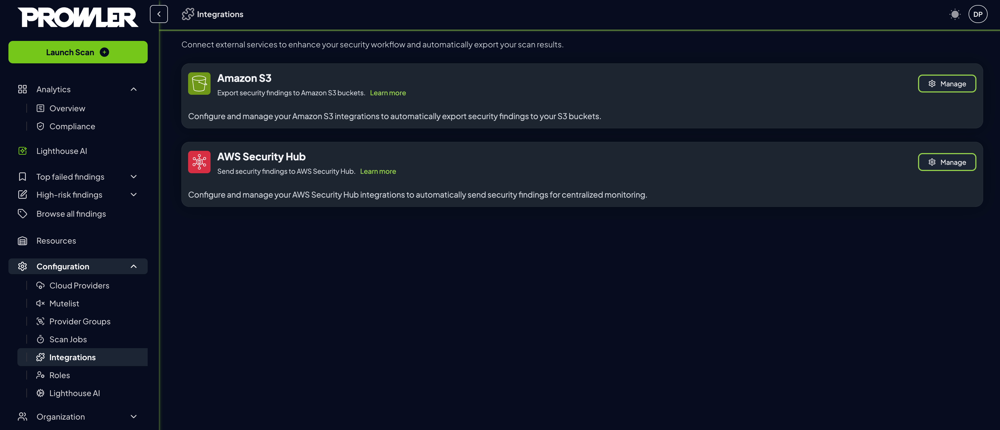
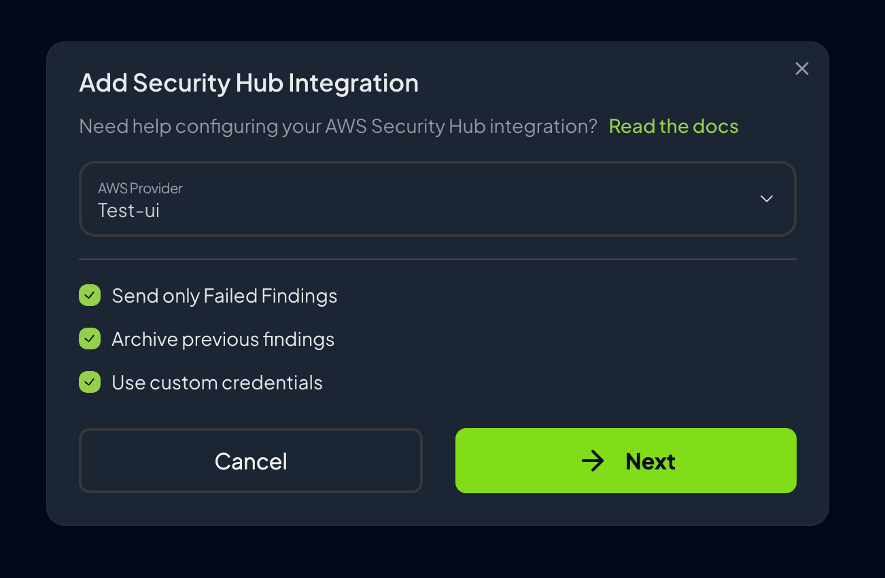

# AWS Security Hub Integration

Prowler App enables automatic export of security findings to AWS Security Hub, providing seamless integration with AWS's native security and compliance service. This comprehensive guide demonstrates how to configure and manage AWS Security Hub integrations to centralize security findings and enhance compliance tracking across AWS environments.

Integrating Prowler App with AWS Security Hub provides:

* **Centralized security visibility:** Consolidate findings from multiple AWS accounts and regions
* **Native AWS integration:** Leverage existing AWS security workflows and compliance frameworks
* **Automated finding management:** Archive resolved findings and filter results based on severity
* **Cost optimization:** Send only failed findings to reduce AWS Security Hub costs
* **Real-time updates:** Automatically export findings after each scan completion

## How It Works

When enabled and configured:

1. Scan results are automatically sent to AWS Security Hub after each scan completes
2. Findings are formatted in [AWS Security Finding Format](https://docs.aws.amazon.com/securityhub/latest/userguide/securityhub-findings-format.html) (ASFF)
3. The integration automatically detects new AWS regions to send findings if the Prowler partner integration is enabled
4. Previously resolved findings are archived to maintain clean Security Hub dashboards

???+ note
    Refer to [AWS Security Hub pricing](https://aws.amazon.com/security-hub/pricing/) for cost information.

## Prerequisites

Before configuring AWS Security Hub Integration in Prowler App, complete these steps:

### AWS Security Hub Setup

Enable the Prowler partner integration in AWS Security Hub by following the [AWS Security Hub setup documentation](./aws/securityhub.md#enabling-aws-security-hub-for-prowler-integration).

### AWS Authentication

Configure AWS credentials by following the [AWS authentication setup guide](./aws/getting-started-aws.md#step-3-set-up-aws-authentication).

## Configuration

To configure AWS Security Hub integration in Prowler App:

1. Navigate to **Integrations** in the Prowler App interface
2. Locate the **AWS Security Hub** card and click **Manage**, then select **Add integration**

    

3. Complete the integration settings

* **AWS Provider:** Select the AWS provider whose findings should be exported to Security Hub
* **Send Only Failed Findings:** Filter out `PASS` findings to reduce AWS Security Hub costs (enabled by default)
* **Archive Previous Findings:** Automatically archive findings resolved since the last scan to maintain clean Security Hub dashboards

    

4. Configure authentication:

Choose the appropriate authentication method:

* **Use Provider Credentials** (recommended): Leverages the AWS provider's existing credentials

    ???+ tip "Simplified Credential Management"
        Using provider credentials reduces administrative complexity by managing a single set of credentials instead of maintaining separate authentication mechanisms. This approach minimizes security risks and provides the most efficient integration path when the AWS account has sufficient permissions to export findings to Security Hub.

* **Custom Credentials:** Configure separate credentials specifically for Security Hub access

5. Click **Create integration** to enable the integration

    

Once configured successfully, findings from subsequent scans will automatically appear in AWS Security Hub.

Once configured, findings from the next scan on will appear in AWS Security Hub.

### Integration Status

Once the integration is active, monitor its status and make adjustments as needed through the integrations management interface.

1. Review configured integrations in the management interface
2. Each integration displays:

    - **Connection Status:** Connected or Disconnected indicator.
    - **Provider Information:** Selected AWS provider name.
    - **Finding Filters:** Status of failed-only and archive settings.
    - **Last Checked:** Timestamp of the most recent connection test.
    - **Regions:** List of regions where the integration is active.

#### Actions

Each Security Hub integration provides several management actions accessible through dedicated buttons:

| Button | Purpose | Available Actions | Notes |
|--------|---------|------------------|-------|
| **Test** | Verify integration connectivity | • Test AWS credential validity • Check Security Hub accessibility • Detect enabled regions automatically • Validate finding export capability | Results displayed in notification message |
| **Config** | Modify integration settings | • Update AWS provider selection • Change finding filter settings • Modify archive preferences | Click "Update Configuration" to save changes |
| **Credentials** | Update authentication settings | • Switch between provider/custom credentials • Update AWS access keys • Change IAM role configuration | Click "Update Credentials" to save changes |
| **Enable/Disable** | Toggle integration status | • Enable integration to start exporting findings • Disable integration to pause exports | Status change takes effect immediately |
| **Delete** | Remove integration permanently | • Permanently delete integration • Remove all configuration data | ⚠️ **Cannot be undone** - confirm before deleting |

???+ tip "Management Best Practices"
    - Test the integration after any configuration changes
    - Use the Enable/Disable toggle for temporary changes instead of deleting
    - Monitor the Last Checked timestamp to ensure recent connectivity

## Viewing Findings in AWS Security Hub

After successful configuration and scan completion, Prowler findings automatically appear in AWS Security Hub. For detailed information about accessing and interpreting findings in the Security Hub console, refer to the [AWS Security Hub findings documentation](./aws/securityhub.md#viewing-prowler-findings-in-aws-security-hub).

## Troubleshooting

**Connection test fails:**

- Verify AWS Security Hub is enabled in target regions
- Confirm Prowler integration is accepted in Security Hub
- Check IAM permissions include required Security Hub actions
- If using IAM Role, verify trust policy and External ID

**No findings in Security Hub:**

- Ensure integration shows "Connected" status
- Verify a scan has completed after enabling integration
- Check Security Hub console in the correct region
- Confirm finding filters match expectations

**Authentication errors:**

- For provider credentials, verify provider configuration
- For custom credentials, check access key validity
- For IAM roles, confirm role ARN and External ID match
