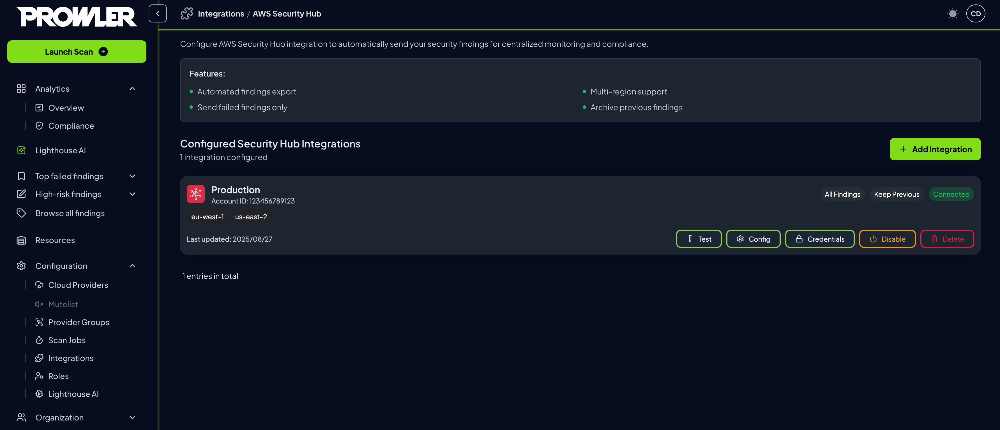

# AWS Security Hub Integration

**Prowler App** enables automatic export of security findings to AWS Security Hub, providing seamless integration with AWS's native security and compliance service. This comprehensive guide demonstrates configuration and management of AWS Security Hub integrations to centralize security findings and enhance compliance tracking across AWS environments.

When enabled and configured, scan results are automatically sent to AWS Security Hub after each scan completes. Findings are formatted in ASFF (AWS Security Finding Format), enabling native integration with AWS security workflows and compliance frameworks.

???+ note
    Refer to [AWS Security Hub pricing](https://aws.amazon.com/security-hub/pricing/) for cost information.

## Prerequisites

Before configuring the AWS Security Hub Integration in **Prowler App**, ensure the following requirements are met:

### AWS Security Hub Setup

1. **Enable AWS Security Hub** in at least one AWS region for the target AWS account
2. **Accept the Prowler Integration** in AWS Security Hub to allow findings import
3. **Configure IAM Permissions** for `securityhub:BatchImportFindings` and `securityhub:GetFindings`

???+ info "AWS Configuration Required"
    If no region has Security Hub enabled, the integration in **Prowler App** will not work. Security Hub is a regional service - enable it in each region where findings should be received.
    AWS Security Hub must be properly configured before setting up the integration in **Prowler App**. For detailed instructions on enabling Security Hub and accepting the Prowler integration, refer to the [AWS Security Hub Setup Guide](https://prowler-prowler-docs--8576.com.readthedocs.build/projects/prowler-open-source/en/8576/tutorials/aws/securityhub/#enabling-aws-security-hub-for-prowler-integration).

## Required Permissions

### IAM Policy

The Security Hub integration requires specific permissions to export findings. The IAM role or user credentials must include:

- `securityhub:BatchImportFindings` - To send findings to Security Hub
- `securityhub:GetFindings` - To retrieve existing findings for updates

???+ tip "Permission Templates Available"
    For the complete IAM policy JSON, refer to the [prowler-additions-policy.json](https://github.com/prowler-cloud/prowler/blob/master/permissions/prowler-additions-policy.json) on GitHub.

### Infrastructure as Code Templates

**Prowler App** provides IaC templates to automate IAM role creation with Security Hub permissions.

#### CloudFormation

[**Launch CloudFormation Stack →**](https://us-east-1.console.aws.amazon.com/cloudformation/home?region=us-east-1#/stacks/quickcreate?templateURL=https%3A%2F%2Fprowler-cloud-public.s3.eu-west-1.amazonaws.com%2Fpermissions%2Ftemplates%2Faws%2Fcloudformation%2Fprowler-scan-role.yml&stackName=Prowler&param_EnableSecurityHubIntegration=true)

#### Terraform

[**View Terraform Module →**](https://github.com/prowler-cloud/prowler/tree/master/permissions/templates/terraform)

---

## Configuration

Once prerequisites are met, configure the Security Hub integration in **Prowler App**:

1. Navigate to **Integrations** in the navigation menu

2. Locate the **AWS Security Hub** card and click **Manage** then **Add integration**

   

3. Complete the integration settings:

    - **AWS Provider:** Select the AWS provider whose findings should be exported
    - **Send Only Failed Findings:** Enable to export only FAIL findings (recommended to reduce costs)
    - **Archive Previous Findings:** Enable to automatically archive resolved findings

    

4. Configure authentication (optional):

    - **Use Provider Credentials:** Uses the AWS provider's existing credentials (default)
    - **Custom Credentials:** Configure separate credentials for Security Hub access

   4.a. For custom credentials:
    - **Access Key ID & Secret:** AWS credentials with Security Hub permissions
    - **SDK default credentials:** Uses the AWS SDK default credentials
    - **IAM Role (Optional):** Role ARN and External ID for role assumption

    

5. Click **Create integration** to enable the integration and test the connection
   

???+ success
    Once configured, findings from the next scan will appear in AWS Security Hub. Check the next scheduled scan time below the Security Hub connection status.

???+ tip "Best Practices"
- **Test After Changes:** Always test connection after configuration updates
- **Use Failed Findings Filter:** Enable to reduce Security Hub costs and noise

### Finding Export Options

**Send Only Failed Findings** reduces AWS Security Hub costs by filtering out PASS findings. This option is enabled by default and recommended for most use cases.

**Archive Previous Findings** automatically archives findings that have been resolved since the last scan, maintaining clean Security Hub dashboards.

---

## Integration Management

### Integration Status

Once the integration is active, monitor its status and make adjustments as needed through the integrations management interface.

1. Review configured integrations in the management interface
2. Each integration displays:

    - **Connection Status:** Connected or Disconnected indicator
    - **Provider Information:** Selected AWS provider name
    - **Finding Filters:** Status of failed-only and archive settings
    - **Last Checked:** Timestamp of the most recent connection test
    - **Regions:** List of regions where the integration is active

#### Actions

Each Security Hub integration provides several management actions accessible through dedicated buttons:

| Button | Purpose | Available Actions | Notes |
|--------|---------|------------------|-------|
| **Test** | Verify integration connectivity | • Test AWS credential validity • Check Security Hub accessibility • Detect enabled regions automatically • Validate finding export capability | Results displayed in notification message |
| **Config** | Modify integration settings | • Update AWS provider selection • Change finding filter settings • Modify archive preferences | Click "Update Configuration" to save changes |
| **Credentials** | Update authentication settings | • Switch between provider/custom credentials • Update AWS access keys • Change IAM role configuration | Click "Update Credentials" to save changes |
| **Enable/Disable** | Toggle integration status | • Enable integration to start exporting findings • Disable integration to pause exports | Status change takes effect immediately |
| **Delete** | Remove integration permanently | • Permanently delete integration • Remove all configuration data | ⚠️ **Cannot be undone** - confirm before deleting |

???+ tip "Management Best Practices"
    - Test the integration after any configuration changes
    - Use the Enable/Disable toggle for temporary changes instead of deleting
    - Monitor the Last Checked timestamp to ensure recent connectivity

---

## Viewing Findings in AWS Security Hub

After configuration and scan completion, Prowler findings appear in AWS Security Hub.

???+ info "Detailed Instructions"
    For comprehensive information on viewing and managing Prowler findings in Security Hub, refer to the [Viewing Prowler Findings guide](./aws/securityhub.md#viewing-prowler-findings-in-aws-security-hub).

---

## Multi-Region Support

The Security Hub integration supports multiple AWS regions:

### Automatic Region Detection

During connection testing, **Prowler App** automatically:

- Detects regions where Security Hub is enabled
- Validates Prowler integration acceptance per region
- Configures finding export to all available regions

### Regional Export Behavior

Findings are exported based on resource location:

- Regional resources → Sent to Security Hub in the resource's region
- Global resources → Sent to the primary region (typically `us-east-1`)

???+ note
    Ensure Security Hub is enabled and the Prowler integration is accepted in all regions where AWS resources exist.

---

## Export Features

### Finding Lifecycle Management

**Archive Previous Findings** option maintains clean Security Hub dashboards:

- **Enabled:** Archives resolved findings automatically
- **Disabled:** All findings remain active in Security Hub

### Compliance Framework Integration

Exported findings integrate with Security Hub compliance standards:

- **AWS Foundational Security Best Practices**
- **CIS AWS Foundations Benchmark**
- **PCI DSS**
- **NIST Cybersecurity Framework**

### Severity Mapping

Prowler severities map to Security Hub labels:

| Prowler Severity | Security Hub Label |
|-----------------|-------------------|
| Critical | CRITICAL |
| High | HIGH |
| Medium | MEDIUM |
| Low | LOW |
| Informational | INFORMATIONAL |

---

## Troubleshooting

**Connection test fails:**

- Verify AWS Security Hub is enabled in target regions
- Confirm Prowler integration is accepted in Security Hub
- Check IAM permissions include required Security Hub actions
- If using IAM Role, verify trust policy and External ID

**No findings in Security Hub:**

- Ensure integration shows "Connected" status
- Verify a scan has completed after enabling integration
- Check Security Hub console in the correct region
- Confirm finding filters match expectations

**Authentication errors:**

- For provider credentials, verify provider configuration
- For custom credentials, check access key validity
- For IAM roles, confirm role ARN and External ID match