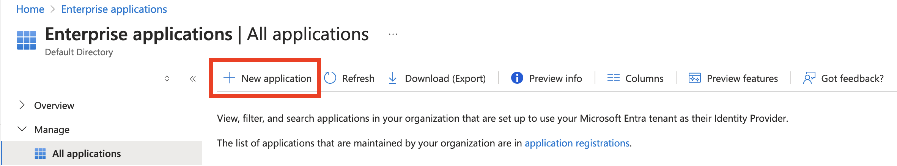
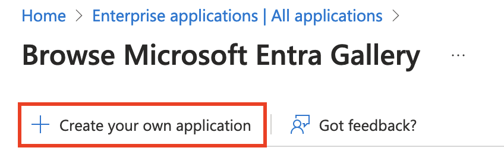
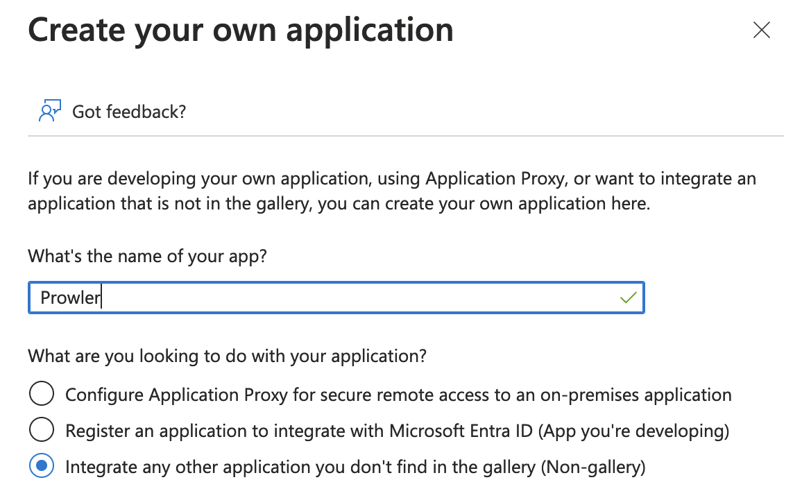
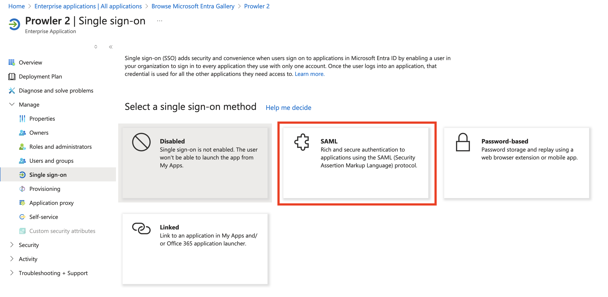
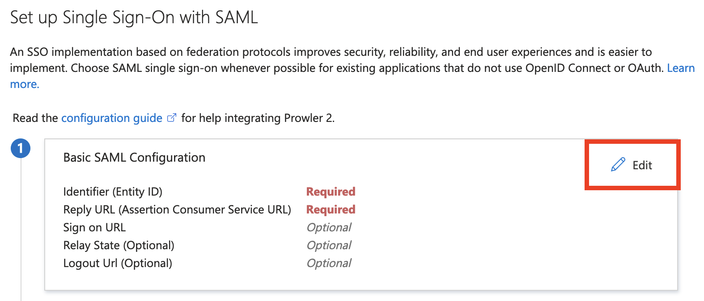
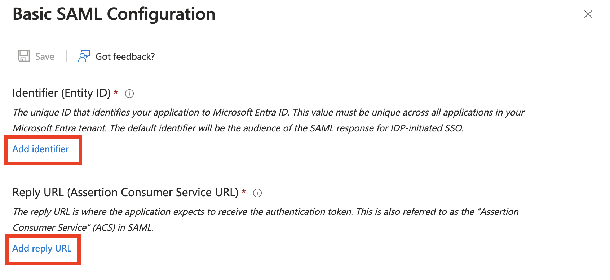
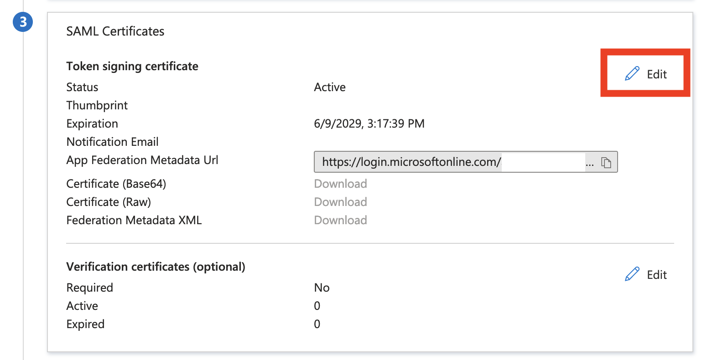
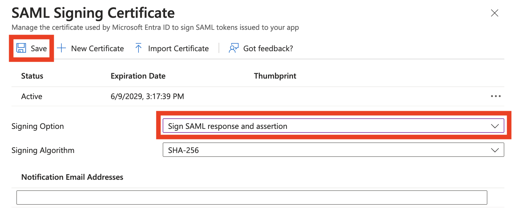
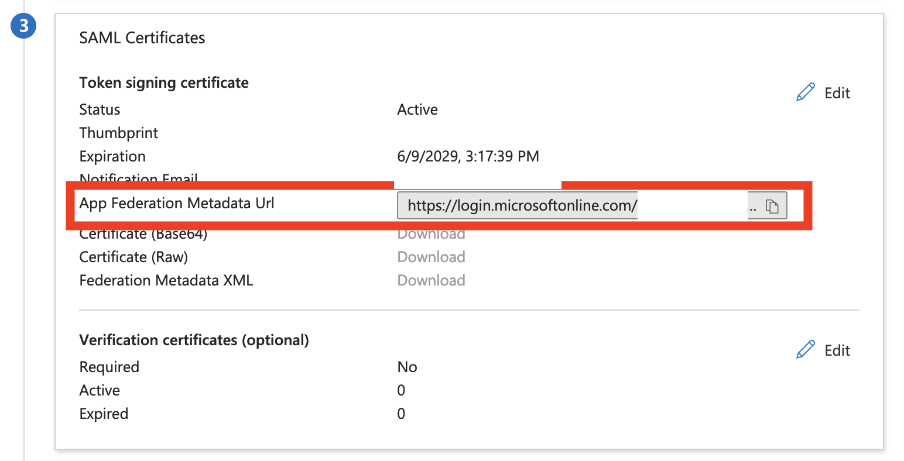

# Entra ID Configuration

This page provides instructions for creating and configuring a Microsoft Entra ID (formerly Azure AD) application to use SAML SSO with Prowler App.

## Creating and Configuring the Enterprise Application

1. From the "Enterprise Applications" page in the Azure Portal, click "+ New application".

    

2. At the top of the page, click "+ Create your own application".

    

3. Enter a name for the application and select the "Integrate any other application you don't find in the gallery (Non-gallery)" option.

    

4. Assign users and groups to the application, then proceed to "Set up single sign on" and select "SAML" as the method.

    

5. In the "Basic SAML Configuration" section, click "Edit".

    

6. Enter the "Identifier (Entity ID)" and "Reply URL (Assertion Consumer Service URL)". These values can be obtained from the SAML SSO integration setup in Prowler App. For detailed instructions, refer to the [SAML SSO Configuration](./prowler-app-sso.md) page.

    

7. In the "SAML Certificates" section, click "Edit".

    

8. For the "Signing Option," select "Sign SAML response and assertion", and then click "Save".

    

9. Once the changes are saved, the metadata XML can be downloaded from the "App Federation Metadata Url".

    

10. Save the downloaded Metadata XML to a file. To complete the setup, upload this file during the Prowler App integration. (See the [SAML SSO Configuration](./prowler-app-sso.md) page for details).
