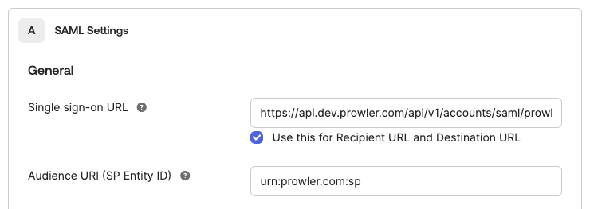

# Configuring SAML Single Sign-On (SSO) in Prowler

This guide provides comprehensive instructions to configure SAML-based Single Sign-On (SSO) in a Prowler environment. This configuration allows users to authenticate using the organization's Identity Provider (IdP).

This document is divided into two main sections:

- **User Guide**: For organization administrators to configure SAML SSO through Prowler App.

- **Developer and Administrator Guide**: For developers and system administrators running self-hosted Prowler instances, providing technical details on environment configuration, API usage, and testing.

---

## User Guide: Configuring SAML SSO in Prowler App

Follow these steps to enable and configure SAML SSO for an organization.

### Key Features

Prowler can be integrated with SAML SSO identity providers such as Okta to enable single sign-on for the organization's users. The Prowler SAML integration currently supports the following features:

-   **IdP-Initiated SSO**: Users can initiate login from their Identity Provider's dashboard.
-   **SP-Initiated SSO**: Users can initiate login directly from the Prowler login page.
-   **Just-in-Time Provisioning**: Users from the organization signing into Prowler for the first time will be automatically created. They can also be manually invited as usual from the User Management tab.

### Prerequisites

-   Administrator access to the Prowler organization is required.
-   Administrative access to the SAML 2.0 compliant Identity Provider (e.g., Okta, Azure AD, Google Workspace) is necessary.

### Configuration Steps

#### Step 1: Access Profile Settings

To access the account settings, click the "Account" button in the top-right corner of Prowler App, or navigate directly to `https://cloud.prowler.com/profile` (or `http://localhost:3000/profile` for local setups).


#### Step 2: Enable SAML Integration

On the profile page, find the "SAML SSO Integration" card and click "Enable" to begin the configuration process.


#### Step 3: Configure the Identity Provider (IdP)

The Prowler SAML configuration panel displays the information needed to configure the IdP. This information must be used to create a new SAML application in the IdP.

1.  **Assertion Consumer Service (ACS) URL**: The endpoint in Prowler that will receive the SAML assertion from the IdP.
2.  **Audience URI (Entity ID)**: A unique identifier for the Prowler application (Service Provider).

To configure the IdP, copy the **ACS URL** and **Audience URI** from Prowler and use them to set up a new SAML application.



???+ info "IdP Configuration"
    The exact steps for configuring an IdP vary depending on the provider (Okta, Azure AD, etc.). Please refer to the IdP's documentation for instructions on creating a SAML application.

#### Step 4: Configure Attribute Mapping in the IdP

For Prowler to correctly identify and provision users, the IdP must be configured to send the following attributes in the SAML assertion:

| Attribute Name | Description                                                                                             | Required |
|----------------|---------------------------------------------------------------------------------------------------------|----------|
| `firstName`    | The user's first name.                                                                                  | Yes      |
| `lastName`     | The user's last name.                                                                                   | Yes      |
| `userType`     | The Prowler role to be assigned to the user (e.g., `admin`, `auditor`). This must match a role name in Prowler. | Yes      |
| `companyName`  | The user's company name. This is automatically populated if the IdP sends an `organization` attribute. | No       |

???+ warning "Dynamic Updates"
    These attributes are updated in Prowler each time a user logs in. Changes made in the IdP will be reflected in Prowler upon the user's next session.

#### Step 5: Upload IdP Metadata to Prowler

Once the IdP is configured, it provides a **metadata XML file**. This file contains the IdP's configuration information, such as its public key and login URL.

To complete the Prowler-side configuration:
1.  Return to the Prowler SAML configuration page.
2.  Enter the **email domain** for the organization (e.g., `mycompany.com`). Prowler uses this to identify users who should authenticate via SAML.
3.  Upload the **metadata XML file** downloaded from the IdP.


#### Step 6: Save and Verify Configuration

Click the "Save" button to complete the setup. The "SAML Integration" card will now show an "Active" status, indicating that the configuration is complete and enabled.


### Signing in with SAML SSO

Once SAML SSO is enabled, users from the configured domain can sign in by entering their email address on the login page and clicking "Continue with SAML SSO". They will be redirected to the IdP to authenticate and then returned to Prowler.


---

## Developer and Administrator Guide

This section provides technical details for developers and administrators of self-hosted Prowler instances.

### Environment Configuration

For self-hosted deployments, several environment variables must be configured to ensure SAML SSO functions correctly. These variables are typically set in an `.env` file.

| Variable                  | Description                                                                                                                                                             | Example                                                   |
|---------------------------|-------------------------------------------------------------------------------------------------------------------------------------------------------------------------|-----------------------------------------------------------|
| `API_BASE_URL`            | The base URL of the Prowler API instance.                                                                                                                              | `http://mycompany.prowler/api/v1`                         |
| `DJANGO_ALLOWED_HOSTS`    | A comma-separated list of hostnames that the Django backend will accept requests from. Include any domains used to access the Prowler API.                               | `localhost,127.0.0.1,prowler-api,mycompany.prowler`       |
| `AUTH_URL`                | The base URL of the Prowler web UI. This is used to construct the callback URL after authentication.                                                                     | `http://mycompany.prowler`                                |
| `SAML_SSO_CALLBACK_URL`   | The full callback URL where users are redirected after authenticating with the IdP. It is typically constructed using the `AUTH_URL`.                                       | `${AUTH_URL}/api/auth/callback/saml`                      |

After modifying these variables, the Prowler API must be restarted for the changes to take effect.

### SAML API Reference

Prowler provides a REST API to manage SAML configurations programmatically.

-   **Endpoint**: `/api/v1/saml-config`
-   **Methods**:
    -   `GET`: Retrieve the current SAML configuration for the tenant.
    -   `POST`: Create a new SAML configuration.
    -   `PATCH`: Update an existing SAML configuration.
    -   `DELETE`: Remove the SAML configuration.

???+ note "API Documentation"
    For detailed information on using the API, refer to the [Prowler API Reference](https://api.prowler.com/api/v1/docs#tag/SAML/operation/saml_config_create).

#### SAML Initiate Endpoint

-   **Endpoint**: `POST /api/v1/accounts/saml/initiate/`
-   **Description**: This endpoint initiates the SAML login flow. It takes an email address, determines if the domain has a SAML configuration, and redirects the user to the appropriate IdP login page. It is primarily designed for browser-based flows.

### Testing SAML Integration

Follow these steps to test a SAML integration in a development environment.

#### 1. Expose the Local Environment

Since the IdP needs to send requests to the local Prowler instance, it must be exposed to the internet. A tool like `ngrok` can be used for this purpose.

To start ngrok, run the following command:
```bash
ngrok http 8080
```
This command provides a public URL (e.g., `https://<random-string>.ngrok.io`) that forwards to the local server on port 8080.

#### 2. Update `DJANGO_ALLOWED_HOSTS`

To allow requests from ngrok, add its URL to the `DJANGO_ALLOWED_HOSTS` environment variable.

```env
DJANGO_ALLOWED_HOSTS=localhost,127.0.0.1,prowler-api,*.ngrok.io
```

#### 3. Configure the IdP

When configuring the IdP for testing, use the ngrok URL for the ACS URL:
`https://<your-ngrok-url>/api/v1/accounts/saml/<YOUR_DOMAIN>/acs/`

#### 4. Configure Prowler via API

To create a SAML configuration for testing, use `curl`. Make sure to replace placeholders with actual data.

```bash
curl --location 'http://localhost:8080/api/v1/saml-config' \
--header 'Content-Type: application/vnd.api+json' \
--header 'Accept: application/vnd.api+json' \
--header 'Authorization: Bearer <YOUR_API_TOKEN>' \
--data '{
  "data": {
    "type": "saml-configurations",
    "attributes": {
      "email_domain": "yourdomain.com",
      "metadata_xml": "<PASTE_YOUR_IDP_METADATA_XML_HERE>"
    }
  }
}'
```

#### 5. Initiate Login Flow

To test the end-to-end flow, construct the login URL and open it in a browser. This will start the IdP-initiated login flow.

`https://<your-ngrok-url>/api/v1/accounts/saml/<YOUR_DOMAIN>/login/?email=<USER_EMAIL>`

If successful, the user will be redirected back to the Prowler application with a valid session.
