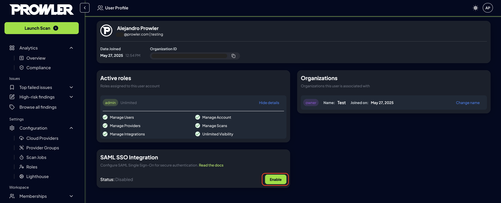
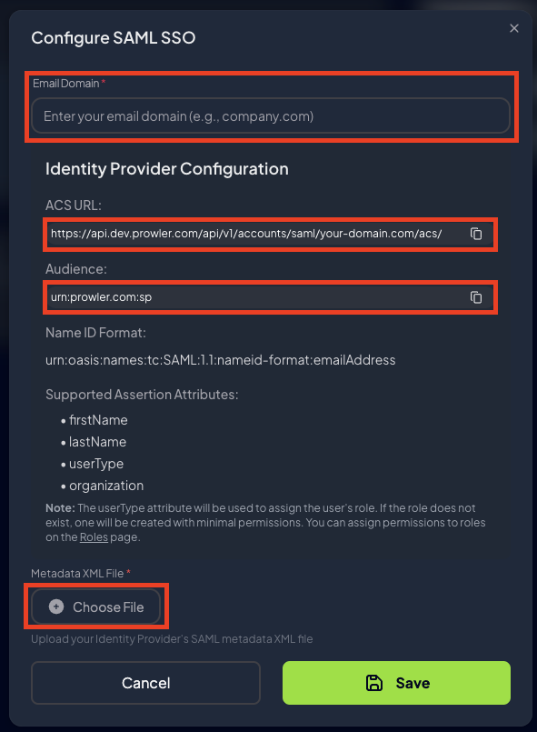

# Configuring SAML Single Sign-On (SSO) in Prowler

This guide explains how to enable and test SAML SSO integration in Prowler. It includes environment setup, API endpoints, and how to configure Okta as your Identity Provider (IdP).

---

## Environment Configuration

### `DJANGO_ALLOWED_HOSTS`

Update this variable to specify which domains Django should accept incoming requests from. This typically includes:

- `localhost` for local development
- container hostnames (e.g. `prowler-api`)
- public-facing domains or tunnels (e.g. ngrok)

**Example**:

```env
DJANGO_ALLOWED_HOSTS=localhost,127.0.0.1,prowler-api,mycompany.prowler
```

# SAML Configuration API

You can manage SAML settings via the API. Prowler provides full CRUD support for tenant-specific SAML configuration.

- GET /api/v1/saml-config: Retrieve the current configuration

- POST /api/v1/saml-config: Create a new configuration

- PATCH /api/v1/saml-config: Update the existing configuration

- DELETE /api/v1/saml-config: Remove the current configuration


???+ note "API Note"
    SSO with SAML API documentation.[Prowler API Reference - Upload SAML configuration](https://api.prowler.com/api/v1/docs#tag/SAML/operation/saml_config_create)

# SAML Initiate

### Description

This endpoint receives an email and checks if there is an active SAML configuration for the associated domain (i.e., the part after the @). If a configuration exists, it responds with an HTTP 302 redirect to the appropriate saml_login endpoint for the organization.

- POST /api/v1/accounts/saml/initiate/

???+ note
    Important: This endpoint is intended to be used from a browser, as it returns a 302 redirect that needs to be followed to continue the SAML authentication flow. For testing purposes, it is better to use a browser or a tool that follows redirects (such as Postman) rather than relying on unit tests that cannot capture the redirect behavior.

### Expected payload
```
{
  "email_domain": "user@domain.com"
}
```

### Possible responses

	•	302 FOUND: Redirects to the SAML login URL associated with the organization.

	•	403 FORBIDDEN: The domain is not authorized.

### Validation logic

    •	Looks up the domain in SAMLDomainIndex.

	•	Retrieves the related SAMLConfiguration object via tenant_id.


# SAML Integration: UI Guide

This guide outlines the process for configuring SAML Single Sign-On (SSO) within the Prowler App.

---

## 1. Accessing the Profile Settings

Open the Prowler App and navigate to the account settings by selecting the **"Account"** button located in the top-right corner of the interface, or navigating to https://cloud.prowler.com/profile or http://localhost:3000/profile.


---

## 2. Enabling SAML Integration

In the configuration panel, locate the **"SAML SSO Integration"** card and click the **"Enable"** button to initiate the setup process.



---

## 3. Configuring Domain and Metadata

Enter the email domain associated with the organization to be configured for SAML.
Ensure that the **Assertion Consumer Service (ACS) URL** displayed matches the one configured in the identity provider (e.g., Okta).

**Example:**

```xml
<?xml version="1.0" encoding="UTF-8"?><md:EntityDescriptor entityID="http://www.okta.com/test" xmlns:md="urn:oasis:names:tc:SAML:2.0:metadata"><md:IDPSSODescriptor WantAuthnRequestsSigned="false" protocolSupportEnumeration="urn:oasis:names:tc:SAML:2.0:protocol"><md:KeyDescriptor use="signing"><ds:KeyInfo xmlns:ds="http://www.w3.org/2000/09/xmldsig#"><ds:X509Data><ds:X509Certificate>MIIDqDCCApCgAwIBAgIGAZbspLXlMA0GCSqGSIb3DQEBCwUAMIGUMQswCQYDVQQGEwJVUzETMBEG
A1UECAwKQ2FsaWZvcm5pYTEWMBQGA1UEBwwNU2FuIEZyYW5jaXNjbzENMAsGA1UECgwET2t0YTEU
xcDDx9gcsrSSMAOK1gG/MVGRMeHfamgeF/jXVA==</ds:X509Certificate></ds:X509Data></ds:KeyInfo></md:KeyDescriptor><md:NameIDFormat>urn:oasis:names:tc:SAML:1.1:nameid-format:emailAddress</md:NameIDFormat><md:SingleSignOnService Binding="urn:oasis:names:tc:SAML:2.0:bindings:HTTP-POST" Location="https://dev-test.okta.com/app/dev-48961430_test/exkotjzsj3Ms39EjW5d7/sso/saml"/><md:SingleSignOnService Binding="urn:oasis:names:tc:SAML:2.0:bindings:HTTP-Redirect" Location="https://dev-test.okta.com/app/dev-test/exkotjzsj3Ms39EjW5d7/sso/saml"/></md:IDPSSODescriptor></md:EntityDescriptor>
```



---

## 4. Verifying Integration Status

After clicking the **"Save"** button, the SAML Integration card will update to reflect the configured and active status.


For sign-in, use the user email and click the **"Continue with SAML SSO"** button at login the page.


---

# SAML Integration: Testing Guide

This document outlines the process for testing the SAML integration functionality.

---

## 1. Start Ngrok and Update ALLOWED_HOSTS

Start ngrok on port 8080:
```
ngrok http 8080
```

Then, copy the generated ngrok URL and include it in the ALLOWED_HOSTS setting. If you're using the development environment, it usually defaults to *, but in some cases this may not work properly, like in my tests (investigate):

```
ALLOWED_HOSTS = env.list("DJANGO_ALLOWED_HOSTS", default=["*"])
```

## 2. Configure the Identity Provider (IdP)

Start your environment and configure your IdP. You will need to download the IdP's metadata XML file.

Your Assertion Consumer Service (ACS) URL must follow this format:

```
https://<PROXY_URL>/api/v1/accounts/saml/<CONFIGURED_DOMAIN>/acs/
```

## 3. IdP Attribute Mapping

The following fields are expected from the IdP:

- firstName

- lastName

- userType (this is the name of the role the user should be assigned)

- companyName (this is filled automatically if the IdP includes an "organization" field)

These values are dynamic. If the values change in the IdP, they will be updated on the next login.

## 4. SAML Configuration API (POST)

SAML configuration is managed via a CRUD API. Use the following POST request to create a new configuration:

```bash
curl --location 'http://localhost:8080/api/v1/saml-config' \
--header 'Content-Type: application/vnd.api+json' \
--header 'Accept: application/vnd.api+json' \
--header 'Authorization: Bearer <TOKEN>' \
--data '{
  "data": {
    "type": "saml-configurations",
    "attributes": {
      "email_domain": "prowler.com",
      "metadata_xml": "<XML>"
    }
  }
}'
```

## 5. SAML SSO Callback Configuration

### Environment Variable Configuration

The SAML authentication flow requires proper callback URL configuration to handle post-authentication redirects. Configure the following environment variables:

#### `SAML_SSO_CALLBACK_URL`

Specifies the callback endpoint that will be invoked upon successful SAML authentication completion. This URL directs users back to the web application interface.

```env
SAML_SSO_CALLBACK_URL="${AUTH_URL}/api/auth/callback/saml"
```

#### `AUTH_URL`

Defines the base URL of the web user interface application that serves as the authentication callback destination.

```env
AUTH_URL="<WEB_UI_URL>"
```

### Configuration Notes

- The `SAML_SSO_CALLBACK_URL` dynamically references the `AUTH_URL` variable to construct the complete callback endpoint
- Ensure the `AUTH_URL` points to the correct web UI deployment (development, staging, or production)
- The callback endpoint `/api/auth/callback/saml` must be accessible and properly configured to handle SAML authentication responses
- Both environment variables are required for proper SAML SSO functionality
- Verify that the `NEXT_PUBLIC_API_BASE_URL` environment variable is properly configured to reference the correct API server base URL corresponding to your target deployment environment. This ensures proper routing of SAML callback requests to the appropriate backend services.

## 6. Start SAML Login Flow

Once everything is configured, start the SAML login process by visiting the following URL:

```
https://<PROXY_IP>/api/v1/accounts/saml/<CONFIGURED_DOMAIN>/login/?email=<USER_EMAIL>
```

At the end you will get a valid access and refresh token

## 7. Notes on the initiate Endpoint

The initiate endpoint is not strictly required. It was created to allow extra checks or behavior modifications (like enumeration mitigation). It also simplifies UI integration with SAML, but again, it's optional.
