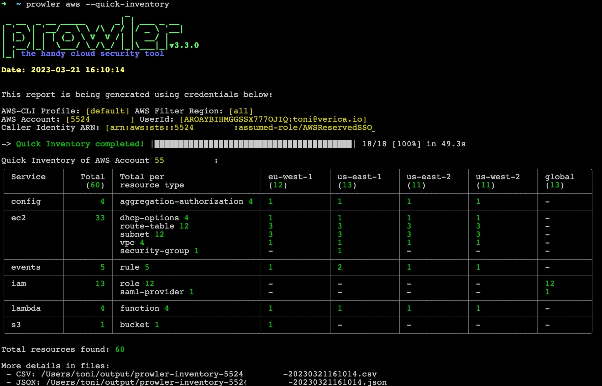

# Quick Inventory

Prowler allows you to execute a quick inventory to extract the number of resources in your provider.
> Currently, it is only available for AWS provider.


- You can use option `-i`/`--quick-inventory` to execute it:
```sh
prowler <provider> -i
```
> By default, it extracts resources from all the regions, you could use `-f`/`--filter-region` to specify the regions to execute the analysis.

- This feature specify both the number of resources for each service and for each resource type.

- Also, it creates by default a CSV and JSON to see detailed information about the resources extracted.



## Objections
The inventorying process is done with `resourcegroupstaggingapi` calls which means that only resources they have or have had tags will appear (except for the IAM and S3 resources which are done with Boto3 API calls).
