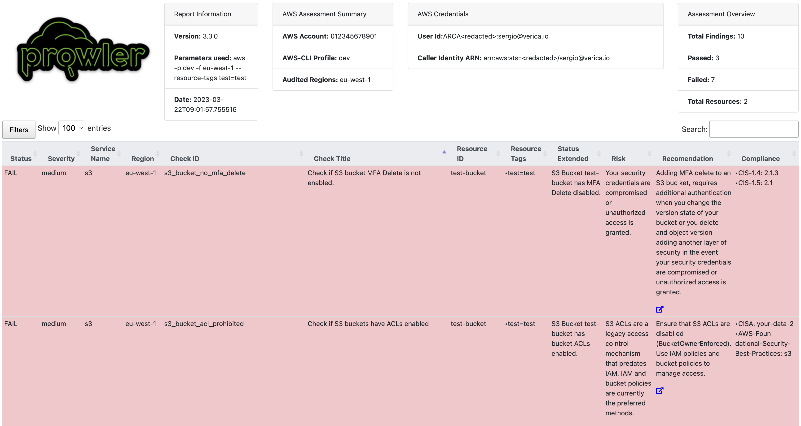

# Reporting

By default, Prowler will generate a CSV, JSON, JSON-OCSF and a HTML report, however you could generate a JSON-ASFF (used by AWS Security Hub) report with `-M` or `--output-modes`:

```console
prowler <provider> -M csv json json-ocsf json-asff html
```

## Custom Output Flags
By default, Prowler creates a file inside the `output` directory named `prowler-output-ACCOUNT_NUM-OUTPUT_DATE.format`.

However, both the output file name and directory can be personalised:

- Custom output report name: you can use the flag `-F`/`--output-filename`
```console
prowler <provider> -M csv json json-asff html -F <custom_report_name>
```
- Custom output directory: you can use the flag `-o`/`--output-directory`
```console
prowler <provider> -M csv json json-asff html -o <custom_report_directory>
```
> Both flags can be used simultaneously to provide a custom directory and filename.
```console
prowler <provider> -M csv json json-asff html \
        -F <custom_report_name> -o <custom_report_directory>
```
## Output timestamp format
By default, the timestamp format of the output files is ISO 8601. This can be changed with the flag `--unix-timestamp` generating the timestamp fields in pure unix timestamp format.

## Output Formats

Prowler supports natively the following output formats:

- CSV
- JSON
- JSON-OCSF
- JSON-ASFF
- HTML

Hereunder is the structure for each of the supported report formats by Prowler:

### HTML

### CSV

CSV format has a set of common columns for all the providers, and then provider specific columns.
The common columns are the following:

- ASSESSMENT_START_TIME
- FINDING_UNIQUE_ID
- PROVIDER
- CHECK_ID
- CHECK_TITLE
- CHECK_TYPE
- STATUS
- STATUS_EXTENDED
- SERVICE_NAME
- SUBSERVICE_NAME
- SEVERITY
- RESOURCE_TYPE
- RESOURCE_DETAILS
- RESOURCE_TAGS
- DESCRIPTION
- RISK
- RELATED_URL
- REMEDIATION_RECOMMENDATION_TEXT
- REMEDIATION_RECOMMENDATION_URL
- REMEDIATION_RECOMMENDATION_CODE_NATIVEIAC
- REMEDIATION_RECOMMENDATION_CODE_TERRAFORM
- REMEDIATION_RECOMMENDATION_CODE_CLI
- REMEDIATION_RECOMMENDATION_CODE_OTHER
- COMPLIANCE
- CATEGORIES
- DEPENDS_ON
- RELATED_TO
- NOTES

And then by the provider specific columns:

#### AWS

- PROFILE
- ACCOUNT_ID
- ACCOUNT_NAME
- ACCOUNT_EMAIL
- ACCOUNT_ARN
- ACCOUNT_ORG
- ACCOUNT_TAGS
- REGION
- RESOURCE_ID
- RESOURCE_ARN


#### AZURE

- TENANT_DOMAIN
- SUBSCRIPTION
- RESOURCE_ID
- RESOURCE_NAME


#### GCP

- PROJECT_ID
- LOCATION
- RESOURCE_ID
- RESOURCE_NAME


> Since Prowler v3 the CSV column delimiter is the semicolon (`;`)
### JSON

The following code is an example output of the JSON format:

```json
[{
    "AssessmentStartTime": "2022-12-01T14:16:57.354413",
    "FindingUniqueId": "",
    "Provider": "aws",
    "Profile": "dev",
    "AccountId": "ACCOUNT_ID",
    "OrganizationsInfo": null,
    "Region": "eu-west-1",
    "CheckID": "rds_instance_minor_version_upgrade_enabled",
    "CheckTitle": "Ensure RDS instances have minor version upgrade enabled.",
    "CheckType": [],
    "ServiceName": "rds",
    "SubServiceName": "",
    "Status": "PASS",
    "StatusExtended": "RDS Instance rds-instance-id has minor version upgrade enabled.",
    "Severity": "low",
    "ResourceId": "rds-instance-id",
    "ResourceArn": "",
    "ResourceTags": {
        "test": "test",
        "enironment": "dev"
    },
    "ResourceType": "AwsRdsDbInstance",
    "ResourceDetails": "",
    "Description": "Ensure RDS instances have minor version upgrade enabled.",
    "Risk": "Auto Minor Version Upgrade is a feature that you can enable to have your database automatically upgraded when a new minor database engine version is available. Minor version upgrades often patch security vulnerabilities and fix bugs and therefore should be applied.",
    "RelatedUrl": "https://aws.amazon.com/blogs/database/best-practices-for-upgrading-amazon-rds-to-major-and-minor-versions-of-postgresql/",
    "Remediation": {
        "Code": {
            "NativeIaC": "https://docs.bridgecrew.io/docs/ensure-aws-db-instance-gets-all-minor-upgrades-automatically#cloudformation",
            "Terraform": "https://docs.bridgecrew.io/docs/ensure-aws-db-instance-gets-all-minor-upgrades-automatically#terraform",
            "CLI": "aws rds modify-db-instance --db-instance-identifier <db_instance_id> --auto-minor-version-upgrade --apply-immediately",
            "Other": "https://www.trendmicro.com/cloudoneconformity/knowledge-base/aws/RDS/rds-auto-minor-version-upgrade.html"
        },
        "Recommendation": {
            "Text": "Enable auto minor version upgrade for all databases and environments.",
            "Url": "https://aws.amazon.com/blogs/database/best-practices-for-upgrading-amazon-rds-to-major-and-minor-versions-of-postgresql/"
        }
    },
    "Categories": [],
    "Notes": "",
    "Compliance": {
        "CIS-1.4": [
            "1.20"
        ],
        "CIS-1.5": [
            "1.20"
        ]
    }
},
{
    "AssessmentStartTime": "2022-12-01T14:16:57.354413",
    "FindingUniqueId": "",
    "Provider": "aws",
    "Profile": "dev",
    "AccountId": "ACCOUNT_ID",
    "OrganizationsInfo": null,
    "Region": "eu-west-1",
    "CheckID": "rds_instance_minor_version_upgrade_enabled",
    "CheckTitle": "Ensure RDS instances have minor version upgrade enabled.",
    "CheckType": [],
    "ServiceName": "rds",
    "SubServiceName": "",
    "Status": "PASS",
    "StatusExtended": "RDS Instance rds-instance-id has minor version upgrade enabled.",
    "Severity": "low",
    "ResourceId": "rds-instance-id",
    "ResourceArn": "",
    "ResourceType": "AwsRdsDbInstance",
    "ResourceTags": {},
    "Description": "Ensure RDS instances have minor version upgrade enabled.",
    "Risk": "Auto Minor Version Upgrade is a feature that you can enable to have your database automatically upgraded when a new minor database engine version is available. Minor version upgrades often patch security vulnerabilities and fix bugs and therefore should be applied.",
    "RelatedUrl": "https://aws.amazon.com/blogs/database/best-practices-for-upgrading-amazon-rds-to-major-and-minor-versions-of-postgresql/",
    "Remediation": {
        "Code": {
            "NativeIaC": "https://docs.bridgecrew.io/docs/ensure-aws-db-instance-gets-all-minor-upgrades-automatically#cloudformation",
            "Terraform": "https://docs.bridgecrew.io/docs/ensure-aws-db-instance-gets-all-minor-upgrades-automatically#terraform",
            "CLI": "aws rds modify-db-instance --db-instance-identifier <db_instance_id> --auto-minor-version-upgrade --apply-immediately",
            "Other": "https://www.trendmicro.com/cloudoneconformity/knowledge-base/aws/RDS/rds-auto-minor-version-upgrade.html"
        },
        "Recommendation": {
            "Text": "Enable auto minor version upgrade for all databases and environments.",
            "Url": "https://aws.amazon.com/blogs/database/best-practices-for-upgrading-amazon-rds-to-major-and-minor-versions-of-postgresql/"
        }
    },
    "Categories": [],
    "Notes": "",
    "Compliance": {}
}]
```

> NOTE: Each finding is a `json` object within a list. This has changed in v3 since in v2 the format used was [ndjson](http://ndjson.org/).


### JSON-OCSF

Based on [Open Cybersecurity Schema Framework Security Finding v1.0.0-rc.3](https://schema.ocsf.io/1.0.0-rc.3/classes/security_finding?extensions=)

```json
[{
    "finding": {
        "title": "Check if ACM Certificates are about to expire in specific days or less",
        "desc": "Check if ACM Certificates are about to expire in specific days or less",
        "supporting_data": {
            "Risk": "Expired certificates can impact service availability.",
            "Notes": ""
        },
        "remediation": {
            "kb_articles": [
                "https://docs.aws.amazon.com/config/latest/developerguide/acm-certificate-expiration-check.html"
            ],
            "desc": "Monitor certificate expiration and take automated action to renew; replace or remove. Having shorter TTL for any security artifact is a general recommendation; but requires additional automation in place. If not longer required delete certificate. Use AWS config using the managed rule: acm-certificate-expiration-check."
        },
        "types": [
            "Data Protection"
        ],
        "src_url": "https://docs.aws.amazon.com/config/latest/developerguide/acm-certificate-expiration-check.html",
        "uid": "prowler-aws-acm_certificates_expiration_check-012345678912-eu-west-1-*.xxxxxxxxxxxxxx",
        "related_events": []
    },
    "resources": [
        {
            "group": {
                "name": "acm"
            },
            "region": "eu-west-1",
            "name": "xxxxxxxxxxxxxx",
            "uid": "arn:aws:acm:eu-west-1:012345678912:certificate/xxxxxxxxxxxxxx",
            "labels": [
                {
                    "Key": "project",
                    "Value": "prowler-pro"
                },
                {
                    "Key": "environment",
                    "Value": "dev"
                },
                {
                    "Key": "terraform",
                    "Value": "true"
                },
                {
                    "Key": "terraform_state",
                    "Value": "aws"
                }
            ],
            "type": "AwsCertificateManagerCertificate",
            "details": ""
        }
    ],
    "status_detail": "ACM Certificate for xxxxxxxxxxxxxx expires in 111 days.",
    "compliance": {
        "status": "Success",
        "requirements": [
            "CISA: ['your-data-2']",
            "SOC2: ['cc_6_7']",
            "MITRE-ATTACK: ['T1040']",
            "GDPR: ['article_32']",
            "HIPAA: ['164_308_a_4_ii_a', '164_312_e_1']",
            "AWS-Well-Architected-Framework-Security-Pillar: ['SEC09-BP01']",
            "NIST-800-171-Revision-2: ['3_13_1', '3_13_2', '3_13_8', '3_13_11']",
            "NIST-800-53-Revision-4: ['ac_4', 'ac_17_2', 'sc_12']",
            "NIST-800-53-Revision-5: ['sc_7_12', 'sc_7_16']",
            "NIST-CSF-1.1: ['ac_5', 'ds_2']",
            "RBI-Cyber-Security-Framework: ['annex_i_1_3']",
            "FFIEC: ['d3-pc-im-b-1']",
            "FedRamp-Moderate-Revision-4: ['ac-4', 'ac-17-2', 'sc-12']",
            "FedRAMP-Low-Revision-4: ['ac-17', 'sc-12']"
        ],
        "status_detail": "ACM Certificate for xxxxxxxxxxxxxx expires in 111 days."
    },
    "message": "ACM Certificate for xxxxxxxxxxxxxx expires in 111 days.",
    "severity_id": 4,
    "severity": "High",
    "cloud": {
        "account": {
            "name": "",
            "uid": "012345678912"
        },
        "region": "eu-west-1",
        "org": {
            "uid": "",
            "name": ""
        },
        "provider": "aws",
        "project_uid": ""
    },
    "time": "2023-06-30 10:28:55.297615",
    "metadata": {
        "original_time": "2023-06-30T10:28:55.297615",
        "profiles": [
            "dev"
        ],
        "product": {
            "language": "en",
            "name": "Prowler",
            "version": "3.6.1",
            "vendor_name": "Prowler/ProwlerPro",
            "feature": {
                "name": "acm_certificates_expiration_check",
                "uid": "acm_certificates_expiration_check",
                "version": "3.6.1"
            }
        },
        "version": "1.0.0-rc.3"
    },
    "state_id": 0,
    "state": "New",
    "status_id": 1,
    "status": "Success",
    "type_uid": 200101,
    "type_name": "Security Finding: Create",
    "impact_id": 0,
    "impact": "Unknown",
    "confidence_id": 0,
    "confidence": "Unknown",
    "activity_id": 1,
    "activity_name": "Create",
    "category_uid": 2,
    "category_name": "Findings",
    "class_uid": 2001,
    "class_name": "Security Finding"
},{
    "finding": {
        "title": "Check if ACM Certificates are about to expire in specific days or less",
        "desc": "Check if ACM Certificates are about to expire in specific days or less",
        "supporting_data": {
            "Risk": "Expired certificates can impact service availability.",
            "Notes": ""
        },
        "remediation": {
            "kb_articles": [
                "https://docs.aws.amazon.com/config/latest/developerguide/acm-certificate-expiration-check.html"
            ],
            "desc": "Monitor certificate expiration and take automated action to renew; replace or remove. Having shorter TTL for any security artifact is a general recommendation; but requires additional automation in place. If not longer required delete certificate. Use AWS config using the managed rule: acm-certificate-expiration-check."
        },
        "types": [
            "Data Protection"
        ],
        "src_url": "https://docs.aws.amazon.com/config/latest/developerguide/acm-certificate-expiration-check.html",
        "uid": "prowler-aws-acm_certificates_expiration_check-012345678912-eu-west-1-xxxxxxxxxxxxx",
        "related_events": []
    },
    "resources": [
        {
            "group": {
                "name": "acm"
            },
            "region": "eu-west-1",
            "name": "xxxxxxxxxxxxx",
            "uid": "arn:aws:acm:eu-west-1:012345678912:certificate/3ea965a0-368d-4d13-95eb-5042a994edc4",
            "labels": [
                {
                    "Key": "name",
                    "Value": "prowler-pro-saas-dev-acm-internal-wildcard"
                },
                {
                    "Key": "project",
                    "Value": "prowler-pro-saas"
                },
                {
                    "Key": "environment",
                    "Value": "dev"
                },
                {
                    "Key": "terraform",
                    "Value": "true"
                },
                {
                    "Key": "terraform_state",
                    "Value": "aws/saas/base"
                }
            ],
            "type": "AwsCertificateManagerCertificate",
            "details": ""
        }
    ],
    "status_detail": "ACM Certificate for xxxxxxxxxxxxx expires in 119 days.",
    "compliance": {
        "status": "Success",
        "requirements": [
            "CISA: ['your-data-2']",
            "SOC2: ['cc_6_7']",
            "MITRE-ATTACK: ['T1040']",
            "GDPR: ['article_32']",
            "HIPAA: ['164_308_a_4_ii_a', '164_312_e_1']",
            "AWS-Well-Architected-Framework-Security-Pillar: ['SEC09-BP01']",
            "NIST-800-171-Revision-2: ['3_13_1', '3_13_2', '3_13_8', '3_13_11']",
            "NIST-800-53-Revision-4: ['ac_4', 'ac_17_2', 'sc_12']",
            "NIST-800-53-Revision-5: ['sc_7_12', 'sc_7_16']",
            "NIST-CSF-1.1: ['ac_5', 'ds_2']",
            "RBI-Cyber-Security-Framework: ['annex_i_1_3']",
            "FFIEC: ['d3-pc-im-b-1']",
            "FedRamp-Moderate-Revision-4: ['ac-4', 'ac-17-2', 'sc-12']",
            "FedRAMP-Low-Revision-4: ['ac-17', 'sc-12']"
        ],
        "status_detail": "ACM Certificate for xxxxxxxxxxxxx expires in 119 days."
    },
    "message": "ACM Certificate for xxxxxxxxxxxxx expires in 119 days.",
    "severity_id": 4,
    "severity": "High",
    "cloud": {
        "account": {
            "name": "",
            "uid": "012345678912"
        },
        "region": "eu-west-1",
        "org": {
            "uid": "",
            "name": ""
        },
        "provider": "aws",
        "project_uid": ""
    },
    "time": "2023-06-30 10:28:55.297615",
    "metadata": {
        "original_time": "2023-06-30T10:28:55.297615",
        "profiles": [
            "dev"
        ],
        "product": {
            "language": "en",
            "name": "Prowler",
            "version": "3.6.1",
            "vendor_name": "Prowler/ProwlerPro",
            "feature": {
                "name": "acm_certificates_expiration_check",
                "uid": "acm_certificates_expiration_check",
                "version": "3.6.1"
            }
        },
        "version": "1.0.0-rc.3"
    },
    "state_id": 0,
    "state": "New",
    "status_id": 1,
    "status": "Success",
    "type_uid": 200101,
    "type_name": "Security Finding: Create",
    "impact_id": 0,
    "impact": "Unknown",
    "confidence_id": 0,
    "confidence": "Unknown",
    "activity_id": 1,
    "activity_name": "Create",
    "category_uid": 2,
    "category_name": "Findings",
    "class_uid": 2001,
    "class_name": "Security Finding"
}]
```

> NOTE: Each finding is a `json` object.
### JSON-ASFF

The following code is an example output of the [JSON-ASFF](https://docs.aws.amazon.com/securityhub/latest/userguide/securityhub-findings-format-syntax.html) format:

```json
[{
    "SchemaVersion": "2018-10-08",
    "Id": "prowler-rds_instance_minor_version_upgrade_enabled-ACCOUNT_ID-eu-west-1-b1ade474a",
    "ProductArn": "arn:aws:securityhub:eu-west-1::product/prowler/prowler",
    "RecordState": "ACTIVE",
    "ProductFields": {
        "ProviderName": "Prowler",
        "ProviderVersion": "3.0-beta-21Nov2022",
        "ProwlerResourceName": "rds-instance-id"
    },
    "GeneratorId": "prowler-rds_instance_minor_version_upgrade_enabled",
    "AwsAccountId": "ACCOUNT_ID",
    "Types": [],
    "FirstObservedAt": "2022-12-01T13:16:57Z",
    "UpdatedAt": "2022-12-01T13:16:57Z",
    "CreatedAt": "2022-12-01T13:16:57Z",
    "Severity": {
        "Label": "LOW"
    },
    "Title": "Ensure RDS instances have minor version upgrade enabled.",
    "Description": "Ensure RDS instances have minor version upgrade enabled.",
    "Resources": [
        {
            "Type": "AwsRdsDbInstance",
            "Id": "rds-instance-id",
            "Partition": "aws",
            "Region": "eu-west-1"
        }
    ],
    "Compliance": {
        "Status": "PASSED",
        "RelatedRequirements": [
            "CISA your-systems-2 booting-up-thing-to-do-first-3",
            "CIS-1.5 2.3.2",
            "AWS-Foundational-Security-Best-Practices rds",
            "RBI-Cyber-Security-Framework annex_i_6",
            "FFIEC d3-cc-pm-b-1 d3-cc-pm-b-3"
        ],
        "AssociatedStandards": [
            {
                "StandardsId": "CISA"
            },
            {
                "StandardsId": "CIS-1.5"
            },
            {
                "StandardsId": "AWS-Foundational-Security-Best-Practices"
            },
            {
                "StandardsId": "RBI-Cyber-Security-Framework"
            },
            {
                "StandardsId": "FFIEC"
            }
        ]
    },
    "Remediation": {
        "Recommendation": {
            "Text": "Enable auto minor version upgrade for all databases and environments.",
            "Url": "https://aws.amazon.com/blogs/database/best-practices-for-upgrading-amazon-rds-to-major-and-minor-versions-of-postgresql/"
        }
    }
},{
    "SchemaVersion": "2018-10-08",
    "Id": "prowler-rds_instance_minor_version_upgrade_enabled-ACCOUNT_ID-eu-west-1-06d21d75e",
    "ProductArn": "arn:aws:securityhub:eu-west-1::product/prowler/prowler",
    "RecordState": "ACTIVE",
    "ProductFields": {
        "ProviderName": "Prowler",
        "ProviderVersion": "3.0-beta-21Nov2022",
        "ProwlerResourceName": "rds-instance-id"
    },
    "GeneratorId": "prowler-rds_instance_minor_version_upgrade_enabled",
    "AwsAccountId": "ACCOUNT_ID",
    "Types": [],
    "FirstObservedAt": "2022-12-01T13:16:57Z",
    "UpdatedAt": "2022-12-01T13:16:57Z",
    "CreatedAt": "2022-12-01T13:16:57Z",
    "Severity": {
        "Label": "LOW"
    },
    "Title": "Ensure RDS instances have minor version upgrade enabled.",
    "Description": "Ensure RDS instances have minor version upgrade enabled.",
    "Resources": [
        {
            "Type": "AwsRdsDbInstance",
            "Id": "rds-instance-id",
            "Partition": "aws",
            "Region": "eu-west-1"
        }
    ],
    "Compliance": {
        "Status": "PASSED",
        "RelatedRequirements": [
            "CISA your-systems-2 booting-up-thing-to-do-first-3",
            "CIS-1.5 2.3.2",
            "AWS-Foundational-Security-Best-Practices rds",
            "RBI-Cyber-Security-Framework annex_i_6",
            "FFIEC d3-cc-pm-b-1 d3-cc-pm-b-3"
        ],
        "AssociatedStandards": [
            {
                "StandardsId": "CISA"
            },
            {
                "StandardsId": "CIS-1.5"
            },
            {
                "StandardsId": "AWS-Foundational-Security-Best-Practices"
            },
            {
                "StandardsId": "RBI-Cyber-Security-Framework"
            },
            {
                "StandardsId": "FFIEC"
            }
        ]
    },
    "Remediation": {
        "Recommendation": {
            "Text": "Enable auto minor version upgrade for all databases and environments.",
            "Url": "https://aws.amazon.com/blogs/database/best-practices-for-upgrading-amazon-rds-to-major-and-minor-versions-of-postgresql/"
        }
    }
}]
```

> NOTE: Each finding is a `json` object within a list.
