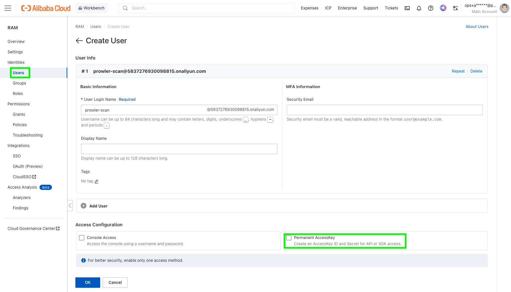
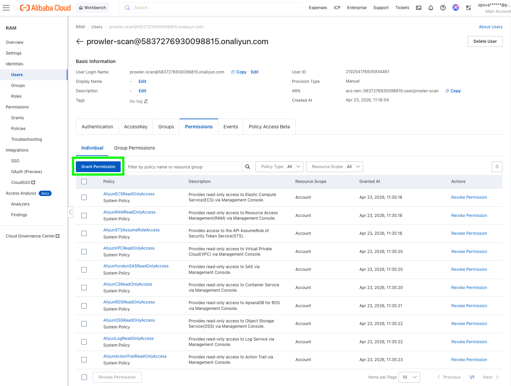

Prowler supports multiple Alibaba Cloud authentication flows. If more than one is configured at the same time, the provider resolves them in this order:

1. **Credentials URI**
2. **OIDC Role Authentication**
3. **ECS RAM Role**
4. **RAM Role Assumption**
5. **STS Temporary Credentials**
6. **Permanent Access Keys**
7. **Default Credential Chain**

<Warning>
Do not use the AccessKey pair of the main Alibaba Cloud account for Prowler. Use a RAM user, a RAM role, or another temporary credential flow instead.
</Warning>

## Choose The Right Method

| Where Prowler runs | What you need to create | Recommended method |
| --- | --- | --- |
| Local workstation | RAM user + AccessKey pair | [RAM User And AccessKey](#ram-user-and-accesskey) |
| CI runner outside Alibaba Cloud | RAM user + AccessKey pair, optionally a target RAM role | [RAM Role Assumption](#ram-role-assumption-recommended) |
| ECS instance | ECS RAM role attached to the instance | [ECS RAM Role](#ecs-ram-role) |
| ACK / Kubernetes | OIDC IdP + RAM role + OIDC token file | [OIDC Role Authentication](#oidc-role-authentication) |
| Internal credential broker | An HTTP endpoint that returns STS credentials | [Credentials URI](#credentials-uri) |

## RAM User And AccessKey

This is the simplest setup for a workstation or a basic CI runner.

### Create The RAM User

1. Open the [RAM console](https://ram.console.alibabacloud.com/).
2. Go to `Identities` > `Users`.
3. Click `Create User`.
4. Enter a logon name and display name.
5. In `Access Configuration`, select `Permanent AccessKey`.



6. Save the generated `AccessKey ID` and `AccessKey Secret` immediately. Alibaba Cloud only shows the secret once.
7. Grant the user the read permissions required for the Alibaba Cloud services you want Prowler to scan.



Alibaba Cloud walkthroughs with current console screenshots:

- [Create a RAM user](https://www.alibabacloud.com/help/en/ram/user-guide/create-a-ram-user)
- [Create an AccessKey pair](https://www.alibabacloud.com/help/en/ram/user-guide/create-an-accesskey-pair)
- [Grant permissions to a RAM user](https://www.alibabacloud.com/help/en/ram/user-guide/grant-permissions-to-the-ram-user)

### Use The AccessKey With Prowler

```bash
export ALIBABA_CLOUD_ACCESS_KEY_ID="your-access-key-id"
export ALIBABA_CLOUD_ACCESS_KEY_SECRET="your-access-key-secret"

prowler alibabacloud
```

Prowler also accepts `ALIYUN_ACCESS_KEY_ID` and `ALIYUN_ACCESS_KEY_SECRET` for compatibility, but `ALIBABA_CLOUD_*` is the preferred naming.

### Use The Default Credential Chain

If you prefer not to export credentials in every shell, you can store them with the Alibaba Cloud CLI and let Prowler reuse the default credential chain from `~/.aliyun/config.json`.

```bash
aliyun configure --mode AK

prowler alibabacloud
```

For profile management details, see Alibaba Cloud's [CLI credential management guide](https://www.alibabacloud.com/help/en/cli/other-configure-command-operations).

## RAM Role Assumption (Recommended)

Use this when:

- you want short-lived credentials instead of long-lived AccessKeys in Prowler,
- you are scanning another Alibaba Cloud account, or
- you are configuring Alibaba Cloud in Prowler Cloud and want to provide a `Role ARN`.

This flow has two parts:

1. A source identity that can call `sts:AssumeRole`.
2. A target RAM role that has the scan permissions.

### Create The Source Identity

Create a RAM user with an AccessKey pair by following the steps in [RAM User And AccessKey](#ram-user-and-accesskey), or reuse an existing automation identity.

### Create The Target Role

1. Open the [RAM console](https://ram.console.alibabacloud.com/).
2. Go to `Identities` > `Roles`.
3. Click `Create Role`.
4. Set `Principal Type` to `Cloud Account`.
5. Choose:
   - `Current Account` if the RAM user and the role are in the same account.
   - `Other Account` if the RAM user belongs to a different Alibaba Cloud account.
6. Give the role a name such as `ProwlerAuditRole`.
7. Attach the scan permissions to the role.
8. Copy the role ARN in the format `acs:ram::<account-id>:role/<role-name>`.

If you want to restrict the role so that only one RAM user or one RAM role can assume it, edit the trust policy accordingly.

Helpful references:

- [Create a RAM role for a trusted Alibaba Cloud account](https://www.alibabacloud.com/help/en/ram/user-guide/create-a-ram-role-for-a-trusted-alibaba-cloud-account)
- [Assume a RAM role](https://www.alibabacloud.com/help/doc-detail/116820.html)

### Allow The Source Identity To Assume The Role

The source RAM user must be able to call `sts:AssumeRole`.

The easiest starting point is to attach Alibaba Cloud's `AliyunSTSAssumeRoleAccess` policy to that RAM user. If you want tighter scope, attach a custom policy limited to the target role ARN.

### Run Prowler

```bash
export ALIBABA_CLOUD_ACCESS_KEY_ID="source-user-access-key-id"
export ALIBABA_CLOUD_ACCESS_KEY_SECRET="source-user-access-key-secret"

prowler alibabacloud \
  --role-arn acs:ram::123456789012:role/ProwlerAuditRole \
  --role-session-name ProwlerAssessmentSession
```

You can also set the role ARN with `ALIBABA_CLOUD_ROLE_ARN`, but the source AccessKey pair is still required for this flow.

## STS Temporary Credentials

Use this if another tool already gives you a temporary `AccessKey ID`, `AccessKey Secret`, and `SecurityToken`.

This is common when:

- a CI platform brokers Alibaba credentials for the job,
- your internal tooling already calls `AssumeRole`, or
- you want to test with a short-lived session before switching to a RAM role flow.

```bash
export ALIBABA_CLOUD_ACCESS_KEY_ID="your-sts-access-key-id"
export ALIBABA_CLOUD_ACCESS_KEY_SECRET="your-sts-access-key-secret"
export ALIBABA_CLOUD_SECURITY_TOKEN="your-sts-security-token"

prowler alibabacloud
```

You can also store the session in the Alibaba CLI configuration:

```bash
aliyun configure --mode StsToken

prowler alibabacloud
```

<Note>
Prowler does not mint standalone STS sessions for you. If you use this method, you must provide all three STS values from your external workflow.
</Note>

## ECS RAM Role

Use this when Prowler runs on an ECS instance and you do not want to store any AccessKeys on disk.

### Create And Attach The Role

1. Open the [RAM console](https://ram.console.alibabacloud.com/).
2. Go to `Identities` > `Roles`.
3. Click `Create Role`.
4. Set the trusted entity to `Alibaba Cloud Service`.
5. Select `ECS` as the trusted service.
6. Attach the read permissions required for the scan.
7. Attach that RAM role to the ECS instance that runs Prowler.

Alibaba Cloud guide:

- [Instance RAM roles](https://www.alibabacloud.com/help/en/doc-detail/54579.html)

### Run Prowler

```bash
prowler alibabacloud --ecs-ram-role ProwlerEcsRole
```

Or:

```bash
export ALIBABA_CLOUD_ECS_METADATA="ProwlerEcsRole"

prowler alibabacloud
```

## OIDC Role Authentication

Use this when Prowler runs in ACK or another Kubernetes environment that provides an OIDC token file.

### Create The OIDC Identity Provider

1. Open the [RAM console](https://ram.console.alibabacloud.com/).
2. Go to `Integrations` > `SSO`.
3. Select `Role-based SSO`, then the `OIDC` tab.
4. Click `Create IdP`.
5. Fill in:
   - `IdP Name`
   - `Issuer URL`
   - `Fingerprint`
   - `Client ID`
6. Create the IdP and note its ARN.

Alibaba Cloud guides:

- [Manage an OIDC IdP](https://www.alibabacloud.com/help/en/ram/manage-an-oidc-idp)
- [Overview of role-based OIDC SSO](https://www.alibabacloud.com/help/en/ram/overview-of-oidc-based-sso)

### Create The RAM Role Trusted By That IdP

Create a RAM role whose trusted entity is the OIDC IdP, then attach the scan permissions to that role.

If you are running in ACK with RRSA, this is typically the role bound to the service account that runs Prowler.

### Provide The OIDC Variables To Prowler

Prowler currently expects:

- `--oidc-role-arn` for the RAM role ARN,
- `ALIBABA_CLOUD_OIDC_PROVIDER_ARN` for the OIDC provider ARN,
- `ALIBABA_CLOUD_OIDC_TOKEN_FILE` for the token file path.

Example:

```bash
export ALIBABA_CLOUD_OIDC_PROVIDER_ARN="acs:ram::123456789012:oidc-provider/ack-rrsa-provider"
export ALIBABA_CLOUD_OIDC_TOKEN_FILE="/var/run/secrets/ack.alibabacloud.com/rrsa-tokens/token"

prowler alibabacloud --oidc-role-arn acs:ram::123456789012:role/ProwlerAckRole
```

If you use ACK RRSA, Alibaba's `ack-pod-identity-webhook` can inject the three required environment variables and mount the token file into the pod automatically:

- [ack-pod-identity-webhook](https://www.alibabacloud.com/help/en/cs/user-guide/ack-pod-identity-webhook)
- [Use RRSA to authorize different pods to access different cloud services](https://www.alibabacloud.com/help/doc-detail/356611.html)

<Note>
Even if your pod already exposes `ALIBABA_CLOUD_ROLE_ARN`, use `--oidc-role-arn` with Prowler. The provider currently reads the role ARN for OIDC from the CLI argument.
</Note>

## Credentials URI

Use this only if you already operate an internal credential broker that returns temporary Alibaba Cloud credentials over HTTP.

The endpoint must return a JSON body with this structure:

```json
{
  "Code": "Success",
  "AccessKeyId": "STS.xxxxx",
  "AccessKeySecret": "xxxxx",
  "SecurityToken": "xxxxx",
  "Expiration": "2026-04-23T10:00:00Z"
}
```

Run Prowler with:

```bash
prowler alibabacloud --credentials-uri http://localhost:8080/credentials
```

Or:

```bash
export ALIBABA_CLOUD_CREDENTIALS_URI="http://localhost:8080/credentials"

prowler alibabacloud
```

For the expected response format, see Alibaba Cloud's SDK guide for [URI credentials](https://www.alibabacloud.com/help/en/sdk/developer-reference/v2-manage-access-credentials).

## Permissions Guidance

The exact minimum policy depends on the checks and services you enable.

If you are using the RAM console's `Grant Permission` screen, search for the **system policy names** below. Alibaba Cloud often uses product policy names that differ from the service name shown in Prowler.

### System Policies In The RAM Console

| Prowler use case | Policy name in RAM console | Notes |
| --- | --- | --- |
| Source user for `--role-arn` | `AliyunSTSAssumeRoleAccess` | Grants `sts:AssumeRole` so the source identity can assume the scan role. |
| RAM checks | `AliyunRAMReadOnlyAccess` | Covers RAM read APIs such as users, groups, policies, MFA devices, and account alias. |
| ECS checks | `AliyunECSReadOnlyAccess` | Read-only ECS access. |
| VPC checks | `AliyunVPCReadOnlyAccess` | Read-only VPC access. |
| OSS checks | `AliyunOSSReadOnlyAccess` | Read-only OSS access. |
| ActionTrail checks | `AliyunActionTrailReadOnlyAccess` | Read-only ActionTrail access. |
| SLS checks | `AliyunLogReadOnlyAccess` | In the RAM console, Simple Log Service appears as `Log`. |
| RDS checks | `AliyunRDSReadOnlyAccess` | Read-only RDS access. |
| ACK / Container Service checks | `AliyunCSReadOnlyAccess` | In the RAM console, ACK permissions appear under `CS`. |
| Security Center checks | `AliyunYundunSASReadOnlyAccess` | In the RAM console, Security Center appears under `Yundun SAS`. |

### Recommended Starting Point

For a broad Alibaba Cloud scan, the identity used by Prowler usually needs read access to the services Prowler currently audits, including:

- `RAM`
- `ECS`
- `VPC`
- `OSS`
- `ActionTrail`
- `Simple Log Service (SLS)`
- `RDS`
- `Container Service / ACK`
- `Security Center`

Use the following setup as a practical starting point:

- If you use **static AccessKeys**, attach the read-only policies above directly to the RAM user used by Prowler.
- If you use **RAM role assumption**, attach `AliyunSTSAssumeRoleAccess` to the source RAM user and attach the read-only policies above to the target scan role.
- If you use **ECS RAM role** or **OIDC/RRSA**, attach the read-only policies above to the role assumed by Prowler.

If you prefer a tighter custom policy instead of system policies, the current provider relies on read APIs such as:

- `ram:Get*`, `ram:List*`
- `ecs:Describe*`
- `vpc:Describe*`
- `oss:Get*`, `oss:List*`
- `actiontrail:Describe*`
- `log:Get*`, `log:List*`, `log:Query*`
- `rds:Describe*`
- `cs:Get*`, `cs:List*`, `cs:Describe*`
- `yundun-sas:Get*`, `yundun-sas:Describe*`, `yundun-sas:List*`

<Note>
If a service is denied, Prowler can still start, but checks for that service may fail or return incomplete results.
</Note>
