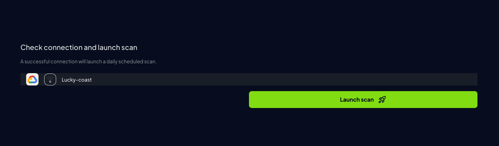

## Prowler App

### Step 1: Get the GCP Project ID

1. Go to the [GCP Console](https://console.cloud.google.com/)
2. Locate the Project ID on the welcome screen


### Step 2: Access Prowler Cloud or Prowler App

1. Navigate to [Prowler Cloud](https://cloud.prowler.com/) or launch [Prowler App](/user-guide/tutorials/prowler-app)
2. Go to "Configuration" > "Cloud Providers"

    

3. Click "Add Cloud Provider"

    

4. Select "Google Cloud Platform"

    

5. Add the Project ID and optionally provide a provider alias, then click "Next"

    

### Step 3: Set Up GCP Authentication

For Google Cloud, first enter your `GCP Project ID` and then select the authentication method you want to use:

- **Service Account Authentication** (**Recommended**)
    * Authenticates as a service identity
    * Stable and auditable
    * Recommended for production
- **Application Default Credentials**
    * Quick scan as current user
    * Uses Google Cloud CLI authentication
    * Credentials may time out

**Service Account Authentication** is the recommended authentication method for automated systems and machine-to-machine interactions, like Prowler. For detailed information about this, refer to the [Google Cloud documentation](https://cloud.google.com/iam/docs/service-account-overview).


<Tabs>
  <Tab title="Service Account Authentication">
    First of all, in the same project that you selected in the previous step, you need to create a service account and then generate a key in JSON format for it. For more information about this, you can follow the next Google Cloud documentation tutorials:

    - [Create a service account](https://cloud.google.com/iam/docs/creating-managing-service-accounts)
    - [Generate a key for a service account](https://cloud.google.com/iam/docs/creating-managing-service-account-keys)

    
     For detailed instructions on how to setup Service Account authentication, see the [Authentication](/user-guide/providers/gcp/authentication#service-account-authentication) page.
  </Tab>
  <Tab title="Application Default Credentials">
    1. Run the following command in your terminal to authenticate with GCP:

    ```bash
    gcloud auth application-default login
    ```

    2. Once authenticated, get the `Client ID`, `Client Secret` and `Refresh Token` from `~/.config/gcloud/application_default_credentials`.

    3. Paste the `Client ID`, `Client Secret` and `Refresh Token` into Prowler App.

    

  </Tab>
</Tabs>


7. Click "Next", then "Launch Scan"

    

---

## Prowler CLI

### Credentials Lookup Order

Prowler follows the same credential search process as [Google authentication libraries](https://cloud.google.com/docs/authentication/application-default-credentials#search_order), checking credentials in this order:

1. [`GOOGLE_APPLICATION_CREDENTIALS` environment variable](https://cloud.google.com/docs/authentication/application-default-credentials#GAC)
2. [`CLOUDSDK_AUTH_ACCESS_TOKEN` + optional `GOOGLE_CLOUD_PROJECT`](https://cloud.google.com/sdk/gcloud/reference/auth/print-access-token)
3. [User credentials set up by using the Google Cloud CLI](https://cloud.google.com/docs/authentication/application-default-credentials#personal)
4. [Attached service account (e.g., Cloud Run, GCE, Cloud Functions)](https://cloud.google.com/docs/authentication/application-default-credentials#attached-sa)

<Note>
The credentials must belong to a user or service account with the necessary permissions.
For detailed instructions on how to set the permissions, see [Authentication > Required Permissions](/user-guide/providers/gcp/authentication#required-permissions).

</Note>
<Note>
Prowler will use the enabled Google Cloud APIs to get the information needed to perform the checks.

</Note>
### Configure GCP Credentials

To authenticate with GCP, use one of the following methods:

```console
gcloud auth application-default login
```

or set the credentials file path:

```console
export GOOGLE_APPLICATION_CREDENTIALS="/path/to/credentials.json"
```

These credentials must belong to a user or service account with the necessary permissions to perform security checks.

For more authentication details, see the [Authentication](/user-guide/providers/gcp/authentication) page.

### Project Specification

To scan specific projects, specify them with the following command:

```console
prowler gcp --project-ids <project-id-1> <project-id-2>
```

### Service Account Impersonation

For service account impersonation, use the `--impersonate-service-account` flag:

```console
prowler gcp --impersonate-service-account <service-account-email>
```

More details on authentication methods in the [Authentication](/user-guide/providers/gcp/authentication) page.
