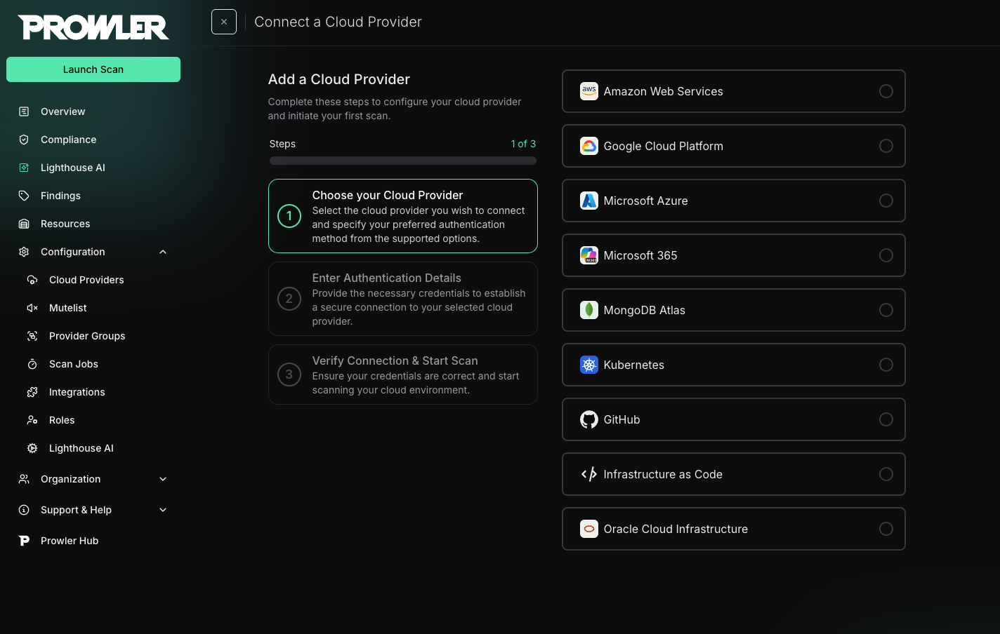
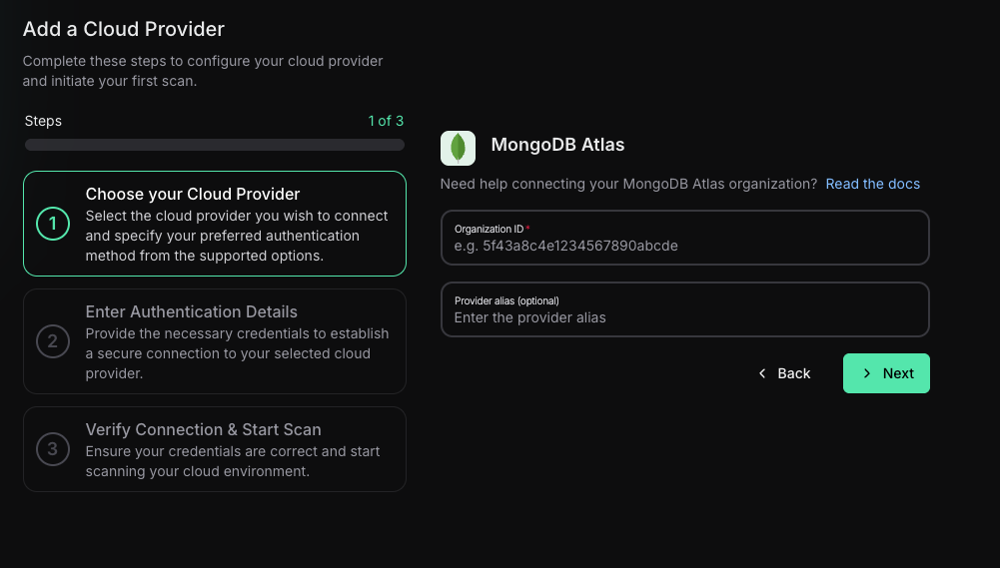
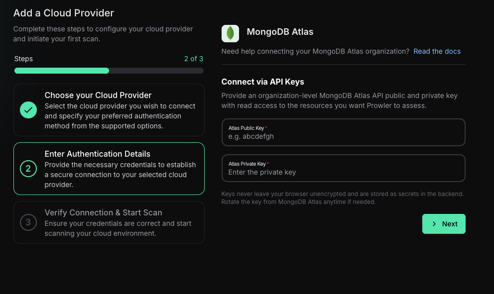
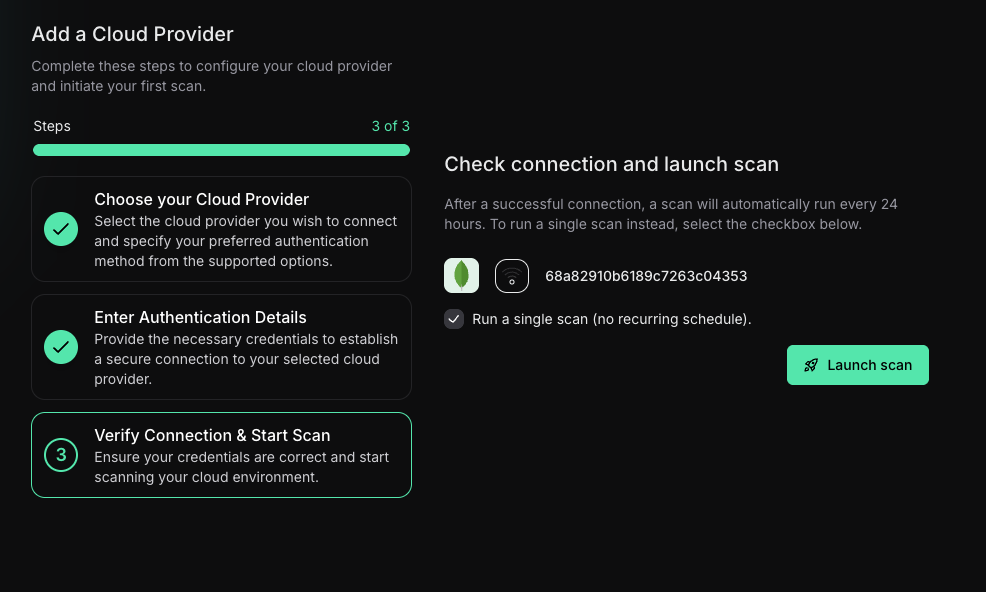

import { VersionBadge } from "/snippets/version-badge.mdx"

Prowler supports MongoDB Atlas both from the CLI and from Prowler Cloud. This guide walks you through the requirements, how to connect the provider in the UI, and how to run scans from the command line.

## Prerequisites

Before you begin, make sure you have:

1. A MongoDB Atlas organization with **API Access** enabled.
2. An **Organization ID** (24-character hex string).
3. An **API Key pair** (public and private keys) with appropriate permissions:
   - **Organization Read Only**: Provides read-only access to everything in the organization, including all projects in the organization. This permission is sufficient for most security checks.
   - **Organization Owner**: Required to audit the [Auditing configuration](https://www.mongodb.com/docs/api/doc/atlas-admin-api-v2/group/endpoint-auditing) for projects. Database auditing tracks database operations and security events, including authentication attempts, data definition language (DDL) changes, user and role modifications, and privilege grants. This configuration is essential for security monitoring, forensics, and compliance. Without **Organization Owner** permission, the `projects_auditing_enabled` check cannot retrieve the audit configuration status.
4. Prowler App access (cloud or self-hosted) or the Prowler CLI (`pip install prowler`).

For detailed instructions on creating API keys, see the [MongoDB Atlas authentication guide](./authentication.mdx).

<Warning>
If **Require IP Access List for the Atlas Administration API** is enabled in your organization settings, you **must** add the IP address of the host running Prowler (or the public IP of Prowler Cloud) to the organization IP Access List or Atlas will reject every API call. You can manage this under **Settings → Organization Settings → Security**. See step 7 of the [authentication guide](./authentication.mdx) for detailed instructions, and refer to the [Prowler Cloud public IP list](../../tutorials/prowler-cloud-public-ips) when using Prowler Cloud.
</Warning>

<CardGroup cols={2}>
  <Card title="Prowler Cloud" icon="cloud" href="#prowler-cloud">
    Onboard MongoDB Atlas using Prowler Cloud
  </Card>
  <Card title="Prowler CLI" icon="terminal" href="#prowler-cli">
    Onboard MongoDB Atlas using Prowler CLI
  </Card>
</CardGroup>

## Prowler Cloud

<VersionBadge version="5.15.0" />

### Step 1: Add the provider

1. Navigate to **Cloud Providers** and click **Add Cloud Provider**.
   
2. Select **MongoDB Atlas** from the provider list.
3. Enter your **Organization ID** (24 hex characters). This value is visible in the Atlas UI under **Organization Settings**.
   
4. (Optional) Add a friendly alias to identify this organization in dashboards.

### Step 2: Provide API credentials

1. Click **Next** to open the credentials form.
2. Paste the **Atlas Public Key** and **Atlas Private Key** generated in the Atlas console.
   

### Step 3: Test the connection and start scanning

1. Click **Test connection** to ensure Prowler App can reach the Atlas API.
2. Save the credentials. The provider will appear in the list with its current connection status.
3. Launch a scan from the provider row or from the **Scans** page.
   

---

## Prowler CLI

<VersionBadge version="5.12.0" />

You can also run MongoDB Atlas assessments directly from the CLI. Both command-line flags and environment variables are supported.

### Step 1: Select an authentication method

Choose one of the following authentication methods:

#### Command-line arguments

```bash
prowler mongodbatlas \
  --atlas-public-key <public_key> \
  --atlas-private-key <private_key>
```

#### Environment variables

```bash
export ATLAS_PUBLIC_KEY=<public_key>
export ATLAS_PRIVATE_KEY=<private_key>
prowler mongodbatlas
```

### Step 2: Run the first scan

#### Scan all projects and clusters

```bash
prowler mongodbatlas
```

This command enumerates all projects accessible to the API key and scans every cluster.

#### Scan a specific project

Add the `--atlas-project-id` flag when you only want to assess one project:

```bash
prowler mongodbatlas --atlas-project-id <project-id>
```

### Additional tips

- Combine flags (for example, `--checks` or `--services`) just like with other providers.
- Use `--output-modes` to export findings in JSON, CSV, ASFF, etc.
- Rotate API keys regularly and update the stored credentials in Prowler App to maintain connectivity.

For more examples (filters, outputs, scheduling), refer back to the [MongoDB Atlas documentation hub](./authentication.mdx) and the main Prowler CLI usage guide.
